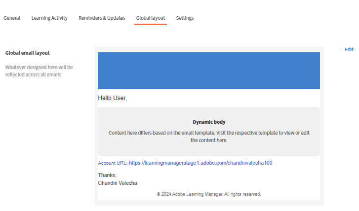
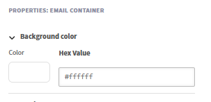
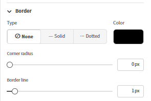
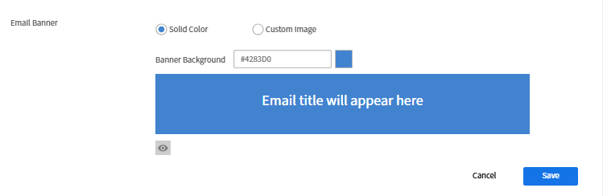
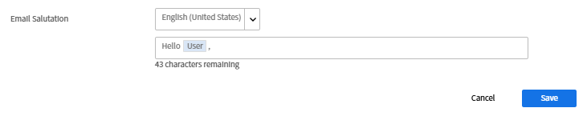
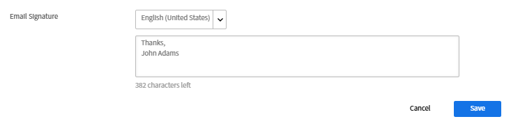
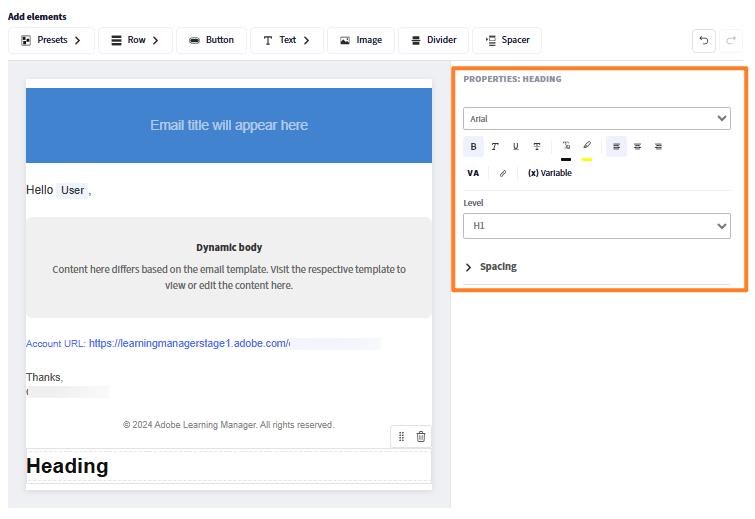
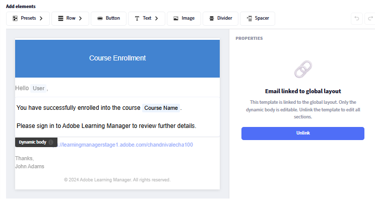

## 元件式電子郵件建構器

Adobe Learning Manager 包含一個基於元件的電子郵件建構器，讓管理員和作者能使用現代視覺編輯器創建企業級、完整品牌化的電子郵件，無需撰寫 HTML。 您的組織發送的每一封電子郵件，從報名確認到會議提醒，都能精確地呼應品牌的外觀與氛圍。

**給管理員：** 設計一個全域版面一次*，一個可重複使用的頁首和頁尾，能自動包裝每封郵件，然後根據需要自訂個別範本。 在內嵌拖放編輯器中，使用豐富的元件撰寫電子郵件：包含完整富文本格式的文字、圖片、橫幅、按鈕、社群媒體連結、分隔符等。

**對作者而言：** 將相同的編輯器功能套用到針對特定課程和實例的電子郵件，讓訓練溝通能針對每種學習經驗量身打造，而不影響整個帳號的設定。

建構者支援階層式模型：同一電子郵件範本可在實例、課程或帳號層級設定。 當範本未被單獨編輯時，會自動繼承父層級的設定。 當你需要完全自訂的設計時，你會解除連結範本，完全掌控。 內建預覽功能讓你能在郵件寄出前，精確查看收件人收件匣的呈現情況。

## 電子郵件範本系統的運作方式

Adobe Learning Manager 中的每封寄出郵件由三個結構部分組成：

* **標題：** 橫幅圖片或顏色，以及組織名稱
* **正文：** 每種電子郵件類型獨有的動態內容區域;包含訊息文字及變數佔位符
* **頁腳：** 帳號網址、電子郵件簽名、幫助連結及其他元素

**全域版面**&#x200B;是同時套用於所有 130+ 電子郵件範本的主設計。當你更新全域佈局時，所有仍連結到它的模板都會自動反映變更。 模板可隨時從全域佈局中斷連結，以便獨立自訂。

### 電子郵件階層

設定與設計透過繼承從高階層級流向低層級。 每個等級都可以覆蓋或完全自訂它繼承的內容。

| 關卡 | 誰來設定 | 預設狀態 | 可編輯的內容 |
| --- | --- | --- | --- |
| **全球佈局** | 行政長官 | 根部;無父母 | 完整佈局：所有零件、所有組件 |
| **帳戶電子郵件範本** | 行政 | 連結至全域佈局 | 僅正文（連結）;完整版面（未連結） |
| **作者-LO 佈局** | 作者 | 連結到帳號範本 | 完整佈局於 LO scope。 |
| **作者-LO 電子郵件範本** | 作者 | 連結到 LO 佈局 | 僅正文（連結）;完整版面（未連結） |
| **作者 - 實例電子郵件範本** | 作者 | 連結到LO範本 | 僅正文（連結）;完整版面（未連結） |

### 核心繼承規則

* 每個等級一開始都與其直接的父級連結，直到明確更改為止。
* 編輯範本 **的主體** 並不會解除連結。 頁首和頁尾仍反映父頁。
* 編輯 **版面**&#x200B;配置或選擇 **「Unlink** 」只會斷開該範本的父連線。
* **還原到原始** 版本後，模板重新連結到父版本，並將版面與主體重設為父版本。
* 在某一層解除連結，對其上下層都沒有影響。

## 建立全域佈局

全域版面定義了共用的頁眉、頁尾和結構包裝，這些都流向每封連結的電子郵件。 先設定好，讓所有範本一開始就有一致的品牌設定。

### 開啟全域版面編輯器

1. 以管理員身份登入 Adobe Learning Manager。
2. 在左側導覽中，選擇 **電子郵件範本**。
3. 選擇「 **全域版面」** 標籤。

   編輯器畫布會以目前的全域佈局載入。 **動態身體區域（Dynamic Body** zone）以佔位符顯示於中央，代表每個範本獨特訊息內容出現的區域。你無法從全域佈局中編輯動態實體。

   

### 設定電子郵件容器

電子郵件容器是每封郵件的最外層包裝。 它的設定會影響所有內容周圍的視覺框架。

1. 選擇 **「編輯** 」，靠近 **全球電子郵件版面**
2. 在畫布上選擇電子郵件容器。
3. 在 **右側的屬性** 面板中，設定：
   * **背景色：** 所有電子郵件內容背後的顏色

   

   * **邊框：** 外邊框的樣式、寬度與顏色

   

   * **間距：** 在郵件內容方向周圍填充

   

   * **行距：** 在佈局中所有行之間所加的垂直間距

   

### 處理列與欄

電子郵件編輯器中的所有內容都放在排&#x200B;**內**。每一列包含一個或多個 **欄位**，每欄包含一個或多個 **元件**。

新增一列：

1. 選擇 **畫布頂端的列** 。

   

2. 選擇欄位配置： **1欄**、 **2欄**、 **3欄**&#x200B;或 **4欄**。

   

   新一列會出現在畫布上，準備放元件。

要設定一列：

1. 選擇畫布上的一列。

   

2. 在 **屬性** 面板中，設定：
   * **背景色：** 列級背景，覆蓋本列容器的顏色
   * **邊框：** 行邊框的樣式、寬度與顏色
   * **間距：** 本列欄間的水平間距

   

**要重新排序資料列：**

* 用手柄拖曳任一列（滑鼠移至左邊時顯示）即可向上或向下移動。

**要刪除一列：**

* 選擇該列，並在列工具列中選擇 **刪除** 圖示。

### 新增與排列元件

元件是電子郵件內容的組成元件。 從頂部的元件&#x200B;**面板拖曳它們**，然後放到任一欄位格子裡。請使用 **左側的屬性** 面板來自訂所選元件。

拖放元件時，會有一個藍色的「+」指示器顯示元件可放置的位置。

**新增元件：**

1. 在元件面板裡，找到你想要的元件。

   

2. 把它拖到畫布上的欄位格子裡。

   

3. 該元件會被加入該單元。 選擇它，在右側面板開啟它的屬性。

   

**要移動元件：**

* 將元件拖曳至不同的欄位或列位置。

**要刪除元件：**

* 選擇元件，然後在元件工具列中選擇 **刪除** 圖示。

### 編輯預設元件

**全域版面**&#x200B;包含內建的預設元件，對應於電子郵件設定中設定的共享欄位。預設元件可以直接在畫布上編輯，或完全移除。

| 預設元件 | 預設內容 | 可以移除嗎？ |
| --- | --- | --- |
| **旗幟** | 預設橫幅圖片或顏色 | 是的 |
| **敬禮** | 「你好 {{user}}，」 | 是的 |
| **動態體** | 每個範本內容的佔位符 | 不需要 |
| **帳號網址** | 你帳號的平台網址 | 是的 |
| **簽名** | 你設定的簽名文字 | 是的 |

**要編輯預設元件：**

1. 例如加入預設元件，橫幅。

   

2. 選擇畫布上的橫幅。
3. 在 **屬性** 面板中，更改 橫幅的字體、字體大小及其他視覺屬性。

   

**要從所有電子郵件中移除預設元件：**

1. 在畫布上選擇預設元件。
2. 在元件工具列選擇 **刪除** 。

從全域佈局移除預設元件，會讓它從所有連結的電子郵件中移除。 未連結的模板會保留該元件，直到你手動從每個模板中移除它。

### 儲存全域佈局

完成版面後選擇 **儲存** 。 更新後的設計會立即套用到所有仍連結到全域版面的電子郵件範本。

## 設定全域電子郵件預設

定義常見元素，如橫幅、問候和簽名，以便在郵件中重複使用。 這些範本可用於全域版面，或是 Adobe Learning Manager 內的個別事件式電子郵件範本中。 這裡所做的變更會自動反映在使用這些預設的地方。 你也可以選擇覆蓋這些預設，直接在電子郵件建構器中設計自訂元素。

請配置以下內容：

### 電子郵件橫幅

1. 在電子郵件橫幅旁&#x200B;**選擇**&#x200B;編輯&#x200B;**。**
2. 上傳橫幅圖片或設定純色背景色。

   

3. 選擇 **儲存。**

### 電子郵件問候

1. 請在電子郵件問候旁邊&#x200B;**選擇**&#x200B;編輯&#x200B;****
2. 預設為「Hello {{user}}」—— {{user}} 該變數會在執行時以收件人姓名填入。

   

3. 修改問候文字或完全移除稱呼。
4. 選擇 **儲存**。

### 帳號網址

1. 選擇 **「編輯** 」，放在 **帳號網址旁邊。**
2. 輸入你學習平台的網址;會出現在所有寄出的電子郵件中。

   

3. 選擇 **儲存**。

### 電子郵件簽名

1. 在電子郵件簽名旁邊&#x200B;**選擇**&#x200B;編輯&#x200B;****
2. 進入結尾文字。

   

3. 選擇 **儲存**。

## 新增與配置個別元件

### 文字組件

文字元件支援完整的富文本編輯。

1. 將文字&#x200B;**元件拖曳**&#x200B;到欄位儲存格。
2. 選擇它進入編輯模式。

   

3. 輸入或貼上你的內容。
4. 請套用以下格式選項：
   * **字型：** 可選擇網頁安全字型（Arial、Helvetica、Georgia 等）或自訂字型
   * **大小：** 字型大小（點數）
   * **粗體**、 **斜體**、 **底線**、 **刪除**
   * **上標** 與 **下標**
   * **文字顏色** 與 **背景色** （文字高亮）
   * **對齊：** 左、中、右或雙齊
   * **行距：** 行高度乘數
   * **水平與垂直填充：** 文字區塊內的內部間距
5. 補充一個超連結：
   * 選擇你想連結的文字
   * 在工具列中選擇 **連結** 圖示
   * 輸入目的地網址

   

6. 選擇 **申請**

### 影像組件

1. 將 Image **元件拖**&#x200B;曳到欄位儲存格中。
2. 選擇&#x200B;**上傳**&#x200B;以上傳新的影像檔案（支援 JPEG 和 GIF），或選擇&#x200B;****&#x200B;瀏覽以從您的圖片庫中選擇。
3. 選取影像後，設定：

   

   * **更換圖片：** 上傳新圖片或替換目前選取的圖片。
   * **圖片網址：** 指定要顯示圖片的來源網址。 影像是從這個位置載入的。
   * **連結：** 新增可點擊的超連結到圖片。 使用者點擊圖片時會被導向指定的網址。
   * **邊框類型：** 定義影像邊框的風格。 可用選項包括無、實心和虛點。
   * **邊框顏色：** 設定在套用邊框風格時的影像邊框顏色。
   * **角角半徑：** 控制影像角點的圓度。 數值越高，角越圓潤。
   * **邊框線：** 調整影像邊框的粗細（寬度）。
   * **頂部距：** 在影像上方增加空隙。
   * **底部間距：** 在圖片下方增加空隙。
   * **左邊間距：** 在圖片左側增加空格。
   * **右距：** 在影像右側增加空間。
   * **水平對齊：** 決定影像在容器內的位置。 選項通常包括左、中、右三邊。

### 按鈕元件

1. 將按鈕&#x200B;**元件拖**&#x200B;曳到欄位儲存格中。
2. 選擇並設定：

   

   * **標籤：** 按鈕文字
   * **連結：** 點擊按鈕時的目的地網址
   * **字型：** 按鈕標籤的字型家族與大小
   * **文字顏色：** 標籤顏色
   * **背景色：** 按鈕填充色
   * **尺寸：** 鈕扣寬度與高度
   * **角落風格：** 圓角、方形或圓形
   * **對齊方式：** 在欄位內的左、中或右
   * **填充：** 標籤文字與按鈕邊緣之間的內部間距

### 分頻器與間隔器元件

**分隔器：** 在內容區塊之間添加一條可見的水平線。

1. 將分隔器&#x200B;**元件拖**&#x200B;入欄位。
2. 在屬性面板中設定 **線條樣式** （實線、虛線、點線）、 **顏色**、 **寬度**&#x200B;和 **高度** （線條上下的垂直空間）。

   **間隔器：** 在元素間加入無可見線條的垂直空間。

3. 拖曳一個 **Spacer** 元件，並在屬性面板中設定其高度。****

## 插入與管理變數

變數是動態的佔位符，當電子郵件發送時會被實際資料取代。 可用的變數依據特定的範本類型而定。 報名確認郵件的變數與會議提醒不同。

### 使用選擇器插入變數

1. 將游標放在你希望變數出現的文字元件中。
2. 在文字編輯器工具列中選擇 **「插入變數** 」。 變數選擇器會開啟，顯示此範本類型所有可用的變數。
3. 選擇一個變數。 例如，課程 **名稱**、 **學習者名稱**&#x200B;或 **學習路徑名稱**。

   

### 輸入變數

輸入變數名稱，並直接被雙大括號包圍：{\{variable_name}\}。 編輯器會自動辨識並標示為變數標記。

**常見變數範例：**

| 變數 | 被 取代 |
| --- | --- |
| 受獎者全名 | {\{learnerName}\} |
| 收件人電子郵件 | {\{learnerEmail}\} |
| 收件人使用者名稱 | {\{user}\} |
| 使用者類型 | {\{userType}\} |
| 組織名稱 | {\{organizationName}\} |
| 球場名稱 | {\{courseName}\} |
| 課程說明 | {\{courseDescription}\} |
| 課程作者 | {\{courseAuthor}\} |
| 課程連結 | {\{courseLink}\} |
| 課程所需技能 | {\{courseSkillDetails}\} |
| 課程徽章 | {\{courseBadge}\} |
| 課程報名截止日 | {\{courseEnrollmentDeadline}\} |
| 課程完成截止日 | {\{courseCompletionDeadline}\} |
| 課程完成日期 | {\{courseCompletionDate}\} |
| 學習路徑的名稱 | {\{LPName}\} |
| 學習路徑連結 | {\{LPLink}\} |
| 學習路徑註冊截止日 | {\{LPEnrollmentDeadline}\} |
| 學習路徑完成截止日 | {\{LPCompletionDeadline}\} |
| 學習路徑完成日期 | {\{LPCompletionDate}\} |
| 認證名稱 | {\{certificationName}\} |
| 認證註冊截止日 | {\{certificationEnrollmentDeadline}\} |
| 認證完成日期 | {\{certificationCompletionDate}\} |
| 課程截止期限 | {\{deadlineDuration}\} |
| 課程到期時間 | {\{expiryDuration}\} |
| 課程到期日 | \{\{到期日\{}\} |
| 會話名稱 | \{\{sessionName\}\} |
| 會期開始日期 | \{\{會議日期\}\} |
| 會期結束日期 | \{\{結束會議日期\}\} |
| 場次開始時間 | \{\{sessionTime\}\} |
| 會期結束時間 | \{\{結束SessionTime\}\} |
| 場地名稱 | \{\{場地名稱\}\} |
| 場地資訊 | \{\{場地資訊\}\} |
| 場地網址 | \{\{場地網址\}\} |
| 場地區域 | \{\{venueRegion\}\} |
| 虛擬教室網址 | \{\{vcUrl\}\} |
| 需要虛擬教室提供者帳號 | \{\{VCProviderAccountReq\}\} |
| 教練名稱 | \{\{教官姓名\}\} |
| 模組名稱 | \{\{moduleName\}\} |
| 學習物件名稱 | \{\{learningObjectName\}\} |
| 學習物件完成日期 | \{\{lo完成日期\}\} |
| 替代學習物件名稱 | \{\{替代LoNameList\}\} |
| 替代學習物件連結 | \{\{alternateLoNameListLinks\}\} |
| 移除的替代學習物件 | \{\{移除了替代Lo\}\} |
| 前置文本 | \{\{前提文字\}\} |
| 先決計數 | \{\{preRequisiteCountText\}\} |
| CI 名稱 | \{\{ciName\}\} |
| 報表儀表板名稱 | \{\{reportDashboardName\}\} |
| 工作輔助名稱 | \{\{jobAidName\}\} |
| 公告內容 | \{\{公告內容文字\}\} |
| 檔案名稱 | \{\{profileName\}\} |
| 課程名額限制 | \{\{座位限制\}\} |
| 幫助文件首頁連結 | \{\{captivatePrimeHelp\}\} |
| 說明頁面連結 | \{\{helpPageLink\}\} |
| 計數 | \{\{count\}\} |

>[!NOTE]
>
>變數是範本專屬的。 並非每個變數都能在每個範本中取得。 使用 **「插入變數** 選擇器」只顯示與你正在編輯範本相符的變數。 用大括號輸入未識別的變數名稱不會在編輯器中產生錯誤，但在已發送的郵件中會以文字形式呈現。

### 橫幅中的變數

1. 電子郵件主旨行也支援變數。 為主體加上變數：
2. 打開範本並找到 **電子郵件主旨** 欄位。
3. 直接輸入變數。 例如，「您在 {\{course_name}\}} 的註冊已確認」。 當郵件發出時，變數會顯示出實際的課程名稱。
4. 或者，選擇 **新增變數**，再選擇 **課程**。

   

### 變數與全域佈局

全域佈局中的變數與範本無關，且根據上下文解析方式不同。 在全域佈局中只使用通用適用的變數，例如 {\{user}\} 和 {\{account_url}\}。 模板專用變數（例如 {\{course_name}\}）應放在個別模板主體中，而非全域佈局中。

## 連結與取消連結範本

### 連結狀態與非連結狀態

每個範本要麼 **連結** 到父範本，要麼 **是未連結** 且完全獨立的。

**連結時：**

* 標題和頁尾在編輯器中顯示&#x200B;**為灰色。**&#x200B;這是模板被連結的視覺指標

* 只有主體可以編輯
* 父版面的變更會自動流入此範本

**解除連結時：**

* 頁首和頁尾完全可編輯。 沒有灰色區域
* 模板完全獨立;父模板的變更不會影響它
* 模板從父設計開始，從解除連結的那一刻開始

**關鍵規則：** 編輯 **主體** 絕不會解除模板的連結。 編輯 **版面** 配置或明確選擇 **「解除連結** 」會中斷父連線。

### 何時連結（保持連結）

* 你希望全球品牌能自動持續流入
* 你只需要在這個範本中更改訊息文字或變數
* 你維護了大量範本庫，想要集中式的品牌控制

### 何時解除連結

* 你需要針對特定模板不同的橫幅、配色方案或結構配置
* 你正在為特定課程、認證或受眾打造獨特的品牌體驗
* 你是一位想要對單一學習物件或實例擁有完整設計控制權的作者

### 解除帳號層級範本連結 - 管理員

1. 選擇 **電子郵件範本** 並開啟範本。 例如，課程 - 自行註冊。
2. 選擇 **取消連結**。

   

3. 閱讀確認訊息後選擇 **「是**」。
4. 頁首和頁尾完全可編輯。
5. 自訂模板的任何部分。
6. 選擇 **儲存**。

範本保留父版面版面作為起點，但不再接收未來父版更新。

### 將範本還原為其父版本

還原到原始範本後，重新連結範本並重置成父範本提供的完全相同內容。

* 如果模板僅&#x200B;****&#x200B;經過正文編輯（仍連結中）：會將正文訊息還原為父範本的預設。頁首和頁尾沒有變動，因為它們本來就是來自父檔案。
* 如果範本完全 **解除連結**：會把所有內容，包括標題、正文和頁尾，都替換成父版本。 所有獨立自訂功能都永久移除。

>[!CAUTION]
>
>還原到原本無法撤銷。 在還原前，先複製你想保留的內容。

**要回退：**

1. 在編輯器中開啟範本。
2. 選擇 **還原到原始檔案**。

   

### 解除連結實例層級的範本-作者

1. 開啟課程並選擇 **電子郵件範本**。
2. 開啟一個範本，例如「課程完成」。
3. 選擇 **解除連結** 並確認。
4. 做修改後選擇 **儲存**。

這只影響這個情況。 其他情況則未受影響。 實例範本是從解除連結時的 LO 層級範本設計開始，而非全域佈局。

管理範本會回復到全域版面版本並重新連結到全域版面。 作者 LO 範本會回復到管理員帳號範本版本。 作者實例範本會回復到 LO 範本版本（或如果 LO 範本連結，則會回到帳號範本）。

## 自訂個人範本

### 導覽到範本

1. 在 **電子郵件範本**&#x200B;中，從列表中選擇一個類別。 例如，**一般****、學習活動**，或&#x200B;**提醒與更新**。
2. 依照名稱找到範本。 模板會列出觸發事件及目前啟用/停用狀態。
3. 選擇範本名稱在編輯器中開啟。

### 編輯主體（連結模板）

當模板被連結時，只有主體可編輯。 頁首和頁尾顯示為灰色。

1. 打開範本。 確認頁首和頁尾是灰色的（連結狀態）。
2. 在正文中選擇任意位置進入編輯模式。
3. 編輯訊息文字、格式、變數以及正文中的任何元件。
4. 選擇 **儲存**。

### 編輯一個完全自訂的範本（未連結）

解除連結後，標題、正文和頁腳三個部分都可以用與全域版面相同的拖放編輯器編輯。

1. 在任何部分新增、移除或重新排列行與元件。
2. 獨立編輯預設元件（橫幅、稱呼、簽名、帳號網址）。
3. 插入針對此範本類型的變數。
4. 選擇 **儲存**。

### 多語言編輯範本

每個範本都支援你帳號設定的所有內容語言。

1. 打開範本。
2. 選擇 **語言** 下拉選單。 它會顯示你帳戶所有可用的語言。
3. 選擇你想編輯的語言。
4. 編輯該語言的正文（以及未連結的版面）。
5. 選擇 **儲存**。

每個語言版本獨立儲存。 編輯一種語言不會影響其他語言。 若語言版本未進行客製化，學習者將獲得該語言的預設內容。

>[!NOTE]
>
>如果範本已解除連結，且你用一種語言編輯其版面，版面變更只會適用於該語言版本。 其他語言版本則保留各自的狀態。

### 編輯器預覽（視覺檢查）

1. 在編輯器工具列中選擇 **預覽** 。
2. 預覽模式會開啟，顯示郵件對收件人的呈現。
3. 檢視版面配置、間距、圖片及可變佔位符號。
4. 關閉預覽以繼續編輯。

## 向下相容性

### 現有帳戶

所有先前設定的電子郵件範本都會完全保留原狀。 新建構器與現有編輯器同時提供。 更新前設定的範本不會自動遷移到新格式。 它們繼續運作如前。

### 新帳號

先用新的建構者和乾淨的預設全域佈局。 預設版面採用簡化設計，避免了舊版常見的渲染問題（如橫幅圖片顯示故障）。

如果你的帳號同時有舊格式和新格式範本，兩者可以共存且不會衝突。 你可以依自己的節奏將個別範本遷移到新格式，方法是在新編輯器中開啟並儲存。

## 排除電子郵件範本問題

**全域版面變更不會出現在範本中**

模板已被解除連結。 確認並修正：

1. 打開範本。
2. 如果頁首和頁尾可 **編輯** （不灰化），模板就會解除連結。
3. 要恢復全域版面繼承，請選擇 **「還原到原始** 」並確認。

**模板看起來和全域版面配置不同**

原因和上面一樣。 該範本被取消連結，可能是故意的，或是因為先前的版面編輯所致。 還原到原始頁面以重新連結。

**變數在已發送的電子郵件中以文字呈現**

變數名稱拼錯或無法提供此範本類型。

1. 打開範本並找到變數。
2. 刪除它，然後用 **插入變數** 選擇器重新插入。
3. 選擇器只會顯示對此範本有效的變數。 請從列表中選擇以避免打字錯誤。
