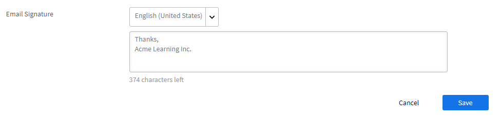
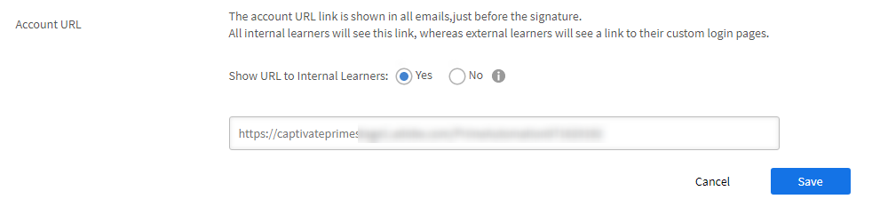
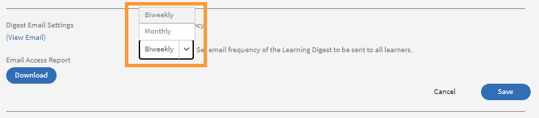
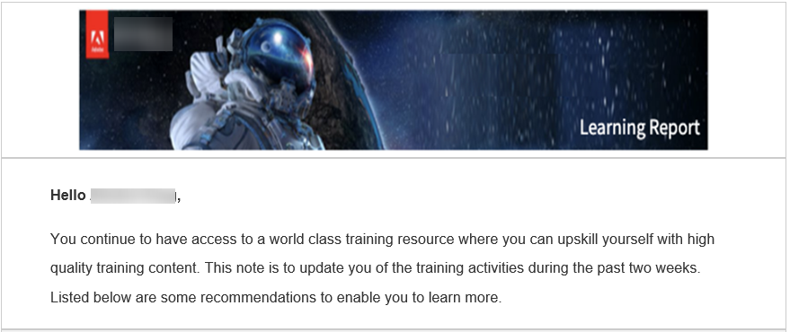
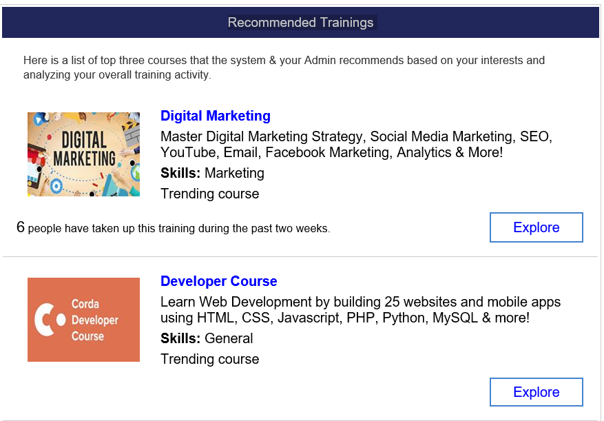
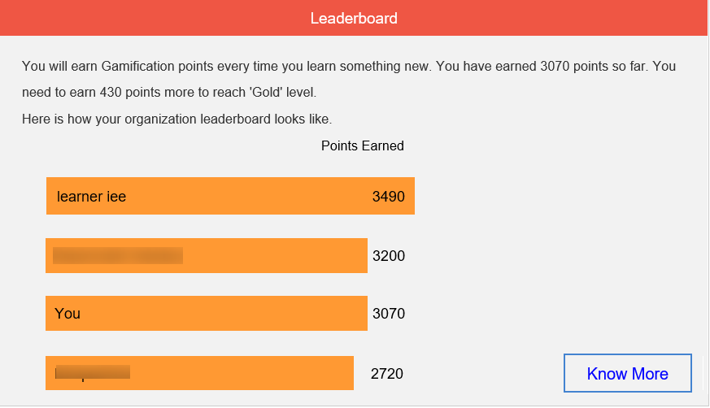
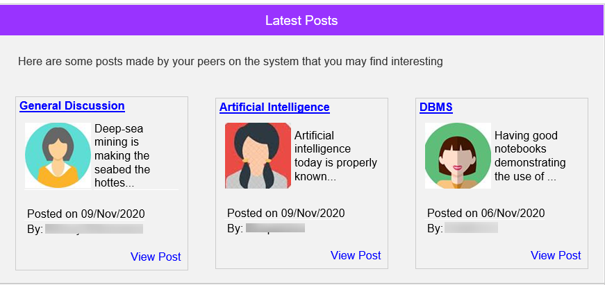
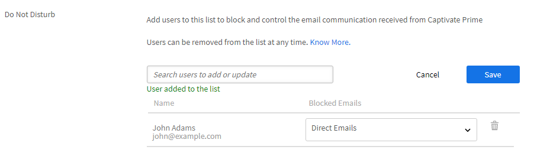

# 電子郵件範本

你訓練活動中的事件會觸發發送給學習者的電子郵件。 作為管理員，你可以輕鬆啟用、停用或修改這些電子郵件範本。

Learning Manager 應用程式會根據事件向多個使用者角色發送電子郵件通知。

作為管理員，您可以自訂電子郵件範本，透過新增或修改內容，並向使用者發送由學習者、管理者及作者觸發的各種事件通知。

管理員也可以選擇不發送特定事件的電子郵件通知。

## 電子郵件範本導論

在本次培訓中，您將學習如何自訂個別電子郵件範本，並自訂電子郵件範本的課程層級與帳戶層級設定。

<!--In this training, you will learn how to create a user group by names, email IDs, and combining multiple auto-generated user groups.-->

如果你無法啟動訓練，請寫信至 <almacademy@adobe.com>。

## 設定電子郵件範本 {#configureemailtemplates}

作為管理員，你可以輕鬆啟用、停用或修改這些電子郵件範本。

以下提到的電子郵件範本屬於這組範本：

**進度刷新：** 此範本通知學習者，由於其活躍設定檔或學習路徑設定的變更，其完成狀態及學習路徑進度已被自動重新計算。 它會引導學習者檢視任何新的待辦需求，並採取行動完成學習路徑。

**課程/路徑已標記為透過替代路徑完成：** 此範本會在學習者完成替代路徑課程時通知學習者。 這表示他們直接完成了管理員設定的來源訓練，作為該目標的替代訓練。

**課程/路徑被標記為未完成：** 此範本通知學習者，原本應透過替代路線完成的課程或學習路徑，現在已被標記為未完成。 當管理員移除或修改替代關係時，帳號層級啟用追溯性未完成。

**檢查清單通過/檢查清單未通過：** 這些範本的目的是告知學習者它們已被審查者評估。 學習者每次評估都會收到這封電子郵件，方便他們前往平台查詢是否需要採取任何行動。

1. 要存取範本，請點擊 **[!UICONTROL Email Templates]** 左側窗格。 在此頁面上，你可以看到三種不同類別的範本，分別為 **[!UICONTROL General]**、 、 **[!UICONTROL Learning Activity]**&#x200B;**[!UICONTROL Reminders and Updates]**&#x200B;和 。還有第四個分頁，可以 **[!UICONTROL Settings]**&#x200B;設定範本。

   

   *選擇「一般」標籤*

2. 若要批量啟用或停用特定職位的電子郵件範本，請選擇省略號（...） 在欄位標題中，並啟用所有適用的角色。**[!UICONTROL Email Recipients]**

   
   _在職務層級寄出所有電子郵件範本_

3. 若要啟用或停用特定職位的電子郵件範本，請選擇省略號（...） 對於該範本，選擇或取消選出角色。

   
   _在職務層級發送電子郵件範本_

4. 要修改範本內容，請點擊範本名稱。 這裡你可以看到，不同類型的使用者會有不同的範本。

   

   *查看電子郵件範本*

5. 要修改此電子郵件範本的內容，請點擊郵件正文。 現在對範本做修改。 你可以修改文字內容，也可以在電子郵件中使用這些變數之一。 對正文部分所做的變更只能套用在這個電子郵件範本上。 不過，如果你更改這封電子郵件的簽名，它可以全域套用到所有範本。

   將滑鼠移到每個圖示上即可查看名稱。

   

   *修改電子郵件範本*

   你可以點擊範本上方的連結 **[!UICONTROL Revert to Original]** ，將訊息正文重設為預設內容。

6. 要確認此範本所套用的變更，請點擊儲存。 現在用戶可以使用修改過的電子郵件範本接收電子郵件通知。

## 自訂電子郵件範本的設定 {#customizesettingsofanemailtemplate}

1. 要開啟設定頁面，請點擊 **[!UICONTROL Settings]**。 你現在可以自訂你的電子郵件範本。
1. 若要自訂學習者收到電子郵件的名稱與電子郵件 ID，請編輯 **[!UICONTROL Sender Name and Address]。**

   請聯絡 [***Adobe 支援***](https://helpx.adobe.com/contact/enterprise-support.other.html#learning-manager) 以設定或更改這些細節。

1. 從選項 **[!UICONTROL Email Banner]** 中自訂你的電子郵件橫幅。 選擇 來更改橫幅 **[!UICONTROL Banner Background]**&#x200B;顏色。

   你可以選擇 **[!UICONTROL Custom Image]** 選項，將自訂圖片當作橫幅。 更改後點擊 **[!UICONTROL Save]** 。

    

   *自訂橫幅的圖片*

   自訂影像尺寸必須是 1240x200px，並支援.jpg、.jpeg 和 .png。

1. 點擊 . 編輯您的電子郵件簽名 **[!UICONTROL Edit]**。 做必要的修改並保存這些變更。

   

   *自訂您的電子郵件簽名*

1. 點擊「編輯 **[!UICONTROL Account URL]**」選項編輯您的帳號網址。

   所有電子郵件中都會顯示帳號網址連結，就在簽名前。 輸入所需的網址並點擊 **[!UICONTROL Save]**。 請注意，此網址僅對內部使用者可見。

   

   *自訂帳號網址*

1. 透過選項中的 **[!UICONTROL Optional Manager Email]** 勾選框，設定經理是否也必須接收寄給其直屬下屬的電子郵件。

## 設定摘要郵件的頻率 {#setfrequencyofdigestemails}

在 **[!UICONTROL Email templates]** > **[!UICONTROL Settings]** 頁面，管理員可以調整發送給學習者的摘要郵件頻率。

在該 **[!UICONTROL Digest Email Settings]** 區塊中，點擊 **[!UICONTROL Edit]**。

在下拉選單中，選擇 **[!UICONTROL Biweekly]** 或 **[!UICONTROL Monthly]**。

* **[!UICONTROL Biweekly]：** 如果你設定頻率為 **[!UICONTROL Biweekly]**，學習者每兩週會收到一次電子郵件。

* **[!UICONTROL Monthly]：** 如果你將頻率設定為 **[!UICONTROL Monthly]**，學習者每月會收到一次電子郵件。

*設定摘要郵件的頻率*

啟用此選項後，頻率預設為 **[!UICONTROL Biweekly]** 現有或新活躍帳號。

### DND 學習者名單

DND 名單中的學習者無法看到摘要郵件的使用者設定。 該選項將持續失效，學習者將不會收到任何郵件。

## 給學習者的摘要電子郵件範例 {#digest-email}

以下範例代表學習者收到的郵件。

*電子郵件範例*

### 訓練活動

*培訓活動的電子郵件*

### 推薦訓練

*推薦培訓的電子郵件*

### 排行榜

*排行榜電子郵件*

### 最新文章

*最新文章的電子郵件*

### 下載電子郵件存取報告

您可以點擊 **[!UICONTROL Download]** 按鈕下載電子郵件存取報告。 本報告包含收到電子郵件的用戶數量，以及開啟並點擊連結的用戶數量。

## 自訂電子郵件網域 {#customizeemaildomain}

若要自訂電子郵件網域及學習者接收通知的電子郵件 ID，請聯絡 [***學習經理客服***](https://helpx.adobe.com/contact/enterprise-support.other.html#learning-manager) ，並提供你想新增的網域資訊及新電子郵件 ID。

你的申請會被處理，並會寄送一封包含確認連結的電子郵件，寄到你指定的新電子郵件地址。 請點擊電子郵件中提供的驗證連結以確認並完成驗證流程。

## 設定請勿打擾電子郵件 {#dnd}

作為管理員，你可以選擇哪些使用者能接收來自 Learning Manager 的電子郵件，哪些則不能。

你可以透過 **[!UICONTROL Do Not Disturb]** 分頁下的 **[!UICONTROL Settings]** 選項來操作。 使用者可透過姓名、電子郵件 ID 或唯一使用者 ID 加入此名單。

搜尋一個要加入清單的使用者。

<!---->

## 被封鎖的電子郵件 {#blockedemails}

從 **每個使用者的「封鎖郵件」** 下拉選單中選擇要封鎖的電子郵件類型。

<!---->

以下是可用的選項：

* **直接寄信給學員：** 此選項限制或允許寄送給學員的電子郵件。
* **升級郵件發送給學員經理：** 此選項限制或允許寄送給學員經理的電子郵件。
* **關於直屬下屬：** 此選項限制或允許發送給用戶的直接下屬升級郵件。
* **關於跳過層級報告：** 此選項限制或允許發送給用戶的第二級報告的升級郵件。

如果你想從列表中刪除某個使用者，可以在使用者標籤中分別使用每個使用者可用的刪除選項。

你可以用 CSV 把使用者加入 DND 清單。 請為以下各類別提供真/假/空白值：

* 封鎖直寄電子郵件
* 封鎖使用者升級
* 封鎖直接升級的進站
* 封鎖進入的跳過升級事件

在值欄位輸入 true，可以阻止使用者收到該選項的電子郵件。 如果輸入 false 作為數值，封鎖的使用者會被解除封鎖。 若欄位留空，則不會對先前選擇進行任何更改。

## 彈性調整範本

Learning Manager 中的電子郵件範本現在包含完全可編輯的區塊，提供更靈活的電子郵件溝通，依據訊息與品牌偏好來客製化。

客製化電子郵件範本的主要改進包括以下幾點：

### 在帳戶層級自訂電子郵件稱呼

選擇 **[!UICONTROL Email Templates]** > **[!UICONTROL Settings]**。 在該&#x200B;**[!UICONTROL Email Salutation]**&#x200B;區段選擇&#x200B;**[!UICONTROL Edit]**。

*自訂電子郵件問候*

您也可以自訂以下內容：

* 電子郵件橫幅與電子郵件簽名，涵蓋課程層級與實例層級。
* 編輯電子郵件頁腳。 頁腳區域包含預先定義的變數，包括帳號網址、簽名以及使用者新增的任何自由文字。

範本也支援進階編輯功能，確保內容從 Microsoft Word 複製貼上時格式會被保留。

## 內嵌邀請 {#inlineinvitations}

Learning Manager 使用者現在會收到線上電子郵件邀請。 ICS 附件不再用於發送邀請函。 邀請函的任何變動都會自動反映在您的行事曆中。

<!---->

## 常見問題 {#frequentlyaskedquestions}

+++如何在電子郵件範本中停用說明功能？

目前在 Learning Manager 中，無法在電子郵件範本中停用 **「幫助** 」。

+++

+++如何修改電子郵件範本？

1. 作為管理員，請登入你的學習管理帳戶。
1. 在左側面板，點擊 **[!UICONTROL Email Templates]** 並選擇你想修改的電子郵件範本。
1. 要自訂每個範本，請點擊範本正文中的文字。 你可以點擊快照中顯示的相應圖示，插入變數。 滑鼠移到每個圖示上即可查看名稱並套用到範本中。
1. 修改範本後，點擊 **[!UICONTROL Save]**。

+++

+++如何建立自己的電子郵件範本？

目前，無法建立自訂電子郵件範本。 不過，你可以編輯和修改現有的範本。

+++

+++如何關閉電子郵件範本？

要關閉電子郵件範本，請選擇需要停用的範本，然後點擊是/否圓形切換按鈕。

+++

+++如何更改範本中的寄件人姓名和地址？

如需更改寄件人姓名及電子郵件地址，請聯絡 [Adobe Learning Manager 客服](https://helpx.adobe.com/contact/enterprise-support.other.html#learning-manager)。

+++
