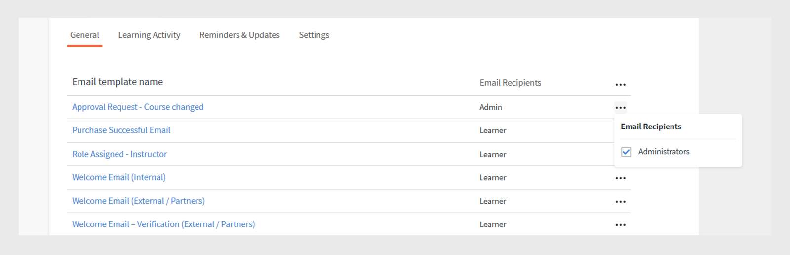

# 電子郵件範本

您的培訓活動中的事件會觸發傳送給學習者的電子郵件。 您作為管理員可以輕鬆地啟用、停用或修改這些電子郵件範本。

Learning Manager應用程式會根據事件傳送電子郵件通知給使用者的多個角色。

身為管理員，您可以新增或修改內容，並針對學習者、管理員和作者觸發的各種事件傳送通知給使用者，以自訂電子郵件範本。

管理員也可以選擇不傳送特定事件的電子郵件通知。

## 電子郵件範本簡介

在本訓練中，您將瞭解如何自訂個別電子郵件範本，以及自訂電子郵件範本的課程和帳戶層級設定。

<!--In this training, you will learn how to create a user group by names, email IDs, and combining multiple auto-generated user groups.-->

如果您無法啟動訓練，請寫信到<almacademy@adobe.com>。

## 設定電子郵件範本 {#configureemailtemplates}

您作為管理員可以輕鬆地啟用、停用或修改這些電子郵件範本。

1. 若要存取範本，請按一下左窗格上的&#x200B;**[!UICONTROL Email Templates]**。 在此頁面中，您可以看到三種不同的範本類別： **[!UICONTROL General]**、**[!UICONTROL Learning Activity]**&#x200B;和&#x200B;**[!UICONTROL Reminders and Updates]**。 第四個索引標籤&#x200B;**[!UICONTROL Settings]**&#x200B;可供您設定範本。

   

   *選取[一般]索引標籤*

2. 若要大量啟用或停用特定角色的電子郵件範本，請選取欄標題中的省略符號(...)，然後啟用&#x200B;**[!UICONTROL Email Recipients]**&#x200B;中的所有適用角色。

   
   _傳送角色層級_&#x200B;的所有電子郵件範本

3. 若要啟用或停用角色的特定電子郵件範本，請選取該範本的省略符號(...)，然後選取或取消選取角色。

   
   _在角色層級傳送電子郵件範本_

4. 若要修改範本的內容，請按一下範本名稱。 您可以在此處看到對於不同型別的使用者，您有不同的範本。

   

   *檢視電子郵件的範本*

5. 若要修改此電子郵件範本的內容，請按一下電子郵件內文。 現在對範本進行變更。 您可以修改文字，也可以在電子郵件中使用這些變數之一。 對內文區段所做的變更只能套用至此電子郵件範本。 不過，如果您變更此電子郵件的簽章，則可將其全域套用至所有範本。

   將滑鼠停留在每個圖示上以檢視名稱。

   

   *修改電子郵件範本*

   您可以按一下範本上方的連結&#x200B;**[!UICONTROL Revert to Original]**，將訊息內文重設為預設內容。

6. 若要確認套用至此範本的變更，請按一下「儲存」。 現在，使用者可以使用修改的電子郵件範本接收電子郵件通知。

## 自訂電子郵件範本的設定 {#customizesettingsofanemailtemplate}

1. 若要開啟設定頁面，請按一下&#x200B;**[!UICONTROL Settings]**。 您現在可以自訂您的電子郵件範本。
1. 若要自訂學習者接收電子郵件的名稱和電子郵件ID，請編輯&#x200B;**[!UICONTROL Sender Name and Address].**

   請聯絡&#x200B;[***Adobe支援***](https://helpx.adobe.com/contact/enterprise-support.other.html#learning-manager)以設定或變更這些詳細資料。

1. 從&#x200B;**[!UICONTROL Email Banner]**&#x200B;選項自訂您的電子郵件橫幅。 選取&#x200B;**[!UICONTROL Banner Background]**&#x200B;以變更橫幅的色彩。

   您可以選取&#x200B;**[!UICONTROL Custom Image]**&#x200B;選項，使用自訂影像作為橫幅。 進行變更後，請按一下&#x200B;**[!UICONTROL Save]**。

    

   *自訂橫幅的影像*

   自訂影像大小必須是1240x200px並支援.jpg、.jpeg和.png。

1. 按一下&#x200B;**[!UICONTROL Edit]**&#x200B;編輯您的電子郵件簽章。 進行必要的變更並儲存變更。

   

   *自訂您的電子郵件簽章*

1. 按一下選項&#x200B;**[!UICONTROL Account URL]**&#x200B;上的[編輯]以編輯您的帳戶URL。

   帳戶URL連結會顯示在所有電子郵件中，在簽名之前。 輸入必要的URL並按一下&#x200B;**[!UICONTROL Save]**。 請注意，此URL僅對內部使用者可見。

   

   *自訂帳戶URL*

1. 使用&#x200B;**[!UICONTROL Optional Manager Email]**&#x200B;選項下的核取方塊，設定管理員是否也必須接收傳送至其直接下屬的電子郵件。

## 設定摘要電子郵件的頻率 {#setfrequencyofdigestemails}

在&#x200B;**[!UICONTROL Email templates]** > **[!UICONTROL Settings]**&#x200B;頁面上，管理員可以變更傳送給學習者的摘要電子郵件的頻率。

在&#x200B;**[!UICONTROL Digest Email Settings]**&#x200B;區段中，按一下&#x200B;**[!UICONTROL Edit]**。

在下拉式清單中選擇&#x200B;**[!UICONTROL Biweekly]**&#x200B;或&#x200B;**[!UICONTROL Monthly]**。

* **[!UICONTROL Biweekly]：**&#x200B;如果您將頻率設為&#x200B;**[!UICONTROL Biweekly]**，學習者每兩週會收到一次電子郵件。

* **[!UICONTROL Monthly]：**&#x200B;如果您將頻率設為&#x200B;**[!UICONTROL Monthly]**，學習者每月會收到一次電子郵件。

*設定摘要電子郵件的頻率*

啟用此選項時，現有/新使用中帳戶的頻率預設設為&#x200B;**[!UICONTROL Biweekly]**。

### DND學習者清單

DND清單中的學習者看不到摘要電子郵件的使用者設定。 該選項將保持停用狀態，學習者將不會收到任何郵件。

## 給學習者的範例摘要電子郵件 {#digest-email}

以下範例代表學習者收到的郵件。

*範例電子郵件*

### 訓練活動

*訓練活動的電子郵件*

### 建議的培訓

*建議的訓練電子郵件*

### 排行榜

排行榜的&#x200B;*電子郵件*

### 最新貼文

*最新貼文的電子郵件*

### 下載電子郵件存取報告

您可以按一下&#x200B;**[!UICONTROL Download]**&#x200B;按鈕下載電子郵件存取報告。 此報表包含收到電子郵件的使用者人數，以及已開啟及點按連結的使用者人數。

## 自訂電子郵件網域 {#customizeemaildomain}

若要自訂您的學習者接收通知的電子郵件網域和電子郵件ID，請聯絡&#x200B;[***Learning Manager支援***](https://helpx.adobe.com/contact/enterprise-support.other.html#learning-manager)，並提供您要新增之網域的詳細資訊以及您的新電子郵件ID。

系統將處理您的請求，並透過您指定的新電子郵件地址，向您傳送一封包含確認連結的電子郵件。 按一下電子郵件中提供的驗證連結，以確認並完成驗證程式。

## 設定「請勿打擾電子郵件」 {#dnd}

管理員可以選取可從Learning Manager接收電子郵件的使用者以及無法接收電子郵件的使用者。

您可以使用&#x200B;**[!UICONTROL Do Not Disturb]**&#x200B;標籤下的&#x200B;**[!UICONTROL Settings]**&#x200B;選項來執行此動作。 使用者可透過其名稱、電子郵件ID或唯一使用者ID新增至此清單。

搜尋要新增至清單的使用者。

<!---->

## 封鎖的電子郵件 {#blockedemails}

從每個使用者的&#x200B;**封鎖的電子郵件**&#x200B;下拉式清單，選取要封鎖的電子郵件型別。

<!---->

可用的選項如下：

* **直接傳送電子郵件給學習者：**&#x200B;此選項會限制或允許傳送電子郵件給學習者。
* **給學習者經理的提升電子郵件：**&#x200B;此選項會限制或允許傳送電子郵件給學習者經理。
* **關於直接下屬：**&#x200B;此選項會限制或允許傳送給使用者有關其直接下屬的傳入向上呈報電子郵件。
* **關於略過層級報告：**&#x200B;此選項會限制或允許傳送給使用者的第二層級報告的傳入向上呈報電子郵件。

如果您想要從清單中刪除使用者，可以使用使用者索引標籤中針對每個使用者個別提供的刪除選項。

您可以使用CSV將使用者新增到DND清單。 針對下列各色彩包含True/False/Blank值：

* 封鎖直接電子郵件
* 封鎖使用者升級
* 封鎖傳入的直接升級
* 封鎖傳入略過呈報

在值欄位中輸入true，以封鎖使用者接收該所選選項的電子郵件。 如果輸入false作為值，則會解除封鎖封鎖封鎖的使用者。 如果欄留白，則不會對先前的選擇進行更改。

## 自訂範本的彈性

Learning Manager中的電子郵件範本現在包含完全可編輯的區段，提供更大的彈性來根據訊息和品牌偏好設定自訂電子郵件通訊。

自訂電子郵件範本的主要增強功能包括下列幾項：

### 在帳戶層級自訂電子郵件稱呼

選取&#x200B;**[!UICONTROL Email Templates]** > **[!UICONTROL Settings]**。 在&#x200B;**[!UICONTROL Edit]**&#x200B;區段中選取&#x200B;**[!UICONTROL Email Salutation]**。

*自訂電子郵件稱呼*

您也可以自訂下列專案：

* 在課程層級和執行個體層級同時傳送電子郵件橫幅和電子郵件簽名。
* 編輯電子郵件頁尾。 頁尾區域包含帳戶URL、簽名以及使用者新增的任何自由格式文字的預定義變數。

範本也支援進階編輯功能，以便在內容複製並貼到Microsoft Word時保留格式。

## 內嵌邀請 {#inlineinvitations}

Learning Manager使用者現在將收到內嵌電子郵件邀請。 不再使用ICS附件來傳送邀請。 邀請中的任何變更都會自動反映在您的行事曆中。

<!---->

## 常見問題 {#frequentlyaskedquestions}

+++如何停用電子郵件範本中的說明？

目前，在Learning Manager中，無法停用電子郵件範本中的&#x200B;**說明**。

+++

+++如何修改電子郵件範本？

1. 以管理員身分登入您的Learning Manager帳戶。
1. 在左側面板上，按一下&#x200B;**[!UICONTROL Email Templates]**&#x200B;並選取您要修改的電子郵件範本。
1. 若要自訂每個範本，請按一下範本內文中的文字。 您可以按一下快照中所顯示的適當圖示，在文字中插入變數。 將滑鼠移到每個圖示上，即可檢視名稱並將其套用至範本。
1. 變更範本後，請按一下&#x200B;**[!UICONTROL Save]**。

+++

+++如何建立自己的電子郵件範本？

目前無法建立自訂電子郵件範本。 不過，您可以編輯及修改現有範本。

+++

+++如何關閉電子郵件範本？

若要關閉電子郵件範本，請選取需要停用的範本，然後按一下「是/否」循環切換按鈕。

+++

+++如何變更範本中的寄件者名稱和地址？

若要變更寄件者名稱和電子郵件地址，請連絡[Adobe Learning Manager支援](https://helpx.adobe.com/contact/enterprise-support.other.html#learning-manager)。

+++
