# 新增和設定Widget

## 行事曆Widget

行事曆Widget會顯示您已排程的課程和訓練。 您可以瀏覽行事曆以檢視為未來幾個月規劃的訓練。 它可讓您依月檢視訓練課程，並可向左或向右捲動。

管理員可將「行事曆」Widget新增至頁面，以顯示培訓排程。 學習者可以捲動月份來檢視即將舉行的課程，與行事曆互動。 他們可以篩選工作階段以快速尋找相關培訓。

### 新增日曆Widget

在擁有獨立銷售及客戶成功經理(CSM)團隊的金融公司中，管理員可以使用此小工具來強調特定團隊的培訓課程。 例如：

* 銷售團隊可以檢視即將舉行的產品更新、法規遵循培訓和推介工作坊。
* CSM團隊可以檢視客戶入門研討會、客戶溝通訓練和服務卓越計畫。

若要設定日曆Widget：

1. 以管理員身分登入Adobe Learning Manager。
2. 在左側導覽窗格中選取&#x200B;**[!UICONTROL Branding]**。
3. 選取&#x200B;**[!UICONTROL Custom Pages]**。
4. 選取必要頁面，然後選取&#x200B;**[!UICONTROL Page Design]**。
5. 選取&#x200B;**[!UICONTROL Edit]**，然後選取配置。
6. 選取&#x200B;**[!UICONTROL Add Widget]**。
7. 選取&#x200B;**[!UICONTROL Calendar]**，然後選取&#x200B;**[!UICONTROL Proceed]**。

   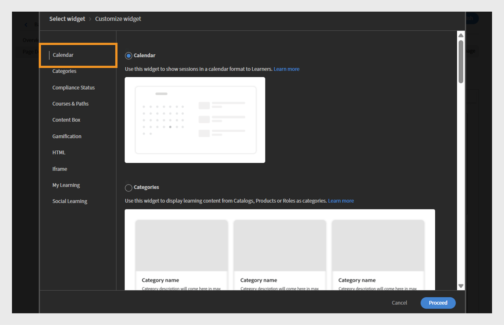
   _Widget選取畫面醒目提示[行事曆]Widget選項，以在行事曆中顯示訓練課程_

8. 輸入&#x200B;**[!UICONTROL Widget title]**&#x200B;和&#x200B;**[!UICONTROL Widget description]**。

   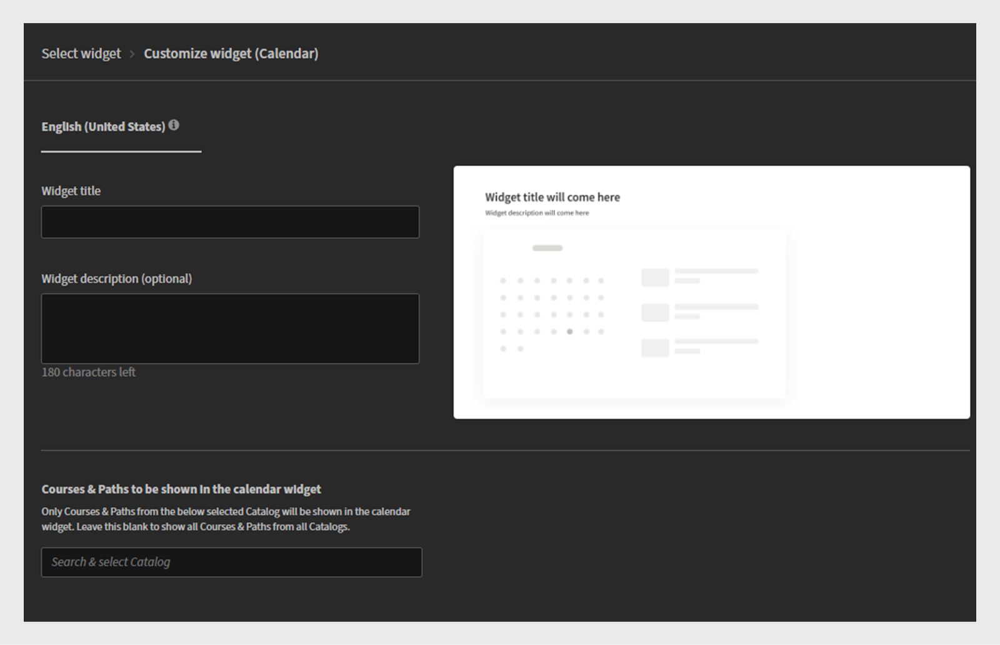
   _行事曆Widget自訂畫面，管理員可以在其中設定Widget標題、說明，並選取目錄_

9. 在&#x200B;**[!UICONTROL Calendar]** Widget中搜尋以顯示其課程和學習路徑，以選取目錄。
10. 選取&#x200B;**[!UICONTROL Add Widget]**。

行事曆Widget將新增至頁面。 管理員可以新增其他Widget並發佈頁面。

>[!NOTE]
>
>如果未選取任何目錄，則會顯示所有目錄中的工作階段。

## 類別Widget

類別Widget會將按目錄、產品或角色組織的學習內容顯示為類別。 它可協助學習者輕鬆瀏覽及尋找依主題、部門、技能或其他相關分類分組的培訓課程。

管理員將類別Widget新增到頁面，以顯示分類的學習選項。 學習者使用Widget選取感興趣的類別來探索訓練，接著顯示相關課程或路徑。

檢視[目錄](/help/migrated/administrators/feature-summary/catalogs.md)和[Recommendations](/help/migrated/recommendations-adobe-learning-manager.md)文章，以進一步瞭解如何設定目錄和建議。

<b>注意</b>：在類別Widget中，選取「目錄」時，清單預設會依建立日期排序。 最近建立的目錄會先出現。

### 新增類別Widget

在金融服務公司，不同的團隊通常需要角色特定培訓的存取權。 類別Widget可將學習內容整理到清晰、可點按的圖磚中，讓銷售和CSM團隊更容易快速找到他們需要的內容。

若要設定類別Widget：

1. 以管理員身分登入Adobe Learning Manager。
2. 在左側導覽窗格中選取&#x200B;**[!UICONTROL Branding]**。
3. 選取&#x200B;**[!UICONTROL Custom Pages]**。
4. 選取必要頁面，然後選取&#x200B;**[!UICONTROL Page Design]**。
5. 選取&#x200B;**[!UICONTROL Edit]**，然後選取配置。
6. 選取&#x200B;**[!UICONTROL Add Widget]**。
7. 選取&#x200B;**[!UICONTROL Categories]**，然後選取&#x200B;**[!UICONTROL Proceed]**。

   
   _Widget選取畫面會醒目提示「類別」Widget選項，依目錄、產品或角色來組織學習內容，方便瀏覽_

8. 選取要顯示在類別卡上的詳細資料：

   * **[!UICONTROL Category Image]**
   * **[!UICONTROL Category Description]**

9. 輸入&#x200B;**[!UICONTROL Widget title]**&#x200B;和&#x200B;**[!UICONTROL Widget description]**。
10. 搜尋並從&#x200B;**[!UICONTROL Category source]**&#x200B;選擇目錄。

   
   _設定類別Widget選項以設定Widget標題和說明，並選取類別來源_

11. 選取&#x200B;**[!UICONTROL Add Widget]**。

類別Widget將會新增至頁面。 管理員可以新增其他Widget並發佈頁面。

## 合規性Widget

「合規性狀態」Widget會顯示學習者達到合規性或認證要求的進度。 它會顯示指派給使用者的強制培訓狀態，包括已完成、擱置中或逾期課程。

管理員可將合規性狀態Widget新增至頁面，以顯示合規性培訓進度。 學習者可用它來快速檢視已完成及仍需注意的必修課程。

### 新增合規性狀態Widget

在金融服務公司，銷售團隊和客戶成功經理(CSM)團隊都必須按時完成合規培訓。 合規性狀態Widget讓學習者更容易直接從團隊特定頁面追蹤即將到來的截止日期及其培訓進度。

若要設定法規遵循Widget：

1. 以管理員身分登入Adobe Learning Manager。
2. 在左側導覽窗格中選取&#x200B;**[!UICONTROL Branding]**。
3. 選取&#x200B;**[!UICONTROL Custom Pages]**。
4. 選取必要頁面，然後選取&#x200B;**[!UICONTROL Page Design]**。
5. 選取&#x200B;**[!UICONTROL Edit]**，然後選取配置。
6. 選取&#x200B;**[!UICONTROL Add Widget]**。
7. 選取&#x200B;**[!UICONTROL Compliance Status]**，然後選取&#x200B;**[!UICONTROL Proceed]**。

   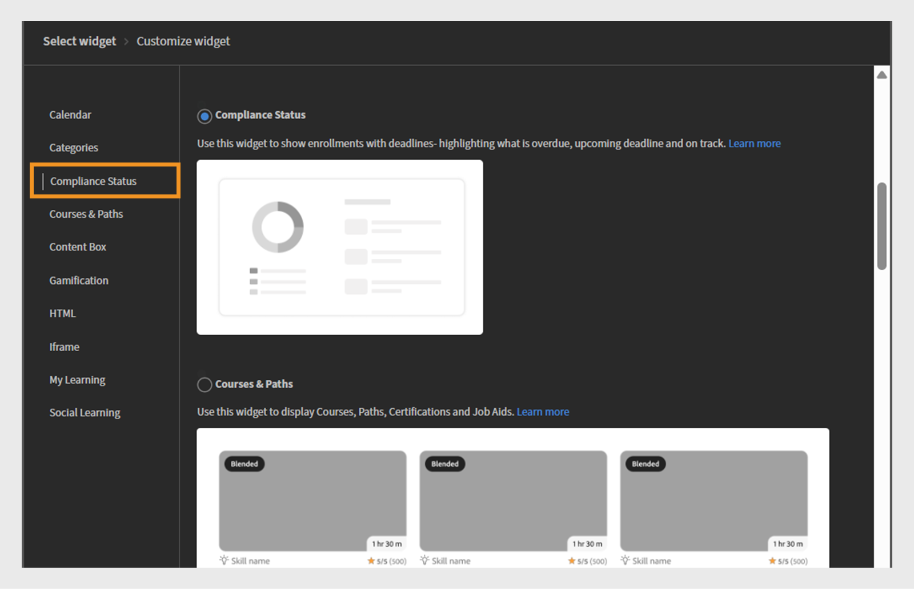
   _Widget選取畫面醒目顯示合規狀態Widget，用於顯示截止日期和狀態指示器的學習者註冊_

8. 輸入&#x200B;**[!UICONTROL Widget title]**&#x200B;和&#x200B;**[!UICONTROL Widget description]**。

   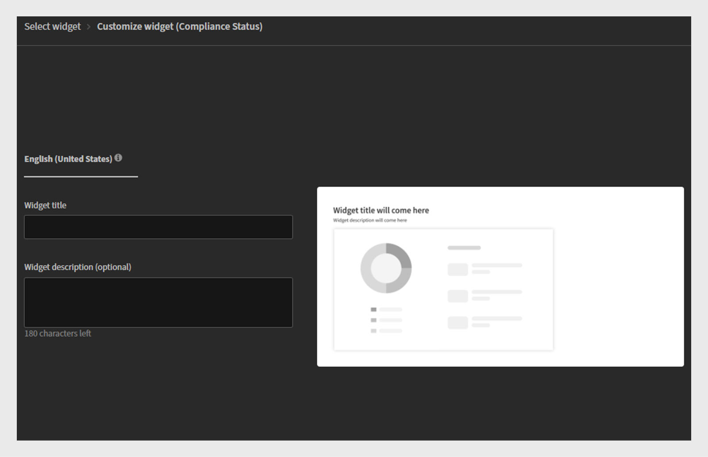
   _法規遵循狀態Widget畫面，管理員可在此設定Widget標題和說明，以顯示學習者的註冊截止日期和狀態_

9. 選取&#x200B;**[!UICONTROL Add widget]**。

合規性狀態Widget將新增至頁面。 管理員可以新增其他Widget並發佈頁面。

## 課程與路徑Widget

課程與路徑Widget會顯示根據學習者的角色、興趣或培訓需求量身打造的建議課程和學習路徑。

管理員可將課程與路徑Widget新增至頁面，強調特定對象的重要學習內容。 學習者可使用工具集瀏覽建議的課程或路徑，並可直接註冊參加課程。

### 新增課程和路徑Widget

一家金融公司想要為其兩個團隊建立角色特定培訓頁面：銷售與客戶成功經理(CSM)。 課程與路徑Widget可顯示每個團隊最相關的學習計畫。

設定課程與路徑Widget：

1. 以管理員身分登入Adobe Learning Manager。
2. 在左側導覽窗格中選取&#x200B;**[!UICONTROL Branding]**。
3. 選取&#x200B;**[!UICONTROL Custom Pages]**。
4. 選取必要頁面，然後選取&#x200B;**[!UICONTROL Page Design]**。
5. 選取&#x200B;**[!UICONTROL Edit]**，然後選取配置。
6. 選取&#x200B;**[!UICONTROL Add Widget]**。
7. 選取&#x200B;**[!UICONTROL Courses & Paths]**。

   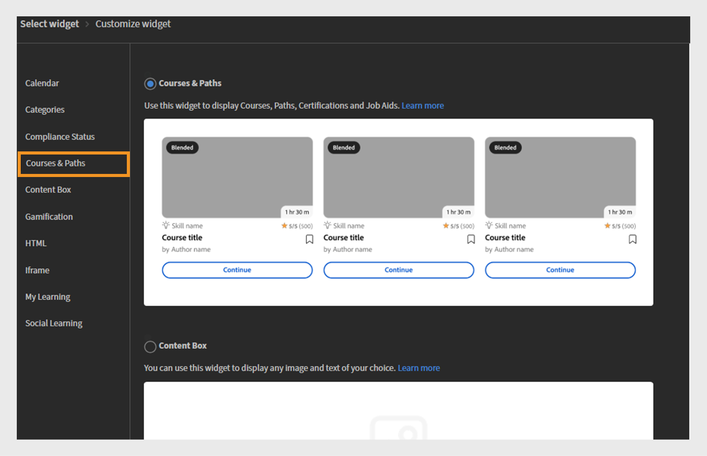
   _Widget選取畫面會醒目提示「課程與路徑」Widget，以將課程、學習路徑、認證和工作輔助顯示為學習者的互動式卡片_

8. 選取&#x200B;**[!UICONTROL Proceed]**。
9. 型別&#x200B;**[!UICONTROL Widget title]**&#x200B;和&#x200B;**[!UICONTROL Widget description]**。
10. 選取目錄，或手動選擇最多25個要顯示的課程。

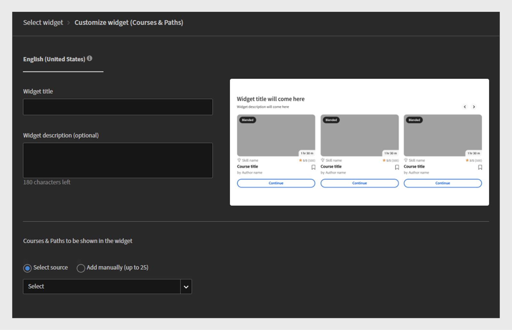
_管理員可設定課程與路徑Widget標題、說明，並選取要顯示為互動式卡片的課程或學習路徑_
11.選取**[!UICONTROL Add widget]**。

課程與路徑Widget將會新增至頁面。 管理員可以新增其他Widget並發佈頁面。

## 內容方塊Widget

「內容方塊」Widget可讓管理員新增自訂內容，例如文字、影像、公告或頁面連結。 它提供彈性的空間，讓您直接在學習環境中分享重要資訊、秘訣、更新或促銷訊息。

### 新增內容方塊Widget

一家金融公司想要為其兩個團隊建立角色特定培訓頁面：銷售與客戶成功經理(CSM)。 內容方塊Widget可用來新增自訂區段，其中包含共用目標資源、更新和激勵訊息的標題、說明、影像和call-to-action按鈕。

若要設定內容方塊Widget：

1. 以管理員身分登入Adobe Learning Manager。
2. 在左側導覽窗格中選取&#x200B;**[!UICONTROL Branding]**。
3. 選取&#x200B;**[!UICONTROL Custom Pages]**。
4. 選取必要頁面，然後選取&#x200B;**[!UICONTROL Page Design]**。
5. 選取&#x200B;**[!UICONTROL Edit]**，然後選取配置。
6. 選取&#x200B;**[!UICONTROL Add Widget]**。
7. 選取&#x200B;**[!UICONTROL Content Box]**，然後選取&#x200B;**[!UICONTROL Proceed]**。

   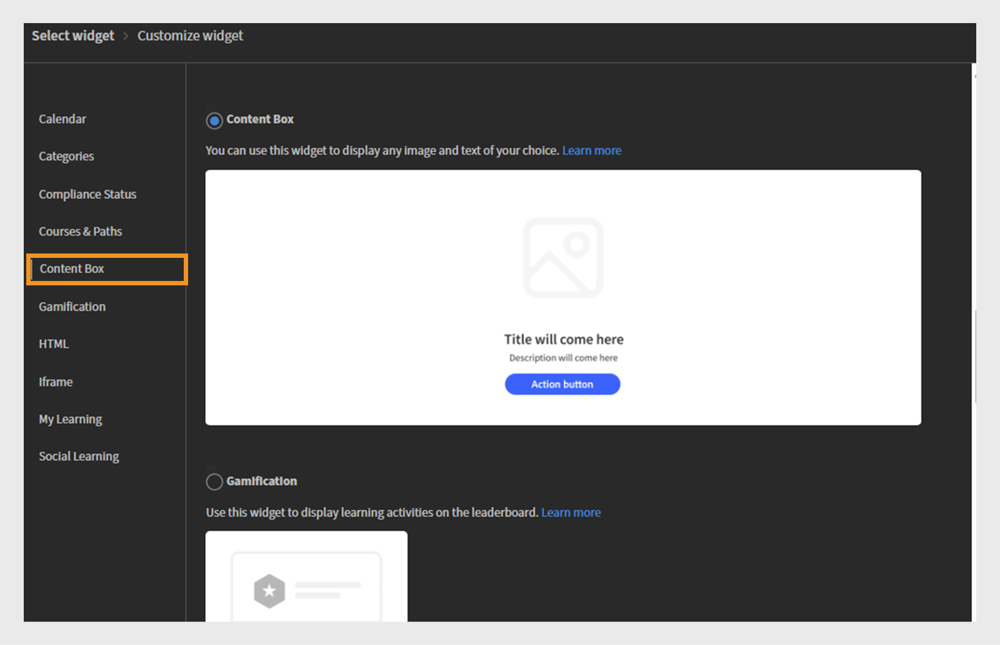
   _Widget選取畫面醒目提示「內容方塊」Widget，以顯示自訂影像、文字和動作按鈕，以增強學習者參與度_

8. 輸入&#x200B;**[!UICONTROL Title]**&#x200B;和&#x200B;**[!UICONTROL Description]**。
9. 在&#x200B;**[!UICONTROL Action button label]**&#x200B;中輸入文字並提供連結。
10. 選取「背景」填色的任何選項：

   * **[!UICONTROL Color]**：從檢色器選取色彩，或在文字欄位中輸入色彩代碼。
   * **[!UICONTROL Image]**：瀏覽並上傳圖片。

11. 使用&#x200B;**[!UICONTROL Content box height]**&#x200B;選項調整方塊高度。
12. 選取文字格式選項。

   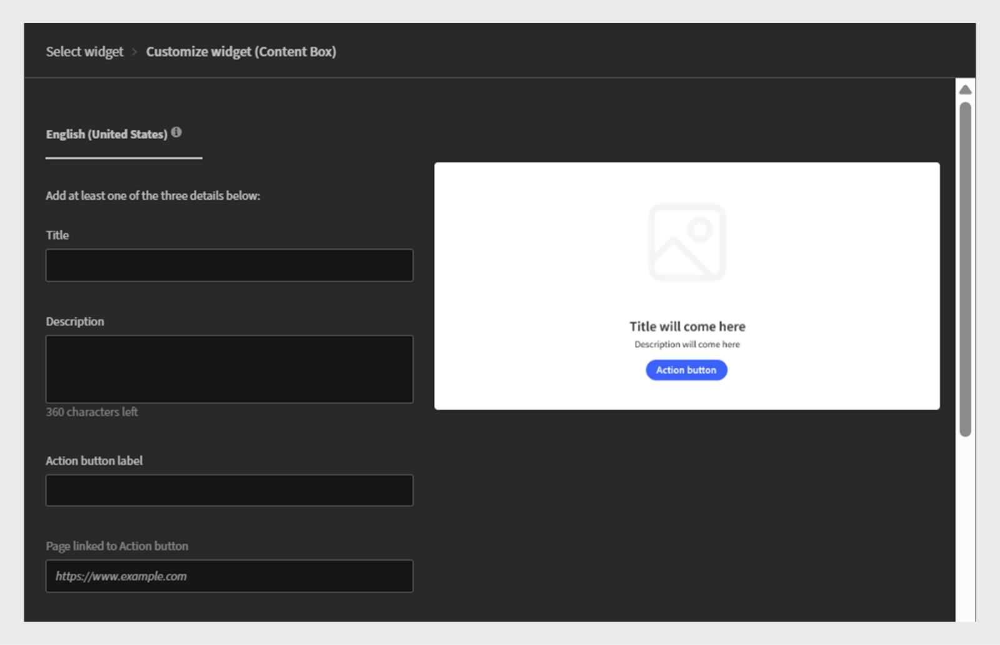
   _Content Box Widget自訂畫面，管理員可在此輸入標題、說明、動作按鈕標籤和連結_

13. 選取&#x200B;**[!UICONTROL Add widgets]**。

內容方塊Widget將會新增至頁面。 管理員可以新增其他Widget並發佈頁面。

## gamification Widget

管理員會將Gamification Widget新增至自訂頁面，以展示學習者的成就，例如獲得的徽章、累積積分和排行榜排名。 學習者可以追蹤其進度並與同業比較結果，藉此促進動機及持續參與。

### 新增Gamification Widget

一家金融公司想要透過其兩個主要團隊(銷售與客戶成功經理(CSM))來提升學習者的參與度和動機。 gamification Widget可用來獎勵獲得點、徽章和排行榜的學習者，獎勵他們完成培訓和主動參與。

對於銷售團隊而言，gamification可專注於獎勵與銷售技能、產品知識及客戶參與培訓相關的成就。 對於CSM團隊來說，重點可能在於客戶服務認證、合規培訓以及客戶管理技能。

若要設定Gamification Widget：

1. 以管理員身分登入Adobe Learning Manager。
2. 在左側導覽窗格中選取&#x200B;**[!UICONTROL Branding]**。
3. 選取&#x200B;**[!UICONTROL Custom Pages]**。
4. 選取必要頁面，然後選取&#x200B;**[!UICONTROL Page Design]**。
5. 選取&#x200B;**[!UICONTROL Edit]**，然後選取配置。
6. 選取&#x200B;**[!UICONTROL Add Widget]**。
7. 選取&#x200B;**[!UICONTROL Gamification]**，然後選取&#x200B;**[!UICONTROL Proceed]**。

   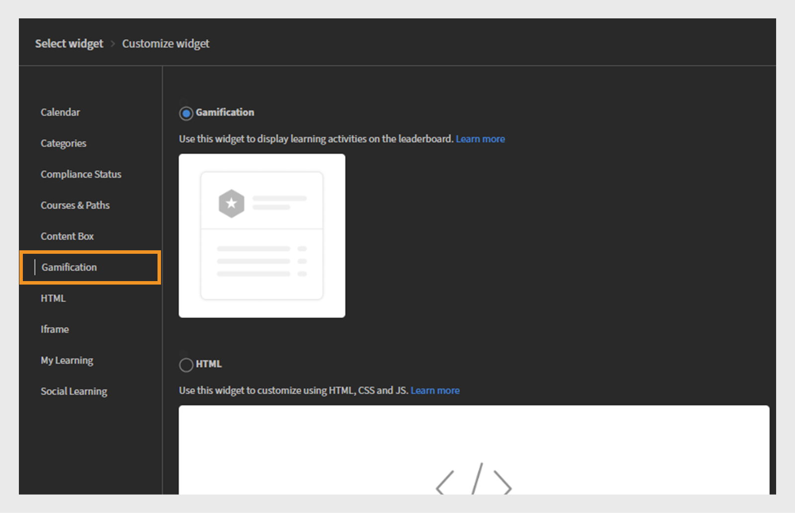
   _Widget選取畫面會反白標示用來在排行榜上顯示學習活動和成就的Gamification Widget_

8. 輸入&#x200B;**[!UICONTROL Widget title]**&#x200B;和&#x200B;**[!UICONTROL Widget description]**。
9. 選取&#x200B;**[!UICONTROL Add widgets]**。

gamification Widget將會新增至頁面。 管理員可以新增其他Widget並發佈頁面。

## HTML Widget

HTML Widget可讓管理員直接將自訂HTML程式碼內嵌至頁面。 如此可讓您靈活地新增量身打造的內容、整合協力廠商工具，或納入超越標準Widget功能的互動式元素。 它透過HTML、CSS甚至JavaScript支援豐富的自訂功能，在學習平台內啟用獨特設計和外部整合。

### 新增HTML Widget

一家金融公司想要針對其兩大團隊：銷售與客戶成功經理(CSM)提供量身打造的自訂互動式內容。 HTML Widget可用來將自訂HTML型資源（例如財務儀表板、資料視覺效果、互動式表單或市場分析工具）直接內嵌到其培訓或團隊頁面中。

若要設定HTML Widget：

1. 以管理員身分登入Adobe Learning Manager。
2. 在左側導覽窗格中選取&#x200B;**[!UICONTROL Branding]**。
3. 選取&#x200B;**[!UICONTROL Custom Pages]**。
4. 選取必要頁面，然後選取&#x200B;**[!UICONTROL Page Design]**。
5. 選取&#x200B;**[!UICONTROL Edit]**，然後選取配置。
6. 選取&#x200B;**[!UICONTROL Add Widget]**。
7. 選取&#x200B;**[!UICONTROL HTML]**，然後選取&#x200B;**[!UICONTROL Proceed]**。

   
   _Widget選取畫面會醒目顯示HTML Widget，以便使用HTML、CSS和JavaScript程式碼自訂頁面_

8. 在個別欄位中輸入您的&#x200B;**[!UICONTROL HTML]**、**[!UICONTROL CSS]**&#x200B;和&#x200B;**[!UICONTROL JavaScript]**&#x200B;程式碼。
9. 選取&#x200B;**[!UICONTROL Add widget]**。

HTML Widget將會新增至頁面。 管理員可以新增其他Widget並發佈頁面。

## IFrame Widget

Iframe Widget會直接在學習平台的頁面中顯示外部URL的內容。 它將外部網站、工具或應用程式內嵌在框架中，讓學習者無需離開LMS即可檢視內容並與之互動。

### 新增Iframe Widget

一家金融公司想要將外部工具和資源順暢地嵌入其內部培訓和合作頁面，以供其銷售人員和客戶成功經理(CSM)團隊使用。 Iframe Widget可用來直接在LMS介面中顯示第三方財務儀表板、市場分析平台或使用者端管理入口網站。

若要設定Iframe Widget：

1. 以管理員身分登入Adobe Learning Manager。
2. 在左側導覽窗格中選取&#x200B;**[!UICONTROL Branding]**。
3. 選取&#x200B;**[!UICONTROL Custom Pages]**。
4. 選取必要頁面，然後選取&#x200B;**[!UICONTROL Page Design]**。
5. 選取&#x200B;**[!UICONTROL Edit]**，然後選取配置。
6. 選取&#x200B;**[!UICONTROL Add Widget]**。
7. 選取&#x200B;**[!UICONTROL Iframe]**，然後選取&#x200B;**[!UICONTROL Proceed]**。

   
   _Widget選取畫面會醒目提示Iframe Widget，以便在選取的區段中內嵌外部應用程式或網頁_

8. 在&#x200B;**[!UICONTROL Page linked to Action button]**&#x200B;選項中輸入URL。
9. 使用&#x200B;**[!UICONTROL Iframe height]**&#x200B;選項調整Iframe高度。

   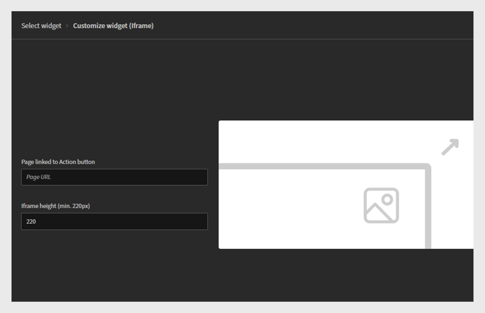
   _Iframe Widget自訂畫面，管理員可在此輸入頁面URL並指定iframe高度以內嵌外部內容_

10. 選取&#x200B;**[!UICONTROL Add widget]**。

Iframe Widget將會新增至頁面。 管理員可以新增其他Widget並發佈頁面。

管理員必須在iframe URL中包含存取權杖作為查詢引數，以擷取正確的詳細資料。 例如，若要在iframe內顯示Adobe Learning Manager的資訊，URL應包含下列引數：

* userId：學習者的唯一識別碼
* accountId：與學習者相關聯的帳戶識別碼
* 權杖： API呼叫所需的驗證權杖
* 地區設定：學習者的語言或地區設定偏好設定

## 我的學習Widget

「我的學習」Widget可為學習者提供其指派或註冊的所有課程、學習計畫及認證的個人化檢視。 它會依型別和期限組織學習內容，讓學習者輕鬆追蹤進度並存取學習資料。 此Widget可協助學習者專注於所需的培訓，並短暫檢視近期截止日期。

### 新增我的學習Widget

一家金融公司想要針對其兩大團隊提供量身打造的個人化學習體驗：銷售與客戶成功經理(CSM)。 「我的學習」Widget可用來向每位團隊成員提供其指派的課程、進行中的學習路徑及認證的整合式檢視。

設定我的學習Widget：

1. 以管理員身分登入Adobe Learning Manager。
2. 在左側導覽窗格中選取&#x200B;**[!UICONTROL Branding]**。
3. 選取&#x200B;**[!UICONTROL Custom Pages]**。
4. 選取必要頁面，然後選取&#x200B;**[!UICONTROL Page Design]**。
5. 選取&#x200B;**[!UICONTROL Edit]**，然後選取配置。
6. 選取&#x200B;**[!UICONTROL Add Widget]**。
7. 選取&#x200B;**[!UICONTROL My Learning]**，然後選取&#x200B;**[!UICONTROL Proceed]**。

   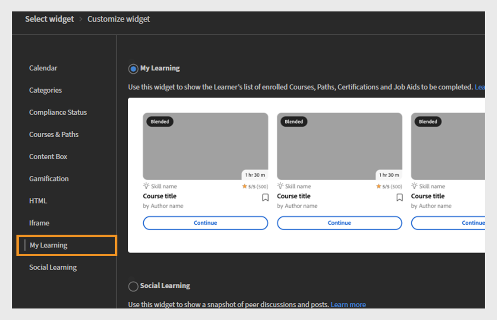
   _Widget選擇畫面，醒目提示「我的學習」Widget，用於顯示學習者已註冊課程的個人化清單_

8. 輸入&#x200B;**[!UICONTROL Widget title]**&#x200B;和&#x200B;**[!UICONTROL Widget description]**。
9. 選取&#x200B;**[!UICONTROL Add widget]**。

我的學習Widget將新增至頁面。 管理員可以新增其他Widget並發佈頁面。

## 社交學習Widget

社交學習Widget可讓學習者在學習平台內互動、分享想法及共同作業。 它支援發佈各種型別的內容，例如文字、影片、音訊、熒幕擷圖、問題和投票。 學習者可以發表評論、回覆、投票贊成或投票反對的貼文，促進點對點知識分享和參與。 此Widget可建立非正式的學習空間，鼓勵社互動動和持續學習，藉以補充正式培訓。

### 新增社交學習Widget

一家金融公司想要在兩個主要團隊之間共同作業和知識分享：銷售與客戶成功經理(CSM)。 社交學習Widget可用於建立互動式空間，團隊成員可在其中張貼問題、分享最佳實務、上傳實用內容並參與討論。

設定社交學習Widget：

1. 以管理員身分登入Adobe Learning Manager。
2. 在左側導覽窗格中選取&#x200B;**[!UICONTROL Branding]**。
3. 選取&#x200B;**[!UICONTROL Custom Pages]**。
4. 選取必要頁面，然後選取&#x200B;**[!UICONTROL Page Design]**。
5. 選取&#x200B;**[!UICONTROL Edit]**，然後選取配置。
6. 選取&#x200B;**[!UICONTROL Add Widget]**。
7. 選取&#x200B;**[!UICONTROL Social Learning]**，然後選取&#x200B;**[!UICONTROL Proceed]**。

   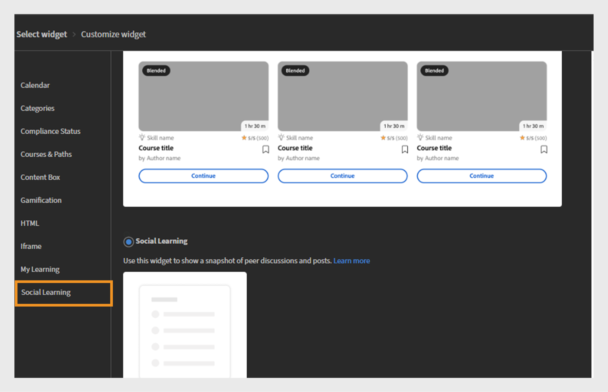
   _Widget選取畫面會醒目顯示社交學習Widget，以顯示貼文以鼓勵共同作業和參與_

8. 輸入&#x200B;**[!UICONTROL Widget title]**&#x200B;和&#x200B;**[!UICONTROL Widget description]**。
9. 選取&#x200B;**[!UICONTROL Add widget]**。

社交學習Widget將會新增至頁面。 管理員可以新增其他Widget並發佈頁面。

## 下一步

在頁面上設定Widget後，使用功能表將頁面整理及群組在一起。
