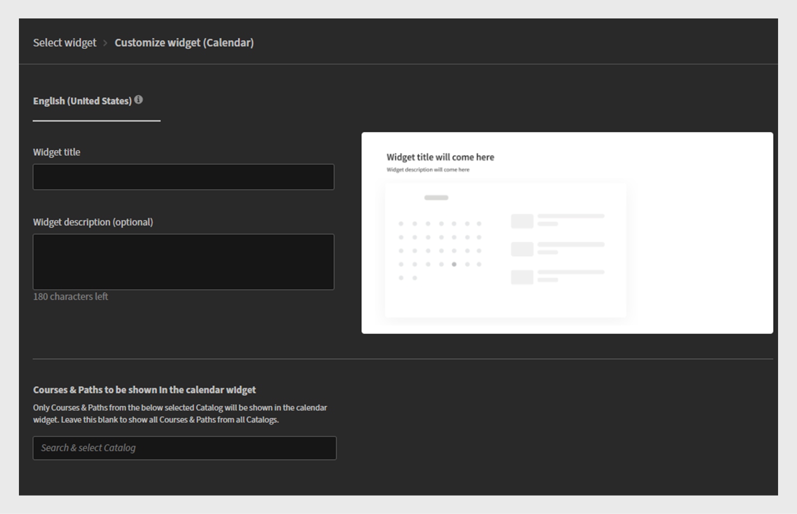
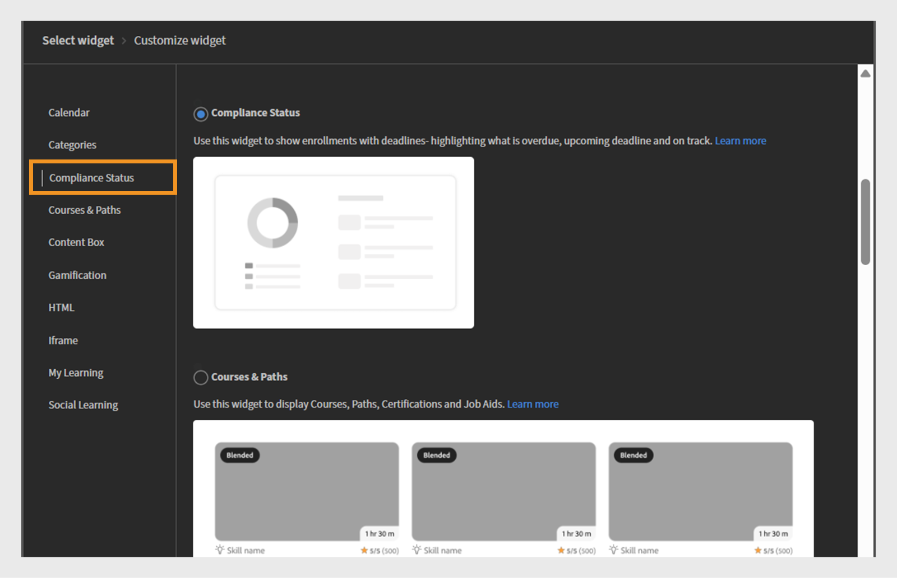
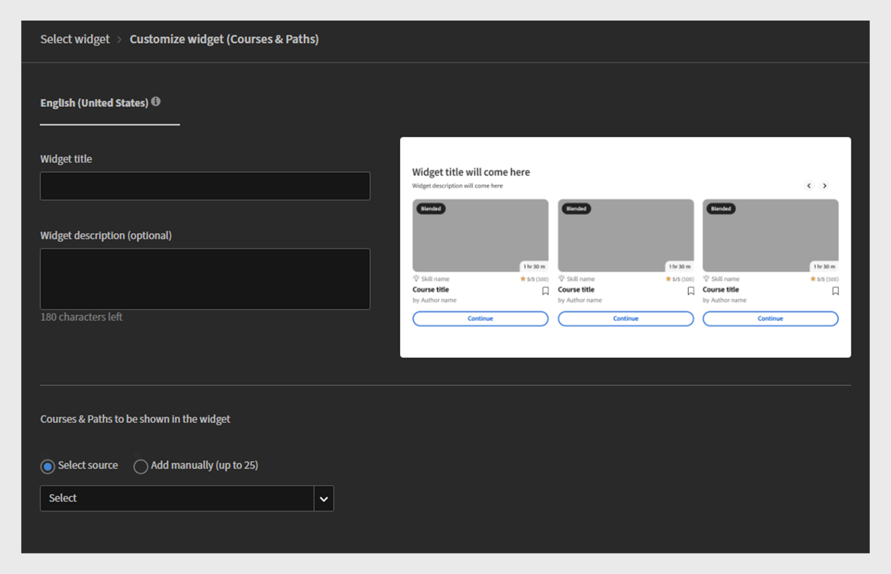
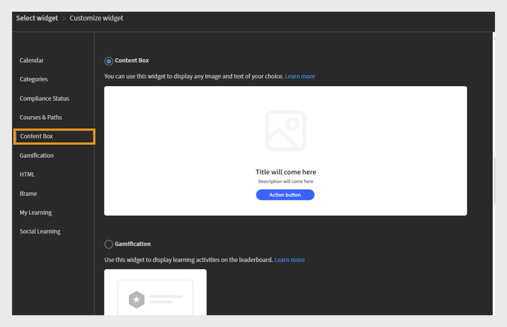
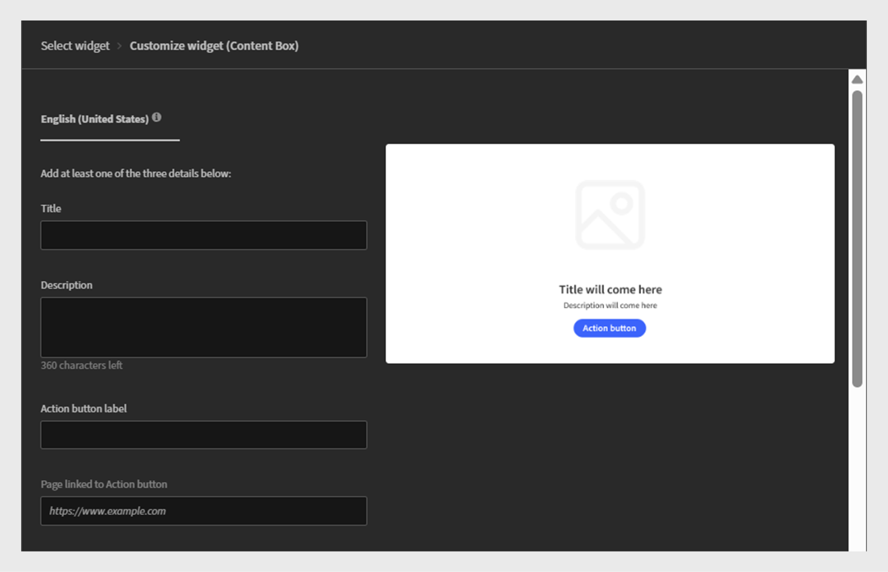
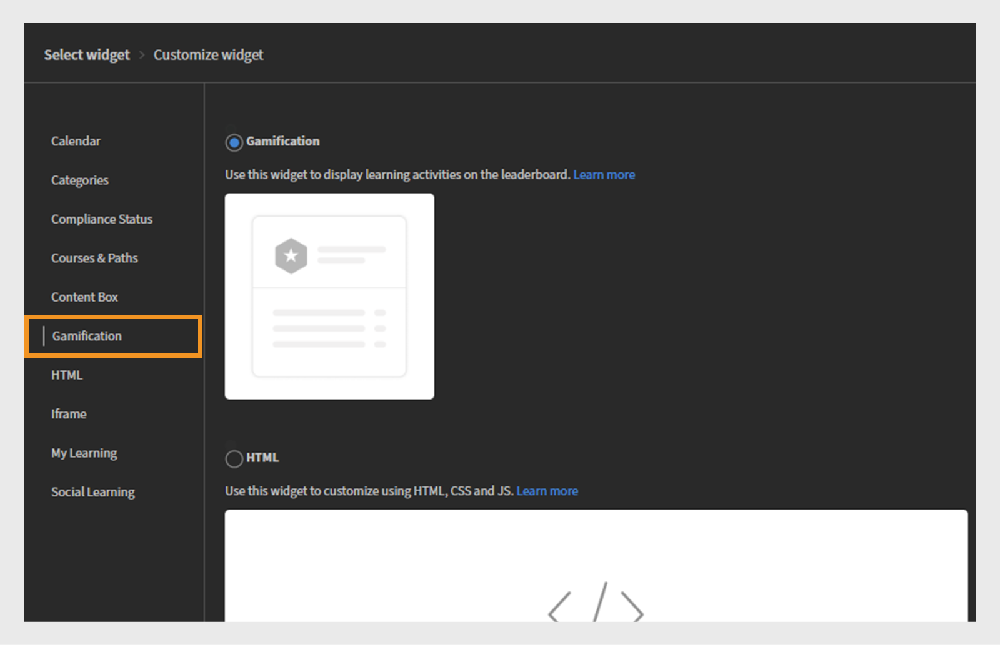
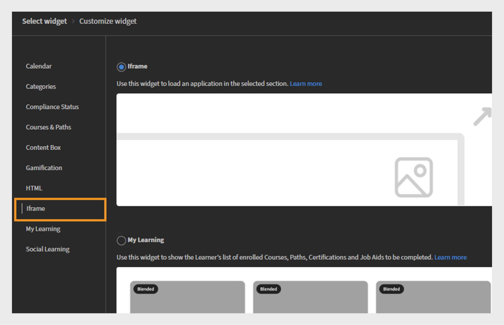

# 新增與配置小工具

## 行事曆小工具

行事曆小工具會顯示你排定的課程和訓練。 你可以瀏覽行事曆，查看未來幾個月的訓練安排。 它允許按月份查看訓練課程，並可向左或向右捲動。

管理員可將行事曆小工具加入頁面，以顯示訓練行程。 學習者可以透過滑動月份來與行事曆互動，查看即將到來的課程。 他們可以篩選課程，快速找到相關的訓練。

### 新增行事曆小工具

在擁有獨立銷售與客戶成功經理（CSM）團隊的金融公司中，管理員可使用此小工具突顯團隊專屬培訓課程。 例如：

* 銷售團隊可以看到即將舉辦的產品更新、合規訓練及簡報工作坊等課程。
* CSM 團隊可檢視客戶入職工作坊、客戶溝通培訓及卓越服務計畫。

要設定行事曆小工具：

1. 以管理員身份登入 Adobe Learning Manager。
2. 在左側導覽窗格選擇 **[!UICONTROL Branding]** 。
3. 選擇 **[!UICONTROL Custom Pages]**。
4. 選擇所需頁面，然後選擇 **[!UICONTROL Page Design]**。
5. 選擇 **[!UICONTROL Edit]** 並選擇版面配置。
6. 選擇 **[!UICONTROL Add Widget]**。
7. 選擇 **[!UICONTROL Calendar]** ，然後選擇 **[!UICONTROL Proceed]**。

   
   _選出小工具畫面，重點顯示行事曆小工具選項，以顯示訓練課程_

8. A型和&#x200B;**[!UICONTROL Widget title]**&#x200B;**[!UICONTROL Widget description]**。

   
   _行事曆小工具自訂畫面，管理員可在此設定小工具標題、描述並選擇目錄_

9. 透過搜尋選擇目錄，即可在小工具中 **[!UICONTROL Calendar]** 顯示課程與學習路徑。
10. 選擇 **[!UICONTROL Add Widget]**。

行事曆小工具會被加入頁面。 管理員可以新增其他小工具並發佈頁面。

>[!NOTE]
>
>若未選取任何目錄，則會顯示所有目錄的課程內容。

## 分類小工具

分類小工具會依目錄、產品或角色分類，顯示學習內容。 它幫助學習者輕鬆瀏覽並找到依主題、部門、技能或其他相關分類分組的訓練內容。

管理員會在頁面上新增分類小工具，以展示分類學習選項。 學習者可透過選擇感興趣的類別來探索培訓內容，進而顯示相關的課程或路徑。

請參閱 [目錄](/help/migrated/administrators/feature-summary/catalogs.md) 與 [推薦](/help/migrated/recommendations-adobe-learning-manager.md) 文章，了解更多關於如何配置目錄與推薦的內容。

<b>注意</b>：在分類小工具中，當選擇目錄時，列表預設依建立日期排序。 較近期製作的目錄最先出現。

### 新增分類小工具

在金融服務公司，不同團隊通常需要針對特定職務的訓練。 分類小工具幫助將學習內容組織成清晰且可點擊的磁磚，讓銷售與客戶服務經理團隊更容易快速找到所需內容。

要設定分類小工具：

1. 以管理員身份登入 Adobe Learning Manager。
2. 在左側導覽窗格選擇 **[!UICONTROL Branding]** 。
3. 選擇 **[!UICONTROL Custom Pages]**。
4. 選擇所需頁面，然後選擇 **[!UICONTROL Page Design]**。
5. 選擇 **[!UICONTROL Edit]** 並選擇版面配置。
6. 選擇 **[!UICONTROL Add Widget]**。
7. 選擇 **[!UICONTROL Categories]** ，然後選擇 **[!UICONTROL Proceed]**。

   
   _小工具選擇畫面，重點顯示分類小工具選項，可依目錄、產品或角色組織學習內容，方便導航_

8. 選擇詳細資料，顯示在類別卡片上：

   * **[!UICONTROL Category Image]**
   * **[!UICONTROL Category Description]**

9. A型和&#x200B;**[!UICONTROL Widget title]**&#x200B;**[!UICONTROL Widget description]**。
10. 從 中搜尋並選擇目錄。**[!UICONTROL Category source]**

    
    _設定類別小工具選項以設定小工具標題與描述，並選擇類別來源_

11. 選擇 **[!UICONTROL Add Widget]**。

分類小工具將會被加入頁面。 管理員可以新增其他小工具並發佈頁面。

## 合規小工具

合規狀態小工具顯示學習者在達成合規或認證要求上的進展。 它顯示分配給使用者的強制訓練狀態，包括已完成、待完成或逾期課程。

管理員會在頁面新增合規狀態小工具，以提供合規訓練進度的可見性。 學習者利用它快速檢查已完成哪些必修課程，哪些仍需注意。

### 新增合規狀態小工具

在金融服務公司，銷售團隊與客戶成功經理（CSM）團隊都必須準時完成合規訓練。 合規狀態小工具讓學習者能直接從團隊專屬頁面追蹤即將到來的截止日期和培訓進度。

要設定合規小工具：

1. 以管理員身份登入 Adobe Learning Manager。
2. 在左側導覽窗格選擇 **[!UICONTROL Branding]** 。
3. 選擇 **[!UICONTROL Custom Pages]**。
4. 選擇所需頁面，然後選擇 **[!UICONTROL Page Design]**。
5. 選擇 **[!UICONTROL Edit]** 並選擇版面配置。
6. 選擇 **[!UICONTROL Add Widget]**。
7. 選擇 **[!UICONTROL Compliance Status]** ，然後選擇 **[!UICONTROL Proceed]**。

   
   _小工具選擇畫面，強調用於顯示學習者註冊及截止日期及狀態指標的合規狀態小工具_

8. A型和&#x200B;**[!UICONTROL Widget title]**&#x200B;**[!UICONTROL Widget description]**。

   
   _合規狀態小工具畫面，管理員可設定小工具標題與描述，以顯示學習者的註冊截止日期與狀態_

9. 選擇 **[!UICONTROL Add widget]**。

合規狀態小工具將會被新增到頁面中。 管理員可以新增其他小工具並發佈頁面。

## 課程與路徑小工具

課程與路徑小工具會顯示根據學習者的角色、興趣或訓練需求量身打造的推薦課程與學習路徑。

管理員會在頁面上新增課程與路徑小工具，以突顯特定受眾的關鍵學習內容。 學習者可使用小工具瀏覽推薦課程或路徑，並可直接報名課程。

### 新增一個課程與路徑小工具

一家金融公司希望為其兩個團隊——銷售經理與客戶成功經理（CSM）——建立專屬職務的培訓頁面。 課程與路徑小工具可用來顯示各團隊最相關的學習計畫。

要設定「路徑與路徑」小工具：

1. 以管理員身份登入 Adobe Learning Manager。
2. 在左側導覽窗格選擇 **[!UICONTROL Branding]** 。
3. 選擇 **[!UICONTROL Custom Pages]**。
4. 選擇所需頁面，然後選擇 **[!UICONTROL Page Design]**。
5. 選擇 **[!UICONTROL Edit]** 並選擇版面配置。
6. 選擇 **[!UICONTROL Add Widget]**。
7. 選擇 **[!UICONTROL Courses & Paths]**。

   
   _小工具選擇畫面，重點顯示課程與路徑小工具，顯示課程、學習路徑、證照及工作輔助工具，作為學習者的互動卡片_

8. 選擇 **[!UICONTROL Proceed]**。
9. 類型 **[!UICONTROL Widget title]** 與 **[!UICONTROL Widget description]**。
10. 選擇課程目錄或手動選擇最多25門課程以顯示。

_課程與路徑小工具，管理員可設定小工具標題、描述，並選擇課程或學習路徑以互動卡片顯示_
&#x200B;11. 選擇 **[!UICONTROL Add widget]**。

「課程與路徑」小工具將會新增到頁面上。 管理員可以新增其他小工具並發佈頁面。

## 內容框小工具

內容框小工具允許管理員新增自訂內容，如文字、圖片、公告或頁面連結。 它提供一個靈活的空間，讓學生能直接在學習環境中分享重要資訊、技巧、更新或宣傳訊息。

### 新增內容框小工具

一家金融公司希望為其兩個團隊——銷售經理與客戶成功經理（CSM）——建立專屬職務的培訓頁面。 內容框小工具可用來新增自訂區塊，包含標題、描述、圖片及行動呼籲按鈕，分享目標資源、更新與激勵訊息。

要設定內容盒小工具：

1. 以管理員身份登入 Adobe Learning Manager。
2. 在左側導覽窗格選擇 **[!UICONTROL Branding]** 。
3. 選擇 **[!UICONTROL Custom Pages]**。
4. 選擇所需頁面，然後選擇 **[!UICONTROL Page Design]**。
5. 選擇 **[!UICONTROL Edit]** 並選擇版面配置。
6. 選擇 **[!UICONTROL Add Widget]**。
7. 選擇 **[!UICONTROL Content Box]** ，然後選擇 **[!UICONTROL Proceed]**。

   
   _小工具選擇畫面，重點顯示內容框小工具，顯示自訂圖片、文字及動作按鈕，提升學習者參與度_

8. 輸入 **[!UICONTROL Title]** &amp; **[!UICONTROL Description]**。
9. 輸入文字 **[!UICONTROL Action button label]** 並附上連結。
10. 請選擇背景填充的任一選項：

    * **[!UICONTROL Color]**：從色彩選擇器中選擇顏色，或在文字欄位輸入顏色代碼。
    * **[!UICONTROL Image]**&#x200B;瀏覽並上傳圖片。

11. 用選項 **[!UICONTROL Content box height]** 調整盒子高度。
12. 選擇文字格式選項。

    
    _內容框小工具自訂畫面，管理員可在此輸入標題、描述、動作按鈕標籤及連結_

13. 選擇 **[!UICONTROL Add widgets]**。

內容框小工具將會被加入頁面。 管理員可以新增其他小工具並發佈頁面。

## 遊戲化小工具

管理員會在自訂頁面新增遊戲化小工具，展示學習者的成就，例如已獲得的徽章、累積的積分和排行榜排名。 學習者可以追蹤自己的進展，並與同儕比較結果，這有助於激發動力並持續參與。

### 新增遊戲化小工具

一家金融公司希望提升學習者在兩大團隊——銷售與客戶成功經理（CSM）之間的參與度與動力。 遊戲化小工具可用來獎勵學習者，獎勵完成訓練並積極參與的學習者積分、徽章及排行榜排名。

對銷售團隊而言，遊戲化可以著重於獎勵與銷售技巧、產品知識及客戶互動培訓相關的成就。 對CSM團隊來說，可能會強調客戶服務認證、合規訓練和客戶管理技能。

要設定遊戲化小工具：

1. 以管理員身份登入 Adobe Learning Manager。
2. 在左側導覽窗格選擇 **[!UICONTROL Branding]** 。
3. 選擇 **[!UICONTROL Custom Pages]**。
4. 選擇所需頁面，然後選擇 **[!UICONTROL Page Design]**。
5. 選擇 **[!UICONTROL Edit]** 並選擇版面配置。
6. 選擇 **[!UICONTROL Add Widget]**。
7. 選擇 **[!UICONTROL Gamification]** ，然後選擇 **[!UICONTROL Proceed]**。

   
   _小工具選擇畫面，重點顯示用於顯示學習活動與成就的遊戲化小工具_

8. 輸入 **[!UICONTROL Widget title]** &amp; **[!UICONTROL Widget description]**。
9. 選擇 **[!UICONTROL Add widgets]**。

遊戲化小工具將會被加入頁面。 管理員可以新增其他小工具並發佈頁面。

## HTML 小工具

HTML 小工具允許管理員直接將自訂 HTML 程式碼嵌入頁面中。 這讓玩家能靈活加入客製化內容、整合第三方工具，或加入超越標準小工具功能的互動元素。 它支援透過 HTML、CSS 甚至 JavaScript 進行豐富的自訂，實現獨特的設計與學習平台內的外部整合。

### 新增一個 HTML 小工具

一家金融公司希望為其兩大團隊——銷售經理與客戶成功經理（CSM）——提供客製化且互動式的內容。 HTML 小工具可用來將自訂的 HTML 資源，如財務儀表板、資料視覺化、互動表單或市場分析工具，直接嵌入訓練或團隊頁面中。

要設定 HTML 小工具：

1. 以管理員身份登入 Adobe Learning Manager。
2. 在左側導覽窗格選擇 **[!UICONTROL Branding]** 。
3. 選擇 **[!UICONTROL Custom Pages]**。
4. 選擇所需頁面，然後選擇 **[!UICONTROL Page Design]**。
5. 選擇 **[!UICONTROL Edit]** 並選擇版面配置。
6. 選擇 **[!UICONTROL Add Widget]**。
7. 選擇 **[!UICONTROL HTML]** ，然後選擇 **[!UICONTROL Proceed]**。

   
   _小工具選擇畫面，重點顯示使用 HTML、CSS 和 JavaScript 程式碼自訂頁面的 HTML 小工具_

8. 在相應欄位輸入你的&#x200B;**[!UICONTROL HTML]**、 和 **[!UICONTROL CSS]**&#x200B;**[!UICONTROL JavaScript]** 程式碼。
9. 選擇 **[!UICONTROL Add widget]**。

HTML 小工具會被加入頁面。 管理員可以新增其他小工具並發佈頁面。

## IFrame 小工具

Iframe 小工具直接在學習平台上的頁面中顯示外部網址的內容。 它將外部網站、工具或應用程式嵌入框架內，讓學習者在不離開 LMS 的情況下就能瀏覽並互動該內容。

### 新增 Iframe 小工具

一家金融公司希望將外部工具與資源無縫嵌入其內部的銷售與客戶成功經理（CSM）團隊的培訓與協作頁面中。 Iframe 小工具可用於直接在 LMS 介面內顯示第三方財務儀表板、市場分析平台或客戶管理入口網站。

要設定 Iframe 小工具：

1. 以管理員身份登入 Adobe Learning Manager。
2. 在左側導覽窗格選擇 **[!UICONTROL Branding]** 。
3. 選擇 **[!UICONTROL Custom Pages]**。
4. 選擇所需頁面，然後選擇 **[!UICONTROL Page Design]**。
5. 選擇 **[!UICONTROL Edit]** 並選擇版面配置。
6. 選擇 **[!UICONTROL Add Widget]**。
7. 選擇 **[!UICONTROL Iframe]** ，然後選擇 **[!UICONTROL Proceed]**。

   
   _Widget 選擇畫面，突出 Iframe Widget，用於嵌入外部應用程式或網頁於所選區段內_

8. 在選項中 **[!UICONTROL Page linked to Action button]** 輸入網址。
9. 用選項 **[!UICONTROL Iframe height]** 調整 Iframe 高度。

   
   _iframe 小工具自訂畫面，管理員可輸入頁面網址並指定 iframe 高度以嵌入外部內容_

10. 選擇 **[!UICONTROL Add widget]**。

Iframe 小工具會被加入頁面。 管理員可以新增其他小工具並發佈頁面。

管理員必須將存取權杖作為查詢參數納入 iframe URL 中，才能取得正確資訊。 例如，要在 iframe 中顯示 Adobe Learning Manager 的資訊，URL 應包含以下參數：

* userId：學習者的唯一識別碼
* accountId：與學習者相關的帳號識別碼
* 令牌：API 呼叫所需的認證令牌
* 地點：學習者的語言或偏好的地點

## 我的學習小工具

我的學習小工具為學習者提供個人化的視圖，展示所有由他們指派或註冊的課程、學習計畫及認證。 它依類型與截止日期組織學習內容，讓學習者能輕鬆追蹤進度並取得學習資源。 這個小工具幫助學習者專注於必要的訓練，並快速查看即將到來的截止日期。

### 新增「我的學習」小工具

一家金融公司希望為其兩大團隊——銷售經理與客戶成功經理（CSM）——量身打造個人化學習體驗。 「我的學習」小工具可讓每位團隊成員整合檢視其分配課程、持續學習路徑及認證。

要設定我的學習小工具：

1. 以管理員身份登入 Adobe Learning Manager。
2. 在左側導覽窗格選擇 **[!UICONTROL Branding]** 。
3. 選擇 **[!UICONTROL Custom Pages]**。
4. 選擇所需頁面，然後選擇 **[!UICONTROL Page Design]**。
5. 選擇 **[!UICONTROL Edit]** 並選擇版面配置。
6. 選擇 **[!UICONTROL Add Widget]**。
7. 選擇 **[!UICONTROL My Learning]** ，然後選擇 **[!UICONTROL Proceed]**。

   
   _小工具選擇畫面，重點顯示「我的學習」小工具，用來顯示學習者個人化的已選課清單_

8. 輸入 **[!UICONTROL Widget title]** &amp; **[!UICONTROL Widget description]**。
9. 選擇 **[!UICONTROL Add widget]**。

我的學習小工具會被加入到頁面上。 管理員可以新增其他小工具並發佈頁面。

## 由我拯救的小工具 {#bookmark-widget}

**「Saved by me**」小工具會顯示課程、學習路徑、證照和工作輔助工具，學習者已將這些內容收藏起來以備後續使用。它讓學習者有一個單一的地方，可以找到已標記為已儲存的內容，而無需再次搜尋目錄。

作為管理員，你可以將 **「由我** 儲存」小工具加入頁面，讓學習者快速存取他們已收藏的內容。 學習者可以使用這個小工具重溫瀏覽時儲存的課程，而不必重複原本的搜尋或導航。

將此小工具加入頁面有助於：

* 透過提供一鍵存取常存取內容，簡化學習者的工作流程

* 減少重複的導航與尋找資源的時間

* 打造更個人化的學習體驗，提升滿意度與參與度

### 新增「已儲存」小工具

試想一家金融公司正在向其銷售與客戶成功經理（CSM）團隊推出超過50門新課程。  學習者瀏覽目錄時，會將與自身職務相關的五、六門課程加入書籤。

這些已儲存的課程會自動顯示在學習者個人化首頁的「由我儲存」小工具中。 他們不必再瀏覽目錄，而是直接進入小工具，存取或註冊他們預留的內容。

要設定 **「由我** 儲存」小工具：

1. 以管理員身份登入 Adobe Learning Manager。
2. 在左側導覽欄選「**品牌」。**
3. 選擇 **自訂頁面**。
4. 選擇所需頁面，然後選擇 **頁面設計**。
5. 選擇版面配置。
6. 選擇 **新增小工具**。
7. 選擇&#x200B;**「由我**&#x200B;儲存」，然後選擇&#x200B;**「繼續」。**

   

8. 輸入 **Widget 標題** 和 **說明**。

   

9. 選擇 **新增小工具**。

**「由我**&#x200B;儲存」小工具會被加入頁面。管理員可以新增其他小工具並發佈頁面。

>[!NOTE]
>
>如果學習者沒有加入任何內容書籤，「由我儲存」小工具會在他們的頁面上顯示空白狀態。 當學習者收藏課程、學習路徑、證照或工作輔助工具時，這些項目會自動出現在小工具中。

小工具標題與描述支援本地化，與 Experience Builder 中的其他小工具相同。 如果你的帳號設定了多種語言，請為每種語言提供標題和描述，讓學習者能在他們偏好的地點看到這個小工具。

## 社交學習小工具

社交學習小工具讓學習者能在學習平台上互動、分享想法並協作。 它支援發布各種內容，如文字、影片、音訊、截圖、問題和投票。 學習者可以留言、回覆、按讚或按負票，促進同儕間的知識分享與互動。 此小工具創造一個非正式的學習空間，透過鼓勵社交互動與持續學習，補充正式訓練。

### 新增社交學習小工具

金融公司希望其兩大團隊——銷售經理與客戶成功經理（CSM）——之間能有合作與知識分享。 社交學習小工具可用來創造互動空間，讓團隊成員可以發問、分享最佳實務、上傳有用內容並參與討論。

要設定社交學習小工具：

1. 以管理員身份登入 Adobe Learning Manager。
2. 在左側導覽窗格選擇 **[!UICONTROL Branding]** 。
3. 選擇 **[!UICONTROL Custom Pages]**。
4. 選擇所需頁面，然後選擇 **[!UICONTROL Page Design]**。
5. 選擇 **[!UICONTROL Edit]** 並選擇版面配置。
6. 選擇 **[!UICONTROL Add Widget]**。
7. 選擇 **[!UICONTROL Social Learning]** ，然後選擇 **[!UICONTROL Proceed]**。

   
   _小工具選擇畫面，重點顯示社交學習小工具，以顯示貼文以鼓勵協作與互動_

8. 輸入 **[!UICONTROL Widget title]** &amp; **[!UICONTROL Widget description]**。
9. 選擇 **[!UICONTROL Add widget]**。

社交學習小工具將會被加入頁面。 管理員可以新增其他小工具並發佈頁面。

## 接下來的計畫

在頁面上設定小工具後，使用選單將頁面組織並分組。
