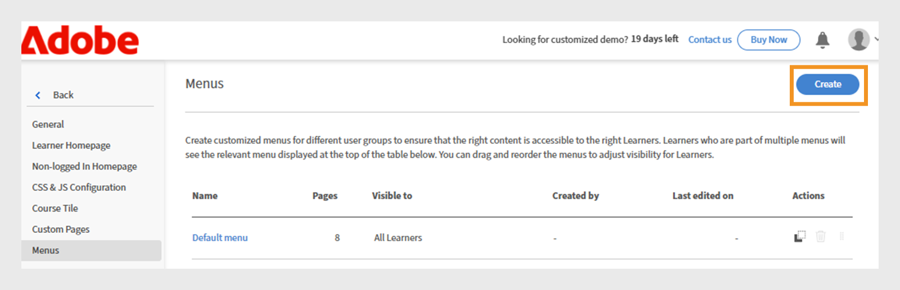
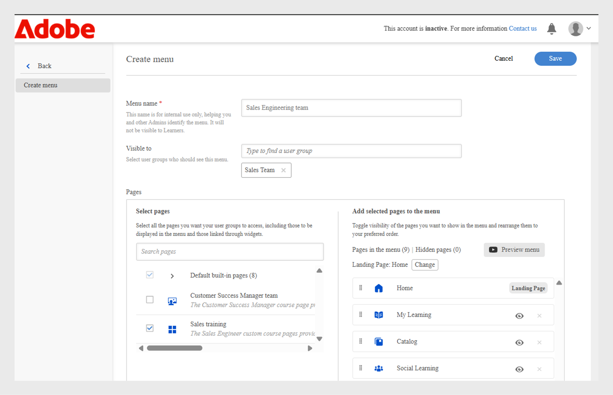
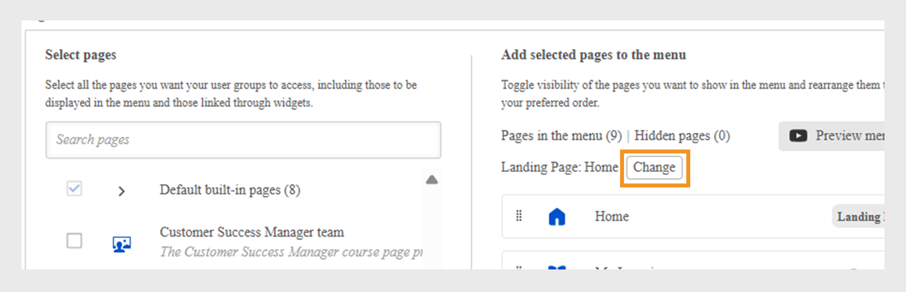
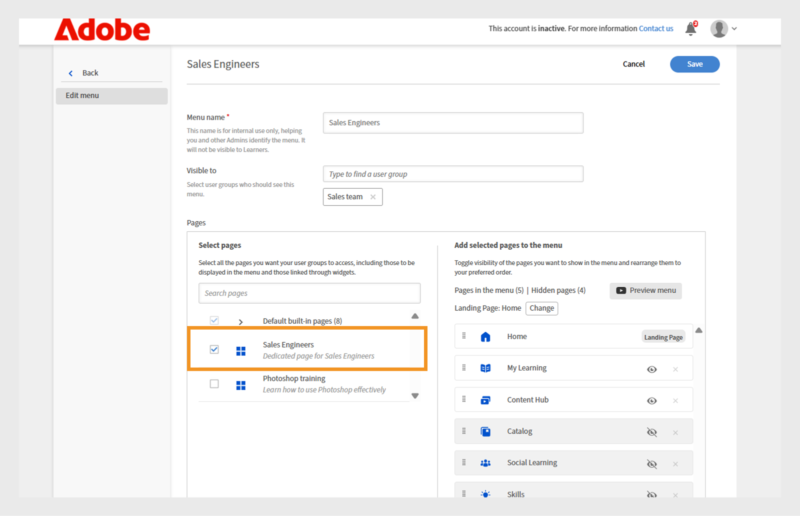
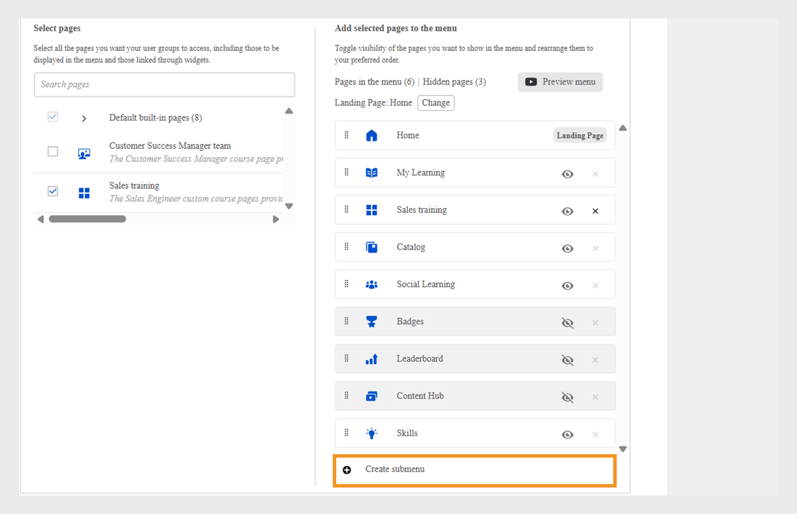
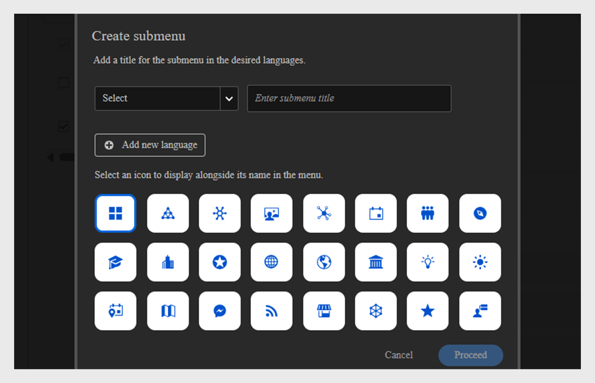
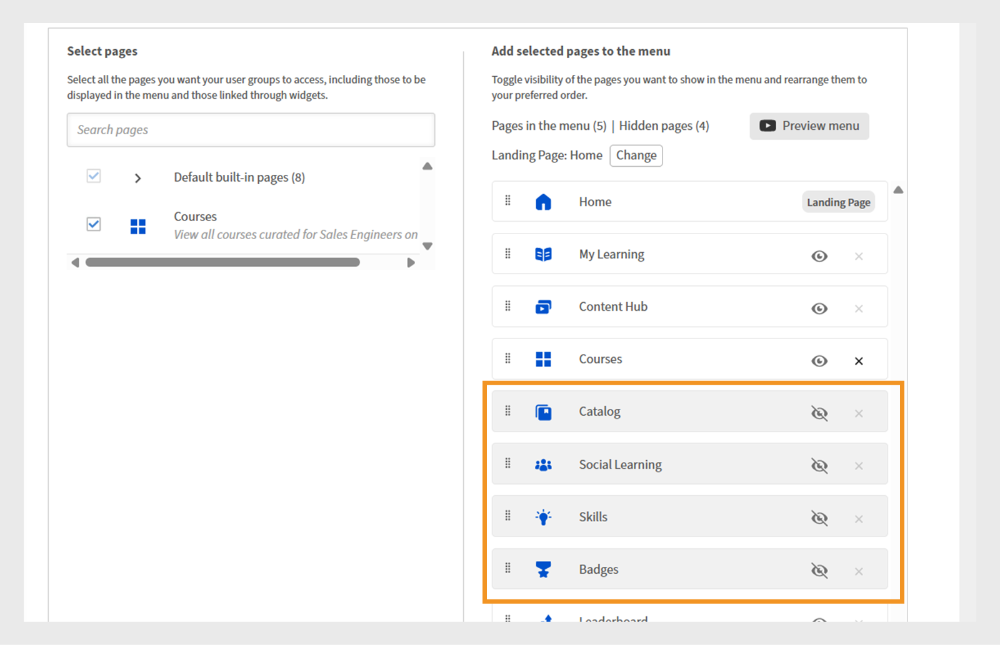

# 建立選單

作為一家金融公司的管理員，該公司有兩個主要團隊：銷售經理和客戶成功經理（CSM），你應該建立獨立的選單，並分別管理各自的頁面。 這讓學習者能輕鬆在自己的選單中找到與其職務相關的課程。

預設情況下，管理員可以看到頁面上的 **[!UICONTROL Menu]** 預設選單，且無法刪除。 此選單包含目前學習者應用程式中所有內建頁面。

要建立選單：

1. 以管理員身份登入 Adobe Learning Manager。
2. 在左側導覽窗格選擇 **[!UICONTROL Branding]** 。
3. 選擇 **[!UICONTROL Menu]** ，然後選擇 **[!UICONTROL Create]**。

   
   _選單畫面顯示可檢視、整理及建立不同學習者群組自訂選單的選項_

4. 輸入 **[!UICONTROL Menu name]** （例如產品培訓）並在選項中 **[!UICONTROL Visible to]** 選擇使用者群組。

   
   _建立選單畫面，管理員可輸入選單名稱供內部使用，並指定使用者群組以控制選單可見性_

5. 以下是選單上可用的頁面類型：
   * **[!UICONTROL Built-in pages]**： 這些是 Adobe Learning Manager 預設的頁面，例如 Home、My Learning 和 Catalog。 管理員無法從選單中移除內建頁面。 他們可以把選單中的頁面隱藏起來。
   * **[!UICONTROL Custom pages]**：這些是管理員使用 Experience Builder 建立的頁面。 自訂頁面讓組織能透過新增針對不同學習者群體的小工具、版面設計及選單，設計品牌化、角色特定或事件導向的體驗。
6. 選擇 **[!UICONTROL Change]** 「下一 **[!UICONTROL Landing Page]** 頁」以更新學習者的登陸頁面。

   
   _選單設定畫面顯示可選擇頁面以更改學習者介面的登陸頁_

7. 從選項 **[!UICONTROL Select pages]** 中選擇自訂頁面。 管理員必須只能選擇已發佈的自訂頁面，而非草稿狀態下的頁面。

   
   _頁面選擇畫面，標示可包含使用者群組自訂頁面及自訂菜單順序的選項_

8. 拖放可在選單中重新排列頁面。
9. 選擇 **[!UICONTROL Preview menu]** 查看選單後再儲存。
10. 選擇 **[!UICONTROL Save]**。

所建立的選單將對被選中的學習者可見。 他們可以透過學習者介面存取自訂頁面。

_學習者介面顯示自訂頁面，包含特色訓練模組，並可從側邊欄選單輕鬆導航_

## 建立子選單

管理員可以在選單內建立子選單，並新增自訂頁面。 子選單沒有登陸頁。

要建立子選單：

1. 在頁面中&#x200B;**[!UICONTROL Menu configuration]**&#x200B;選擇&#x200B;**[!UICONTROL Create submenu]**。

   
   _選單設定頁面，標示「建立子選單」選項，以建立學習者的子選單_

2. 選擇語言並輸入子選單標題。
3. 選擇一個圖示顯示在子選單旁邊。
4. 選擇 **[!UICONTROL Add New Language]** 為不同地點建立相同的子選單。 例如，若新增英語與法語，選擇英語介面語言的學習者會看到英語子選單，而選擇法語的學習者則會看到法語子選單。

   
   _子選單提示顯示可選擇子選單標題、語言及圖示以顯示於選單中_

5. 選擇 **[!UICONTROL Proceed]**。
6. 在子選單下方拖放頁面。

## 設置隱藏頁面

此 **[!UICONTROL Hide pages]** 選項允許管理員透過顯示較少頁面來保持學習者介面的整潔。 管理員可以將頁面隱藏在選單中，讓學習者在學習者介面中看不到，但學習者仍可透過其他方式存取這些頁面。 例如，目錄頁面可以從選單中隱藏，但可透過學習者首頁進入。

_選單設定畫面顯示隱藏頁面，如目錄、社交學習、技能與徽章_

>[!NOTE]
>
>子選單中的頁面無法直接隱藏。 要隱藏頁面，先從子選單拖出，再隱藏。

## 接下來的計畫

在設置頁面、小工具和選單後，透過使用 JavaScript 和 CSS 加入自訂功能，提升整體學習者的體驗。
