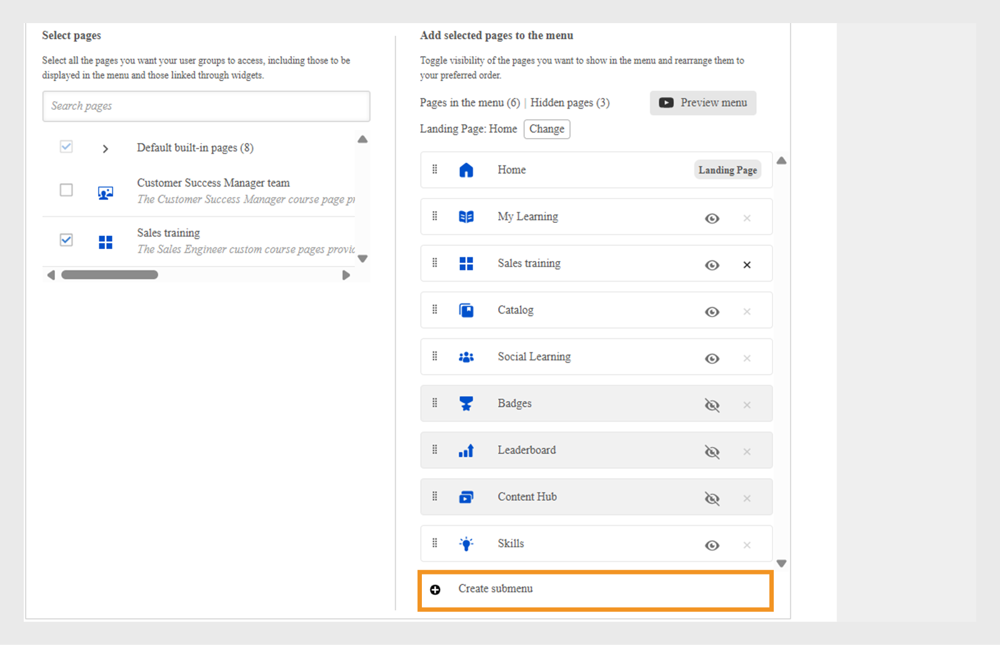

# 建立功能表

作為擁有兩個主要團隊(銷售和客戶成功經理(CSM))的財務公司的管理員，您應該建立具有各自頁面的單獨選單。 這可讓學習者透過自己的功能表，輕鬆找到與其角色相關的課程。

依預設，管理員可以在&#x200B;**[!UICONTROL Menu]**&#x200B;頁面上看到無法刪除的預設功能表。 此功能表包含學習者應用程式中目前可見的所有內建頁面。

若要建立功能表：

1. 以管理員身分登入Adobe Learning Manager。
2. 在左側導覽窗格中選取&#x200B;**[!UICONTROL Branding]**。
3. 選取&#x200B;**[!UICONTROL Menu]**，然後選取&#x200B;**[!UICONTROL Create]**。

   
   _功能表畫面顯示可檢視、整理和建立不同學習者群組的自訂功能表的選項_

4. 輸入&#x200B;**[!UICONTROL Menu name]** （例如，產品培訓）並在&#x200B;**[!UICONTROL Visible to]**&#x200B;選項中選取使用者群組。

   
   _建立功能表畫面，管理員可在此輸入功能表名稱供內部使用，並指定使用者群組來控制功能表的可見性_

5. 以下是功能表上可用的頁面型別：
   * **[!UICONTROL Built-in pages]**：這些是Adobe Learning Manager隨附的預設頁面，例如「首頁」、「我的學習」和「目錄」。 管理員無法從功能表中移除內建頁面。 他們可以在功能表中隱藏頁面。
   * **[!UICONTROL Custom pages]**：這些是管理員使用Experience Builder建立的頁面。 自訂頁面可讓組織新增適合不同學習者群組的Widget、版面配置和選單，以設計品牌、角色特定或事件型體驗。
6. 選取&#x200B;**[!UICONTROL Change]**&#x200B;旁的&#x200B;**[!UICONTROL Landing Page]**&#x200B;以更新學習者的登陸頁面。

   
   _功能表組態畫面會顯示選取頁面的選項，以變更學習者介面的登陸頁面_

7. 從&#x200B;**[!UICONTROL Select pages]**&#x200B;選項中選擇自訂頁面。 管理員必須能夠僅選取已發佈的自訂頁面，而非處於草稿狀態的頁面。

   
   _頁面選取畫面，醒目顯示包含使用者群組自訂頁面和自訂功能表順序的選項_

8. 拖放以重新排列功能表中的頁面。
9. 選取&#x200B;**[!UICONTROL Preview menu]**&#x200B;以在儲存之前檢視功能表。
10. 選取&#x200B;**[!UICONTROL Save]**。

選定的學習者可看見已建立的功能表。 他們可以透過其學習者UI存取自訂頁面。

_學習者UI顯示自訂頁面，其中包含精選訓練模組，以及從側邊欄功能表輕鬆導覽_

## 建立子功能表

管理員可以在功能表中建立子功能表並在其中新增自訂頁面。 子功能表沒有登入頁面。

若要建立子功能表：

1. 在&#x200B;**[!UICONTROL Create submenu]**&#x200B;頁面中選取&#x200B;**[!UICONTROL Menu configuration]**。

   
   _功能表組態頁面醒目提示「建立子功能表」選項，為學習者建立子功能表_

2. 選取語言並輸入子選單標題。
3. 選取要顯示在子功能表旁的圖示。
4. 選取&#x200B;**[!UICONTROL Add New Language]**&#x200B;以針對不同的地區設定建立相同的子功能表。 例如，如果您新增英文和法文，介面語言為英文的學習者會看到英文子功能表，而選取法文的學習者會看到法文子功能表。

   
   _子功能表提示，顯示選取子功能表標題、語言和圖示以在功能表中顯示的選項_

5. 選取&#x200B;**[!UICONTROL Proceed]**。
6. 將頁面拖放至子功能表下方。

## 設定隱藏頁面

**[!UICONTROL Hide pages]**&#x200B;選項可讓管理員透過顯示較少的頁面來保持學習者UI整齊。 管理員可從功能表隱藏頁面，讓學習者無法在學習者UI中看到頁面，但學習者仍能以其他方式存取這些頁面。 例如，「目錄」頁面可從功能表隱藏，但可透過學習者首頁存取。

_顯示隱藏頁面的功能表設定畫面，例如，目錄、社交學習、技能和徽章_

>[!NOTE]
>
>無法直接隱藏子功能表內的頁面。 若要隱藏頁面，請先將頁面拖曳出子功能表，然後再隱藏頁面。

## 下一步

設定頁面、Widget和功能表後，使用JavaScript和CSS新增自訂，以增強整體學習者體驗。

