# 在Experience Builder建立自訂頁面

身為金融服務公司的管理員，您可以管理兩個團隊：銷售與客戶成功。 每個團隊都有獨特的學習需求，但兩者都使用相同的標準學習入口網站。 這會導致困惑、雜亂和學習者參與度低。
若要在不投資Headless組建或等待自訂開發人員解決方案的情況下解決此挑戰，您可以在Adobe Learning Manager中使用Experience Builder。 有了頁面、Widget和選單，您只需幾個步驟即可設計品牌化、角色專屬的入口網站，無需編碼。

若要在Adobe Learning Manager中建立銷售工程團隊的自訂頁面：

1. 以管理員身分登入Adobe Learning Manager。
2. 在左側導覽窗格中選取&#x200B;**[!UICONTROL Branding]**。
3. 選取&#x200B;**[!UICONTROL Custom Pages]**。
4. 選取&#x200B;**[!UICONTROL Create page]**。

   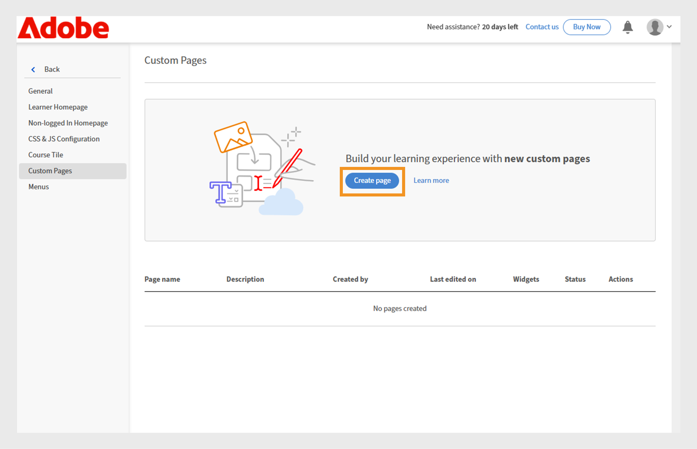
   _自訂頁面畫面顯示[建立頁面]選項，用來設計新的自訂學習體驗_

5. 輸入&#x200B;**[!UICONTROL Page name]** （例如，銷售團隊的銷售訓練）。
6. 輸入&#x200B;**[!UICONTROL Page description]**。

   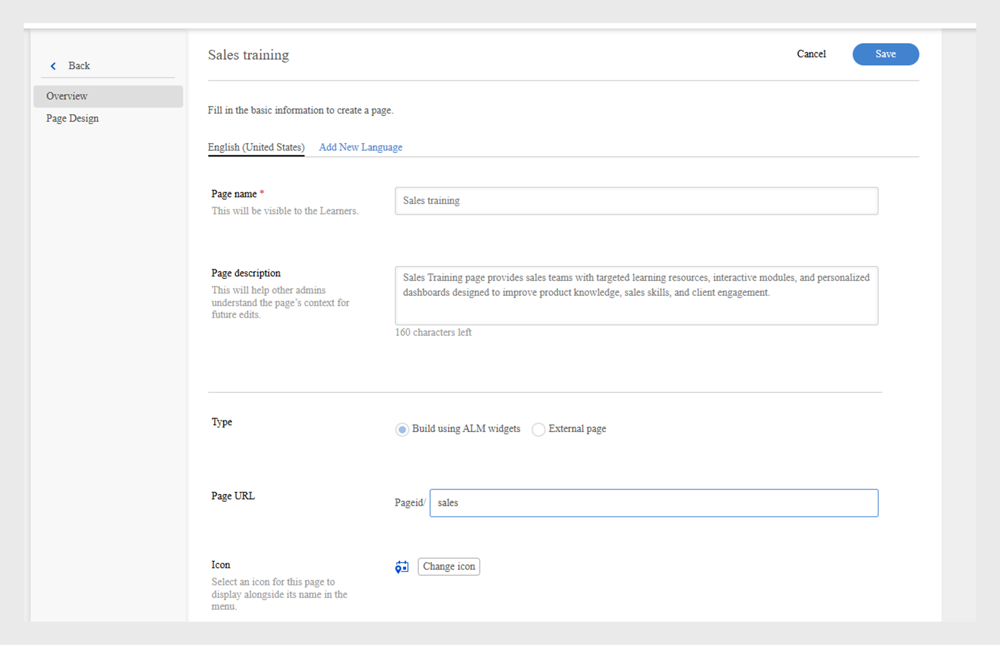
   _在Adobe Learning Manager中設定銷售訓練頁面，顯示頁面名稱、說明、型別、URL和圖示設定的欄位，以建立目標銷售訓練入口網站_

7. 從下列專案選取頁面型別：

   * **[!UICONTROL Build using ALM widgets]**：管理員可以使用現有的Adobe Learning Manager Widget建立頁面。 在「頁面URL」欄位中輸入自訂字串。 此字串將會附加至自訂頁面的URL。
   * **[!UICONTROL External page]**：管理員可以為外部頁面新增URL。 如果您選取頁面型別為外部，請在「頁面URL」文字欄位中輸入外部頁面URL。

8. 選取&#x200B;**[!UICONTROL Change icon]**&#x200B;以變更頁面的圖示。
9. 選取&#x200B;**[!UICONTROL Add New Language]**&#x200B;以新增頁面的預設語言。
10. 選取&#x200B;**[!UICONTROL Save]**。

已建立頁面，並將其儲存為自訂頁面區段中的草稿。 管理員可以使用介面工具來編輯和設計草擬的頁面。

下一步是將配置新增到自訂頁面，您可以在其中新增和設定Widget。

## Experience Builder中的頁面配置

從下拉式選單中選取適當的區段配置，以設計您的頁面。 任何版面的最大寬度皆為1212畫素。 根據您想要新增的Widget數目及其所需大小，從下列區段選項中選擇：

* **[!UICONTROL 1 column - Full section width]**：內容橫跨整個區段寬度，提供最大的空間。
* **[!UICONTROL 2 columns - 1/2 section width each]**：區段平均分割為兩個等寬欄。
* **[!UICONTROL 2 columns - 2/3 and 1/3 section width]**：主要內容佔據三分之二的寬度，而次要內容則使用三分之一。
* **[!UICONTROL 2 columns - 1/3 and 2/3 section width]**：側邊內容需要三分之一，主要內容需要三分之二的區段。
* **[!UICONTROL 3 columns - 1/3 section width each]**：區段分成三個等寬欄。

>[!NOTE]
>
>除了1欄 — 完整區段寬度版面配置外，所有版面配置中最多可垂直新增10個Widget。

若要在Experience Builder中選取銷售訓練頁面的配置：

1. 以管理員身分登入Adobe Learning Manager。
2. 在左側導覽窗格中選取&#x200B;**[!UICONTROL Branding]**。
3. 選取&#x200B;**[!UICONTROL Custom Pages]**，然後選取所需的頁面。
4. 選取&#x200B;**[!UICONTROL Page Design]**。
5. 選取&#x200B;**[!UICONTROL Edit]**。

   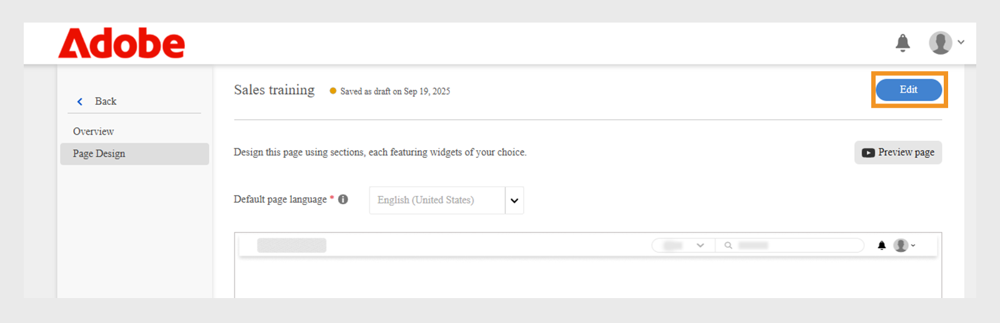
   _銷售訓練自訂頁面的頁面設計編輯畫面，醒目顯示新增頁面區段、Widget和版面配置的編輯按鈕_

6. 從&#x200B;**[!UICONTROL Select section layout]**&#x200B;下拉式清單中選擇選項。

   
   _區段配置選擇對話方塊可讓系統管理員為自訂頁面設計選擇單一或多欄Widget配置_

7. 選取&#x200B;**[!UICONTROL Proceed]**。

新增的版面配置有以下選項：

* **[!UICONTROL Delete row]**：從版面配置移除列。
* **[!UICONTROL Fit screen width]**：調整版面，使其自動調整大小以符合熒幕，以提升顯示效果。
* **[!UICONTROL Reorder]**：將版面拖放至所需位置，以變更版面順序。

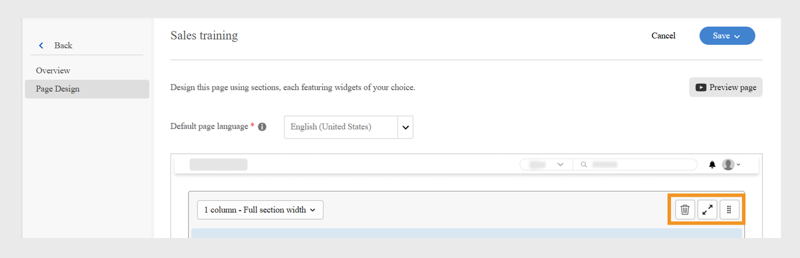
_顯示版面配置選項的頁面配置，以重新排序、展開或刪除區段_

下一步是在自訂頁面上新增及設定Widget。

## 新增和設定Widget

根據需求，將所需的Widget新增至銷售培訓自訂頁面。

若要在銷售訓練自訂頁面中設定Widget：

1. 在配置中選取&#x200B;**[!UICONTROL Add widget]**。

   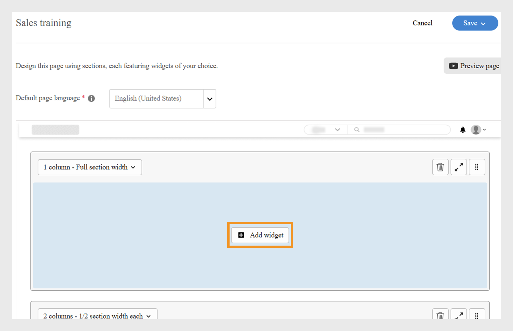
   _頁面設計畫面可讓系統管理員選取並新增Widget，以自訂其課程頁面_

2. 選擇&#x200B;**[!UICONTROL Content Box widget]**，然後選取&#x200B;**[!UICONTROL Proceed]**。

   
   _Widget選取畫面醒目提示「內容方塊」Widget，以顯示自訂影像、文字和動作按鈕，以增強學習者參與度_

3. 輸入&#x200B;**[!UICONTROL Title]**&#x200B;和&#x200B;**[!UICONTROL Description]**。
4. 在&#x200B;**[!UICONTROL Action button label]**&#x200B;中輸入文字並提供連結。
5. 設定其餘選項。 檢視此[區段](/help/migrated/administrators/feature-summary/experience-builder/add-a-widget.md#content-box-widget)以進一步瞭解&#x200B;**[!UICONTROL Content Box widget]**。

   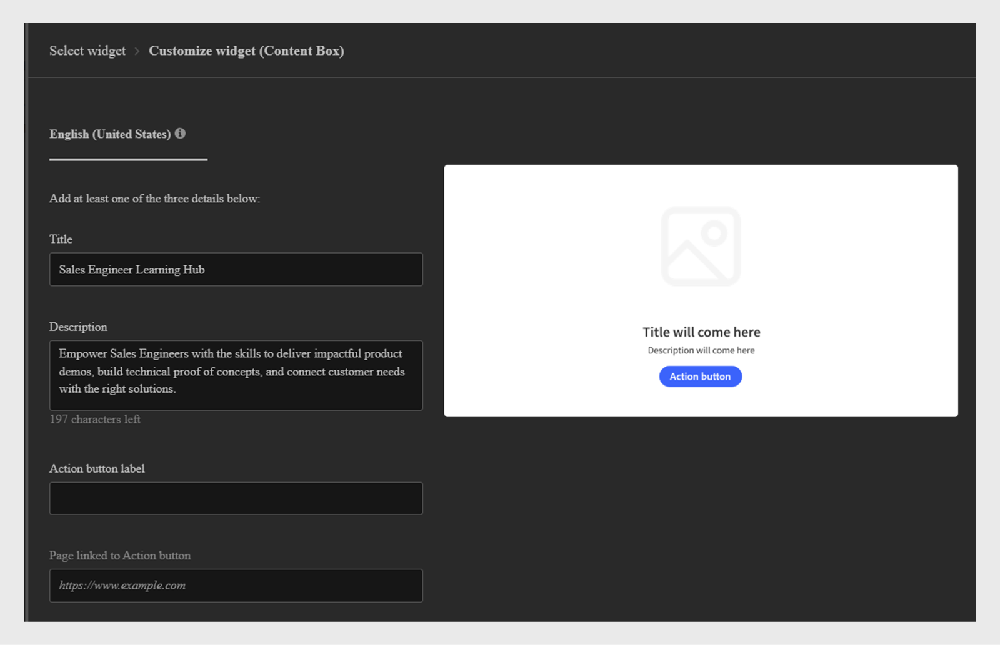
   _內容方塊Widget畫面會顯示設定Widget_&#x200B;的選項

6. 在銷售工程師的&#x200B;**[!UICONTROL Content Box widget]**&#x200B;設定畫面中，輸入標題、說明和動作按鈕標籤
7. 選取&#x200B;**[!UICONTROL Add widget]**。
8. 選取&#x200B;**[!UICONTROL Save]**並從下列選項中選擇：
a. **[!UICONTROL Save as Draft]**：此頁面將儲存為草稿。 管理員稍後可以編輯頁面。
b. **[!UICONTROL Save & Publish]**：頁面將會發佈，管理員可以將此頁面新增到功能表。

   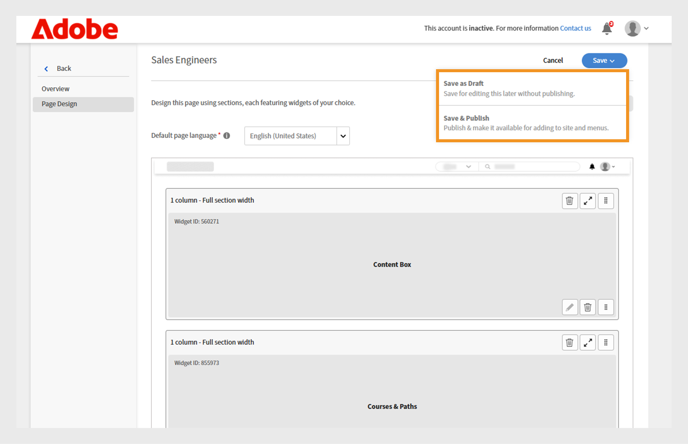
   _儲存選項可讓系統管理員選擇將頁面儲存為草稿以供日後編輯，還是發佈頁面以供學習者存取_

頁面可儲存為草稿或發佈。 管理員可以在發佈前編輯草稿，也可以更新並重新發佈已發佈的頁面。

請依照相同的步驟，為Customer Success Manager團隊建立頁面。

## 預覽頁面

若要預覽頁面：

1. 以管理員身分登入Adobe Learning Manager。
2. 在左側導覽窗格中選取&#x200B;**[!UICONTROL Branding]**。
3. 選取&#x200B;**[!UICONTROL Custom Pages]**。
4. 選取必要頁面，然後選取&#x200B;**[!UICONTROL Page Design]**。
5. 選取&#x200B;**[!UICONTROL Edit]**，然後選取&#x200B;**[!UICONTROL Preview page]**&#x200B;以檢視入口網站的預覽。

   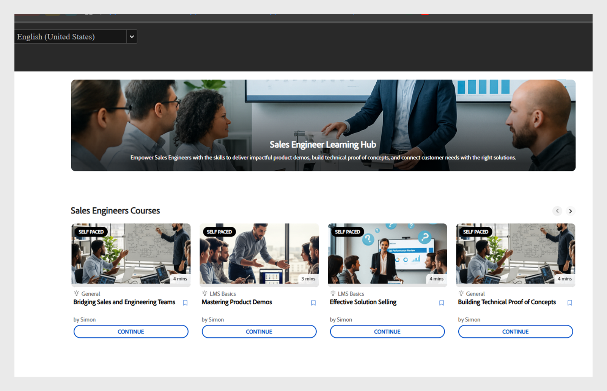
   _頁面預覽，顯示具有橫幅、精選課程的自訂頁面配置_

6. 選取「檢查模式」以檢視Widget的高度和寬度。

   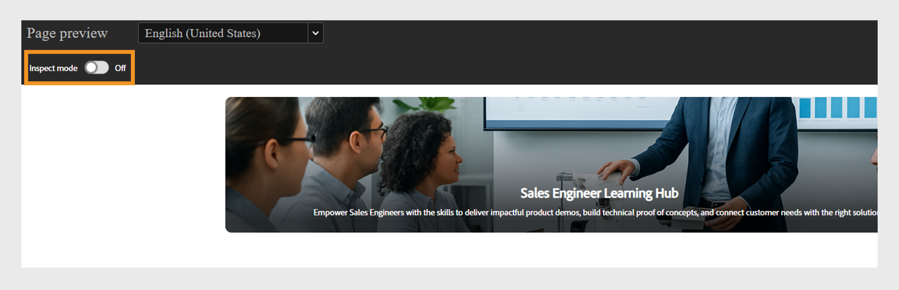
   _在Experience Builder中以檢查模式切換的頁面預覽畫面會反白顯示，讓管理員檢閱和檢查Widget_

## 以不同語言建立頁面

管理員可以在建立頁面時在新增語言中選取所需的語言，以建立多個地區設定的特定自訂頁面。 新增多種語言時，必須在預設語言標籤旁的對應標籤中，針對每種語言個別設定Widget詳細資訊。

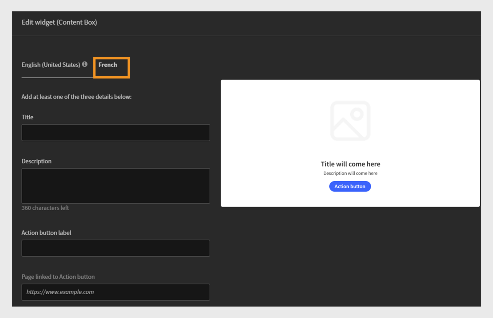
_管理員可以新增其他語言的Widget詳細資訊，例如法文，以及預設語言_

## 管理頁面生命週期

管理員可以使用「自訂頁面」區段來編輯、刪除和複製頁面。

### 編輯頁面

若要編輯自訂頁面：

1. 以管理員身分登入Adobe Learning Manager。
2. 在左側導覽窗格中選取「品牌」。
3. 選取「自訂頁面」。
4. 選取所需的頁面，然後選取「編輯」。
5. 選取「儲存」。

此頁面將會更新變更。

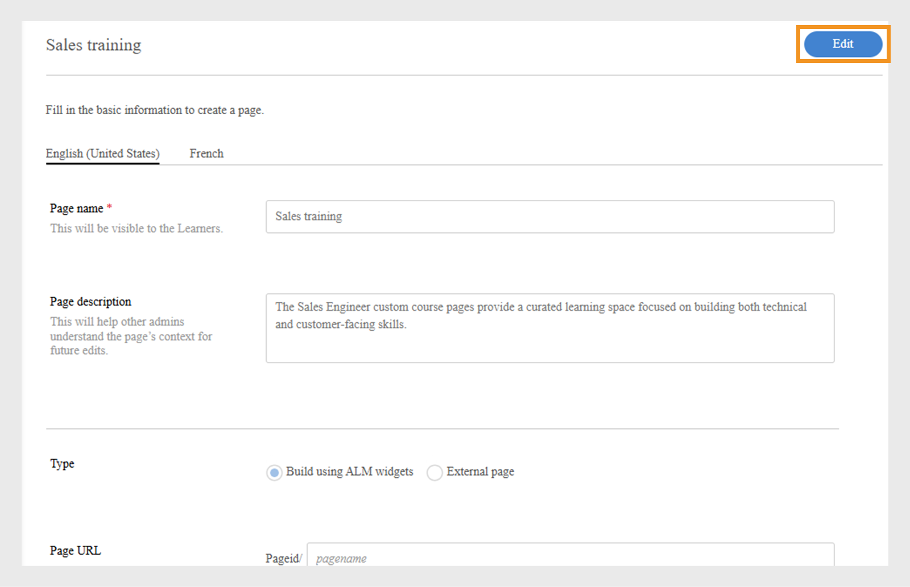
_編輯自訂頁面，讓系統管理員可以更新頁面名稱、說明和型別_

### 刪除頁面

若要刪除頁面：

1. 以管理員身分登入Adobe Learning Manager。
2. 在左側導覽窗格中選取「品牌」。
3. 選取「自訂頁面」。
4. 選取所需的頁面。
5. 選取動作，然後選取刪除。

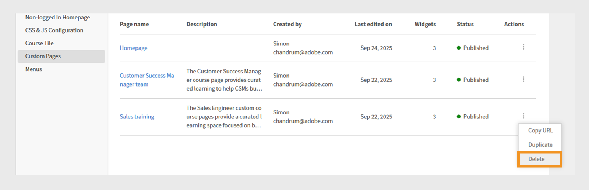
_自訂頁面畫面會顯示刪除為產品訓練建立之自訂頁面的選項_

### 複製頁面

若要複製頁面：

1. 以管理員身分登入Adobe Learning Manager。
2. 在左側導覽窗格中選取「品牌」。
3. 選取「自訂頁面」。
4. 選取所需的頁面。
5. 選取動作，然後選取複製。

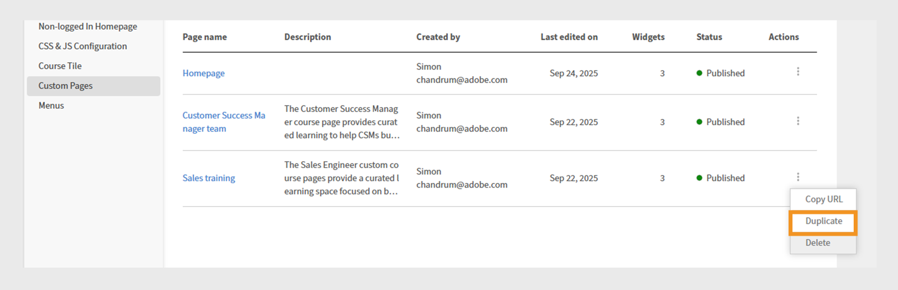
_自訂頁面畫面會顯示選項，用來復製為產品訓練建立的自訂頁面_

## 下一步

建立頁面後，根據您的培訓需求，在自訂頁面上新增並設定Widget。
