# 在 Experience Builder 建立自訂頁面

作為金融服務公司的行政人員，你管理兩個團隊：銷售與客戶成功。 每個團隊都有獨特的學習需求，但兩者都使用相同的標準學習入口網站。 這導致了混亂、雜亂以及學習者參與度低。
為了解決這個問題，而不必投資無頭建置或等待客製化開發解決方案，你可以使用 Adobe Learning Manager 中的 Experience Builder。 透過頁面、小工具和選單，你只需幾個步驟就能設計出品牌化、角色專屬的入口網站，無需編碼。

要在 Adobe Learning Manager 中為銷售工程團隊建立自訂頁面：

1. 以管理員身份登入 Adobe Learning Manager。
2. 在左側導覽窗格選擇 **[!UICONTROL Branding]** 。
3. 選擇 **[!UICONTROL Custom Pages]**。
4. 選擇 **[!UICONTROL Create page]**。

   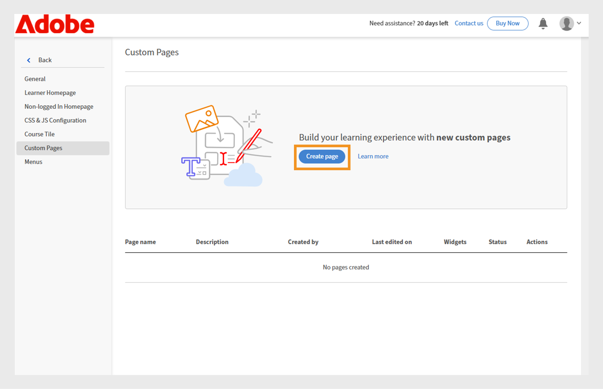
   _自訂頁面畫面顯示「建立頁面」選項，設計新的自訂學習體驗_

5. 輸入（ **[!UICONTROL Page name]** 例如，銷售團隊的銷售訓練）。
6. 輸入 **[!UICONTROL Page description]**.。

   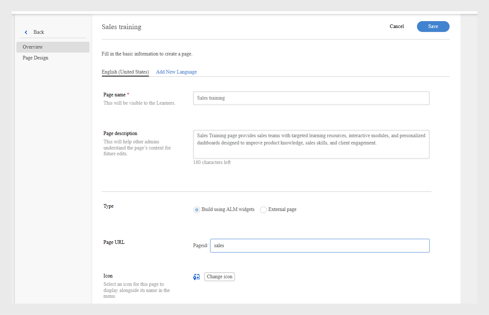
   _Adobe Learning Manager 中建立銷售培訓頁面，顯示頁面名稱、描述、類型、URL 及圖示設定欄位，以建立目標銷售培訓入口網站_

7. 從以下頁面類型中選擇：

   * **[!UICONTROL Build using ALM widgets]**&#x200B;管理員可以使用現有的 Adobe Learning Manager 元件建立頁面。 在頁面網址欄位輸入自訂字串。 這個字串會附加到你自訂頁面的網址後面。
   * **[!UICONTROL External page]**&#x200B;管理員可以為外部頁面新增網址。 如果你選擇頁面類型為外部，請在頁面網址文字欄位輸入外部頁面 URL。

8. 選擇 以 **[!UICONTROL Change icon]** 更改頁面圖示。
9. 選擇 **[!UICONTROL Add New Language]** 新增頁面的預設語言。
10. 選擇 **[!UICONTROL Save]**。

該頁面已建立並存為草稿，存放於自訂頁面區塊。 管理員可以使用這些小工具編輯和設計已草擬的頁面。

下一步是在自訂頁面新增版面，讓你可以新增和設定小工具。

## Experience Builder 中的頁面版面配置

從下拉選單中選擇合適的章節版面設計，設計你的頁面。 任何佈局的最大寬度為 1212 像素。 根據你想新增的元件數量及其期望大小，從以下區塊選項中選擇：

* **[!UICONTROL 1 column - Full section width]**：內容涵蓋整個區塊寬度，提供最大空間。
* **[!UICONTROL 2 columns - 1/2 section width each]**：該區塊被平均分為兩列等寬的欄。
* **[!UICONTROL 2 columns - 2/3 and 1/3 section width]**：主內容佔寬度的三分之二，支線內容佔三分之一。
* **[!UICONTROL 2 columns - 1/3 and 2/3 section width]**： 支線內容佔三分之一，主線內容佔三分之二。
* **[!UICONTROL 3 columns - 1/3 section width each]**：該區段分為三個等寬的欄位。

>[!NOTE]
>
>除了單欄全區段寬度的配置外，所有版面中垂直新增最多 10 個小工具。

要在 Experience Builder 中選擇銷售培訓頁面的版面配置：

1. 以管理員身份登入 Adobe Learning Manager。
2. 在左側導覽窗格選擇 **[!UICONTROL Branding]** 。
3. 選擇 **[!UICONTROL Custom Pages]** 並選擇所需頁面。
4. 選擇 **[!UICONTROL Page Design]**。
5. 選擇 **[!UICONTROL Edit]**。

   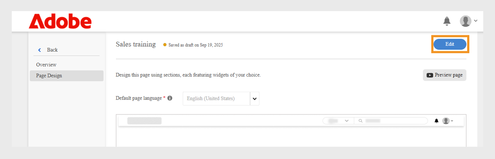
   _銷售培訓自訂頁面的頁面設計編輯畫面，重點顯示新增頁面區塊、元件與版面版面的編輯按鈕_

6. 從下拉選單選擇 **[!UICONTROL Select section layout]** 選項。

   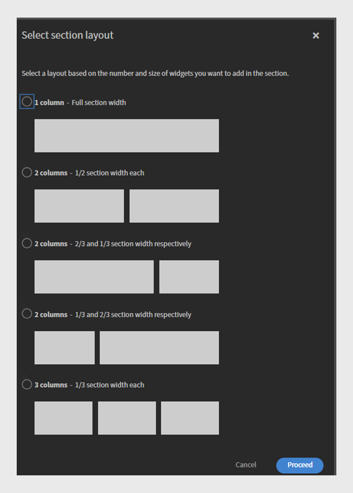
   _區塊版面選擇對話框允許管理員選擇單欄或多欄小工具排列以進行自訂頁面設計_

7. 選擇 **[!UICONTROL Proceed]**。

新增的版面有以下選項：

* **[!UICONTROL Delete row]**：將該列從版面中移除。
* **[!UICONTROL Fit screen width]**&#x200B;調整版面，讓它自動調整大小以符合你的螢幕，以提升視野。
* **[!UICONTROL Reorder]**：透過拖放排列順序，將它們拖放到想要的位置。

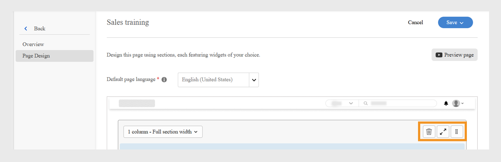
_頁面版面配置顯示重新排序、展開或刪除該區段的版面選項_

下一步是在自訂頁面上新增並設定小工具。

## 新增與配置元件

根據需求，在銷售訓練自訂頁面中新增所需的小工具。

要在銷售訓練自訂頁面中設定小工具：

1. 在版面中選擇 **[!UICONTROL Add widget]** 。

   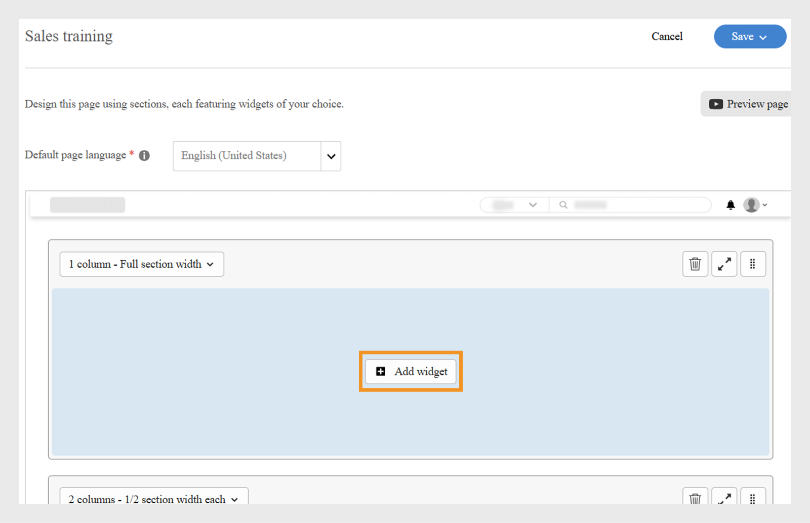
   _頁面設計畫面允許管理員選擇並新增小工具，以自訂課程頁面_

2. 選擇 ， **[!UICONTROL Content Box widget]** 然後選擇 **[!UICONTROL Proceed]**。

   
   _小工具選擇畫面，重點顯示內容框小工具，顯示自訂圖片、文字及動作按鈕，提升學習者參與度_

3. 輸入 **[!UICONTROL Title]** &amp; **[!UICONTROL Description]**。
4. 輸入文字 **[!UICONTROL Action button label]** 並附上連結。
5. 設定剩餘的選項。 請參閱本[節](/help/migrated/administrators/feature-summary/experience-builder/add-a-widget.md#content-box-widget)以了解更多相關資訊。**[!UICONTROL Content Box widget]**

   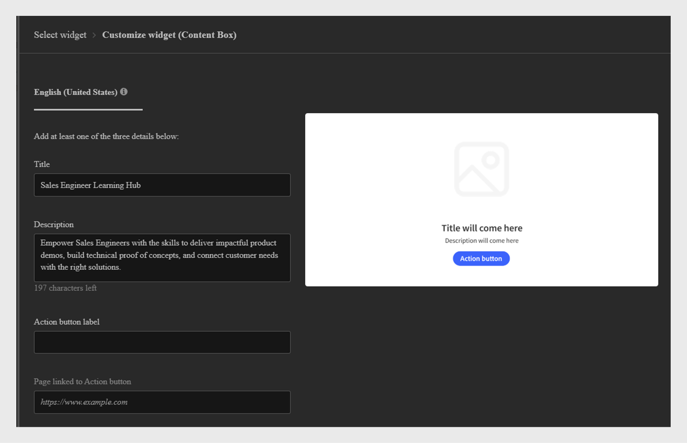
   _內容框小工具畫面，顯示設定小工具的選項_

6. 在銷售工程師的設定畫面輸入標題、描述和動作按鈕標籤&#x200B;**[!UICONTROL Content Box widget]**
7. 選擇 **[!UICONTROL Add widget]**。
8. 選擇 **[!UICONTROL Save]** 並從以下選項中挑選：a. **[!UICONTROL Save as Draft]**： 頁面將被儲存為草稿。 管理員可以之後編輯該頁面。
b. **[!UICONTROL Save & Publish]**：該頁面將會被發布，管理員可以將此頁面加入選單。

   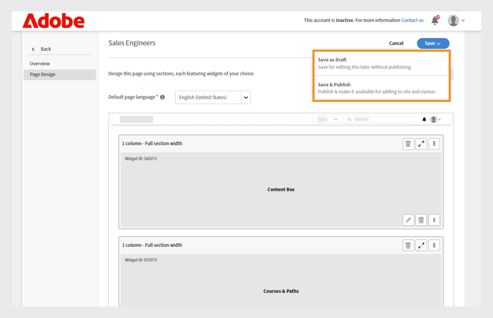
   _儲存選項允許管理員選擇將頁面保存為草稿以便日後編輯，或是發佈給學習者使用_

該頁面可以儲存為草稿或發佈。 管理員可以在發佈前編輯草稿，也可以更新及重新發布已發表的頁面。

請依照相同步驟建立客戶成功經理團隊的頁面。

## 預覽頁面

預覽頁面：

1. 以管理員身份登入 Adobe Learning Manager。
2. 在左側導覽窗格選擇 **[!UICONTROL Branding]** 。
3. 選擇 **[!UICONTROL Custom Pages]**。
4. 選擇所需頁面，然後選擇 **[!UICONTROL Page Design]**。
5. 選擇 **[!UICONTROL Edit]** 並選擇 **[!UICONTROL Preview page]** 以查看入口網站的預覽。

   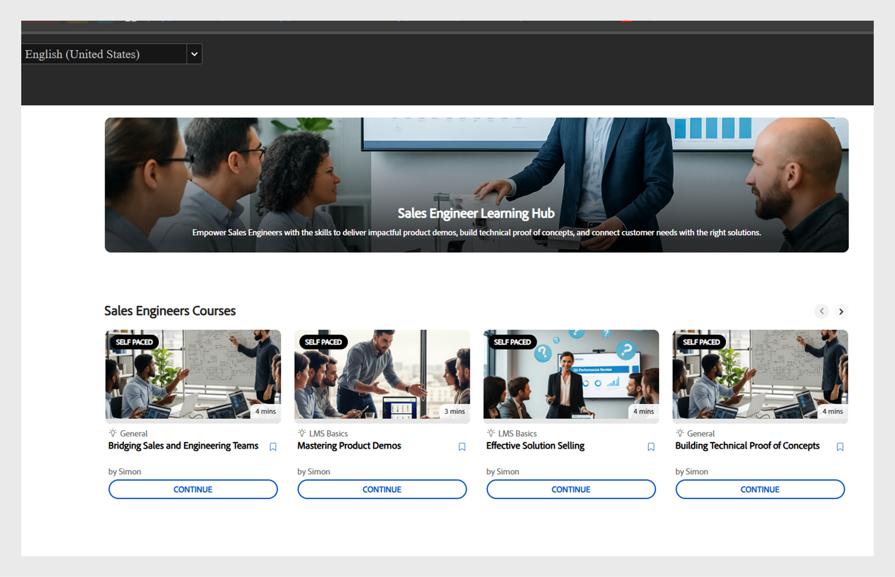
   _頁面預覽，顯示自訂頁面佈局與橫幅、精選課程_

6. 選擇檢查模式以查看小工具的高度與寬度。

   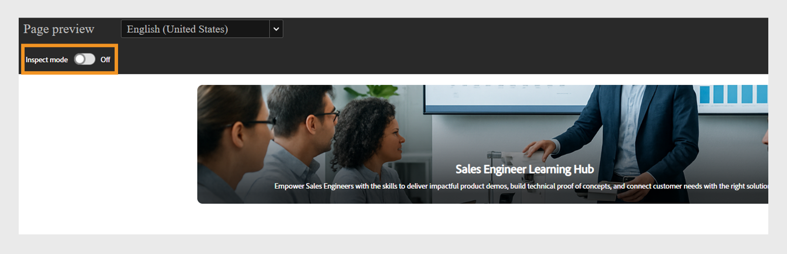
   _Experience Builder 中的頁面預覽畫面，並標示檢視模式切換，讓管理員能檢視並檢查小工具_

## 建立一個不同語言的頁面

管理員可在建立頁面時，透過新增語言選擇所需語言，建立多個區域專屬的自訂頁面。 當新增多種語言時，元件細節必須分別在對應的分頁中設定，該分頁位於預設語言分頁旁。

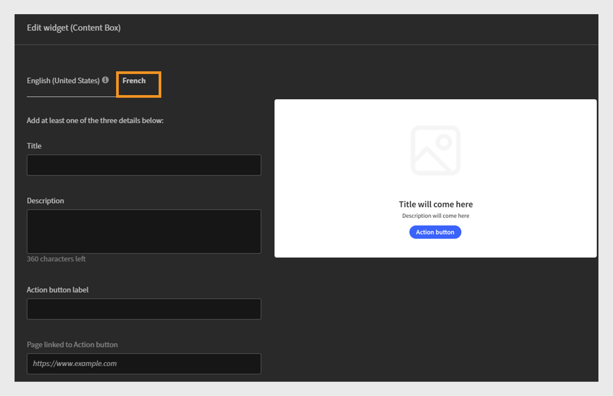
_管理員可以在預設語言之外，新增其他語言（如法語）的小工具細節_

## 管理頁面生命週期

管理員可以使用自訂頁面區塊來編輯、刪除及複製頁面。

### 編輯頁面

要編輯自訂頁面：

1. 以管理員身份登入 Adobe Learning Manager。
2. 在左側導覽欄選「品牌」。
3. 選擇自訂頁面。
4. 選擇所需頁面，然後選擇編輯。
5. 選擇儲存。

頁面將隨著變更持續更新。

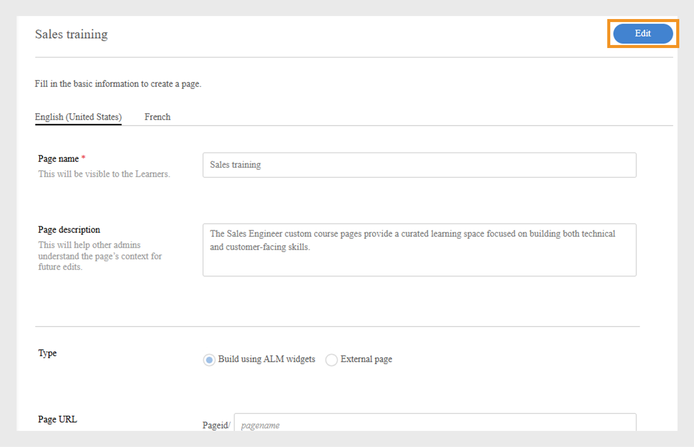
_編輯自訂頁面，允許管理員更新頁面名稱、描述與類型_

### 刪除該頁面

刪除該頁面：

1. 以管理員身份登入 Adobe Learning Manager。
2. 在左側導覽欄選「品牌」。
3. 選擇自訂頁面。
4. 選擇所需頁面。
5. 選擇動作，然後選擇刪除。

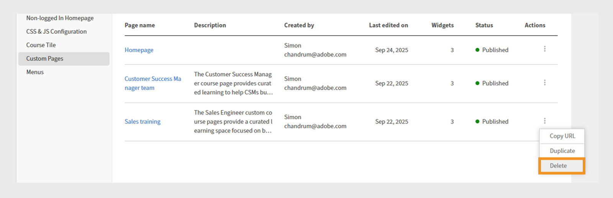
_自訂頁面畫面，顯示刪除為產品訓練所建立自訂頁面的選項_

### 複製該頁面

要複製該頁面：

1. 以管理員身份登入 Adobe Learning Manager。
2. 在左側導覽欄選「品牌」。
3. 選擇自訂頁面。
4. 選擇所需頁面。
5. 選擇動作，然後選擇重複。

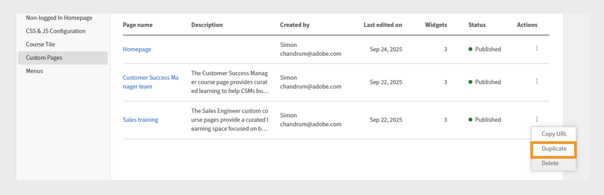
_自訂頁面畫面顯示可複製為產品訓練所建立的自訂頁面的選項_

## 接下來的計畫

建立頁面後，根據你的訓練需求，在自訂頁面上新增並設定小工具。
