# 自訂體驗建構器

## 自訂頁腳

頁腳顯示在學習器介面底部，通常顯示管理員設定中預設的資訊。 管理員可以用自訂頁尾取代，打造品牌化體驗。 利用 HTML 和 CSS，他們能定義頁腳的設計、版面與內容，以符合組織需求。

作為金融公司的管理員，您可以使用自訂選項來設定頁腳。 這個選項允許你加入自己的 HTML 和 CSS，讓你完全有彈性來設計頁腳。

自訂頁腳：

1. 以管理員身份登入 Adobe Learning Manager。
2. 選擇 **[!UICONTROL Branding]** ，然後選擇 **[!UICONTROL General]**。
3. 選擇 **[!UICONTROL Edit]** 下一個 **[!UICONTROL Footer customization]** 選項。

   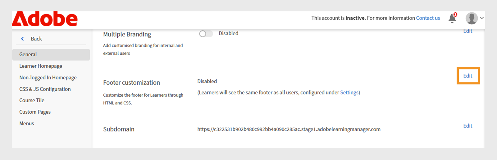
   _Adobe Learning Manager 的一般設定畫面，顯示啟用頁尾自訂選項_

4. 選擇切換按鈕以啟用 **[!UICONTROL Footer customization]**.

   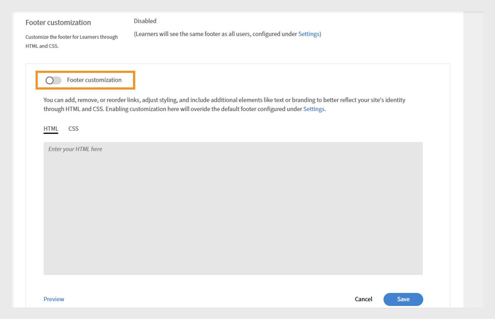
   _Adobe Learning Manager 中的頁尾自訂設定，顯示啟用自訂頁尾和欄位的開關，以加入 HTML 或 CSS 以打造個人化品牌_

5. 在各自的分頁輸入你的 **[!UICONTROL HTML]** 和 **[!UICONTROL CSS]** 。

   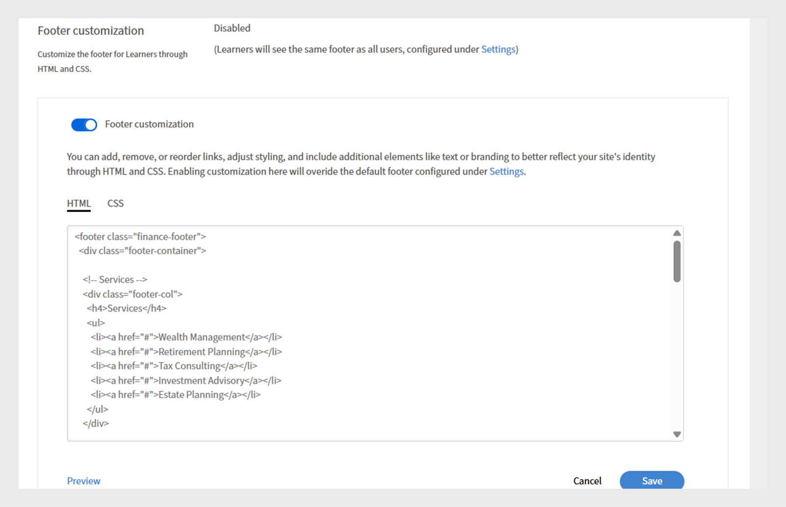
   _Adobe Learning Manager 中的頁尾自訂畫面，顯示自訂 HTML 區段，用於新增、編輯或樣式化學習者介面頁尾_

6. 選擇 **[!UICONTROL Preview]** 查看自訂頁尾，再儲存。

   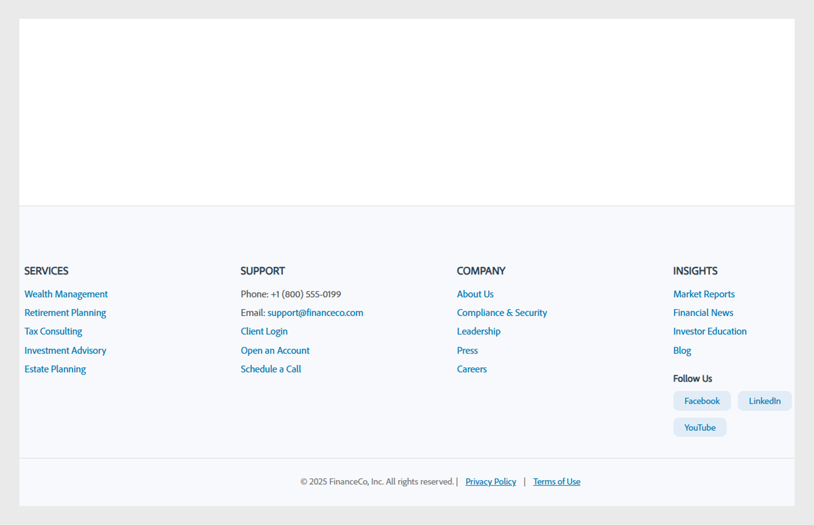
   _Adobe Learning Manager 自訂學習者介面頁尾預覽，包含分類連結_

7. 選擇 **[!UICONTROL Save]**。

客製化的頁腳將顯示給所有學習者。

## 自訂球場磚塊

在金融公司，管理員可以設置課程圖塊來決定學習者會看到哪些細節。 例如，他們可能會顯示合規訓練的課程描述和技能名稱，但隱藏評分或作者姓名，以保持對強制性要求的關注。

自訂球場磚塊：

1. 以管理員身份登入 Adobe Learning Manager。
2. 選擇 **[!UICONTROL Branding]** ，然後選擇 **[!UICONTROL Course Tile]**。
3. 選擇 **[!UICONTROL Edit]**。

   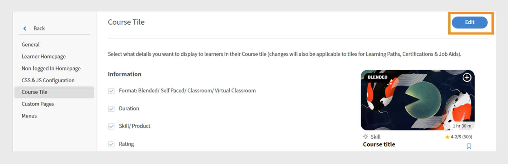
   _Adobe Learning Manager 的課程磁磚設定畫面，顯示可自訂磁貼的編輯選項_

4. 請選擇以下選項以顯示或隱藏與課程資訊相關的細節：

   a. **[!UICONTROL Format]**：混合式/自學/教室/虛擬教室：學習對象的類型。
   b. **[!UICONTROL Duration]**：學習對象的持續時間。
   c. **[!UICONTROL Skill/ Product]**展示課程涵蓋的關鍵技能或產品。
   d. **[!UICONTROL Rating]**：顯示課程的學習者評分。
   e. **[!UICONTROL Author name]**：顯示課程作者姓名f. **[!UICONTROL Description (appears on hover)]**：當學習者滑鼠移到卡片上時，顯示課程簡短摘要。
   g. **[!UICONTROL Published date/ due date (appears on hover)]**：顯示課程發表時間或完成截止日期。

5. 請選擇以下選項以顯示或隱藏與課程行動相關的細節：

   a. **[!UICONTROL Add to Learning List button]**：允許學習者將課程儲存在個人學習清單中，以便日後參考。
   b. **[!UICONTROL Save button]**：儲存任何對課程設定或偏好設定所做的變更。
   c. **[!UICONTROL Enroll / Continue button]**：允許學習者選擇選修新課程或繼續已開始的課程。 隱藏此選項也會移除旁邊出現的「不推薦」和「下載」動作。

   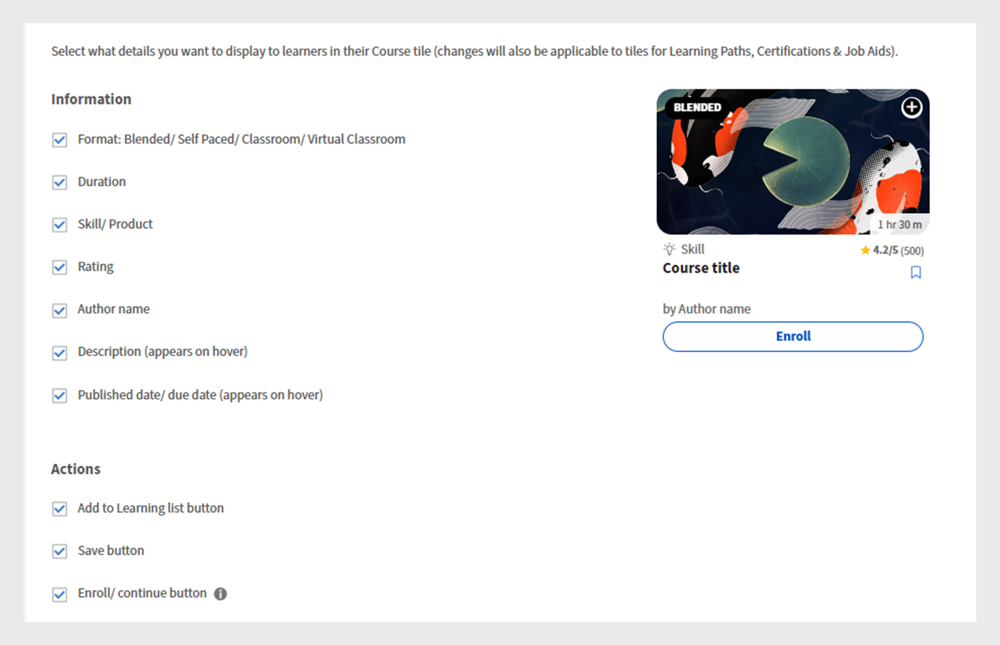
   _Adobe Learning Manager 的課程磁貼設定畫面，管理員在此選擇要顯示給學習者的資訊與動作_

6. 螢幕右側會顯示賽道圖塊的預覽。

   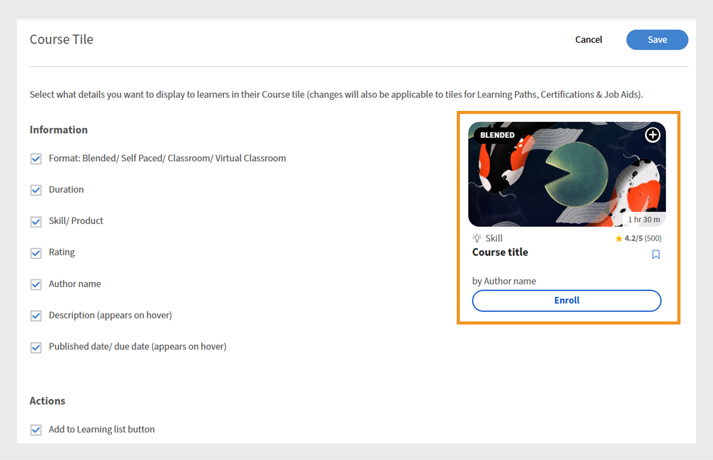
   _Adobe Learning Manager 中的課程磁磚設定畫面，重點顯示課程磁磚的預覽_

7. 選擇 **儲存**。

客製化課程圖塊將顯示給所有學習者。

**自訂化之前**

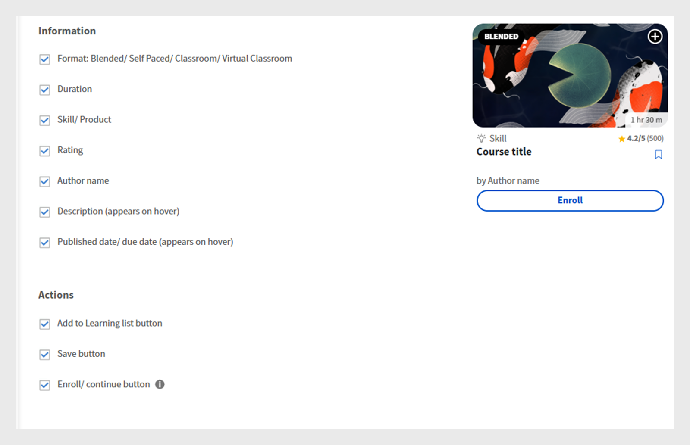
_Adobe Learning Manager 自訂前的課程磁貼_

**客製化後**

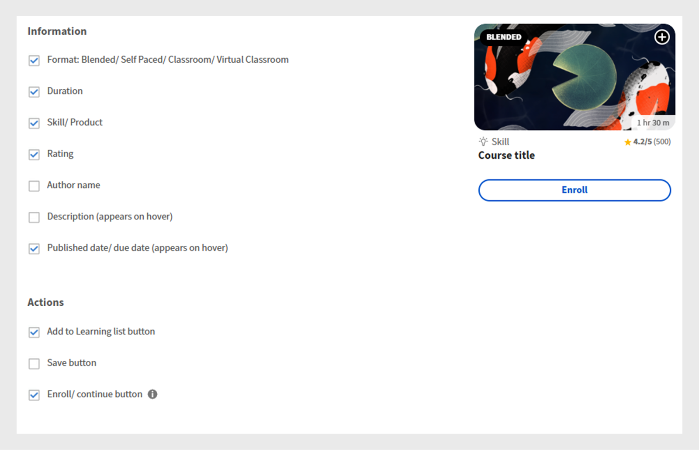
_Adobe Learning Manager 自訂後的課程磁貼_

## 使用 JavaScript 和 CSS 自訂

作為財務公司管理員，您可以透過注入 CSS 和 JavaScript 來自訂學習應用程式，以符合公司品牌與法規要求，讓您完全掌控應用程式的外觀、版面配置及互動功能。

要使用 CSS 和 JS 自訂學習者介面：

1. 以管理員身份登入 Adobe Learning Manager。
2. 選擇 **[!UICONTROL Branding]** ，然後選擇 **[!UICONTROL CSS & JS Configuration]**。
3. 選擇 **[!UICONTROL Edit]**。
4. 在各自的分頁輸入你自訂的 CSS 和 JS。

   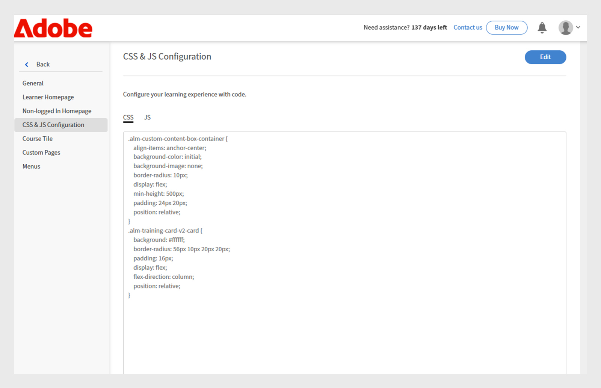
   _Adobe Learning Manager 中的 CSS 與 JS 設定畫面，管理員可在此新增自訂 CSS 與 JS_

5. 選擇儲存。

客製化功能將展示給所有學習者。

**自訂之前**

Learner 首頁選單的設計基於 Adobe Learning Manager 的預設設計。


_Adobe Learning Manager Learner 首頁，自訂前的頁面_

**客製化後**

新增以下 CSS 與 JS 後，學習者首頁選單已根據自訂功能進行更新。

範例 CSS：

```
p{
display:block;
}

.withExtraMargin{
margin-right: 100px!important;
}
.alm-footer-extraMargin{
margin-top:0;
}

.alm-layout-almLayoutContainer{
margin: 0;
    margin-bottom: 5rem;
}
#page-756 #category-970151 .alm-category-card-cardLink
{
    height: 400px;

}
#page-756 #category-970151 .alm-category-card-header
{
height: 240px!important;
}
#page-656 .alm-category-card-cardLink{
    height: 380px;
background: white;
}
#page-656 .alm-category-card-header{
height: 200px!important;
}

#page-746 #html-636797 {
    background-color: #f7f9fc;
}

#page-746 .alm-layout-almLayoutContainer{
row-gap:0;
margin-bottom:0;
}

.alm-category-card-cardLink{
transition: border .3s ease;
}
.navText{
       font-size: 16px;
    cursor: pointer;
}
.submenuDownCaret{
display:none;}
.alm-catalog-container-pageContainer{
max-width: 1720px;
    width: 100%;
    padding: 0 40px;
    padding: 0 40px;
}


.pagenavbarcontainer.newNavbarContainer{
width: 1230px;
    margin: 0 auto;
}
div[automationid="learner-menu-inside-header"]{
margin-right:100px!important;
}
#searchScope,.searchSeparator,#searchInDropdown{
display:none!important;
}
#right-navbar{
    margin-right: 0;
}
#companyLogoImg{
cursor:pointer;
max-width:190px;
}
.alm-catalog-container-filtersContainer{
width:340px;
}
.alm-training-card-v2-imageFlipContainer{
border:none;
}
.newSearchBoxContainer{
border-radius: 5px !important;
    border-width: 2px !important;
    border-color: rgb(5, 32, 34) !important;
}
.searchBoxFlex{
width:250px!important;
flex-direction: row-reverse;
    padding-right: 10px;
}
.searchPlaceholderIcon svg{
    height: 16px;
    width: 16px;
}
.searchPlaceholderIcon svg path{
fill: black;
}
#page-656 .alm-layout-almLayoutContainer {
    padding-bottom: 5rem;
margin-bottom:0!important;
}
#page-656 .alm-strip-widget-header-stripHeaderContainer{
display:none;
}
#page-656 .content-wrapper{
padding-bottom:50px;
}
.myspan{
position: absolute;
    bottom: 10px;
    display: block;
    width: 85%;
    margin-left: 20px;
    margin-right: 20px;
    border-top: 1px solid #efefef !important;
    color: #5a697c !important;
    text-align: right;
    padding-top: 5px;
}
.alm-app-wrapperComponent{
padding-bottom:100px;}


@media (max-width: 768px) {
#page-656 .alm-category-widget-cardRow{
   flex-direction: column;
gap: 40px;
 }
#page-656 .alm-category-widget-stripCardContainerRow{
    width: 100%;
    display: flex;
    justify-content: center;
  }
}

@media (max-width: 768px) {
    .container2-right {
        display: none!important;
    }
.container-1 .content-wrapper{
    padding: 0 20px!important;
 }
}
```

範例JS：

```
console.error("Hello Error")

setTimeout(() =>{
// Step 1: Check if #category-284977 is present
const categoryElement = document.querySelector('#category-284977');

if (categoryElement) {
  // Step 2: Find all elements with .alm-category-card-cardLink
  const cardLinks = categoryElement.querySelectorAll('.alm-category-card-cardLink');

  // Step 3: Loop over them and append span with random calculation
  cardLinks.forEach((link, index) => {
    const span = document.createElement('span');


    // Calculate number = (index+1) * 5
    let number = (index + 1) * 5;
if(index === 2){
number = number +2;
}
if(index == 3){
number = number - 7;
}

    span.textContent = `${number} courses`;
    span.classList.add('myspan');
    link.appendChild(span);
  });
}

},2000)
```

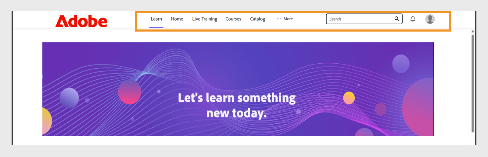
_Adobe Learning Manager Learner 首頁自訂化後_

## 自訂小工具

管理員可以透過套用 CSS 類別來自訂自訂頁面上的元件。 例如，他們可以在內容框小工具中對齊文字，或在「路徑與路徑」小工具中調整課程磁磚間距。

>[!TIP]
>
>檢查學習者頁面，找出你想修改的樣式。 複製相關 CSS 類別並貼到 CSS 與 JS 設定頁面，即可套用你的自訂。

**自訂之前**

以下畫面是銷售工程師在加入 CSS 自訂前的訓練頁面。

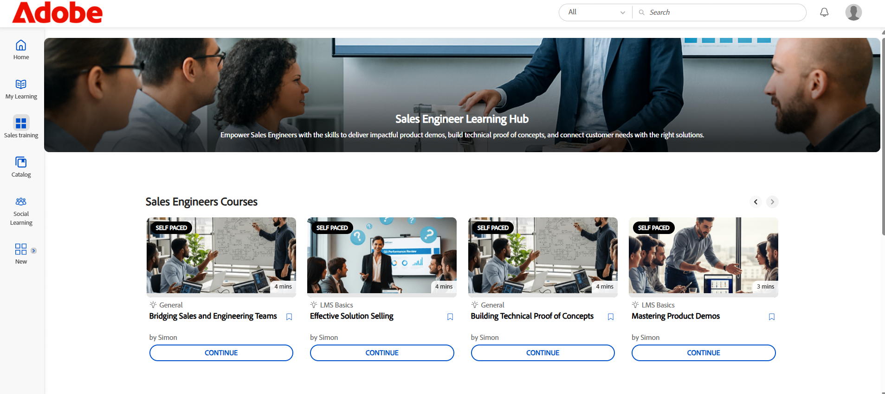
_客製化前的銷售工程師學習者頁面_

**客製化後**

新增以下 CSS 類別後，學習者頁面會依照這些類別中定義的樣式更新。 根據 CSS，內容框小工具中的文字已向左對齊，且課程磚塊間距也擴大了。

```
.alm-custom-content-box-center {
    align-items: baseline;
    text-align: initial;
}
.alm-training-card-v2-imageContainer {
    border: 14px solid var(--prime-color-white);
    border-radius: -1px;
    height: 106%;
    position: relative;
    transition: all .1s ease-in-out;
}
.alm-course-path-widget-cardRow {
    display: flex;
    gap: 135px;
    margin: 0 0 21px;
    padding: 10px;
}
```

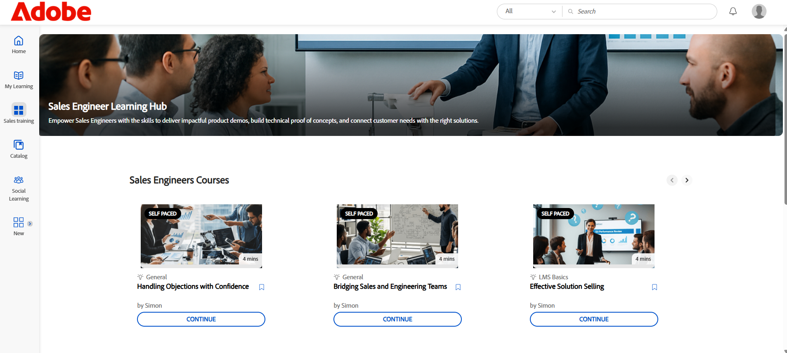
_客製化後的銷售工程師學習者頁面_

### 元件的預先定義 CSS 類別

以下是一些用於小工具的預先定義 CSS 類別。

| 小工具名稱 | 容器 CSS |
|---|---|
| 賽程表 | alm-calendar-widget-container |
| 類別 | alm-類別-widget-容器 |
| 類別卡 | alm-類別-卡片-容器 |
| 合規 | ALM-合規-容器 |
| 路線與路徑 | alm-course-path-widget-container |
| 路線與路徑 LO 卡 | alm-training-card-v2-card |
| 內容框 | alm-custom-content-box-container |
| 遊戲化 | ALM-排行榜-容器 |
| 社會學習 | alm-social-learning-container |
