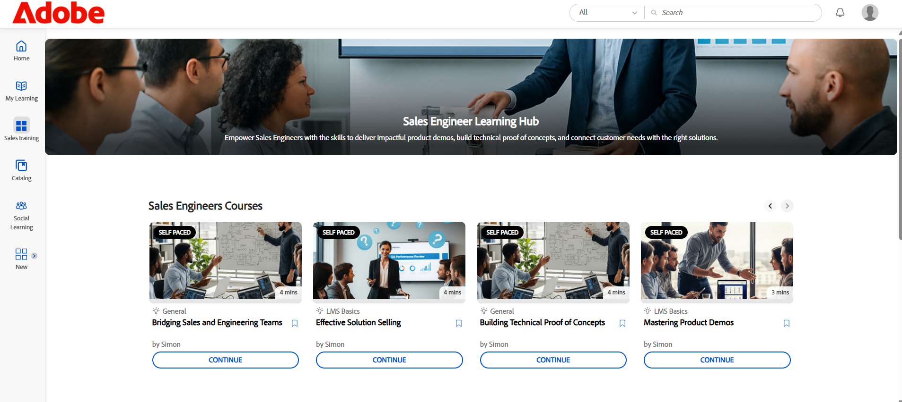

# 自訂Experience Builder

## 自訂頁尾

頁尾會顯示在學習者介面的底部，通常會顯示管理員設定中所設定的預設資訊。 管理員可以使用自訂頁尾取代此專案，以建立品牌化體驗。 他們能使用HTML和CSS定義頁尾的設計、版面和內容，以符合組織的需求。

身為財務公司的管理員，您可以使用自訂選項來設定頁尾。 此選項可讓您新增自己的HTML和CSS，讓您完全靈活地設計頁尾。

若要自訂頁尾：

1. 以管理員身分登入Adobe Learning Manager。
2. 選取&#x200B;**[!UICONTROL Branding]**，然後選取&#x200B;**[!UICONTROL General]**。
3. 選取&#x200B;**[!UICONTROL Edit]**&#x200B;選項旁的&#x200B;**[!UICONTROL Footer customization]**。

   
   _Adobe Learning Manager中的一般設定畫面，顯示啟用頁尾自訂的選項_

4. 選取切換按鈕以啟用&#x200B;**[!UICONTROL Footer customization]**。

   
   _Adobe Learning Manager中的頁尾自訂設定，顯示啟用自訂頁尾和欄位以新增HTML或CSS以個人化品牌化的切換按鈕_

5. 在個別索引標籤中鍵入您的&#x200B;**[!UICONTROL HTML]**&#x200B;和&#x200B;**[!UICONTROL CSS]**。

   
   _Adobe Learning Manager中的頁尾自訂畫面，顯示用於新增、編輯或樣式化學習者介面頁尾的自訂HTML區段_

6. 在儲存前選取&#x200B;**[!UICONTROL Preview]**&#x200B;以檢視自訂頁尾。

   
   _預覽Adobe Learning Manager中的自訂學習者介面頁尾，其中包含已分類的連結_

7. 選取&#x200B;**[!UICONTROL Save]**。

自訂頁尾將會向所有學習者顯示。

## 自訂課程圖磚

在金融公司，管理員可以設定課程圖磚，以決定學習者可看到的詳細資訊。 例如，他們可能會顯示課程說明和合規培訓的技能名稱，但隱藏評級或作者名稱，以專注在強制要求上。

若要自訂課程圖磚：

1. 以管理員身分登入Adobe Learning Manager。
2. 選取&#x200B;**[!UICONTROL Branding]**，然後選取&#x200B;**[!UICONTROL Course Tile]**。
3. 選取&#x200B;**[!UICONTROL Edit]**。

   
   _Adobe Learning Manager中的「課程圖磚」設定畫面，顯示「編輯」選項以自訂圖磚_

4. 選取下列選項以顯示或隱藏與課程資訊相關的詳細資訊：

   a. **[!UICONTROL Format]**：混合/自學/教室/虛擬教室：學習物件的型別。
b. **[!UICONTROL Duration]**：學習物件的持續時間。
c. **[!UICONTROL Skill/ Product]**：顯示課程涵蓋的關鍵技能或產品。
d. **[!UICONTROL Rating]**：顯示課程的學習者評分。
e. **[!UICONTROL Author name]**：顯示課程作者的名稱
f. **[!UICONTROL Description (appears on hover)]**：當學習者暫留在卡片上時，顯示課程的簡短摘要。
g. **[!UICONTROL Published date/ due date (appears on hover)]**：顯示課程發佈的時間或完成期限。

5. 選取下列選項以顯示或隱藏課程動作的相關詳細資訊：

   答： **[!UICONTROL Add to Learning List button]**：允許學習者將課程儲存至個人學習清單以供日後參考。
b. **[!UICONTROL Save button]**：儲存對課程設定或偏好設定所做的任何變更。
c. **[!UICONTROL Enroll / Continue button]**：允許學習者註冊新課程或繼續他們已經開始的課程。 隱藏此選項也會移除旁邊顯示的「不建議」和「下載」動作。

   
   _Adobe Learning Manager中的課程磚設定畫面，管理員可在此選取資訊和動作，以便向學習者顯示_

6. 課程圖磚的預覽會顯示在畫面右側。

   
   _Adobe Learning Manager中的課程圖磚設定畫面，醒目提示課程圖磚預覽_

7. 選取&#x200B;**儲存**。

自訂課程圖磚會顯示給所有學習者。

自訂前&#x200B;**&#x200B;**


_在自訂之前，在Adobe Learning Manager中插入課程磚_

**自訂之後**


自訂後_Adobe Learning Manager中的課程磚_

## 使用JavaScript和CSS自訂

作為金融公司管理員，您可以插入CSS和JavaScript來自訂學習者應用程式，以符合貴公司的品牌和法規要求，讓您完整控制應用程式的外觀、版面配置和互動功能。

若要使用CSS和JS自訂學習者介面：

1. 以管理員身分登入Adobe Learning Manager。
2. 選取&#x200B;**[!UICONTROL Branding]**，然後選取&#x200B;**[!UICONTROL CSS & JS Configuration]**。
3. 選取&#x200B;**[!UICONTROL Edit]**。
4. 在個別索引標籤中鍵入您的自訂CSS和JS。

   
   在Adobe Learning Manager中的&#x200B;_CSS與JS設定畫面，管理員可以在其中新增自訂CSS與JS_

5. 選取「儲存」。

所有學習者皆可看到自訂內容。

**在自訂之前**

學習者首頁選單設計以Adobe Learning Manager預設設計為基礎。


自訂前_Adobe Learning Manager學習者首頁_

**自訂之後**

新增以下CSS和JS後，學習者首頁功能表已根據自訂進行更新。

範例CSS：

```
p{
display:block;
}

.withExtraMargin{
margin-right: 100px!important;
}
.alm-footer-extraMargin{
margin-top:0;
}

.alm-layout-almLayoutContainer{
margin: 0;
    margin-bottom: 5rem;
}
#page-756 #category-970151 .alm-category-card-cardLink
{
    height: 400px;

}
#page-756 #category-970151 .alm-category-card-header
{
height: 240px!important;
}
#page-656 .alm-category-card-cardLink{
    height: 380px;
background: white;
}
#page-656 .alm-category-card-header{
height: 200px!important;
}

#page-746 #html-636797 {
    background-color: #f7f9fc;
}

#page-746 .alm-layout-almLayoutContainer{
row-gap:0;
margin-bottom:0;
}

.alm-category-card-cardLink{
transition: border .3s ease;
}
.navText{
       font-size: 16px;
    cursor: pointer;
}
.submenuDownCaret{
display:none;}
.alm-catalog-container-pageContainer{
max-width: 1720px;
    width: 100%;
    padding: 0 40px;
    padding: 0 40px;
}


.pagenavbarcontainer.newNavbarContainer{
width: 1230px;
    margin: 0 auto;
}
div[automationid="learner-menu-inside-header"]{
margin-right:100px!important;
}
#searchScope,.searchSeparator,#searchInDropdown{
display:none!important;
}
#right-navbar{
    margin-right: 0;
}
#companyLogoImg{
cursor:pointer;
max-width:190px;
}
.alm-catalog-container-filtersContainer{
width:340px;
}
.alm-training-card-v2-imageFlipContainer{
border:none;
}
.newSearchBoxContainer{
border-radius: 5px !important;
    border-width: 2px !important;
    border-color: rgb(5, 32, 34) !important;
}
.searchBoxFlex{
width:250px!important;
flex-direction: row-reverse;
    padding-right: 10px;
}
.searchPlaceholderIcon svg{
    height: 16px;
    width: 16px;
}
.searchPlaceholderIcon svg path{
fill: black;
}
#page-656 .alm-layout-almLayoutContainer {
    padding-bottom: 5rem;
margin-bottom:0!important;
}
#page-656 .alm-strip-widget-header-stripHeaderContainer{
display:none;
}
#page-656 .content-wrapper{
padding-bottom:50px;
}
.myspan{
position: absolute;
    bottom: 10px;
    display: block;
    width: 85%;
    margin-left: 20px;
    margin-right: 20px;
    border-top: 1px solid #efefef !important;
    color: #5a697c !important;
    text-align: right;
    padding-top: 5px;
}
.alm-app-wrapperComponent{
padding-bottom:100px;}


@media (max-width: 768px) {
#page-656 .alm-category-widget-cardRow{
   flex-direction: column;
gap: 40px;
 }
#page-656 .alm-category-widget-stripCardContainerRow{
    width: 100%;
    display: flex;
    justify-content: center;
  }
}

@media (max-width: 768px) {
    .container2-right {
        display: none!important;
    }
.container-1 .content-wrapper{
    padding: 0 20px!important;
 }
}
```

範例JS：

```
console.error("Hello Error")

setTimeout(() =>{
// Step 1: Check if #category-284977 is present
const categoryElement = document.querySelector('#category-284977');

if (categoryElement) {
  // Step 2: Find all elements with .alm-category-card-cardLink
  const cardLinks = categoryElement.querySelectorAll('.alm-category-card-cardLink');

  // Step 3: Loop over them and append span with random calculation
  cardLinks.forEach((link, index) => {
    const span = document.createElement('span');


    // Calculate number = (index+1) * 5
    let number = (index + 1) * 5;
if(index === 2){
number = number +2;
}
if(index == 3){
number = number - 7;
}

    span.textContent = `${number} courses`;
    span.classList.add('myspan');
    link.appendChild(span);
  });
}

},2000)
```


自訂後_Adobe Learning Manager學習者首頁_

## 自訂Widget

管理員可以套用CSS類別來自訂頁面上的Widget。 例如，他們可以對齊「內容方塊」Widget中的文字，或是調整「課程與路徑」Widget中課程圖磚之間的間距。

>[!TIP]
>
>檢查學習者頁面以識別您要修改的樣式。 複製相關的CSS類別，並將其貼到「CSS &amp; JS設定」頁面以套用您的自訂。

**在自訂之前**

在新增CSS自訂功能之前，以下是銷售工程師培訓頁面。


自訂前_銷售工程師學習者頁面_

**自訂之後**

新增下列CSS類別後，學習者頁面會根據這些類別中定義的樣式更新。 根據CSS，內容方塊Widget中的文字已靠左對齊，而課程圖磚之間的間距現已增加。

```
.alm-custom-content-box-center {
    align-items: baseline;
    text-align: initial;
}
.alm-training-card-v2-imageContainer {
    border: 14px solid var(--prime-color-white);
    border-radius: -1px;
    height: 106%;
    position: relative;
    transition: all .1s ease-in-out;
}
.alm-course-path-widget-cardRow {
    display: flex;
    gap: 135px;
    margin: 0 0 21px;
    padding: 10px;
}
```


自訂後_銷售工程師學習者頁面_

### Widget的預定義CSS類別

以下是一些適用於Widget的預定義CSS類別。

| Widget名稱 | 容器CSS |
|---|---|
| 行事曆 | alm-calendar-widget-container |
| 類別 | alm-category-widget-container |
| 類別卡 | alm-category-card-container |
| 合規性 | alm-compliance-container |
| 課程與路徑 | alm-course-path-widget-container |
| 課程與路徑LO卡 | alm-training-card-v2-card |
| 內容方塊 | alm-custom-content-box-container |
| gamification | alm-leaderboard-container |
| 社交學習 | alm-social-learning-container |


