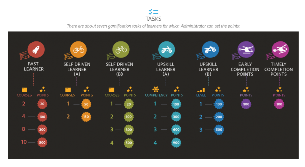
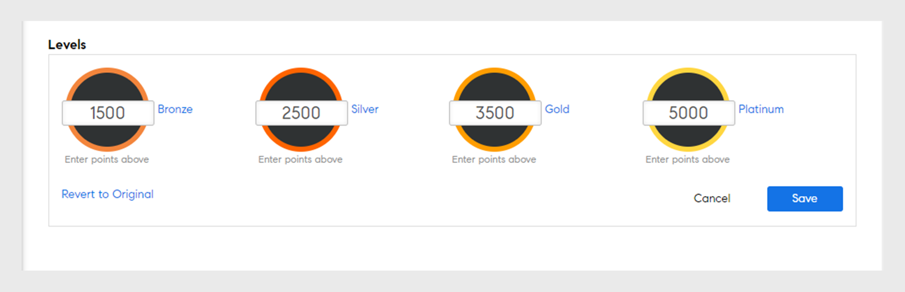
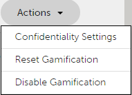
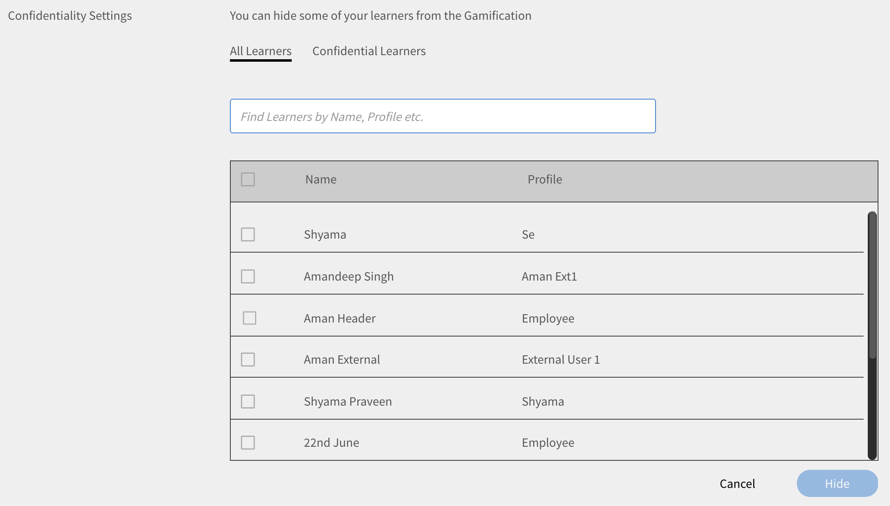
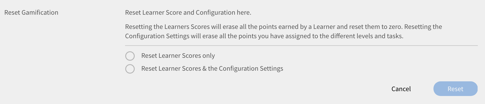
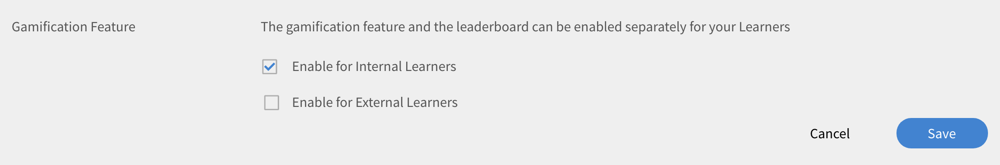
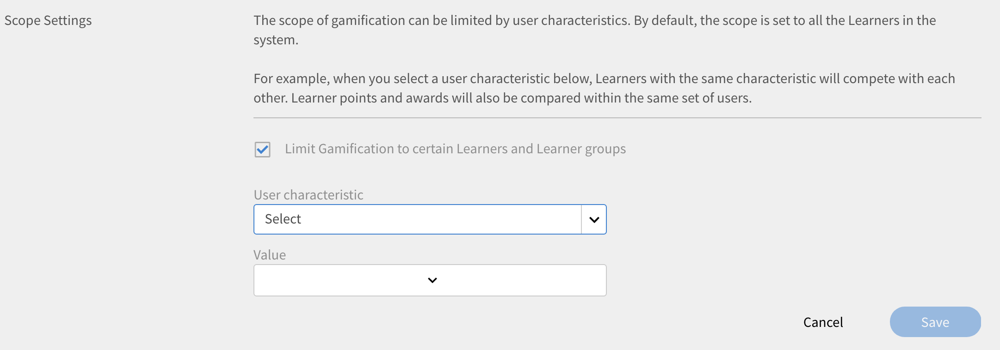
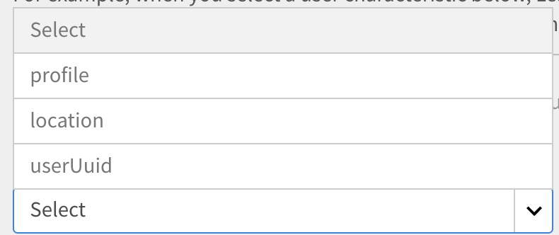
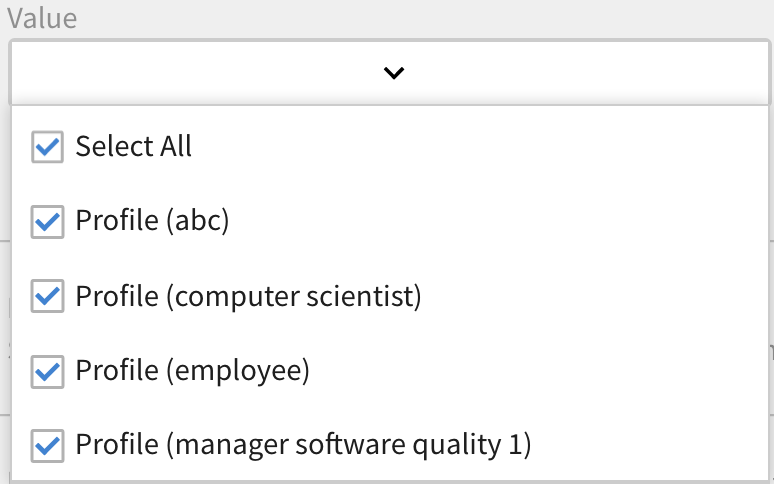

# 遊戲

遊戲化是指在非遊戲情境下使用遊戲思維和遊戲機制，讓使用者在學習時獲得收益點。

## 概觀 {#overview}

Adobe Learning Manager包含名為「遊戲化」的功能，旨在吸引學習者，並透過互動式遊戲元素促進學習。 它會透過獎勵來鼓勵想要的學習者行為，並讓學習者獲得點數並與同業競爭。 此功能可加強學習平台內的使用者參與和動機。

依預設，使用者可以使用一些遊戲點與資料的範例來瞭解模式。 您可以相應地修改點。

<!--A sample illustration is provided below that shows all the tasks and points.

-->

## 遊戲設定 {#gamificationsettings}

若要存取設定，請遵循下列步驟：

1. 以系統管理員身分登入，在左窗格按一下&#x200B;**[!UICONTROL Gamification]**。
1. 建立新的Learning Manager帳戶時，遊戲功能會依預設停用。 若要啟用，請按一下頁面右上角的&#x200B;**[!UICONTROL Enable]**。

## 設定點 {#setuppoints}

管理員可依照下列步驟為學習者設定遊戲點數：

1. 以系統管理員身分登入後，請按一下&#x200B;**[!UICONTROL Gamification]**。\
   此時會出現一個頁面，列出銅、銀、金和白金等層級，以及達到每個層級所需的點數。 隨即顯示任務清單與對應點。
1. 按一下每個任務旁的「編輯」圖示以設定點。
1. 修改工作的發生頻率，例如每月或每季或每年完成特定數量的課程。
1. 按一下&#x200B;**[!UICONTROL Save]**。

*設定點*

## 任務 {#tasks}

學習者有五個遊戲化任務，管理員可為其設定分數。 以下顯示插圖說明所有學習者的任務和分數：

>[!NOTE]
>
>特定任務中學習者的遊戲點數不會累積。 但是，如果學習者完成不同任務後獲得這些分數，則會以累積方式將這些分數新增到學習者帳戶中。

將課程指派給分數時，管理員必須確保學習者以漸進方式取得分數。

快速學習者&#x200B;**&#x200B;**

當學習者在一個月/季/年內完成特定數量的課程時，此工作適用。 此工作是鼓勵快速學習者。

您可以看到下列可能的情況：

1. 當學習者在一個月/季/年內完成兩門課程時，會獲得20分。
1. 當學習者在一個月/季/年內完成四門課程時，會獲得100分。
1. 當學習者完成八門課程時，會獲得300分。
1. 當學習者完成十門課程時，會獲得500分。

>[!NOTE]
>
>管理員可以修改時間週期和需要完成的課程數量以獲得相應的點數。

在任務中，分數不會累計分配給學習者。 例如，假設學習者完成數個課程並獲得20分。 當學習者完成四門課程時，他們會獲得100分，但不會考慮現有20分。

**適用於自我導向學習者(a)**

此任務適用於學習者註冊指定數量的課程並在一個月/季/年內完成的情況。 在這種情況下，管理員可以啟用此工作來配置點並鼓勵它們。

可能的情況：

1. 當學習者在一個月/季/年內註冊一門課程時，會獲得50分。
1. 當學習者在一個月/季/年內註冊兩門課程時，會獲得150分。

>[!NOTE]
>
>管理員可以修改時間週期和課程數。

自我導向學習者&#x200B;**(b)**

當學習者註冊並完成超過一個月/季/年內完成所需數量的課程時，此工作適用。 在這種情況下，管理員可以啟用此工作來配置點並鼓勵它們。

學習者註冊課程以及所分配課程的可能情況：

1. 當學習者在一個月/季/年內註冊一門課程時，會獲得20分。
1. 當學習者在一個月/季/年內註冊兩門課程時，會獲得100分。
1. 當學習者在一個月/季/年內註冊三門課程時，會獲得300分。
1. 當學習者在一個月/季/年內註冊四門課程時，會獲得500分。

>[!NOTE]
>
>管理員可以修改時間週期和課程數。 例如，第三個案例可以修改成五個課程，而非三個課程以獲得80分。

**提升技能(a)**

此任務適用於學習者完成特定數量的能力時。 管理員可選擇此任務來鼓勵學習者儘可能獲得更多能力。

能力提升的可能情況：

1. 學習者獲得一項能力時，會獲得100分。
1. 當學習者獲得兩個能力時，就會獲得300分。
1. 當學習者獲得三個能力時，就會獲得600分。
1. 當學習者獲得四個能力時，就會獲得900分。

>[!NOTE]
>
>該時段不適用於此任務。 管理員可以修改每個情境的課程數。

**提升技能(b)**

只要學習者完成能力內的每個較高層級，此工作即適用。

特定能力內各層級中提升技能的可能案例：

1. 學習者達到一個層級時，會獲得100分。
1. 學習者達到兩個層級時，會獲得200分。
1. 學習者達到三個層級時，會獲得500分。

>[!NOTE]
>
>時段不適用於此任務。 如果學習者獲得較高層級，然後獲得較低層級的能力，則他們只會獲得較高層級的分數。

**以供參考**

此任務適用於完成N天內回頭參考已完成課程的學習者。

可能的情況：
當學習者完成課程後30天內參考完成課程時，會收到50分。

**提早完成點**

此任務適用於學習者，當他們在N天內回頭參考已建立書籤的課程以完成課程時。

可能的情況：\
當學習者成為完成課程的前10名學習者之一時，他/她會獲得100分。

**按時完成點數**

此任務適用於在註冊課程後指定天數內完成課程的學習者。

可能的情況：\
當學習者在課程開始後的10天內完成課程時，會獲得100分。

**全方位的學習者**

此工作適用於每月消費預習、資源及工作輔助等選用學習資料的學習者。

可能的情況：

1. 學習者每月完成一項學習時，會獲得20分。
1. 當學習者每月完成兩次學習時，就會獲得40分。
1. 當學習者每月完成三次學習時，就會獲得80分。

**持續學習**

此工作適用於每週、每月或每季特定天數參與學習活動的學習者。 活動包括使用學習內容、下載資源和工作輔助。

可能的情況：

1. 當學習者每週進行一天學習活動時，會獲得20分。
1. 當學習者每週進行兩天學習活動時，會獲得40分。
1. 當學習者每週進行一天學習活動時，會獲得80分。

**意見反應**

適用於對課程提供意見回饋的學習者。

可能的情況：

1. 若是開始評等意見反應，可獲得20分。
1. 若是反應回饋，可獲得20分。
1. 若是經理的回饋，可獲得20分。

## 管理員動作 {#administratoractions}

管理員可以建立機密使用者清單、重設遊戲點數，以及停用/啟用學習者的遊戲化功能。 在遊戲化頁面上選取&#x200B;**[!UICONTROL Settings]**&#x200B;以檢視動作，如下列快照所示。

管理員的&#x200B;*遊戲化選項*

## 機密性設定 {#confidentialitysettings}

如有需要，您可以讓一些較高層管理使用者成為機密使用者。 排行榜中的其他學習者看不到機密使用者的遊戲化活動。

機密性設定可套用至內部和外部使用者。

1. 按一下&#x200B;**[!UICONTROL Gamification]** > **[!UICONTROL Settings]** > **[!UICONTROL Confidentiality Settings]**。

*檢視機密性設定*

1. 在列出的使用者中，按一下使用者名稱的核取方塊，然後按一下「隱藏」，讓使用者成為機密使用者。

   >[!NOTE]
   >
   >您可以透過勾選使用者名稱的核取方塊，在列出的使用者中識別機密使用者。

1. 按一下「機密使用者」頁標，以檢視機密使用者的清單。 依預設，這些區域不可見。 按一下下拉箭頭圖示以檢視清單。
1. 按一下機密使用者清單中使用者名稱的核取方塊，然後按一下「新增」，將使用者從機密清單中移除。

## 重設遊戲 {#resetgamification}

您可以重設學習者獲得的遊戲點數並重設組態設定。 如果您選擇重設使用者分數，使用者獲得的所有分數都會被清除，並重設為零。 如果您選擇重設使用者分數和組態設定，則所有指派給層級和工作的預設點都會重設為零。

重設遊戲化設定可套用至內部和外部使用者。

若要重設學習者分數和設定，請按一下「重設遊戲化」 ，然後視需要選擇一個選項。 您可以選擇僅重設學習者分數和重設學習者分數與組態設定。 選取後，按一下「確定」。

*重設遊戲點數*

## 停用遊戲 {#disablegamification}

按一下&#x200B;[!UICONTROL **遊戲化**] > **[!UICONTROL Settings]** > [!UICONTROL **遊戲化功能**]。 這可讓您為學習者分別啟用遊戲化功能和排行榜。 視需要在「內部學習者啟用」和「外部學習者啟用」之間選取，並按一下「確定」。 當您再次啟用遊戲化時，會保留所有點。

*停用遊戲化*

您可以為內部和外部使用者停用遊戲化。

## 群組層級遊戲 {#grouplevelgamification}

管理員可以透過變更範圍設定來定義遊戲的範圍。 您可以選擇性地啟用類似設定檔使用者、群組或位置之間的遊戲化。

1. 在管理員登入中，按一下左窗格中的&#x200B;**[!UICONTROL Gamification]**。
1. 開啟&#x200B;**[!UICONTROL Gamifications]** > **[!UICONTROL Settings]** > **[!UICONTROL Scope Settings]**。 [!UICONTROL Gamification Scope Settings]對話方塊隨即顯示。

   

   *檢視遊戲範圍設定對話方塊*

1. 按一下選項&#x200B;**[!UICONTROL Enable Scope Settings]**。

1. 從下拉式清單中選取「使用者特性」 。

   <!---->

1. 選取與您所選的使用者特性相對應的值。 例如，如果您選取使用者特性作為設定檔，則需要從下拉式清單中選取值。 以下熒幕擷圖中顯示範例設定檔值，以供您參考。

   <!---->

1. 按一下&#x200B;**[!UICONTROL Save].**
