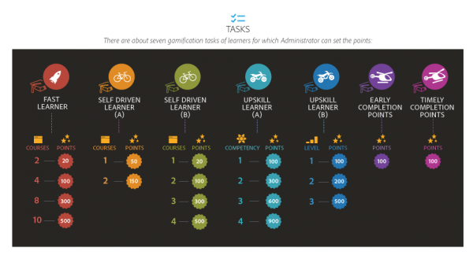
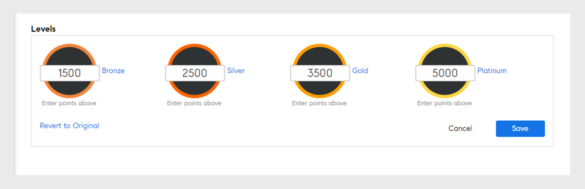
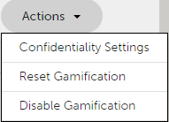
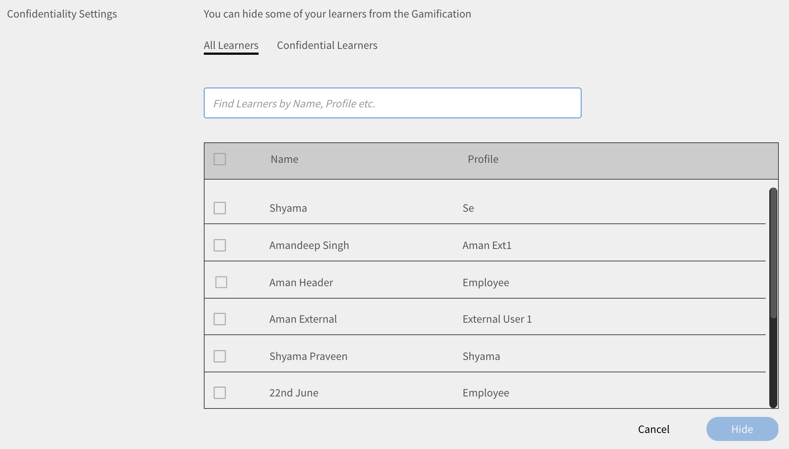
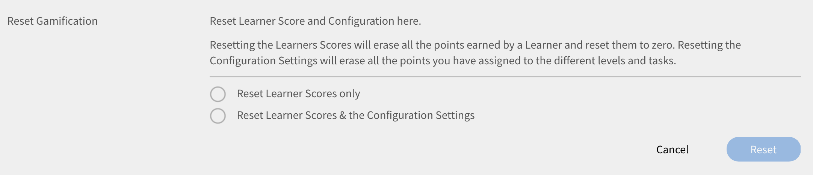
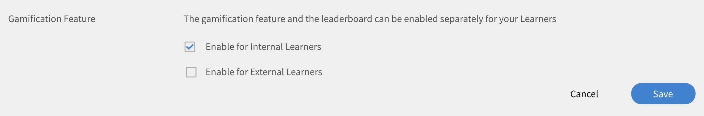
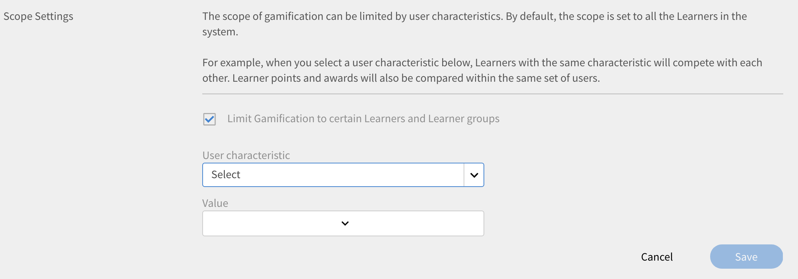
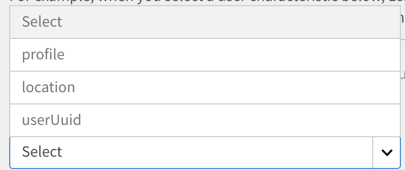
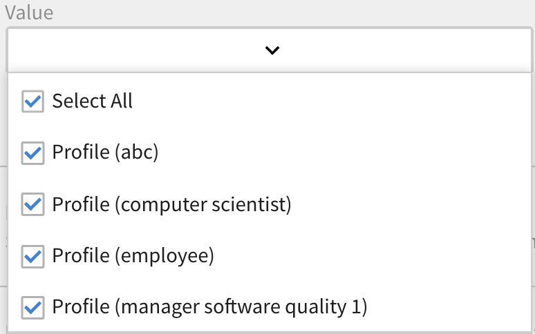

# 遊戲化

遊戲化是指在非遊戲情境中運用遊戲思維與遊戲機制，讓使用者在學習過程中獲得積分。

## 概觀 {#overview}

Adobe Learning Manager 包含一項名為 Gamification 的功能，旨在透過互動遊戲元素吸引學習並促進學習。 它透過獎勵鼓勵學習者達成理想的行為，並讓學習者賺取積分並與同儕競爭。 此功能提升了學習平台內的用戶參與度與動機。

預設情況下，會提供一些範例遊戲化點和數據，供使用者理解這個模式。 你可以相應調整點數。

<!--
A sample illustration is provided below that shows all the tasks and points.

-->

## 遊戲化設定 {#gamificationsettings}

要進入設定，請依照以下步驟操作：

1. 以管理員身份登入，在左側窗格點擊 **[!UICONTROL Gamification]**。
1. 當你建立新的學習管理員帳號時，遊戲化預設是被關閉的。 要啟用它，請點擊 **[!UICONTROL Enable]** 頁面右上角。

## 設置據點 {#setuppoints}

管理員可依照以下步驟設置學習者遊戲化點數：

1. 登入管理員後點選 **[!UICONTROL Gamification]** 。\
   會出現一頁，列出銅、銀、金、白金等級及達成各等級所需的點數。 會顯示任務清單及對應的點數。
1. 點擊每個任務旁邊的編輯圖示來設定點數。
1. 調整任務的頻率，例如每月、每季或每年完成特定數量的課程。
1. 點擊 **[!UICONTROL Save]**。

*設置據點*

## 任務 {#tasks}

管理員可設定五個學習者的遊戲化任務。 以下展示了所有學習者任務與重點的示意圖：

>[!NOTE]
>
>特定任務中學習者的遊戲化點數並非累積的。 但如果學習者在不同任務中獲得這些分數，這些分數會累積到學生的帳戶中。

在分配課程點數時，管理者必須確保學習者逐步獲得積分。

**給快速學習者**

當學習者在一個月/一季/一年內完成特定數量的課程時，此任務即適用。 這項任務是為了鼓勵快速學習者。

你可以看到以下可能的情況：

1. 當學習者在一個月/一季/一年內完成兩門課程時，可獲得20分。
1. 當學習者在一個月/一季/一年內完成四門課程時，可獲得100分。
1. 當學習者完成八門課程時，可獲得300分。
1. 當學習者完成十門課程時，可獲得500分。

>[!NOTE]
>
>管理員可以調整時間範圍及完成課程數量以獲得相應積分。

在任務中，學習者不會累積獲得分數。 舉例來說，假設一位學習者完成了幾門課程並獲得了20分。 當學習者完成四門課程時，他們可獲得100分，但現有的20分不予計算。

**對於自學型學習者（a）**

此任務適用於學生在規定數量課程中註冊並在一個月/一季/一年內完成時。 在這種情況下，管理員可以啟用此任務來分配點數並鼓勵他們。

可能的情況：

1. 當學習者在一個月/一季/一年內選修一門課時，可獲得50分。
1. 當學習者在一個月/一季/一年內選修兩門課程時，可獲得150分。

>[!NOTE]
>
>管理員可修改課程時段及課程數量。

**針對自學型學習者（b）**

當學習者在每月/季度/一年內註冊並完成超過所需完成的課程數量時，此任務適用。 在這種情況下，管理員可以啟用此任務來分配點數並鼓勵他們。

學習者除分配課程外還可能選修課程的情況：

1. 當學習者在一個月/一季/一年內選修一門課時，會獲得20分。
1. 當學習者在一個月/一季/一年內修讀兩門課時，可獲得100分。
1. 當學習者在一個月/一季/一年內修讀三門課程時，可獲得300分。
1. 當學習者在一個月/一季/一年內修讀四門課程時，可獲得500分。

>[!NOTE]
>
>管理員可修改課程時段及課程數量。 例如，第三個劇本可以將賽道從三道改為五道，以獲得80分。

**關於提升技能（a）**

當學習者完成特定數量的能力時，此任務適用。 管理員可以選擇此任務，鼓勵學習者獲得盡可能多的能力。

能力提升的可能情境：

1. 當學習者達成一項能力時，他們會獲得100分。
1. 當學習者達成兩項能力時，可獲得300分。
1. 當學習者達成三項能力時，可獲得600分。
1. 當學習者達成四項能力時，可獲得900分。

>[!NOTE]
>
>此任務不適用時間範圍。 管理員可以為每種情境調整課程數量。

**為了提升技能（b）**

當學習者完成某一能力的更高等級時，此任務皆適用。

在特定能力範圍內提升技能的可能情境：

1. 當學習者達到一級時，可獲得100分。
1. 當學習者達到兩個等級時，可獲得200分。
1. 當學習者達到三個等級時，可獲得500分。

>[!NOTE]
>
>此任務不適用於時間範圍。 若學習者達到較高水準後，能力等級降低，則僅因較高等級獲得點數。

**供參考**

此任務適用於在完成後N天內回顧已完成課程的學習者。

可能的情況：當學員在完成後30天內提及已完成的課程時，將獲得50分。

**提前完成積分**

當學習者在N天內回訪書籤課程以完成課程時，此任務同樣適用。

可能的情況：\
當學習者成為前10名完成課程的學員之一時，他/她可獲得100分。

**及時完成分**

此任務適用於學生在報名後規定天數內完成課程。

可能的情況：\
當學員在課程開始後10天內完成課程時，將獲得100分。

**綜合學習者**

此任務適用於每月使用選修學習材料（如課前準備、資源及工作輔助）的學習者。

可能的情況：

1. 當學習者每月完成一次學習時，可獲得20分。
1. 當學習者每月完成兩次學習時，可獲得40分。
1. 當學習者每月完成三次學習時，可獲得80分。

**持續學習**

此任務適用於每週、每月或季度中從事特定天數學習活動的學習者。 活動包括使用學習內容、下載資源及工作輔助工具。

可能的情況：

1. 當學習者每週參與一天的學習活動時，他們會獲得20分。
1. 當學習者每週參與兩天的學習活動時，他們會獲得40分。
1. 當學習者每週參與一天的學習活動時，他們會獲得80分。

**回饋**

這適用於對課程提供回饋的學習者。

可能的情況：

1. 開始評分給予20分。
1. 反應回饋則得20分。
1. 經理回饋則是20分。

## 管理員行動 {#administratoractions}

管理員可以建立機密使用者名單、重置遊戲化點數，以及為學習者停用或啟用遊戲化功能。 請選擇遊戲化頁面， **[!UICONTROL Settings]** 查看下方快照中顯示的動作。

*管理員的遊戲化選項*

## 機密性設定 {#confidentialitysettings}

如果需要，你可以將一些高階管理的使用者設為機密使用者。 機密使用者的遊戲化活動在排行榜上不會被其他學習者看到。

機密設定可套用於內部與外部使用者。

1. 點擊 **[!UICONTROL Gamification]** > **[!UICONTROL Settings]** > **[!UICONTROL Confidentiality Settings]**。

*查看機密設定*

1. 從列出的使用者中，點選使用者名稱的勾選框，然後點選隱藏以將該使用者設為機密使用者。

   >[!NOTE]
   >
   >你可以透過使用者名稱中的勾選框來識別這些機密使用者。

1. 點擊「機密使用者」標籤以查看機密使用者名單。 預設情況下，它們是看不到的。 點擊下拉箭頭圖示即可查看清單。
1. 在機密使用者列表中勾選使用者名稱的勾選框，然後點擊新增以將使用者從機密清單中移除。

## 重置遊戲化 {#resetgamification}

你可以重置學習者獲得的遊戲化點數，也可以重設設定。 如果你選擇重置用戶分數，所有用戶獲得的分數都會被抹除並歸零。 如果你選擇重置使用者分數和設定，那麼所有分配給等級和任務的預設分數都會重置為零。

重置遊戲化設定可以套用給內部和外部使用者。

要重置學習者分數與設定，請點擊「重置遊戲化」並依照需求選擇選項。 你可以選擇只重置學習者分數，或重置學習者分數與設定設定。 選中後，點擊確定。

*重置遊戲化點數*

## 關閉遊戲化 {#disablegamification}

點擊 [!UICONTROL **遊戲化**] > **[!UICONTROL Settings]** > [!UICONTROL **遊戲化功能**]。 這讓你能分別啟用遊戲化功能和排行榜，讓學習者受益。 依需求在「為內部學習者啟用」與「為外部學習者啟用」之間選擇，然後點擊確定。 當你再次啟用遊戲化時，所有點數都會保留。

*關閉遊戲化*

你可以為內部和外部使用者關閉遊戲化。

## 群組層級遊戲化 {#grouplevelgamification}

管理員可以透過更改範圍設定來定義遊戲化的範圍。 你可以選擇性地在相似的個人檔案使用者、群組或地點間啟用遊戲化。

1. 在管理員登入中，點擊 **[!UICONTROL Gamification]** 左側窗格。
1. 打開 **[!UICONTROL Gamifications]** > **[!UICONTROL Settings]** > **[!UICONTROL Scope Settings]**。 [!UICONTROL Gamification Scope Settings]對話框出現了。

   

   *查看遊戲化範圍設定對話框*

1. 點選選項 **[!UICONTROL Enable Scope Settings]**。

1. 從下拉選單中選擇使用者特徵。

   <!---->

1. 選擇與你所選使用者特徵對應的值。 例如，如果你選擇了使用者特徵作為個人檔案，那麼你需要從下拉選單中選擇該值。 下方截圖展示了範例剖面值，供您參考。

   <!---->

1. 點擊 **[!UICONTROL Save]。**
