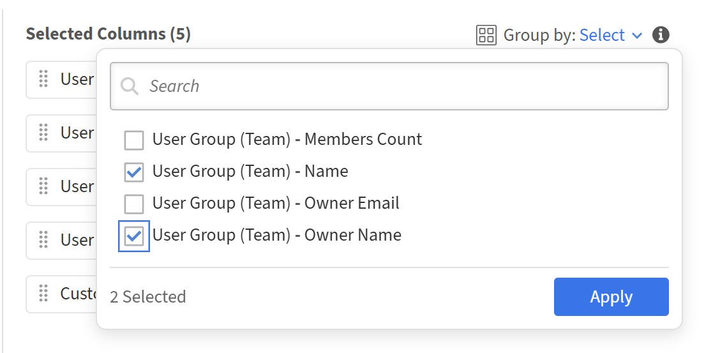
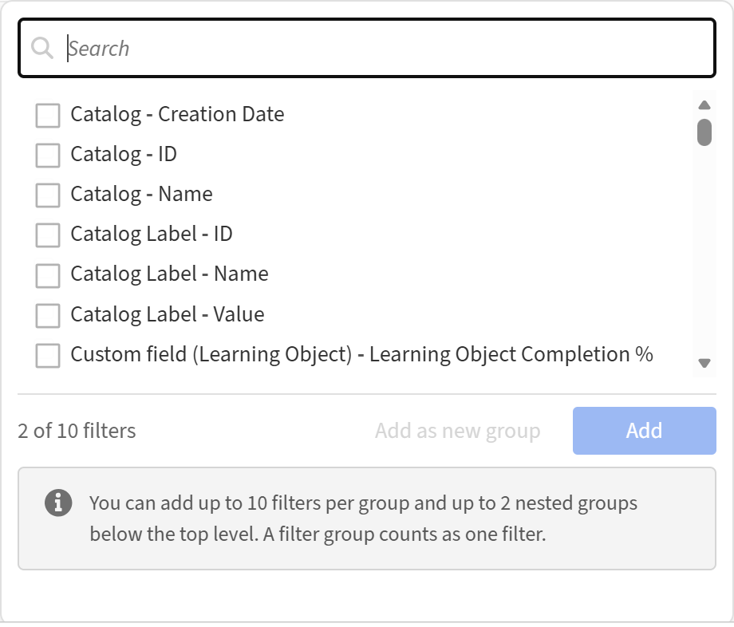

# 開始使用 Report Builder

## 概觀

報告建構器包含 15 個預設範本，專為最常見的學習資料報告應用場景設計。 每個範本都是現成可用的報表配置，包含欄位、篩選器、分組設定及排序功能。 範本是唯讀的。 你可以預覽或複製它們，製作可編輯的副本。

## 關於範本

範本是由 Adobe Learning Manager 提供的現成型報表配置。 每個範本皆針對特定使用情境設計，例如註冊與完成追蹤、合規報告或講師表現。 範本會出現在 **報告建器中的範本** 標籤下。 每個範本由一個或多個資料集建構，產生特定類型的輸出。 若要自訂範本，請選擇&#x200B;**複製**，在報告&#x200B;****&#x200B;標籤中建立可編輯的副本，且保留原件不變。

## 範本目錄

### 使用者學習逐字稿

**分類：** 成績單、完成與進度追蹤

**說明：** 為每位學習者完整學習歷史，顯示所有註冊、狀態、分數、截止日期及跨所有學習對象類型的時間。

**使用時機：** 您需要完整的學習者活動匯出，用於合規稽核、學習者支援案例，或將 ALM 資料整合進外部系統。

**適用對象：** 客戶教育、合作夥伴教育、員工教育、銷售賦能。

**所使用的資料集：** 使用者、學習物件、逐字稿（學習物件）

**關鍵欄位：** 使用者ID、使用者名稱、使用者電子郵件、經理名稱、使用者狀態、學習物件名稱、學習物件類型、註冊日期、完成日期、狀態、進度百分比、使用者最高分數、完成截止日、逾期、所花費時間（分鐘）

**套用篩選條件：** 去年內的報名日期;目錄 = 預設目錄

### 學習者進度摘要

**分類：** 成績單、完成與進度追蹤

**說明：** 追蹤每位學習者依照分配的學習路徑與課程的進度，包括透過家長 LO ID 進行階層映射。

**使用時間：** 你想了解每位學習者在學習路徑中的位置——*誰在進行中、誰已逾期，誰有錯過截止日期的風險。

**適用對象：** 客戶教育、合作夥伴教育、員工教育、銷售賦能。

**所使用的資料集：** 使用者、學習物件、逐字稿（學習物件）

**關鍵欄位：** 使用者ID、使用者名稱、使用者電子郵件、經理名稱、學習物件ID、學習物件名稱、學習物件類型、家長學習物件ID、註冊日期、完成截止日、狀態、進度百分比、逾期、開始日期、完成日期

**套用篩選條件：** 去年內的註冊日期;學習物件類型 = 學習路徑或課程;目錄 = 預設目錄

### 主動學習者儀表板

**分類：** 學習者參與度與平台使用

**說明：** 每月平台互動摘要，顯示每位學習者參與次數、完成次數及總花費時間。

**使用時間：** 你想找出過去一年中最積極和最不投入的學習者，並觀察參與度逐月的趨勢。

**適用對象：** 客戶教育、合作夥伴教育、員工教育、銷售賦能。

**所用資料集：** 使用者、逐字稿（學習對象）

**關鍵欄位：** 使用者ID、使用者名稱、使用者電子郵件、經理名稱、使用者狀態、最後存取日期（月份）、唯一存取課程、完成註冊次數、總使用時間（分鐘數）

**套用篩選條件：** 使用者去年內最後存取日期;使用者狀態 = 活躍;目錄 = 預設目錄

**群組依據：** 使用者欄位 + 最後存取日期月份

**彙總：** 在學習物件 ID 上計算唯一（存取的唯一課程）、若狀態 = 已完成（已完成的註冊）、時間總和（總花費時間）

### 非活躍學習者報告

**分類：** 學習者參與度與平台使用

**說明：** 識別過去一年內未使用平台的活躍用戶，顯示其最後註冊及完成日期。

**使用時間：** 你需要尋找休眠帳號，用於重新互動活動、授權審查或帳號清理。

**適用對象：** 客戶教育、合作夥伴教育、員工教育、銷售賦能。

**所用資料集：** 使用者、逐字稿（學習對象）

**關鍵欄位：** 使用者ID、使用者名稱、使用者電子郵件、經理名稱、使用者建立日期、使用者最後存取日期、最後註冊日期、最後完成日期

**套用篩選條件：** 使用者最後存取日期非去年內;使用者狀態 = 活躍;目錄 = 預設目錄

**群組依序：** 使用者ID、使用者名稱、使用者電子郵件、管理員名稱、使用者建立日期、使用者最後存取日期

**總計** ：註冊日期上限（最後註冊日期）、完成日期上限（最後完成日期）

### 新學習者採用

**分類：** 學習者參與度與平台使用

**說明：** 追蹤過去一年內創建用戶的入職互動，例如首次註冊次數、完成次數及總課程使用次數。

**使用時間：** 你想衡量新用戶從建立帳號到首次註冊及完成的速度，這是入職健康的重要指標。

**適用對象：** 客戶教育、合作夥伴教育、員工教育、銷售賦能。

**所用資料集：** 使用者、逐字稿（學習對象）

**關鍵欄位：** 使用者ID、使用者名稱、使用者電子郵件、經理名稱、使用者建立日期、使用者最後存取日期、首次註冊日期、首次完成日期、總存取課程數、已完成課程

**套用篩選條件：** 使用者創建日期為去年;使用者狀態 = 活躍;目錄 = 預設目錄

>[!NOTE]
>
>此範本在使用者資料集與逐字稿資料集之間採用左連接方式，使零註冊的使用者仍會出現在報告中。 這使得他們能夠識別尚未開始學習旅程的新用戶。

**群組依序：** 使用者ID、使用者名稱、使用者電子郵件、管理員名稱、使用者建立日期、使用者最後存取日期

**彙總** ：註冊日期的最低標準（首次註冊日期）、完成日期的最低期限（首次完成日期）、學習對象 ID 唯一數（存取課程總數）、狀態計數 = 已完成（已完成課程）

### 使用者群組學習

**分類：** 使用者、群組與組織結構

**說明：** 比較不同組織領域的學習活動——主動學習者、所修課程、完成次數及每組所花費的時間。

**使用時間：** 你想在部門、職務或任何活躍的現場使用者群體間進行基準測試。

**適用對象：** 客戶教育、合作夥伴教育、員工教育、銷售賦能。

**所使用資料集：** 使用者群組（活動欄位）、逐字稿（學習物件）

**關鍵欄位：** 使用者群組ID、使用者群組名稱、成員數、活躍學習者數、總獨立課程存取數、完成註冊數、總花費時間（分鐘數）

**套用篩選條件：** 去年內的註冊日期;目錄 = 預設目錄;使用者群組（活動欄位）名稱 = 個人檔案（活動欄位）

**群組依序：** 使用者群組ID、使用者群組名稱、成員數

**彙總：** 以使用者 ID 計算唯一數（活躍學習者）、以學習物件 ID 計數唯一數（存取的課程總數）、狀態 = 完成（完成註冊數）、時間總和（總花費時間）

### 依地點學習

**分類：** 使用者、群組與組織結構

**說明：** 比較不同地理位置的學習活動——活躍學習者、所修課程、完成時間及各地點所花費的時間。

**使用時間：** 您需要在不手動切片的情況下，跨區域進行學習健康基準測試。 對於全球性組織中，學習者分布廣泛，非常有用。

**適用對象：** 客戶教育、合作夥伴教育、員工教育、銷售賦能。

**所使用資料集：** 使用者群組（活動欄位）、逐字稿（學習物件）

**關鍵欄位：** 使用者群組ID、使用者群組名稱、成員數、活躍學習者數、總獨立課程存取數、完成註冊數、總花費時間（分鐘數）

**套用篩選條件：** 去年內的註冊日期;目錄 = 預設目錄;使用者群組（活動欄位）名稱包含「地點」

**群組依序：** 使用者群組ID、使用者群組名稱、成員數

**彙總：** 以使用者 ID 計算唯一數（活躍學習者）、以學習物件 ID 計數唯一數（存取的課程總數）、狀態 = 完成（完成註冊數）、時間總和（總花費時間）

### 經理學習

**分類：** 使用者、群組與組織結構

**說明：** 總結每位經理完整團隊層級的學習表現——主動學習者、完成人數及花費時間。

**使用時間：** 你想比較不同經理的團隊參與度，並找出完成率或相較於團隊規模花費時間較低的團隊。

**適用對象：** 員工教育、銷售賦能。

**所使用資料集：** 使用者群組（團隊）、逐字稿（學習物件）

**關鍵欄位：** 經理ID、經理姓名、經理電子郵件、成員數（完整團隊）、活躍學習者、總獨立課程存取數、完成報名數、總花費時間（分鐘數）

**套用篩選條件：** 去年內的報名日期;目錄 = 預設目錄

**群組依序：** 擁有者ID（經理ID）、擁有者姓名、擁有者電子郵件、會員數量

**彙總：** 以使用者 ID 計算唯一數（活躍學習者）、以學習物件 ID 計數唯一數（存取的課程總數）、狀態 = 完成（完成註冊數）、時間總和（總花費時間）

>[!NOTE]
>
>此範本使用使用者群組（Team）資料集，涵蓋每位經理下的完整團隊階層。 不需要額外的使用者群組過濾器。

### 招生摘要

**分類：** 成績單、完成與進度追蹤

**說明：** 依狀態分類的課程層級註冊人數，分為完成、進行中及未開始，針對每個學習項目。

**使用時間：** 你希望快速查看每門課程的報名漏斗——有多少學員開始了、有多少人正在進行中，以及有多少人已完成。

**適用對象：** 客戶教育、合作夥伴教育、員工教育、銷售賦能。

**所用資料集：** 學習物件、逐字稿（學習物件）

**關鍵欄位：** 學習物件 ID、學習物件名稱、學習物件類型、學習物件狀態、總註冊學習者、完成註冊、進行中註冊、未開始註冊

**套用篩選條件：** 去年內的報名日期;目錄 = 預設目錄

**群組分類：** 學習物件 ID、名稱、類型、狀態

**彙總：** 使用者ID唯一計數（註冊學習總數）、狀態 = 完成時計數、若狀態 = 進行中計數、若狀態 = 未開始計數

### 入學趨勢分析

**分類：** 成績單、完成與進度追蹤

**說明：** 每個學習項目的月比月註冊與完成數計數，顯示學習者參與度隨時間演變。

**使用時間** ：你要了解每門課程的報名人數何時高峰或減少，以及完成人數是否緊接著同月的報名。

**適用對象：** 客戶教育、合作夥伴教育、員工教育、銷售賦能。

**所用資料集：** 學習物件、逐字稿（學習物件）

**關鍵欄位：** 學習物件名稱、學習物件類型、註冊日期（月份）、總註冊學習者、完成註冊

**套用篩選條件：** 去年內的報名日期;目錄 = 預設目錄

**群組分類：** 學習物件名稱、學習物件類型、註冊月份

**彙總：** 使用者ID唯一數（註冊學習總數）、狀態 = 完成（完成註冊數）

### 課程完成報告

**分類：** 成績單、完成與進度追蹤

**說明：** 各課程完成率的細分，包含狀態數量、最後完成日期、平均進度及平均花費時間。

**使用時間：** 你想找出表現不佳的內容——報名人數高但完成度低的課程，或平均進度低（顯示早期退學的課程）。

**適用對象：** 客戶教育、合作夥伴教育、員工教育、銷售賦能。

**所用資料集：** 學習物件、逐字稿（學習物件）

**關鍵欄位：** 學習物件 ID、學習物件名稱、學習物件類型、學習物件狀態、總註冊學習者數、完成註冊、進行中註冊、未開始註冊、最後完成日期、平均進度百分比、平均花費時間（分鐘數）

**套用篩選條件：** 去年內的報名日期;目錄 = 預設目錄

**群組分類：** 學習物件 ID、名稱、類型、狀態

**彙總** ：依使用者 ID 計數唯一、狀態 = 完成/進行中/未開始計數、完成日期最高、進度百分比平均、平均時間

### 完成趨勢儀表板

**分類：** 成績單、完成與進度追蹤

**說明：** 每個學習項目的每月完成數，包含平均花費時間與進度，僅涵蓋已完成的註冊數。

**使用時間：** 你要追蹤完成率是否逐月成長，以及完成的學習者是認真完成還是匆忙完成。

**適用對象：** 客戶教育、合作夥伴教育、員工教育、銷售賦能。

**所用資料集：** 學習物件、逐字稿（學習物件）

**關鍵欄位：** 學習物件名稱、學習物件類型、完成日期（月份）、完成學習者總數、平均花費時間（分鐘）、平均進度百分比

**套用篩選條件：** 去年完成日期;狀態 = 完成;目錄 = 預設目錄

**群組依序：** 學習物件名稱、學習物件類型、完成月份

**彙總** ：使用者ID中唯一數（完成學習總數）、平均花費時間、平均進度百分比

>[!NOTE]
>
>此範本在分組前會篩選為「完成狀態」，確保只包含有效完成日期的紀錄，且空日期不會扭曲每月趨勢。

### 完成時間

**分類：** 成績單、完成與進度追蹤

**說明：** 衡量完成每門課程的實際時間，包括平均、最小及最大，並與設計時長進行比較。

**使用時間：** 你要找出學習者完成時間明顯長或短的課程，這可能代表內容長度或難度的問題。

**適用對象：** 客戶教育、合作夥伴教育、員工教育、銷售賦能。

**所用資料集：** 學習物件、逐字稿（學習物件）

**關鍵欄位：** 學習物件 ID、學習物件名稱、學習物件類型、持續時間（分鐘，設計）、完成學習者總數、平均花費時間（分鐘）、最小花費時間（分鐘）、最大花費時間（分鐘）

**套用篩選條件：** 去年完成日期;狀態 = 完成;目錄 = 預設目錄

**分組：** 學習物件 ID、名稱、類型、持續時間（分鐘）

**彙總** ：使用者ID唯一計數、平均/最小/最大花費時間

**注意：** 課程時長（設計課程長度）已包含在「分組比」中，因此與實際所花時間顯示在同一列，方便直接比較而無需計算欄位。 最小與最大時間差距過大，顯示學習者經驗不一致。

### 逾期學習作業

**分類：** 合規與認證

**說明：** 列出逾期強制註冊的活躍用戶，並顯示截止日期、目前狀態及進度。

**使用時間：** 您需要一份可執行的不合規學習者名單，以升級給主管或觸發重新註冊的工作流程。

**適用對象：** 合作夥伴教育、員工教育、銷售賦能。

**所用資料集：** 使用者、使用者群組（活動欄位）、學習物件、逐字稿（學習物件）

**關鍵欄位：** 使用者ID、使用者名稱、使用者電子郵件、經理名稱、使用者群組（活躍欄位）名稱、學習物件ID、學習物件名稱、學習物件類型、註冊日期、完成截止日、狀態、進度百分比、逾期

**套用篩選條件：** 逾期 = 是;狀態 = 進行中或未開始;去年完成截止日期;目錄 = 預設目錄;使用者狀態 = 活躍;使用者群組（活動欄位）名稱 = 個人檔案（活動欄位）

**不按應用** 分組，輸出為每筆逾期報名一列，保留完整的學習者與課程細節以便升級。

>[!NOTE]
>
>狀態過濾器（進行中或未開始）作為保護機制，排除任何錯誤標記為逾期但已完成的紀錄。

### 強制訓練狀態

**分類：** 合規與認證

**說明：** 所有登記的完整合規視圖，並有完成截止日期，包含所有狀態，而非僅是逾期。

**使用時間：** 您需要完整的合規全貌，而非僅僅違規，例如，向領導層報告整體強制性訓練完成率。

**適用對象：** 員工教育、銷售賦能。

**所用資料集：** 使用者、使用者群組（活動欄位）、學習物件、逐字稿（學習物件）

**關鍵欄位：** 使用者ID、使用者名稱、使用者電子郵件、經理名稱、使用者群組（活動欄位）名稱、學習物件ID、學習物件名稱、學習物件類型、註冊日期、完成截止日期、完成日期、狀態、進度百分比、逾期

**套用篩選條件：** 完成截止日期非空白;去年內註冊日期;目錄 = 預設目錄;使用者狀態 = 活躍;使用者群組（活動欄位）名稱 = 個人資料（活動欄位）

**沒有群組被應用** ，所有狀態都包含（已完成、進行中、未開始、逾期），提供完整的合規狀況。

**注意：** 篩選「完成截止日期非空白」是所有課程類型中強制訓練的關鍵邏輯，無論強制狀態如何設定。

## 範本快速參考

| **#** | **模板名稱** | **分類** | **內部教育** | **外部（客戶/合作夥伴）教育** |
|--------|------------------------------|-------------------------------------|------------------|-------------------------------------|
| 1 | 使用者學習逐字稿 | 成績單、完成與進度 | ✓ | ✓ |
| 2 | 學習者進度摘要 | 成績單、完成與進度 | ✓ | ✓ |
| 3 | 主動學習者儀表板 | 學習者參與度與平台使用情況 | ✓ | ✓ |
| 4 | 非活躍學習者報告 | 學習者參與度與平台使用情況 | ✓ | ✓ |
| 5 | 新學習者採用 | 學習者參與度與平台使用情況 | ✓ | ✓ |
| 6 | 使用者群組學習 | 使用者、群組與組織架構 | ✓ | ✓ |
| 7 | 依地點學習 | 使用者、群組與組織架構 | ✓ | ✓ |
| 8 | 經理學習 | 使用者、群組與組織架構 | ✓ | ✗ |
| 9 | 招生摘要 | 成績單、完成與進度 | ✓ | ✓ |
| 10 | 入學趨勢分析 | 成績單、完成與進度 | ✓ | ✓ |
| 11 | 課程完成報告 | 成績單、完成與進度 | ✓ | ✓ |
| 12 | 完成趨勢儀表板 | 成績單、完成與進度 | ✓ | ✓ |
| 13 | 完成時間 | 成績單、完成與進度 | ✓ | ✓ |
| 14 | 逾期學習作業 | 合規與認證 | ✓ | ✓ |
| 15 | 強制訓練狀態 | 合規與認證 | ✓ | ✗ |

## 使用報告建構器範本

透過自訂預設範本，快速開始使用 Adobe Learning Manager 報告建器，適用於常見的報告使用場景。

1. 以管理員身份登入 Adobe Learning Manager。
2. 在左側窗格選擇 **「報告** 」，然後選擇 **「報告建構器**」。

3. 選擇範本&#x200B;****&#x200B;標籤。
4. 瀏覽可用的範本。 每個範本都會以其使用情境命名。

   

5. 選擇範本名稱以開啟唯讀預覽。 在此範例中，選擇 **使用者團隊** 範本的合規百分比。 檢視欄位、套用的篩選條件和排序順序。
6. 選擇 **重複**。

   

當你複製範本時，報告建構器會開啟一個可編輯的副本，裡面已預先載入該範本的現有設定。 報告名稱、描述、欄位、篩選和排序都可以在儲存前編輯。

## 報告名稱與描述

1. 在 **名稱** 欄位中，將預設名稱（例如 *「使用者團隊*&#x200B;的合規率副本」）替換成報告的唯一名稱。 需要一個名字。
2. 在 **描述** 欄位輸入一份簡短的報告摘要。 這有助於其他管理員在查看或編輯報告時理解其目的。

## 新增與配置欄位

****&#x200B;欄目區塊有兩個面板：**左側為選擇欄**，**右側為已選欄**。

### 新增欄位

1. 在「 **選擇欄位」** 面板中，選擇資料集名稱來展開。 例如， **目錄** 或 **活躍現場使用者群組**。
2. 選擇你想新增欄位旁的 **+** 圖示。 該欄位出現在 **右側的「選取欄位」** 面板中。

   

3. 要重複加同一欄。 例如，將兩個不同的聚合應用於同一欄位。 再次選擇 **該欄位的 +** 鍵。

### 重新排序欄位

在選取&#x200B;**欄位面板中拖曳任一欄列**&#x200B;左側的把手，即可移到不同位置。面板中的欄位順序與下載報告中相同。

### 重新命名欄位

1. 在欄位列中選擇 **編輯** （鉛筆）圖示。

   

2. 進入化名。 別名會在下載的報告中以欄位標題出現，而非預設欄位名稱。

   

### 移除一欄

選擇 **欄位列上的 x** 圖示以移除該報表。

## 應用 群組

**控制項群組**&#x200B;顯示在選取&#x200B;**欄位面板的頂端**。

1. 選擇 **分組：選擇**。

   

2. 選擇要分組的欄位。 你可以選擇多個。 在截圖中，報告依使用者群組（Team）-名稱和使用者群組（Team）-擁有者名稱分組。
3. 每個選取的分組欄位會以標籤形式出現在「控制分&#x200B;**組」下方**。要移除分組欄位，請在標籤上選擇 **x** 。

>[!NOTE]
>
>當應用 group by 時，所有非 group-by 欄位的欄位都必須套用一個彙總函數。 沒有彙總的欄位會造成錯誤。

### 對欄位套用聚合

1. 在「選取&#x200B;**欄位」面板中任何非按群組的欄位**，選擇&#x200B;**「按**&#x200B;組合彙總」。
2. 從下拉選單中選擇一個函式。 在截圖中， **Learning Object Count** 使用 **Count Distinct**，並以 count_of_courses 的別名方式。

   

可用的彙總函數：

| **功能** | **它回報了什麼** |
|--------------------|---------------------------------------------|
| **伯爵** | 群組中的總列數 |
| **伯爵** | 群中唯一值的數量 |
| **計算 若** | 與你指定的數值相符的列數 |
| **總和** | 群中一個數值域的總和 |
| **敏** | 該組最低價值 |
| **麥克斯** | 該組中最高值 |
| **平均** | 群體的平均值 |

## 套用濾鏡

**篩選**&#x200B;器區塊位於欄&#x200B;**目區塊下方**。篩選器會限制報告中出現的列數。

1. 要新增篩選器，請在篩選區塊右側選擇 **+** 圖示。
2. 選擇要篩選的欄位。

   

3. 選擇一個運算元並輸入或選擇一個數值。

要編輯現有的篩選器，請選擇 **篩選列上的鉛筆** 圖示。 要新增巢狀過濾器群組，請在篩選列右側選擇 **帶有括號的 +** 圖示。

## **設定排序**

**排序**&#x200B;區位於&#x200B;**篩選**&#x200B;區下方。

1. 選擇 **+ 新增排序** 以新增排序。
2. 選擇排序的欄位，並選擇&#x200B;****&#x200B;上升或&#x200B;**下降**。

   

3. 重複這個步驟以加入次級排序。 拖曳每個排序列左側的柄來更改優先順序。

>[!TIP]
>
>務必至少塗抹一種。 若不排序，不同報告下載時列序可能會有所不同。

## 存檔報告

在右上角選擇 **「儲存報告** 」。 報告會儲存在你的 **報告** 分頁，並準備下載。

## 最佳實務

* 在每欄使用別名，讓下載的報告有有意義的標頭，而不是像學習物件 - 學習物件 ID 這類欄位名稱。
* 當你想要獨特紀錄時，例如每個目錄的課程不同，而非總列，請使用 **Count Distinct** **代替 Count** 。

* 儲存前請先套用排序功能，尤其是你要分享或訂閱的報告。
* 保持描述更新。 其他管理員則依賴它來了解報告範圍，但不必打開它。
