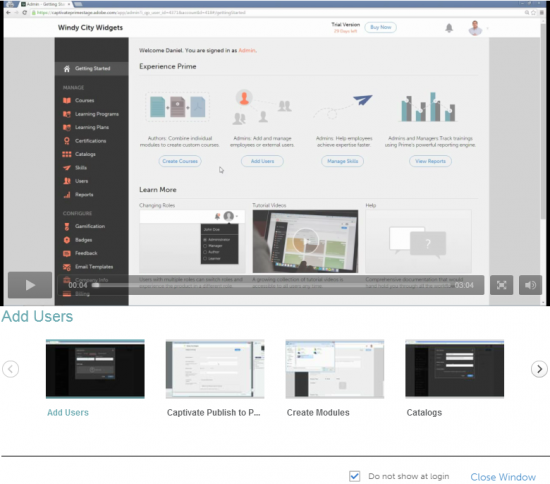

# 管理員快速入門

快速入門頁面可協助您逐一瀏覽應用程式的主要功能。

只要您以管理員身分登入，就能檢視包含影片清單的快顯視窗。

## 檢視範例影片 {#viewsamplevideos}

瀏覽範例影片教學課程，以瞭解您身為管理員角色的主要功能。 如果您不想在登入期間顯示此快顯視窗，您可以按一下 **[!UICONTROL Do not show at login]** 選項來切換快顯視窗。

按一下 **[!UICONTROL Close Window]** 關閉快顯視窗。

## 快速入門頁面 {#gettingstartedpage}

從快速入門頁面，您可以執行下列活動：

* 建立課程
* 新增使用者
* 管理使用者
* 檢視報表

您也可以選擇檢視教學課程影片、說明內容並瞭解不同角色，以進一步瞭解Learning Manager應用程式。

