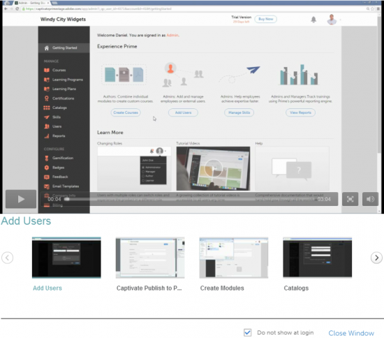

# 開始擔任管理員

開始頁面幫助你瀏覽應用程式的主要功能。

一旦你以管理員身份登入，就能看到彈出視窗，裡面有影片清單。

## 觀看範例影片 {#viewsamplevideos}

瀏覽範例教學影片，了解你作為管理員角色的主要特點。 如果你不想讓這個彈出視窗在登入時出現，可以點擊 **[!UICONTROL Do not show at login]** 彈出視窗右下角的選項來停用它。

點擊 **[!UICONTROL Close Window]** 關閉彈出視窗。

## 開始頁面 {#gettingstartedpage}

從開始頁面，你可以執行以下操作：

* 建立課程
* 新增使用者
* 管理使用者
* 檢視報告

你也可以透過觀看教學影片、說明內容及了解不同角色來進一步了解學習經理應用程式。

