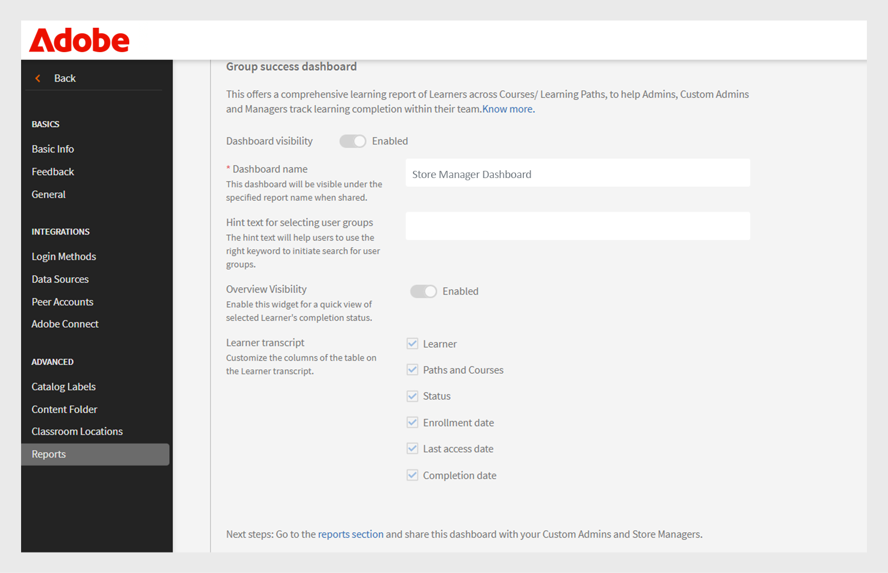
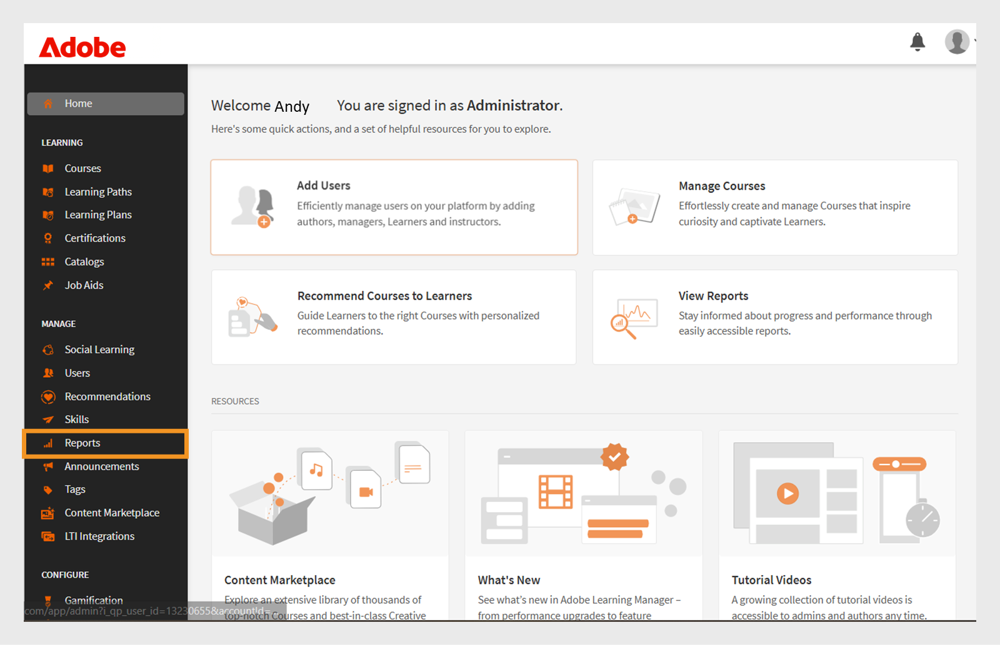
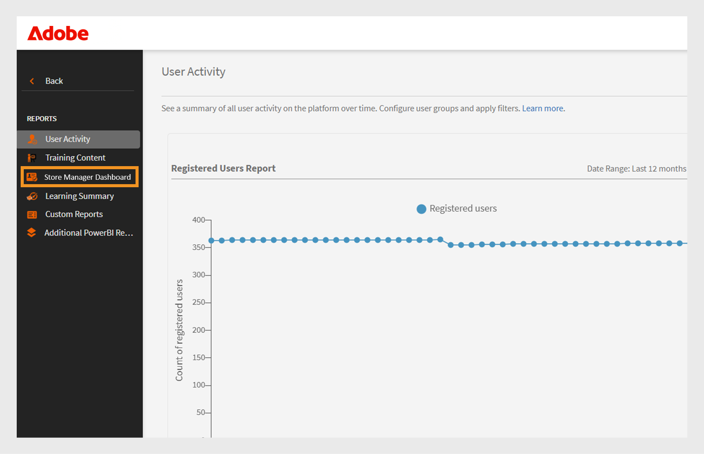
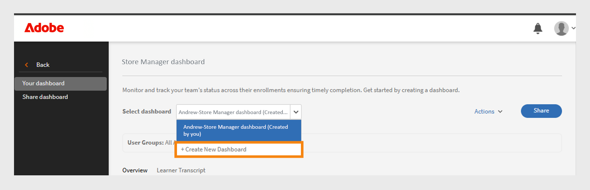
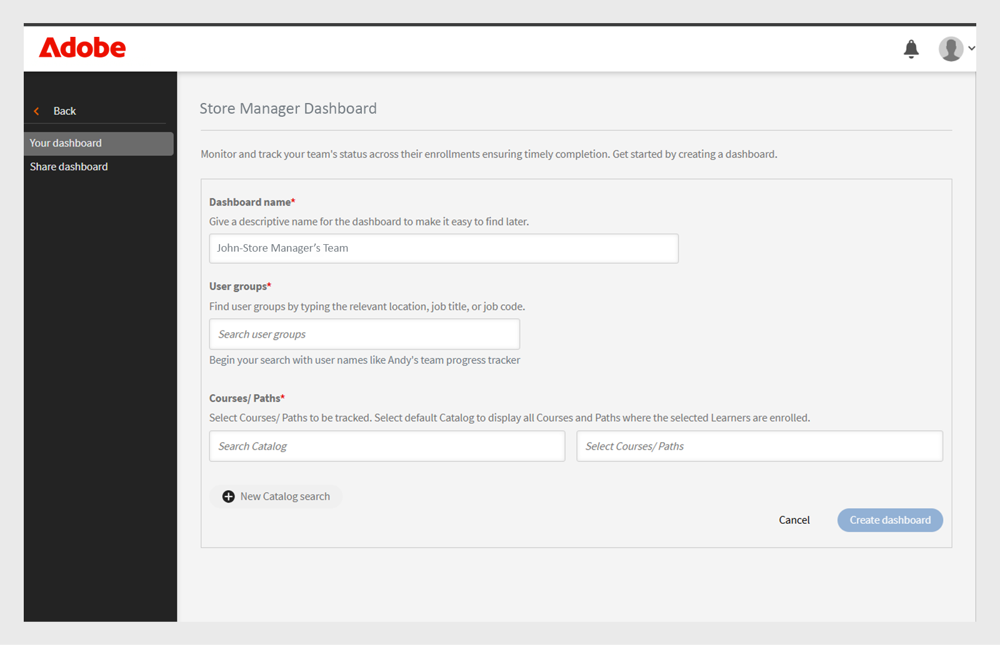
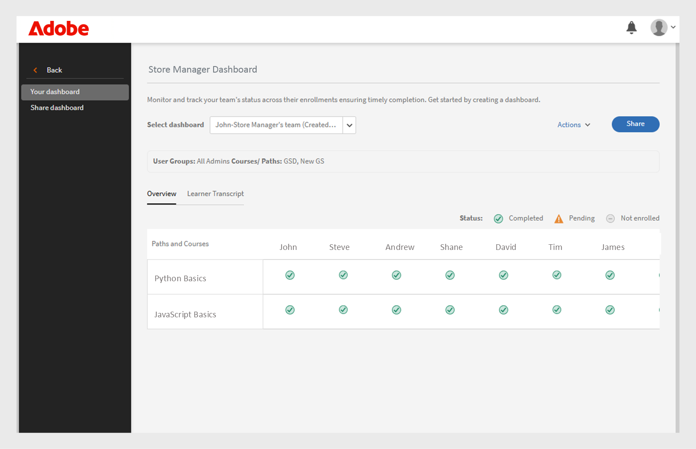
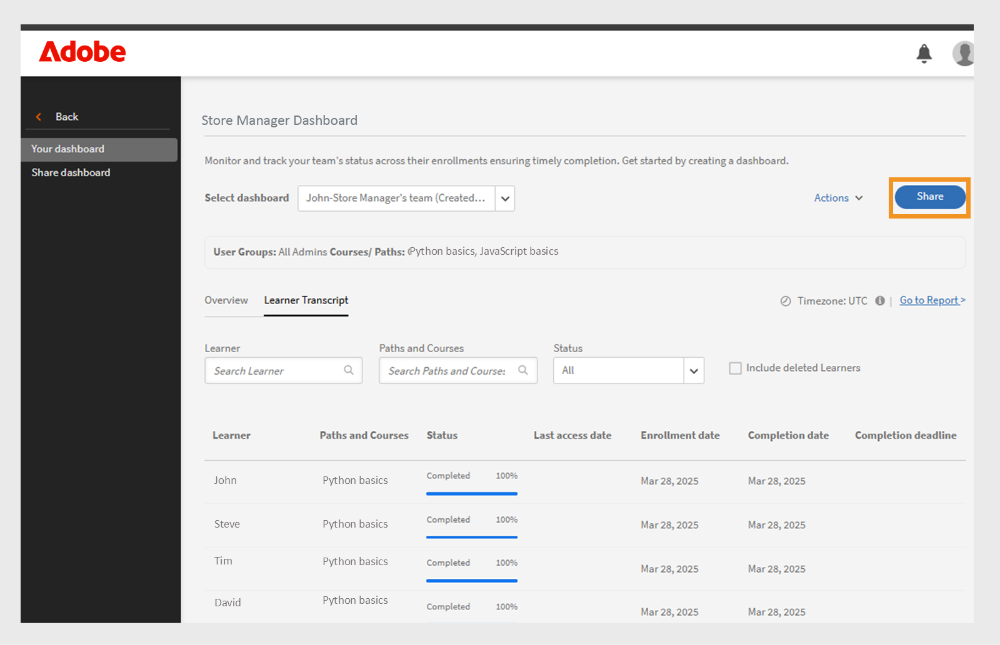
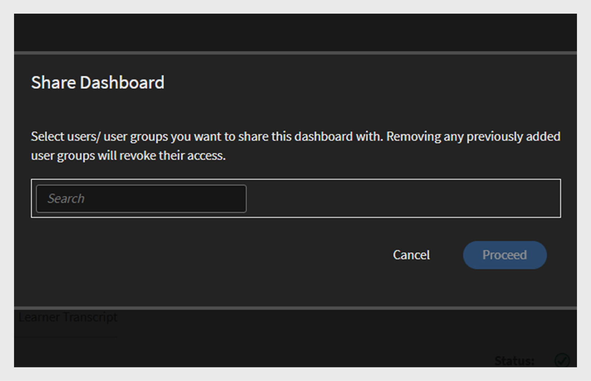
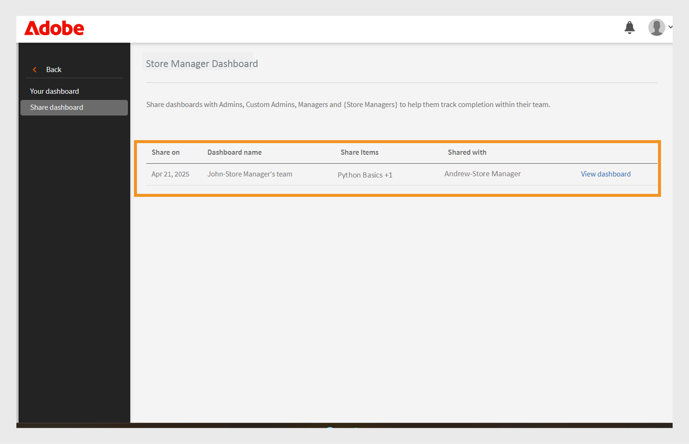

# 群組成功儀表板

## 群組成功儀表板概觀

Adobe Learning Manager中的Group Success Dashboard (GSD)可讓管理員和管理人員跨部門或使用者群組，近乎即時（從註冊、進度或完成到反映在儀表板上的60分鐘延遲）監視學習者的進度。 它支援主動追蹤課程完成、註冊和待定動作，讓團隊更容易管理學習。 檢視此[文章](/help/migrated/administrators/feature-summary/add-users-user-groups.md)以進一步瞭解使用者群組。

## 主要使用案例

群組成功儀表板提供下列功能：

* **簡化學習者進度追蹤**： Group Success Dashboard提供使用者易用的即時學習者資料檢視，減少使用Excel型成績單的需求。 經理和管理員可快速檢視學習者註冊和課程進度，以支援關鍵案例，例如：

   * **績效考核整備**：經理可以在評估週期之前評估團隊成員的課程進度。
   * **法規遵循監控**：識別尚未完成強制培訓的學習者。
   * **團隊層級追蹤**：加盟、商店或地區經理可確保他們的團隊能準時完成必要的學習。

* **促進團隊管理**： Group Success Dashboard適用於擁有小型團隊（50人以下）的管理員，例如商店經理、加盟經理、代理商經理或內部團隊。 它提供團隊檢視，可讓經理快速檢查其團隊是否已完成達成業務目標所需的課程集。

## 如何使用群組成功儀表板

管理員可以為控制面板命名、選取使用者群組並選擇課程或學習路徑，以啟用和建立控制面板。 控制面板可以與其他管理員共用。

### 啟用群組成功儀表板

管理員必須為帳戶啟用「群組成功儀表板」 。 若要啟用「群組成功儀表板」，請依照下列步驟操作：

1. 以管理員身分登入。
2. 選取**[!UICONTROL Settings]**然後選取&#x200B;**[!UICONTROL Reports]**。
3. 選取&#x200B;**[!UICONTROL Dashboard visibility]**&#x200B;切換。
4. 輸入儀表板名稱（例如，**[!UICONTROL Store Manager Dashboard]**）。
   
   _儀表板名稱、使用者群組和學習路徑選取範圍的欄位_
5. 選取&#x200B;**[!UICONTROL Overview Visibility]**&#x200B;以啟用儀表板中的概觀區段。 此區段可讓您檢視最多50個學習者的進度。

   >[!NOTE]
   >
   >如果團隊中有超過50個學習者或超過50個學習物件，請前往&#x200B;**[!UICONTROL Learner Transcript]**&#x200B;標籤而非&#x200B;**[!UICONTROL Overview]**&#x200B;標籤。

6. 針對&#x200B;**[!UICONTROL Learner Transcript]**&#x200B;區段，選取您要檢視的必要資料行。

   * 學習者
   * 路徑與課程
   * 狀態
   * 註冊日期
   * 上次存取日期
   * 完成日期

啟用此功能後，管理員可以在&#x200B;**[!UICONTROL Reports]**&#x200B;區段中檢視群組成功儀表板。

### 建立群組成功儀表板

管理員可建立最多100個儀表板來檢視學習者的進度。 若要建立控制面板，請依照下列步驟進行：

1. 以系統管理員身分登入並選取&#x200B;**[!UICONTROL Reports]**&#x200B;頁面。

   
   _在管理員首頁中選取報告_

2. 選取「群組成功儀表板」 。 儀表板的名稱為&#x200B;**[!UICONTROL Store Manager Dashboard]**。

   
   _選取商店管理員儀表板_

   >[!NOTE]
   >
   >您在啟用「群組成功儀表板」時設定的名稱將顯示為儀表板名稱。

3. 從選取儀表板下拉式清單中選取&#x200B;**[!UICONTROL Create New Dashboard]**。

   
   _選取建立GSD的選項_

4. 輸入控制面板的名稱。
5. 選取要顯示在儀表板中的使用者群組。
6. 搜尋課程或學習路徑，然後從結果中選取它們。

   
   _選取使用者群組與課程_

7. 選取&#x200B;**[!UICONTROL Create dashboard]**。

若是較大的團隊，請在&#x200B;**索引標籤中選取**&#x200B;預設目錄&#x200B;**和**&#x200B;所有學習者&#x200B;**[!UICONTROL Learner Transcript]**&#x200B;使用者群組以建立儀表板。 這包括&#x200B;**[!UICONTROL Learner Transcript]**&#x200B;檢視中的所有課程和學習者，讓您更輕鬆地搜尋及追蹤每個學習者的進度。

### 檢視群組成功儀表板

建立控制面板後，管理員可依照下列步驟檢視控制面板：

1. 以管理員身分登入。
2. 選取&#x200B;**[!UICONTROL Reports]**，然後選取&#x200B;**[!UICONTROL Group Success Dashboard]**。
控制面板的名稱為「商店管理員控制面板」。
3. 在&#x200B;**[!UICONTROL Your dashboards]**&#x200B;區段中，從&#x200B;**[!UICONTROL Select dashboard]**&#x200B;下拉式清單中選取已建立的儀表板。
4. 儀表板分為：
   * **[!UICONTROL Overview]**：您可以快速檢視學習者在個別課程或學習路徑上的進度。 您一次最多可以檢視50個課程或學習路徑以及50個學習者的進度。 若要檢查特定學習者的進度，請選取「**[!UICONTROL Learner Transcript]**」區段。

   
   _商店經理團隊中學習者的學習狀態_

   * **[!UICONTROL Learner Transcript]**：選取特定學習者或課程以檢視學習者進度。 在儀表板中搜尋學習者以檢查其學習進度。 如果您已使用預設目錄建立控制面板並包含所有學習者，您可以搜尋任何學習者以輕鬆檢閱其進度。

   
   _詳細學習者成績單檢視，包含註冊與完成的欄_

>[!NOTE]
>
>若要下載詳細的學習者成績單，請在&#x200B;**[!UICONTROL Go to Report]**&#x200B;索引標籤中選取&#x200B;**[!UICONTROL Learner Transcript]**。

### 共用群組成功儀表板

管理員可以與其他管理員或管理員共用控制面板。 請依照步驟共用控制面板：

1. 選取&#x200B;**[!UICONTROL Reports]**，然後選取&#x200B;**[!UICONTROL Group Success Dashboard]**。 儀表板的名稱為&#x200B;**[!UICONTROL Store Manager Dashboard]**。
2. 在&#x200B;**[!UICONTROL Share]**&#x200B;選項中選取&#x200B;**[!UICONTROL Your dashboards]**。

   
   _選取共用按鈕_

3. 依名稱搜尋使用者或使用者群組並選取它們。

   
   _與使用者或使用者群組共用儀表板_

4. 選取&#x200B;**[!UICONTROL Proceed]**&#x200B;以共用儀表板。

您可以在「**[!UICONTROL Reports]**」下檢視共用儀表板詳細資訊，選取「**[!UICONTROL Group Success Dashboard]**」（商店管理員儀表板），然後選取「**[!UICONTROL Shared dashboards]**」。

_檢視共用的儀表板_

>[!NOTE]
>
>管理員或自訂管理員只能在管理員共用的「群組成功儀表板」上看到已啟用的目錄。

### 群組成功控制面板的限制

以下是「群組成功儀表板」的限制：

* 儀表板中不支援循環憑證。
* **[!UICONTROL Last access date]**&#x200B;索引標籤中的&#x200B;**[!UICONTROL Learner Transcript]**&#x200B;欄目前會顯示學習路徑和認證的資料。 計畫在未來更新時提供課程支援。

## 跨多個使用者群組選取學習者

當您選取多個使用者群組時，Adobe Learning Manager會使用特定規則來決定要納入哪些學習者：

* **具有相同作用中欄位的使用者群組**：如果使用者群組使用相同的欄位（例如「位置」），則系統包含來自兩個群組的所有學習者。 它會結合值。 例如： **位置= Bangalore**&#x200B;和&#x200B;**位置= Chennai**。 其中包含來自兩個位置的學習者。
* **具有不同作用中欄位的使用者群組**：如果使用者群組使用不同的欄位（例如，位置和角色），則系統僅包含符合所有條件的學習者。 例如： **Location = Bangalore或Chennai**&#x200B;以及&#x200B;**Role = Manager**。 其中僅包括身兼經理一職且位於班加羅爾或欽奈的學習者。

**摘要：**

* 相同作用中欄位：學習者已合併（OR邏輯）
* 不同的作用中欄位：學習者必須符合所有條件（和邏輯）

此方法可協助您根據選取的條件鎖定合適的學習者。
