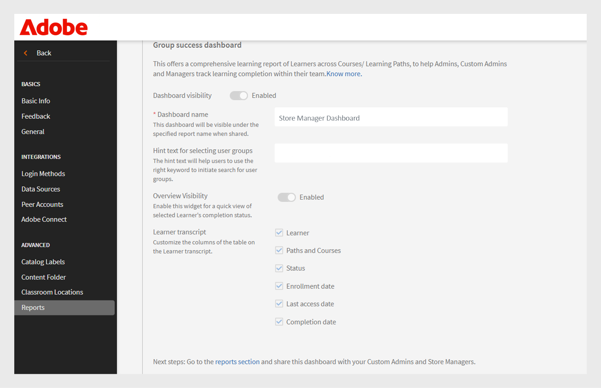
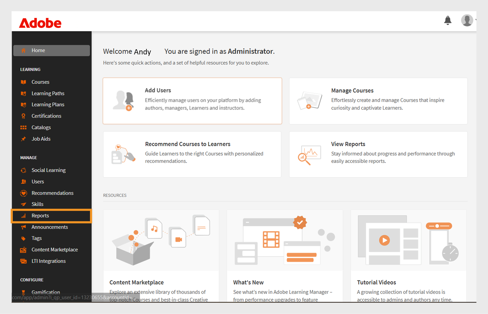
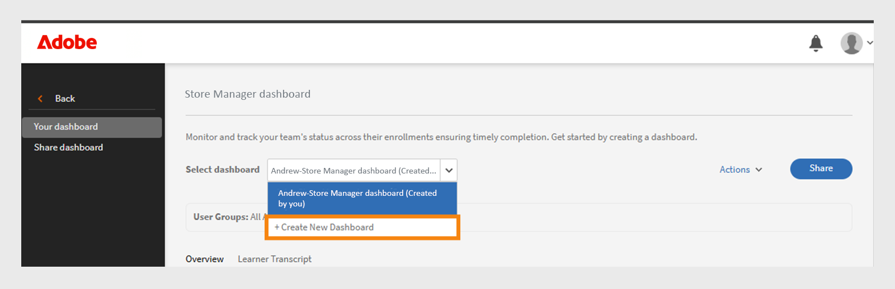
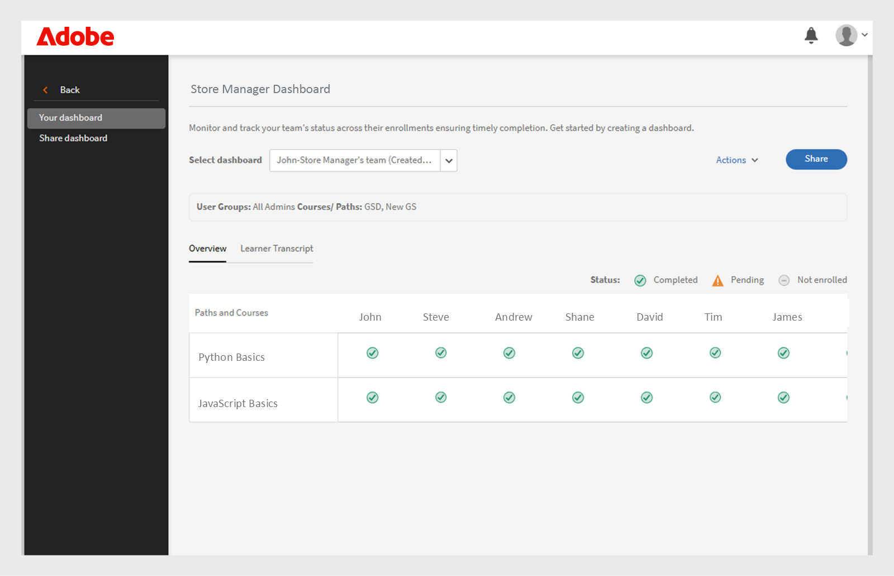

# 團體成功儀表板

## 簡介

Adobe Learning Manager 中的群組成功儀表板（GSD）讓管理員與經理能近乎即時地監控學員進度（從註冊、進度到完成到反映在儀表板上的延遲約 60 分鐘），跨部門或使用者群組。 它支援主動追蹤課程完成、註冊及待處理的行動，讓團隊的學習管理更為輕鬆。 請參閱本文[&#128279;](/help/migrated/administrators/feature-summary/add-users-user-groups.md)以了解更多關於使用者群組的資訊。

>[!NOTE]
>
>此功能在 FedRAMP 授權的環境中無法使用。 詳情請參閱 [FedRAMP 環境](/help/migrated/feature-availability-in-fedramp-authorized-environment.md) 的功能可用性。

## 主要使用案例

團體成功儀表板提供以下功能：

* **簡化學習進度追蹤**：團體成功儀表板提供使用者友善且即時的學習者資料視圖，減少對 Excel 成績單的需求。 管理者與管理者能快速查看學習者註冊與課程進度，以支援以下關鍵情境：

   * **績效評估準備度**：經理可在評核週期前評估團隊成員的課程進度。
   * **合規監控**：識別尚未完成強制訓練的學習者。
   * **團隊層級追蹤**：加盟店、門市或區域經理能確保團隊按時完成必要的學習。

* **促進團隊管理**：Group Success Dashboard 對於擁有小團隊（少於 50 人）的經理非常有用，例如門市經理、加盟經理、經銷商經理或內部團隊。 它提供團隊視圖，讓經理能快速檢查團隊是否完成了達成業務目標所需的課程。

## 如何使用團體成功儀表板

管理員可以透過命名儀表板、選擇使用者群組，以及選擇課程或學習路徑來啟用並建立這些儀表板。 儀表板可以與其他管理員或經理共享。

### 啟用群組成功儀表板

管理員必須啟用該帳號的群組成功儀表板。 要啟用群組成功儀表板，請遵循以下步驟：

1. 以管理員身份登入。
2. 選擇 **[!UICONTROL Settings]**，然後選擇 **[!UICONTROL Reports]**。
3. 選擇 **[!UICONTROL Dashboard visibility]** 切換開關。
4. 輸入儀表板名稱（例如， **[!UICONTROL Store Manager Dashboard]**）。
   
   _儀表板名稱、使用者群組及學習路徑選擇欄位_
5. 選擇 **[!UICONTROL Overview Visibility]** 啟用儀表板中的總覽區塊。 此區可查看最多50名學習者的進度。

   >[!NOTE]
   >
   >如果團隊中有超過 50 名學習者或超過 50 個學習物件，請前往 **[!UICONTROL Learner Transcript]** 分頁而非 **[!UICONTROL Overview]** 分頁。

6. 在該 **[!UICONTROL Learner Transcript]** 區塊中，選擇你想查看的必查欄位。

   * 學習者
   * 路徑與課程
   * 現況
   * 入學日期
   * 最後進入日期
   * 完工日期

啟用此功能後，管理員可在該 **[!UICONTROL Reports]** 區塊中查看群組成功儀表板。

### 建立團體成功儀表板

管理員可建立最多 100 個儀表板以檢視學習者的進度。 要建立儀表板，請依照以下步驟操作：

1. 以管理員身份登入並選擇該 **[!UICONTROL Reports]** 頁面。

   
   _在管理員首頁選擇報告_

2. 選擇群組成功儀表板。 儀表板名稱為 **[!UICONTROL Store Manager Dashboard]**。

   
   _選擇商店經理儀表板_

   >[!NOTE]
   >
   >啟用群組成功儀表板時，你設定的名稱會顯示為儀表板名稱。

3. 從「選擇儀表板」下拉選單中選擇 **[!UICONTROL Create New Dashboard]** 。

   
   _選擇建立德國牧羊犬的選項_

4. 輸入儀表板名稱。
5. 選擇一個使用者群組，讓它出現在儀表板中。
6. 搜尋課程或學習路徑，並從結果中選擇。

   
   _選擇使用者群組與課程_

7. 選擇 **[!UICONTROL Create dashboard]**。

對於較大的團隊，請在分&#x200B;**[!UICONTROL Learner Transcript]**&#x200B;頁中選擇&#x200B;**預設目錄**&#x200B;和&#x200B;**所有學習者**&#x200B;使用者群組來建立儀表板。這包含了檢視中 **[!UICONTROL Learner Transcript]** 所有課程和學習者，讓搜尋和追蹤每位學習者的進度變得更容易。

### 查看團體成功儀表板

建立儀表板後，管理員可依照以下步驟查看儀表板：

1. 以管理員身份登入。
2. 選擇， **[!UICONTROL Reports]** 然後 **[!UICONTROL Group Success Dashboard]**。
這個儀表板名稱叫做 Store Manager Dashboard。
3. 在該 **[!UICONTROL Your dashboards]** 區塊中，從 **[!UICONTROL Select dashboard]** 下拉選單選擇已建立的儀表板。
4. 儀表板分為：
   * **[!UICONTROL Overview]**&#x200B;你可以快速看到學習者在各個課程或學習路徑上的進度。 你可以同時查看最多 50 門課程或學習路徑，以及 50 位學習者。 如果你想查看特定學習者的進度，請選擇該 **[!UICONTROL Learner Transcript]** 區塊。

   
   _店經理團隊中學習者的學習狀況_

   * **[!UICONTROL Learner Transcript]**：透過選擇特定學習者或課程來查看學習進度。 在儀表板中搜尋學習者，查看他們的學習進度。 如果你用預設目錄建立儀表板並包含所有學習者，你可以搜尋任何學習者，輕鬆檢視他們的進度。

   
   _詳細的學習者成績單檢視，並附有報名與完成欄位_

>[!NOTE]
>
>要下載詳細的學習者成績單，請在標籤&#x200B;**[!UICONTROL Learner Transcript]**&#x200B;中選擇&#x200B;**[!UICONTROL Go to Report]**。

### 分享團體成功儀表板

管理員可以與其他管理員或經理共享儀表板。 請依照步驟分享儀表板：

1. 選擇， **[!UICONTROL Reports]** 然後 **[!UICONTROL Group Success Dashboard]**。 儀表板名稱為 **[!UICONTROL Store Manager Dashboard]**。
2. 選擇&#x200B;**[!UICONTROL Share]**&#x200B;**[!UICONTROL Your dashboards]**&#x200B;選項。

   
   _選擇分享按鈕_

3. 依名稱搜尋使用者或使用者群組並選擇。

   
   _與使用者或使用者群組共享儀表板_

4. 選擇 **[!UICONTROL Proceed]** 分享儀表板。

你可以在 **[!UICONTROL Reports]**&#x200B;選擇 **[!UICONTROL Group Success Dashboard]** （Store Manager Dashboard）後再選擇 **[!UICONTROL Shared dashboards]**。

_查看共用儀表板_

>[!NOTE]
>
>管理員或自訂管理員只能在管理員分享的群組成功儀表板上看到已啟用的目錄。

### 團體成功儀表板的限制

以下是群組成功儀表板的限制：

* 儀表板不支援重複憑證。
* **[!UICONTROL Last access date]**&#x200B;分頁中的&#x200B;**[!UICONTROL Learner Transcript]**&#x200B;欄位目前顯示的是學習路徑與認證的資料。課程支援計畫於未來更新中推出。

## 在多個使用者群組中選擇學習者

當您選擇多個使用者群組時，Adobe Learning Manager 會使用特定規則來決定哪些學習者要包含：

* **使用相同活動欄位**&#x200B;的使用者群組：若使用者群組使用相同欄位（例如位置），系統會包含兩個群組的所有學習者。 它結合了這些價值觀。 例如： **地點 = 班加羅爾** ，地點 **= 清奈**。 涵蓋兩個地區的學習者。
* **擁有不同活躍欄位**&#x200B;的使用者群組：若使用者群組使用不同欄位（例如位置與角色），系統僅包含符合所有條件的學習者。 例如： **地點 = 班加羅爾或金奈** ，角色 **= 經理**。 僅包含位於班加羅爾或金奈的經理學員。

**摘要：**

* 同一主動領域：學習者被結合（或邏輯）
* 不同的主動領域：學習者必須符合所有標準（以及邏輯）

這種方法能幫助你根據所選條件鎖定合適的學習者。
