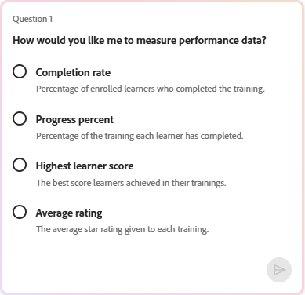

# 什麼是 Insights Agent

Insights Agent 是 Adobe Learning Manager 中的一項 AI 驅動功能，讓管理員能使用自然語言查詢學習者資料。 你不用下載報告或操作試算表，而是打個問題，例如「過去三個月帳戶創建了多少門課？ 給我每月報告。」，Insights Agent 直接取得並呈現資料。 您可以以表格形式查看結果，或下載 CSV 檔案。

Insights Agent 的設計目的是縮短從提出資料問題到獲得答案之間的步驟。 目前依賴 Excel 樞紐、商業智慧團隊或多個合併報告的管理員，可以使用 Insights Agent 更快獲得答案。

## Insights Agent 能做什麼

你可以使用 Insights Agent 來：

- 依地區、部門或使用者群組查詢完成度與合規指標
- 分析各學習課程的招生趨勢
- 查看特定課程或學習路徑的進度資料
- 可以表格或可下載 CSV 檔案的形式取得結果
- 獲得一個淺顯易懂的說明，說明你的結果是如何計算的

## Insights Agent 不支援的資料

以下資料類型不在本版本範圍內：

- 回饋與調查數據
- 遊戲化點數與徽章
- 稽核歷史與變更日誌

引用這些資料類型的查詢不會回傳結果。 例如，「上季獲得了多少遊戲化點數？」 或「哪些學習者獲得了合規徽章？」 會回傳錯誤或資料不完整。

## Insights Agent 與報表建置器的不同

這兩個功能使用相同的底層學習資料，但運作方式不同。 Insights Agent 是對話式的。 你描述你想要的東西，代理人就會拿到它。 報表建構器是結構化的。 你選擇資料集、欄位和篩選器來建立可重複使用的報表。

| **使用情境** | **推薦** |
|---|---|
| 問一個快速的數據問題 | Insights 代理 |
| 在不知道結構的情況下探索資料 | Insights 代理 |
| 建立一份結構化且可重複的報告 | 報表建置器 |
| 結合多個資料集並自訂連接 | 報表建置器 |
| 排程報告訂閱 | 報表建置器 |
| 結合資料集與自訂連接或進階資料建模 | 報表建置器 |

**重要**&#x200B;提示：Insights Agent 與報表建工具的整合計畫在未來版本中推出，目前的測試版尚未提供。

## Insights Agent 的運作方式

輸入問題時，Insights Agent 會分四個階段處理：

1. **解讀**：代理人解析你的問題，以判斷需要哪些資料。 如果問題有任何模糊之處，代理人會在繼續前先問你一個澄清性問題

2. **方法**：代理人描述找到答案所採取的步驟。 此部分有助於你驗證資料是否以預期方式取得，特別是針對複雜查詢。

3. **結果**：代理會將您的資料呈現為表格。 若結果包含50列或以下，則可包含簡明的摘要。

4. **下載**：你可以下載結果的 CSV 檔案。 大型報告可能需要額外時間;代理人會在檔案準備好時通知您。

**方法**&#x200B;部分對於複雜的查詢特別有用。它顯示代理使用的邏輯，類似 BI 分析師手動執行查詢時會解釋的邏輯。 檢視這個方法能幫助你在採取行動前確認輸出的可靠性。

## 使用 Insights Agent 提問

使用 Adobe Learning Manager 中的 Insights 代理程式查詢學習者資料，並以文字、表格或可下載的 CSV 檔案形式取得結果。

Insights Agent 可透過學習管理員的 AI 助理面板存取。 面板可以調整尺寸。 你可以擴充它，讓結果更易閱讀。 預設情況下， **開啟面板時會選擇「獲取洞察** 」模式。 另外還有一個獨立 **的學習** 模式，供使用說明產品使用問題使用。 **學習** 模式回答有關如何使用 Learning Manager 的教學問題。 例如，「我該如何建立學習路徑？」 它不會查詢學習者資料。

### 提出問題

預設 **選擇「獲取洞察** 」模式後，你可以立即開始查詢學習者資料，無需每次存取助理都調整模式。 不過，如果你在教學問題時切換到 **Learn** 模式，請務必在提交查詢前重新選擇 **「獲取洞察** 」。

1. 在學習管理員中選擇 AI 助理圖示以開啟助理面板。

2. 在模式選擇器中選擇 **「獲取洞察** 」，如果預設還沒選。   

3. 在文字欄輸入你的問題。 用淺顯的語言。 例如： **過去三個月內創建了多少門課程？**

4. 選擇 **發送** 或按 **Enter** 來提交您的問題。

### 檢視回應

提交問題後，Insights Agent 會處理您的請求並回覆最多包含四個部分：

1. **消歧義（如有需要）：** 如果你的問題包含歧義詞彙，如「學習活動」或「表現」，或「提供過去三個月的表現資料」，助理會顯示一串選項，並要求你選擇其中一項後才繼續。 選擇最符合你需求的選項。 在最初的問題之後，你就不能再輸入更多指令。 在你用查詢介面開始新查詢之前，唯一可用的互動方式是從提供的選項中選擇。 你只能透過從提供的選項中選擇來回應消歧義;本版本不提供自由文字後續。

&#x200B;2. **方法：**&#x200B;**方法**&#x200B;部分描述代理人取得資料所採取的步驟。它以可捲動的面板形式出現在問題下方。 選擇展開圖示以查看完整方法。 檢視此部分有助於確認邏輯是否符合你的意圖，尤其是對複雜查詢而言。 例如，如果你要求「所有上一年註冊的學習者」，客服人員可能會回傳每位學習者最近的一次註冊紀錄，而非所有登記紀錄。 **「方法**」部分&#x200B;**可能會**&#x200B;**或會解釋**&#x200B;這個決定。如果邏輯與你的意圖不符，就用更具體的詞彙重新查詢。

&#x200B;3. **結果：** 洞察代理以文字或表格形式產生結果。 對於最適合以表格形式解讀的資料點，Insights Agent 會回傳一個表格。 Insights 代理不會產生圖表或圖表。 要視覺化資料，請下載 CSV 並用你偏好的工具開啟。 若結果包含50列或以下，表格上方可能會附上淺顯的摘要。 例如，「哪些課程在過去一年內新增的報名人數不少於5人？作者是誰？」

回應內容包含以下摘要：

***摘要***

- *匹配球場：102*
- *註冊人數範圍：24人至2019年*
- *每門配對課程的平均註冊人數：589.6*
- *每門配對課程的中位數註冊人數：553.5*

*完整報告的下載連結將在出口完成後提供。*

**注意：** Insights Agent 是機率性的。 如果你重複執行同一個查詢，回應的措辭或結果排序可能會有些微差異。 擷取的底層資料相同，但輸出在不同次執行中可能有所不同。

### 下載報告

選擇 **下載報告** 以匯出結果為 CSV 檔案。 對於大型結果集，下載可能需要額外時間。 當檔案準備好時，代理會顯示訊息;你也會收到通知。

## 開始一個新查詢

每個 Insights Agent 會話一次處理一個問題。 檢視結果後，選擇 **新問題** 來問另一個問題。 你不能在同一場次打後續問題，也不能要求客服細化或擴充回傳的結果。

>[!TIP]
>
>如果你想探索相關資料，可以開始一個新的查詢，將你從第一個查詢中學到的內容納入其中。 例如，在查看各區域的註冊總數後，開始新的查詢以查詢同一區域的完成率。

## 提供回饋

每回答後，選擇豎起大拇指或踩的圖示來評分結果。 你也可以指定輸出是否不準確、難以理解，或是回傳時間過長。 這些回饋有助於隨著時間提升經紀人。

## 最佳實務

- 從具體的問題開始，而非廣泛的問題。 「北美用戶組安全訓練課程的完成率是多少？」比「顯示完成資料」更有用的結果。
- 在命名內容和學習者群組時，請使用精確的 Adobe Learning Manager 術語。 查詢寫作指南列出了正確的術語。
- 如果客服提出澄清性問題，就當作一個訊號，讓你可以修正原本的查詢。 你的問題越具體，所需的說明就越少。
- 在依結果採取行動前，請先檢視 **「方法** 」部分，尤其是對於準確性至關重要的合規查詢。

## 為 Insights 代理撰寫有效的查詢

您的查詢品質直接影響 Insights Agent 回傳的結果品質。 一個完善的查詢包含三個要素：上下文（內容與學習者）、範圍（狀態、時間範圍與使用者狀態）以及欄位（你想在輸出中精確輸入的欄位）。 學習如何使用正確的術語、查詢結構及範例查詢作為起點。

### 三部分查詢公式

每個有效的 Insights Agent 查詢包含以下三個組成部分：

| **組成部分** | **意義** | **範例** |
|---|---|---|
| **背景** | 你問的內容和學習者 | &quot;...新進員工入職學習路徑，針對銷售助理學員在地點101......」 |
| **範圍** | 註冊狀態、時間範圍與使用者狀態 | &quot;...已註冊但尚未完成，且在過去90天內完成者......」 |
| **柱子** | 你想放在輸出中的每個欄位 | &quot;...請顯示姓名、電子郵件、地點及報名日期」 |

缺少任何一項，會導致結果模糊，或是代理人提出澄清性問題。

### 使用正確的 ALM 術語

Insights Agent 會將您的查詢與 Adobe Learning Manager 的資料模型進行匹配。 使用錯誤的術語可能會回傳錯誤或無結果。 請使用下方左欄的術語。

| **使用這個詞** | **不是這個** |
|---|---|
| **學習路徑** | 課程/軌道/課程 |
| **河道** | 模組 / 課程 / 課程 |
| **認證** | 徽章/證書 |
| **學習者** | 學生/員工 |
| **會期** | 課程/排定日期 |
| **使用者群組** | 團隊/系所/同屆 |
| **現役領域** | 自訂欄位 / 屬性 |
| **招生情況** | 註冊/分配 |
| **完工** | 完成/完成/通過 |
| **目錄標籤** | 類別/標籤組 |

Insights Agent 不區分大小寫，但精確詞彙匹配能提升準確度。

### 錨定你的內容

每個查詢都需要一個內容錨點，讓代理人知道要查看哪些學習項目。 你可以透過以下任一方式作為錨點：

| **錨類型** | **範例** |
|---|---|
| 名稱 | &quot;...新進員工入職學習路徑」 |
| 目錄 | &quot;...所有學習路徑皆收錄於入職目錄中」 |
| 目錄標籤 | &quot;...所有目錄標籤為 Region = North」的課程 |
| 標籤 | &quot;...所有標註為合規的課程」 |
| 技巧 | &quot;...所有課程都對應到客服技能」 |
| 合規標籤 | &quot;...所有符合法規的認證」 |
| 內容類型 | &quot;...所有已出版課程」/「...所有認證」 |

### 讓你的學習者有固定的基礎

請指定哪些學習者要納入，使用以下方法之一：

- **主動現場價值** — 「學習者在活躍領域 職位 = 銷售助理」或「學習者在現場 地點 = 101」
- **使用者群組** — 「銷售助理使用者群組的學習者」
- **課程** — 「報名於6月15日職場安全課程的學員」

### 定義你的工作範圍

若沒有明確範圍，結果可能會包含錯誤的狀態、時間範圍或使用者狀態。

| **範圍類型** | **選擇權** |
|---|---|
| 招生狀況 | 已註冊/完成/未註冊/逾期 |
| 時間範圍 | 所有時間 / 過去30天 / 過去90天 / 特定日期範圍 |
| 使用者狀態 | 僅限活躍使用者（預設）/ 為非活躍用戶新增「包含已刪除使用者」 |

### 為每個輸出欄位命名

如果你沒有指定欄位，Insights Agent 會幫你選擇。 輸出中你想命名的欄位。

| **模糊** | **具體** |
|---|---|
| 「顯示地點號碼」 | 「各地點：總學習人數、註冊人數、未註冊人數」 |
| 「顯示完成率」 | 「每條學習路徑：姓名、總註冊人數、總完成人數、完成率」 |
| 「告訴我誰失敗了」 | 「顯示未完成學員姓名、電子郵件、課程名稱及完成狀態」 |

### 範例查詢

把這些當作起點。 透過替換適用於你帳號的內容名稱、用戶群組和時間範圍來調整它們。

**完工與合規**

- 「北美用戶組安全訓練課程的完成率是多少？」
- 「請依用戶群組顯示所有標示合規課程的完成率。 請包含使用者群組名稱、總註冊人數、完成總數及完成百分比。」
- 「所有學習者在職領域 職稱 = 副總裁的合規率是多少？」

**招生分析**

- 「依地點，新進員工入職學習路徑中註冊了多少學員？」
- 「顯示過去90天按地區登記的統計。 請附上地區名稱及註冊人數。」
- 「列出所有已報名但尚未完成職場安全課程的學員——包括姓名、電子郵件及報名日期。」

**課程與進度**

- 「領導力發展學習路徑的完成狀態分布如何？顯示已完成、進行中、尚未開始的計數。」
- 「上個月有多少學員完成了資料隱私課程？」

**組織觀點**

- 「顯示所有符合法規認證的完成率，依部門分組。 請提供系所名稱、總註冊人數及完成率。」
- 「過去30天各地區的入學分布如何？」

### 常見的避免錯誤

| **避免** | **改做這個吧** |
|---|---|
| 沒有內容錨點（「給我看一切」） | 請說明具體的路徑、課程、目錄、標籤或技能 |
| 模糊的指標（「為什麼完成率這麼低？」） | 問一個可衡量的問題：「哪些學習路徑的完成率低於30%，按地點劃分？」 |
| 未指定使用者狀態 | 明確新增「僅限活躍使用者」或「包含已刪除使用者」 |
| 詢問預測 | 問的是目前的數據顯示了什麼，而不是未來會發生什麼 |
| 詢問未經支持的資料（回饋、技能、徽章） | 請在報告區使用現有報告 |
| 在同一查詢中提出多個問題（「按地區顯示報名人數，並列出未完成安全訓練的人員」） | 每個查詢只問一個重點問題。 代理人可能只回答複合問題的部分，且不保證其餘部分會被回應。 |

## 發行限制

**重複認證在消歧步驟中可能會顯示多個選項**

當您查詢重複認證的資料時，Insights Agent 可能會在澄清步驟中顯示多個選項，分別對應每次認證重複，而非單一條目顯示。 選擇這些選項中的任何一項，可能會回傳錯誤或不完整的資料。 我們建議不要使用 Insights 代理來查詢重複驗證的憑證。

**屬於定期認證的課程在消歧義步驟中可能會顯示多個選項**

當您查詢與定期認證相關的課程資料時，Insights Agent 可能會在澄清步驟中顯示多個選項，分別對應跨認證週期建立的每個版本課程，而非單一條目顯示。 選擇這些選項中的任何一項，可能會回傳錯誤或不完整的資料。

**新增資料可能需要長達30分鐘才能出現在結果中**

內容建立、學習者註冊或完成紀錄更新後，這些資料可能需要長達30分鐘才能在查詢結果中取得。 如果結果顯示不完整或不反映近期活動，請等待30分鐘再嘗試查詢。

**註冊與完成資料包含直接及間接註冊**

當您查詢課程或學習路徑的註冊或完成資料時，Insights Agent 會回傳一個綜合統計，包含直接註冊（特定註冊該課程或學習路徑的學習者）及間接註冊（學生在其他學習路徑或認證中存取相同內容）。 結果並未區分這兩種入學類型。

**不支援非拉丁字母提交的查詢**

Insights Agent 支援以英語及拉丁字母語言（如法語和西班牙語）撰寫的查詢。 使用非拉丁字母（包括日文、中文、阿拉伯文、韓文、印地文和俄文）提交的查詢無法處理，客服會顯示無法完成查詢的訊息。 如果你用這些語言提交查詢，請重新開始一個查詢並改寫成英文。 未來版本可能會考慮支援更多語言。

**結果可能包含所有州的內容與學習者**

當您在 Insights Agent 查詢資料時，除非另有說明，結果可能會包含所有可用狀態的紀錄。 例如，查詢已註冊學習者的資訊可能包含候補名單上的學習者或帳號已被刪除的學習者。 查詢課程或學習路徑時，可能包含已發表及已退休的內容。 為了精煉你的結果，請在提問時包含明確的條件。 例如，指定僅限活躍用戶、排除候補學習者，或限制結果為已發表內容，以確保輸出只反映你想看到的紀錄。

