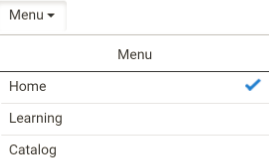

# iPad 與 Android 平板用戶

在 iPad 或 Google Nexus 9 Android 平板的學習管理應用程式中，登入學習者後，你可以看到以下 **首頁** 畫面：

*應用程式的主畫面*

要進入學習與目錄功能，請點選 **單** 下拉選單並選擇相應選項。

<!---->

## 離線存取應用程式 {#accesstheappoffline}

你可以在 iPad 和 Google Nexus 9 Android 平板上離線使用 Learning Manager 應用程式。 下載並以離線模式修課，連接網路時將內容與線上應用程式同步。

1. 點選 **最上方的選單** 下拉選單，然後點選 **學習** 選項。 所有可用球場的清單以圖塊形式顯示。
1. 點擊每個學習物件圖塊底部的下載圖示，即可下載學習內容。

   <!---->

1. 當你在線上時，應用程式頂端的欄會跳出一個提示，讓你檢查是否要同步你的內容。 如果你的答案是肯定，請點擊紅色條。 綠色條表示你的內容與線上應用程式同步。

<!--
## Track device storage {#trackdevicestorage}

You can monitor your device storage periodically.

Tap the profile icon at the upper-right corner of the app and tap **Device Storage** menu option.

An app storage information dialog appears as shown below.

Using the app storage information, you can check the total space of device, app and the downloaded courses. This information enables you to download courses accordingly. To delete the downloaded courses in the device, tap X icon adjacent to each course name.
-->
