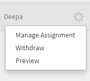
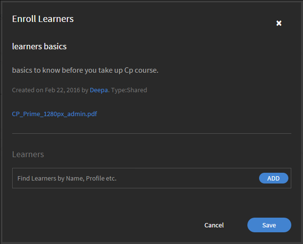

# 工作輔助

Learning Manager中的管理員工作輔助。

工作輔助是訓練內容的存放庫，可供沒有任何註冊或完成條件的學習者存取。 學習者可以參考這些工作輔助，以獲得在組織中執行任何活動或任務的協助。

工作輔助可以單獨使用，或與Learning Manager中的課程使用一起使用。

組織的管理員可以管理學習者的工作輔助指派，也可以撤回或重新發佈工作輔助。

## 撤銷/重新發佈工作輔助 {#withdrawrepublishjobaids}

在管理員登入下，按一下左窗格中的&#x200B;**[!UICONTROL Job Aids]**&#x200B;以存取工作輔助。

您可以按一下工作輔助旁邊的設定圖示並選取&#x200B;**[!UICONTROL Withdraw]**，以撤銷已發佈的工作輔助。

*管理工作輔助*

按一下「已撤銷」頁標，以檢視已撤銷的工作輔助。 您可以按一下「設定」圖示並選擇「Publish」，重新發佈已撤銷的工作。 按一下設定中的「預覽」 ，在播放器中預覽工作輔助。

## 管理工作輔助指派 {#managejobaidassignments}

1. 在「已發佈」標籤中，按一下工作輔助旁邊的設定圖示。

1. 按一下&#x200B;**[!UICONTROL Manage Assignment]**。

   **[!UICONTROL Enroll Learners]**&#x200B;快顯對話方塊隨即顯示。

   

   *檢視註冊學習者對話方塊*

1. 在&#x200B;**[!UICONTROL Learners]**&#x200B;欄位中，開始輸入學習者的名稱，然後從下拉式清單中選擇學習者。 您也可以依名稱、個人資料等資訊尋找學習者。
1. 按一下&#x200B;**[!UICONTROL Add].**
1. 按一下&#x200B;**[!UICONTROL Save]**。

## 常見問題 {#frequentlyaskedquestions}

+++如何匯出工作輔助報告？

在熒幕的右上角，按一下&#x200B;**[!UICONTROL Actions]** > **[!UICONTROL Export Report]**。

+++

+++如何管理工作輔助指派？

在&#x200B;**[!UICONTROL Published]**&#x200B;標籤中，按一下工作輔助附近的設定圖示。 新增學習者並按一下&#x200B;**[!UICONTROL Add]**。

+++

+++如何撤銷工作輔助？

在&#x200B;**[!UICONTROL Published]**&#x200B;標籤中，按一下工作輔助附近的設定圖示。 按一下&#x200B;**[!UICONTROL Withdraw]**。 「工作輔助」現在不再出現在「已發佈」標籤中。 若要檢視已撤銷的工作輔助，請按一下「已撤銷」頁標。

+++
