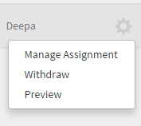

# 工作輔助工具

學習管理中為管理員提供的工作輔助工具。

工作輔助工具是一個培訓內容的資料庫，學習者無需註冊或完成標準即可取得。 學習者可以參考這些工作輔助工具，協助執行組織中的任何活動或任務。

工作輔助工具可獨立使用，或與課程共享一併使用學習管理器。

企業管理者可以管理工作輔助工具的分配給學生，並撤回或重新發布工作輔助工具。

## 撤回/重新發布工作輔助工具 {#withdrawrepublishjobaids}

在管理員登入中，點擊 **[!UICONTROL Job Aids]** 左側窗格即可存取工作輔助工具。

您可以點擊工作說明旁的設定圖示並選擇 **[!UICONTROL Withdraw]**，來撤回已發表的工作協助工具。

*管理工作輔助工具*

點擊「撤回」標籤查看已撤回的工作輔助工具。 你可以點擊設定圖示並選擇發佈，重新發布已撤回的職缺。 在設定中點擊預覽，可以在播放器中預覽工作輔助工具。

## 管理工作援助的分配 {#managejobaidassignments}

1. 在「已發佈」分頁中，點擊工作輔助工具旁的設定圖示。

1. 點擊 **[!UICONTROL Manage Assignment]**。

   **[!UICONTROL Enroll Learners]**&#x200B;彈出視窗視窗出現。

   

   *查看「註冊學習者」對話框*

1. 在 **[!UICONTROL Learners]** 現場，開始輸入學習者姓名，並從下拉選單中選擇學習者。 你也可以依照姓名、個人資料等方式查找學習者。
1. 點擊 **[!UICONTROL Add]。**
1. 點擊 **[!UICONTROL Save]**。

## 常見問題 {#frequentlyaskedquestions}

+++如何匯出工作援助報告？

在螢幕右上角，點擊 **[!UICONTROL Actions]** > **[!UICONTROL Export Report]**。

+++

+++如何管理職業輔助資料的分配？

在分頁中 **[!UICONTROL Published]** ，點擊工作說明附近的設定圖示。 新增學習器並點擊 **[!UICONTROL Add]**。

+++

+++如何撤回就業援助？

在分頁中 **[!UICONTROL Published]** ，點擊工作說明附近的設定圖示。 點擊 **[!UICONTROL Withdraw]**。 工作輔助工具現在不再出現在已發表的標籤中。 要查看已撤回的工作援助，請點擊「撤回」標籤。

+++
