# L1意見回饋表單

>[!IMPORTANT]
>
>增強的L1意見反應功能正在向特定客戶推出。 如果您的帳戶中沒有看到此功能，請檢視[新增L1與L3意見回饋](/help/migrated/administrators/feature-summary/courses.md#add-l1-and-l3-feedback)，以取得現有意見回饋功能的詳細資訊。
>
>請聯絡您的客戶成功經理(CSM)團隊以啟用新的意見系統，並瞭解移轉時間表。

Adobe Learning Manager的第1級(L1)意見反應功能可讓學習者在完成課程或學習路徑後，分享他們的意見反應。 此意見回饋意見可協助管理員評估課程品質、講師成效和整體學習體驗。

管理員現在可以建立和管理多個可重複使用的意見表單，並將其指派給特定課程和學習路徑。

此功能可讓管理員：

* 建立可重複使用的意見表單
* 自訂不同課程或學習路徑的意見回饋
* 視需要指派量身打造的表單

**[!UICONTROL L1 Feedback Report]**&#x200B;和&#x200B;**[!UICONTROL Feedback Report]** （自訂報告）現在包含兩個新欄：意見表單名稱和意見版本。 這些欄提供使用的意見回饋表單的詳細資料。

## 建立L1意見反應表單

管理員可以在帳戶層級建立多個L1意見表單，並將正確的表單指派給課程、學習路徑或認證。

若要建立L1意見反應表單：

1. 以管理員身分登入Adobe Learning Manager。
2. 選取&#x200B;**[!UICONTROL Feedback forms]**。

   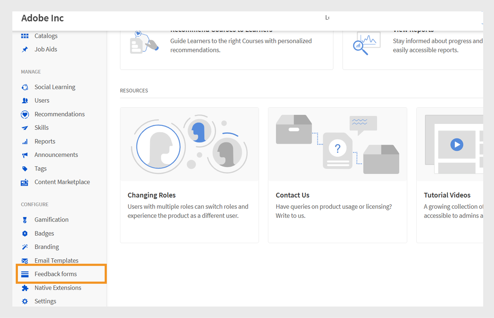
   _顯示意見表單選項的管理員首頁，用以建立和管理意見表單_
3. 選取&#x200B;**[!UICONTROL Add form]**。

   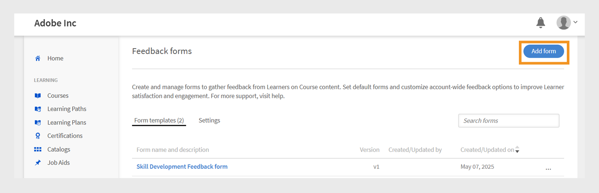
   _意見表單畫面顯示[新增表單]按鈕以建立意見表單_
4. 選擇&#x200B;**[!UICONTROL Default template language]**，然後選取&#x200B;**[!UICONTROL Save]**。

   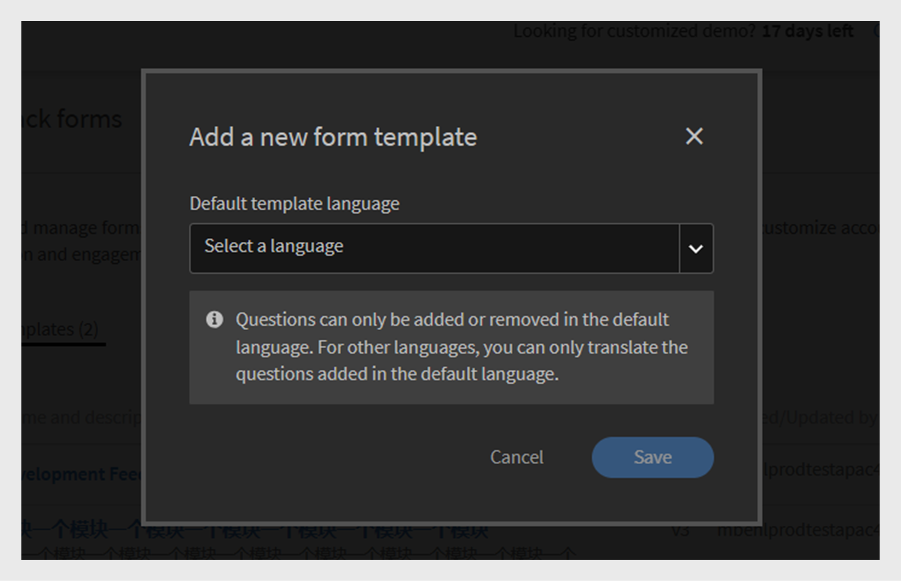
   _新增範本提示以顯示選取預設語言的選項_
5. 輸入表單標題和說明。

   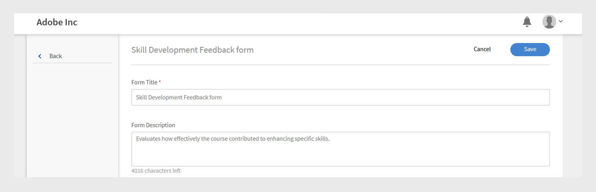
   _新增意見表單頁面顯示選項，輸入表單標題和表單說明_
6. 從&#x200B;**[!UICONTROL Add Question]**&#x200B;功能表，從下列選項選取問題型別：

   a. **[!UICONTROL Free Text]**：允許學習者以自己的文字提供答案。

   * 在&#x200B;**[!UICONTROL Question]**&#x200B;文字欄位中輸入您的問題。
   * 若要讓問題成為必要問題，請選取&#x200B;**[!UICONTROL Mandatory]**切換按鈕。
     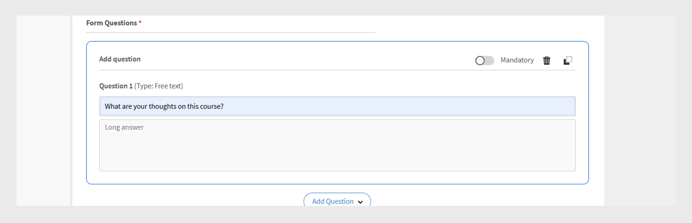
     _新增自由文字問題到意見回饋表單_

   b. **[!UICONTROL Numerical Scale/NPS]**：學習者可使用數值刻度（通常為1至10）來評定其課程滿意度或建議課程的可能性。

   * 在&#x200B;**[!UICONTROL Question]**&#x200B;文字欄位中輸入您的問題。
   * 選取評等範圍（1至10）。
   * 若要讓問題成為必要問題，請選取&#x200B;**[!UICONTROL Mandatory]**切換按鈕。
     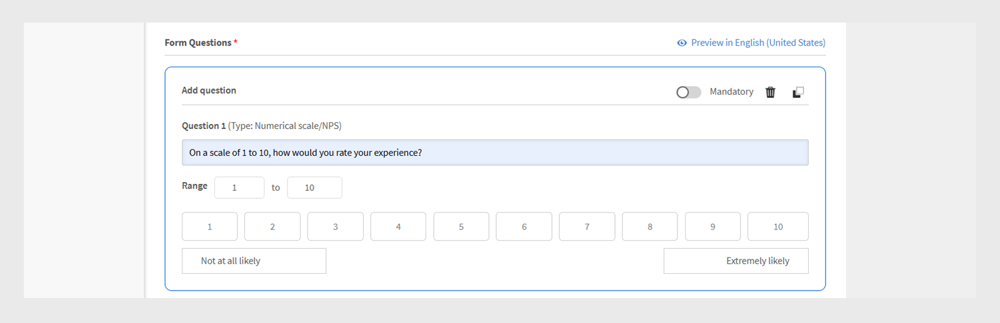\
     _在意見表單中新增數值/NPS比例問題_

   c. **[!UICONTROL Likert Scale]**：學習者可以指定他們同意陳述的程度，從「強烈不同意」到「強烈同意」。

   * 在&#x200B;**[!UICONTROL Question]**&#x200B;文字欄位中輸入您的問題。
   * 若要讓問題成為必要問題，請選取&#x200B;**[!UICONTROL Mandatory]**切換按鈕。
     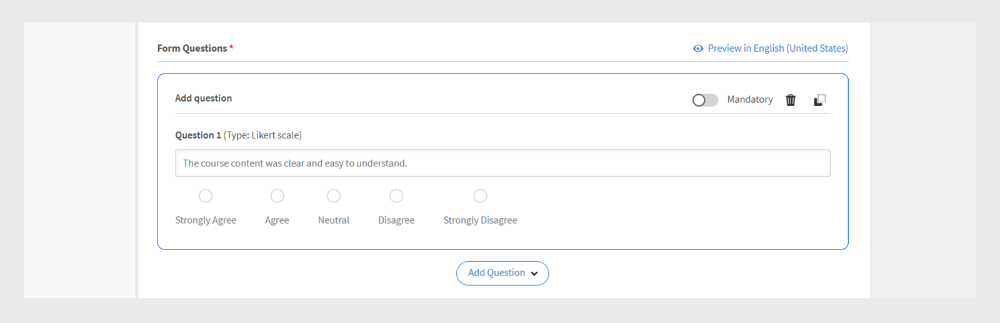
     _在意見表單中新增李克特量表問題_

   d. **[!UICONTROL Course Effectiveness Score]**：使用相對評等系統，測量課程對學習者之影響的量度。

   * 預先定義的問題（李克特量表從1到10）將新增到意見回饋表單中。
   * 您只能新增一個&#x200B;**[!UICONTROL Course Effectiveness Score]**問題，且無法編輯
     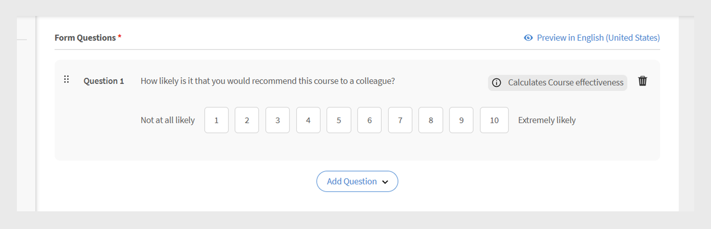
     _將課程效果分數問題新增至意見表單_
7. 選取&#x200B;**[!UICONTROL Save]**。 您可以在意見反應Forms區段中檢視建立的表單。

### 預覽意見反應表單

您可以選取「以英文（美國）預覽」來預覽意見表單。 如果您已使用多種語言建立表單，則也可以使用每種個別語言預覽表單。 檢視此[區段](/help/migrated/administrators/feature-summary/l1-feedback-form.md#add-feedback-forms-in-other-languages)，瞭解如何以其他語言新增意見表單。

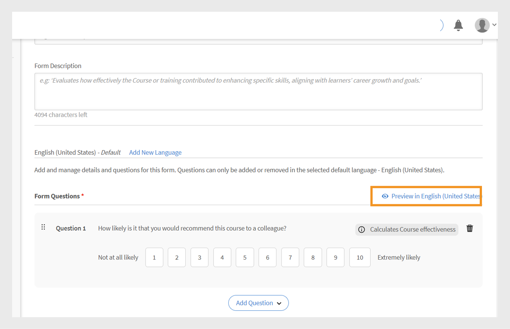
_意見表單畫面顯示[預覽]選項，以檢視預設語言的意見表單_

### 新增其他語言的意見表單

建立多種語言意見回饋表單中問題的翻譯。 不過，您只能新增或移除預設語言的問題（例如英文）。 對於其他語言，您只能翻譯最初以預設語言新增的問題。 無法直接在翻譯版本中新增或移除問題。

1. 在意見回饋表單中選取&#x200B;**[!UICONTROL Add New Language]**。

   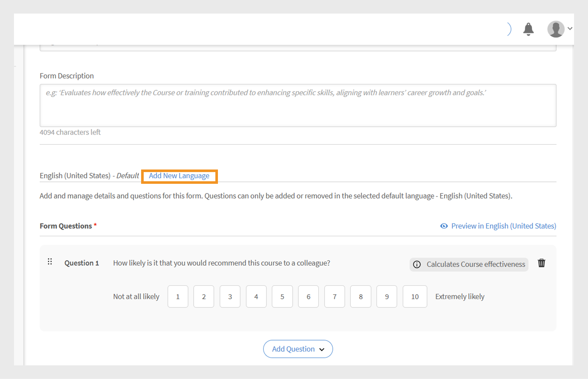
   _新增語言版本至意見表單_
2. 選擇所要的語言並選取&#x200B;**[!UICONTROL Save]**。
3. 導覽至您新增的語言標籤。
4. 選取每個問題旁的&#x200B;**[!UICONTROL Translate]**&#x200B;以新增您的翻譯。

   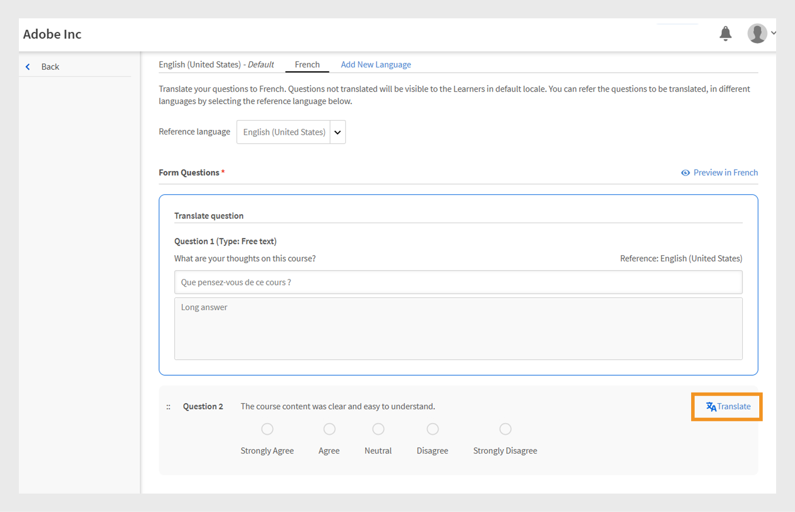
   _顯示[翻譯]選項的意見表單畫面，可將問題翻譯成個別語言_

   >[!NOTE]
   >
   >課程效果分數問題會自動翻譯。

5. 新增翻譯之後，請選取&#x200B;**[!UICONTROL Save]**。

## 將意見回饋表單設定為預設

管理員可為自學、教室、虛擬教室和混合式課程建立預設意見表單。 設定預設表單後，該表單會自動套用至所有新建立的課程。 學習者完成任何課程後都會看到此表單。 如有需要，管理員可以選擇為特定課程指派不同的意見表單。

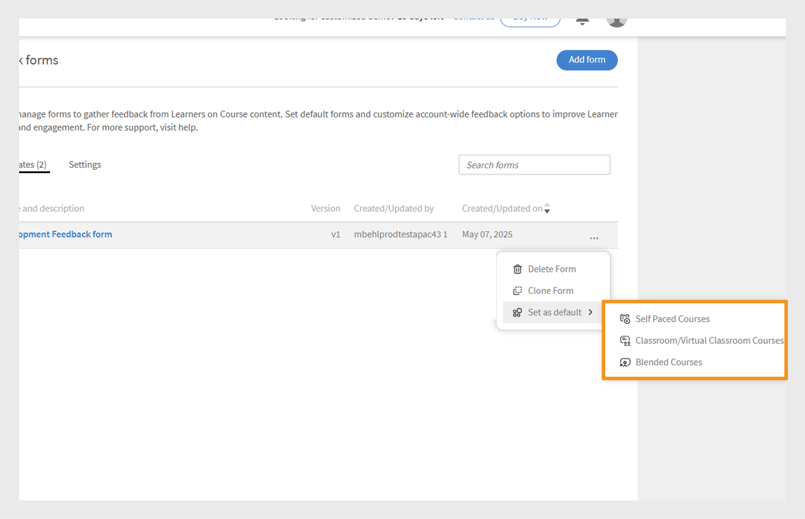
_意見表單畫面顯示選項，用來設定預設意見表單_

## 設定學習者意見反應設定

管理員可在學習者意見回饋區段中設定下列設定：

* **[!UICONTROL Enable form to capture learners' feedback for this Course]**：啟用此選項以收集課程學習者的意見回饋。 啟用後，系統會提示學習者在完成課程後提供意見回饋。
* **[!UICONTROL Form setting]**：啟用時，意見回饋表單會在學習者完成課程後立即自動開啟，讓即時收集意見回饋變得更輕鬆。

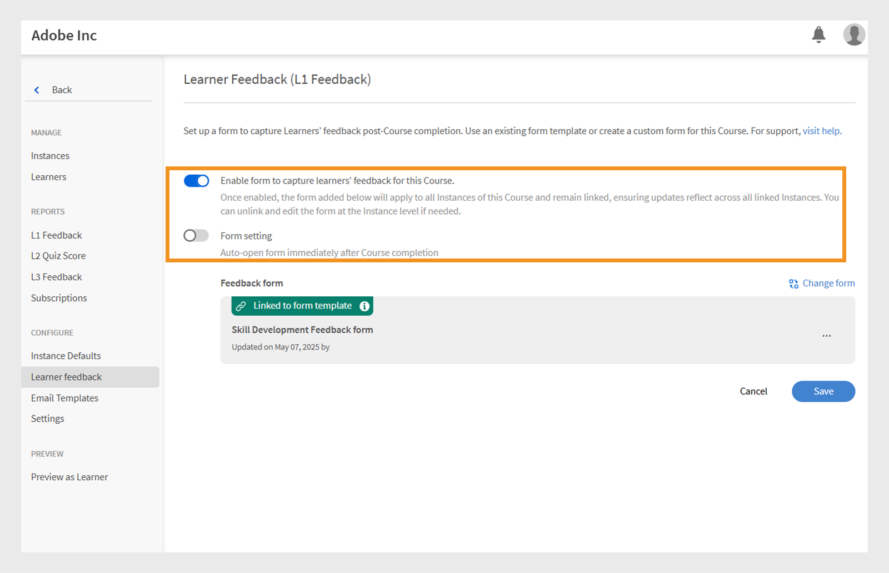
_顯示學習者意見設定的學習者意見回饋畫面_

>[!NOTE]
>
>課程例項使用課程層級的預設意見回饋表單。 當您建立新執行個體時，也會使用課程層級的預設表單，而不是帳戶層級。

### 變更課程的預設意見回饋表單

預設意見回饋表單適用於所有課程。 作為管理員，您可以建立新表單或從現有清單中選擇一個表單。 若要變更預設意見回饋表單，此課程必須啟用學習者意見回饋。

若要變更預設意見反應表單：

1. 在管理員首頁上選取&#x200B;**[!UICONTROL Courses]**。
2. 在&#x200B;**[!UICONTROL Course]**&#x200B;區段上選取任何課程。
3. 選取&#x200B;**[!UICONTROL View Course]**，然後選取&#x200B;**[!UICONTROL Learner feedback]**。

   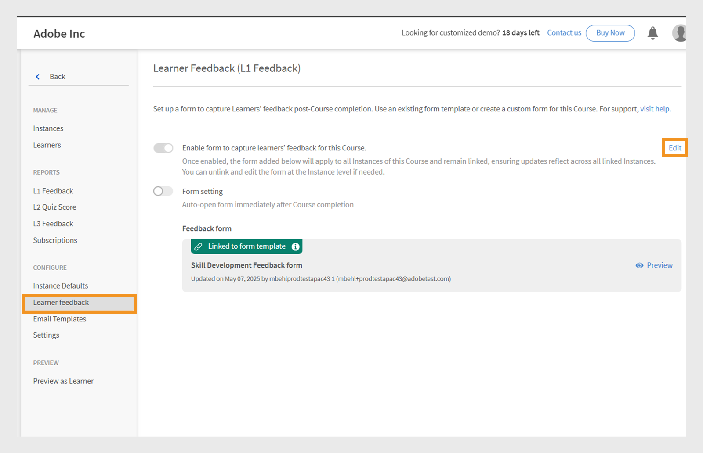
   _學習者意見回饋畫面顯示[編輯]選項以變更表單_
4. 在&#x200B;**[!UICONTROL Edit]**&#x200B;區段中選取&#x200B;**[!UICONTROL Learner feedback]**。
5. 選取&#x200B;**[!UICONTROL Change form]**。

   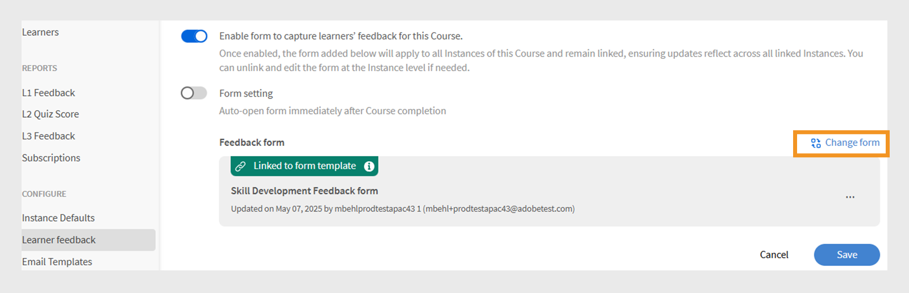
   _學習者意見回饋畫面顯示[變更表單]選項，以變更課程的意見回饋表單_
6. 從功能表中選擇其他意見表單，或選取&#x200B;**[!UICONTROL Start with a blank form]**&#x200B;以建立新的意見表單。

   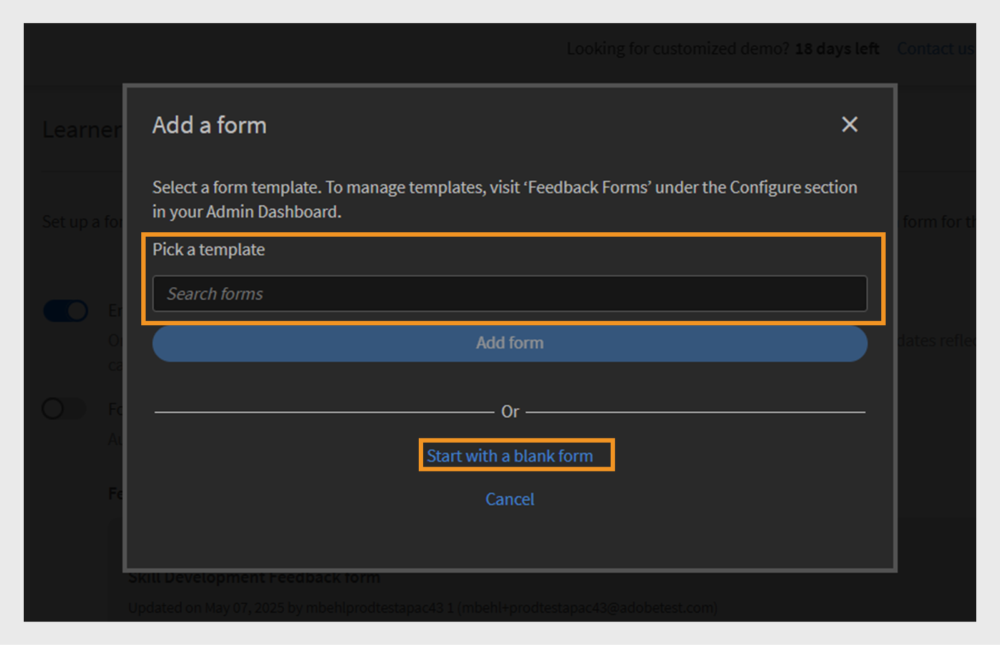
   _新增表單畫面，顯示從可用範本選取或建立新表單的選項_
7. 選取&#x200B;**[!UICONTROL Save]**&#x200B;以套用您的變更。

如果課程使用預設意見表單，且在帳戶層級更新預設表單，則所有此類課程會自動反映新表單。 但是，如果管理員變更表單或在課程層級指派新表單，則預設表單的未來變更將不會影響該課程的意見表單。

執行個體會使用課程層級的意見回饋表單作為預設值。 如果管理員在課程層級變更意見表單，則不會影響已在執行個體層級設定的表單。 不過，任何在變更後建立的新執行個體，預設都會使用更新的課程層級意見表單。

請依照相同步驟變更學習路徑的預設意見表單。

>[!NOTE]
>
>如果您不變更表單，課程將使用預設的意見回饋表單。

