# L1 反饋形式

>[!IMPORTANT]
>
>強化版的 L1 回饋功能正逐步推送到特定客戶。 如果你在帳號中沒有看到這個功能，請參閱 [「新增 L1 和 L3 回饋](/help/migrated/administrators/feature-summary/courses.md#add-l1-and-l3-feedback) 」以獲得更多現有回饋功能的資訊。
>
>請聯絡您的客戶成功經理（CSM）團隊，啟用新的回饋系統並了解遷移時間表。

Adobe Learning Manager 中的第一級（L1）回饋功能允許學習者在完成課程或學習路徑後分享回饋。 這些回饋有助於管理者評估課程品質、教師效能及整體學習體驗。

管理員現在可以建立和管理多個可重複使用的回饋表單，並將其指派到特定課程和學習路徑。

此功能提供更靈活的操作，允許管理員：

* 建立可重複使用的回饋表單
* 針對不同課程或學習路徑自訂回饋
* 根據需要分配客製化表格

**[!UICONTROL L1 Feedback Report]**&#x200B;與&#x200B;**[!UICONTROL Feedback Report]**（自訂報告）現在新增兩個欄位：回饋表單名稱與回饋版本。這些欄位提供所使用的回饋表單細節。

>[!NOTE]
>
>此功能—— **L1 回饋報告** ——在 FedRAMP 授權的環境中無法使用。 詳情請參閱 [FedRAMP 環境](/help/migrated/feature-availability-in-fedramp-authorized-environment.md) 的功能可用性。

## 建立 L1 回饋表單

管理員可以在帳號層級建立多個 L1 回饋表單，並為課程、學習路徑或認證指派合適的表單。

要建立 L1 回饋表單：

1. 以管理員身份登入 Adobe Learning Manager。
2. 選擇 **[!UICONTROL Feedback forms]**。

   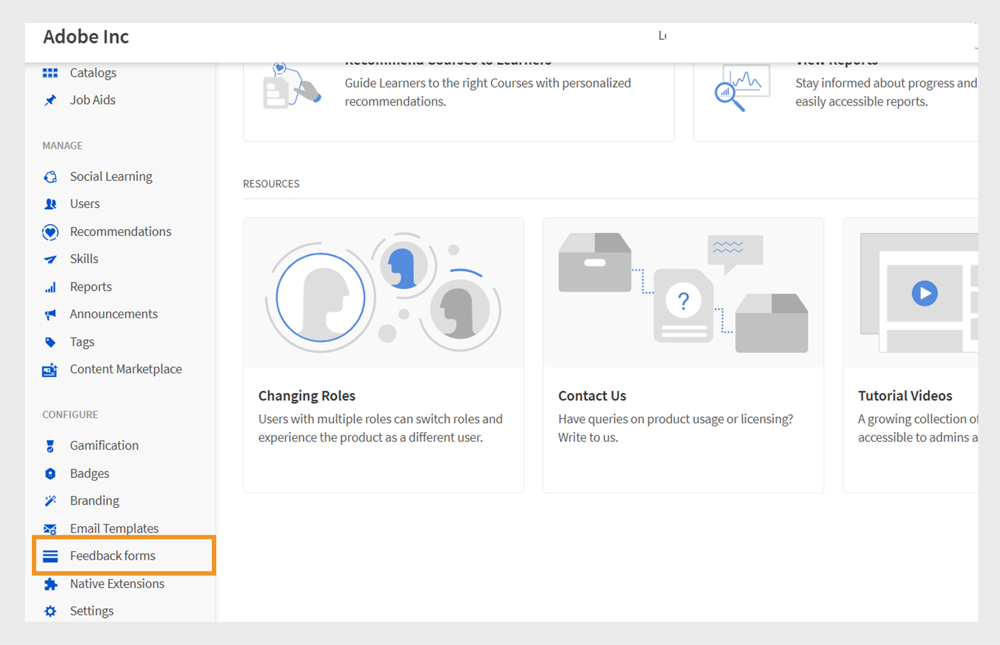
   _管理員首頁顯示回饋表單選項以建立和管理回饋表單_
3. 選擇 **[!UICONTROL Add form]**。

   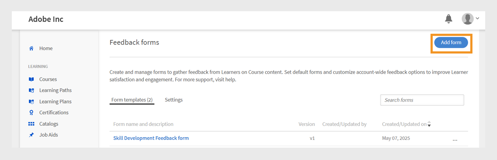
   _回饋表單畫面顯示新增表單以建立回饋表單_
4. 選擇 **[!UICONTROL Default template language]**，然後選擇 **[!UICONTROL Save]**。

   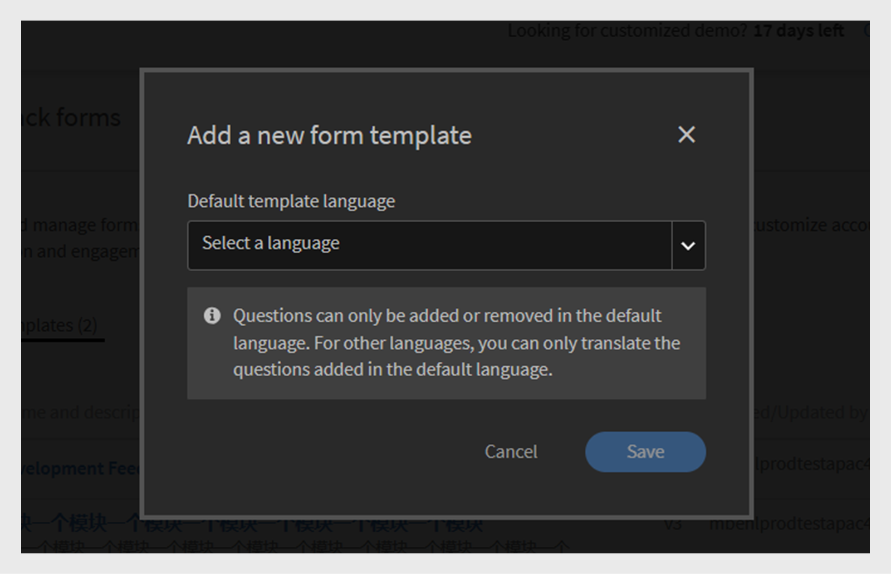
   _新增一個範本提示，顯示選擇預設語言的選項_
5. 請輸入表單標題與描述。

   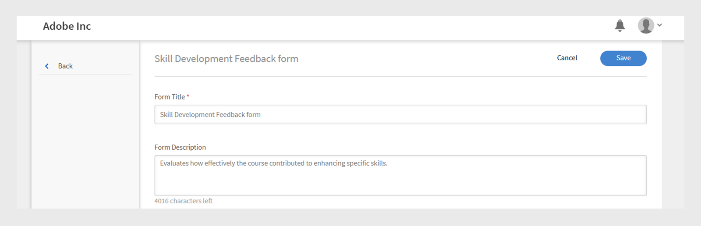
   _新增回饋表單頁面，顯示選項，輸入表單標題與表單說明_
6. 在 **[!UICONTROL Add Question]** 選單中，請從以下題型中選擇：

   a. **[!UICONTROL Free Text]**：允許學習者用自己的話提供答案。

   * 在文字欄輸入你的問題 **[!UICONTROL Question]** 。
   * 要將問題設為強制性，請選擇 **[!UICONTROL Mandatory]** 切換開關。
     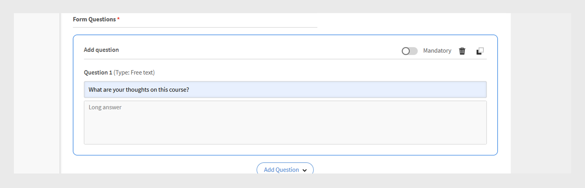
     _在回饋表單中新增一個自由文字問題_

   b. **[!UICONTROL Numerical Scale/NPS]**：學習者可使用數值量表（通常為1到10）評估課程滿意度或推薦該課程的可能性。

   * 在文字欄輸入你的問題 **[!UICONTROL Question]** 。
   * 選擇評分範圍（1到10）。
   * 要將問題設為強制性，請選擇 **[!UICONTROL Mandatory]** 切換開關。
     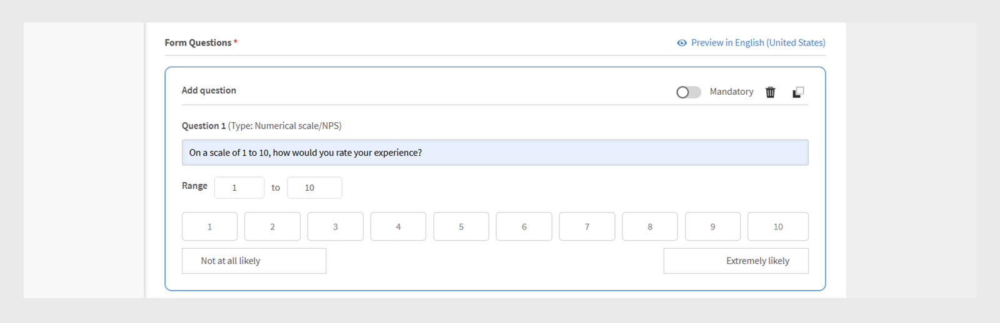\
     _在回饋表單中加入一個數值/NPS 量表問題_

   c. **[!UICONTROL Likert Scale]**&#x200B;學習者可以指定他們同意某個陳述的程度，從強烈不同意到強烈同意。

   * 在文字欄輸入你的問題 **[!UICONTROL Question]** 。
   * 要將問題設為強制性，請選擇 **[!UICONTROL Mandatory]** 切換開關。
     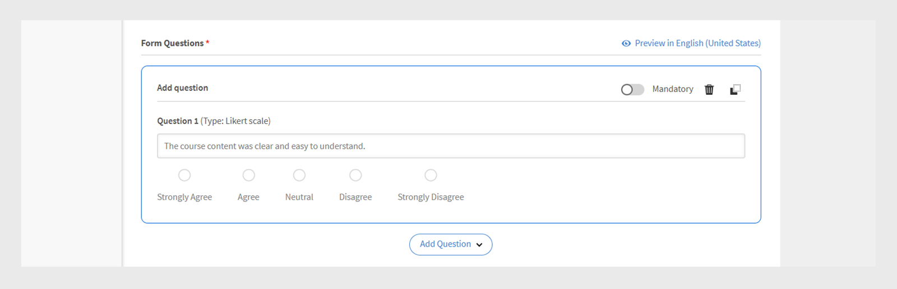
     _在回饋表單中加入李克特量表問題_

   d. **[!UICONTROL Course Effectiveness Score]**：一個用相對評分系統衡量課程對學習者影響效果的量表。

   * 回饋表單中會加入一個預設問題，李克特量表為1到10分。
   * 你只能新增一個 **[!UICONTROL Course Effectiveness Score]** 問題，且無法編輯
     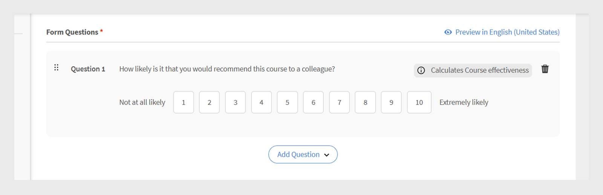
     _將課程效能分數問題加入回饋表單_
7. 選擇 **[!UICONTROL Save]**。 您可以在回饋表單區查看已建立的表單。

### 預覽回饋表單

您可以選擇「預覽英文（美國）」來預覽回饋表單。 如果你已經用多種語言建立表單，也可以預覽各自語言的表單。 請參閱本 [節](/help/migrated/administrators/feature-summary/l1-feedback-form.md#add-feedback-forms-in-other-languages) ，了解如何新增其他語言的回饋表單。

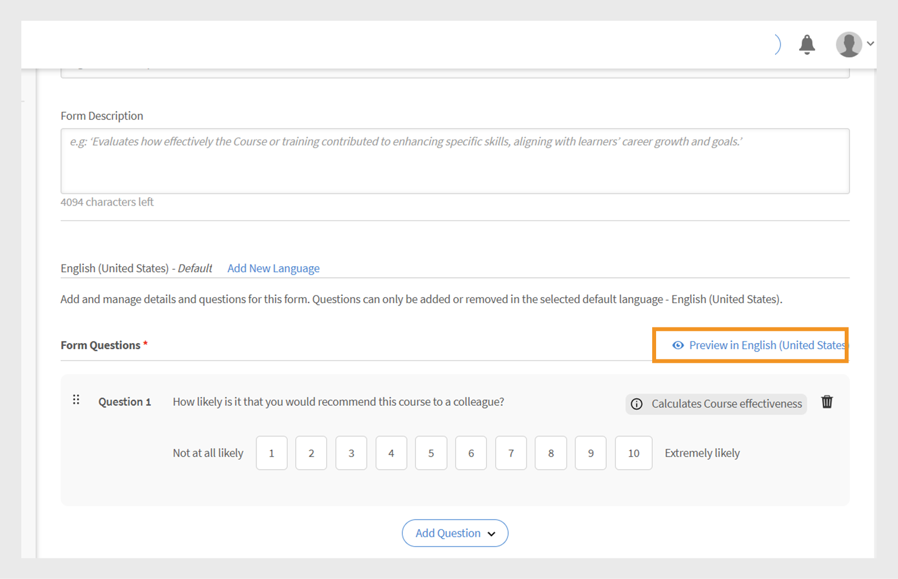
_回饋表單畫面顯示預覽選項，可以預設語言查看回饋表單_

### 新增其他語言的回饋表單

在回饋表單中為問題製作多種語言的翻譯。 不過，你只能用預設語言（例如英文）新增或刪除問題。 其他語言只能翻譯原本預設語言中新增的問題。 翻譯版本無法直接新增或刪除問題。

1. 在回饋表單中選擇 **[!UICONTROL Add New Language]** 。

   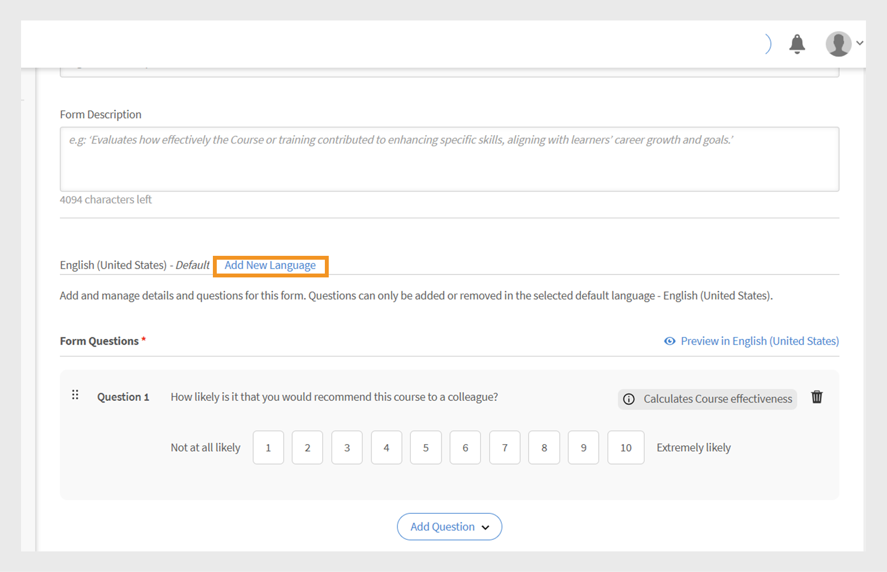
   _在回饋表單中新增語言版本_
2. 選擇所需的語言並選擇 **[!UICONTROL Save]**。
3. 請前往你新增的語言分頁。
4. 在每個問題旁邊選擇 **[!UICONTROL Translate]** 加入你的翻譯。

   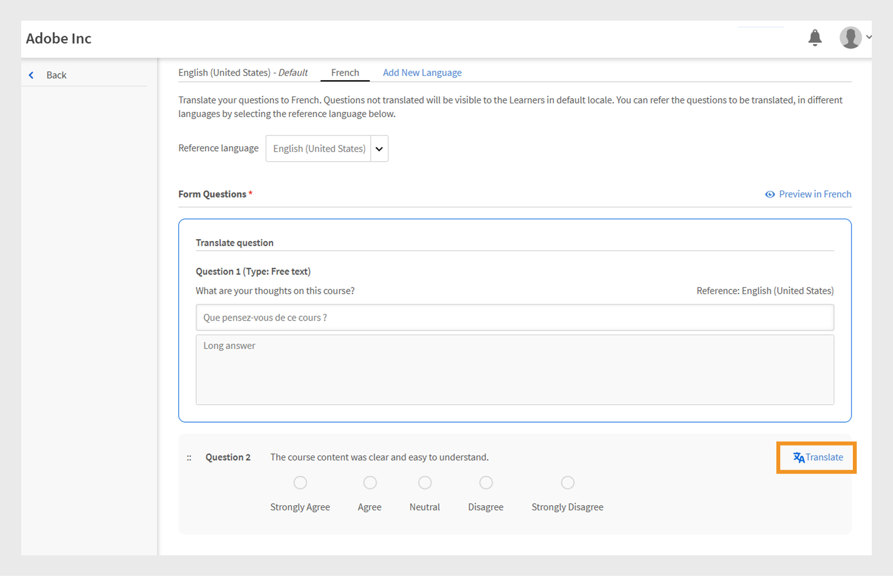
   _回饋表單畫面顯示翻譯選項，將問題翻譯成相應語言_

   >[!NOTE]
   >
   >課程效能分數問題會自動轉換。

5. 加入翻譯後，選擇 **[!UICONTROL Save]**。

## 預設設置回饋表單

管理員可為自學、課堂、虛擬課堂及混合課程建立預設回饋表單。 一旦預設表單建立，該表單會自動套用到所有新建立的課程。 學習者完成任何課程後，都會看到此表格。 管理員可選擇針對特定課程分配不同的回饋表單。

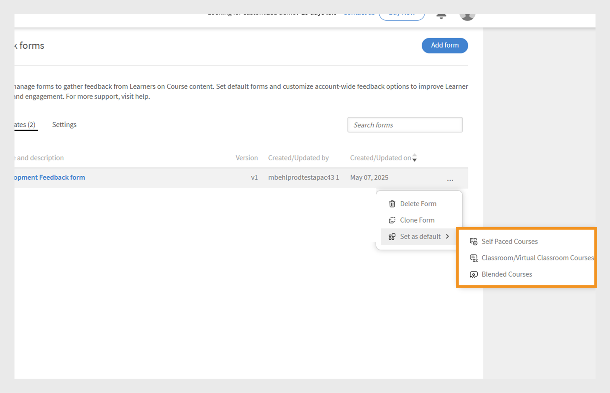
_回饋表單畫面顯示選項，可設定預設回饋表單_

## 設定學習者回饋設定

管理員可在學習者回饋區段設定以下設定：

* **[!UICONTROL Enable form to capture learners' feedback for this Course]**：啟用此選項以收集學習者對課程的回饋。 啟用後，學習者完成課程後會被提示提供回饋。
* **[!UICONTROL Form setting]**&#x200B;啟用後，回饋表單會在學習者完成課程後立即自動開啟，方便及時收集回饋。

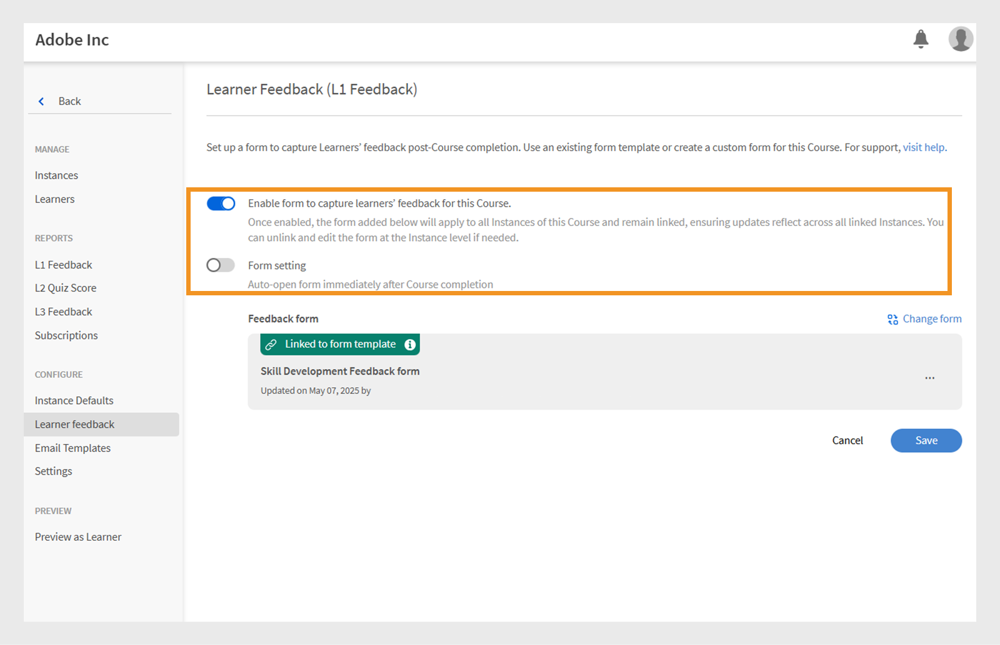
_學習者回饋畫面顯示學習者回饋設定_

>[!NOTE]
>
>課程實例使用課程層級的預設回饋表單。 當你建立新實例時，它們也會使用課程層級的預設表單，而不是帳號層級。

### 更改課程的預設回饋形式

預設的回饋表單適用於所有課程。 作為管理員，你可以建立新表單，或從現有清單中選擇一個。 若要更改預設的回饋表單，必須啟用學習者回饋功能。

要更改預設回饋表單：

1. 請在管理員首頁選擇 **[!UICONTROL Courses]** 。
2. 選擇該 **[!UICONTROL Course]** 區段中任一課程。
3. 選擇 **[!UICONTROL View Course]**，再選擇 **[!UICONTROL Learner feedback]**。

   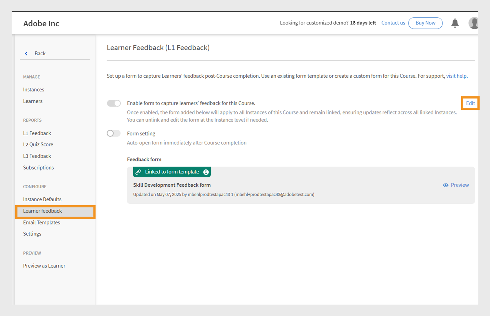
   _學習者回饋畫面顯示修改表單的編輯選項_
4. 在該&#x200B;**[!UICONTROL Learner feedback]**&#x200B;區段選擇&#x200B;**[!UICONTROL Edit]**。
5. 選擇 **[!UICONTROL Change form]**。

   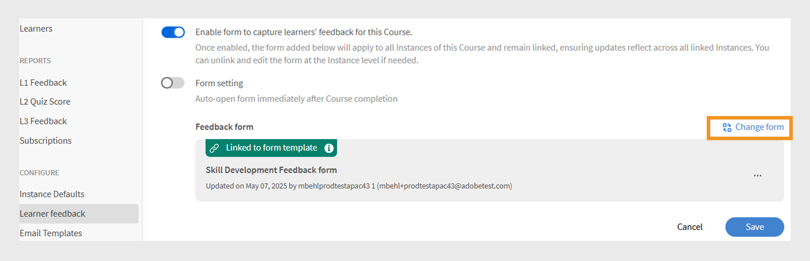
   _學習者回饋畫面顯示「變更表單」選項，以更改課程的回饋表單_
6. 從選單中選擇其他回饋表單，或選擇 **[!UICONTROL Start with a blank form]** 建立新的。

   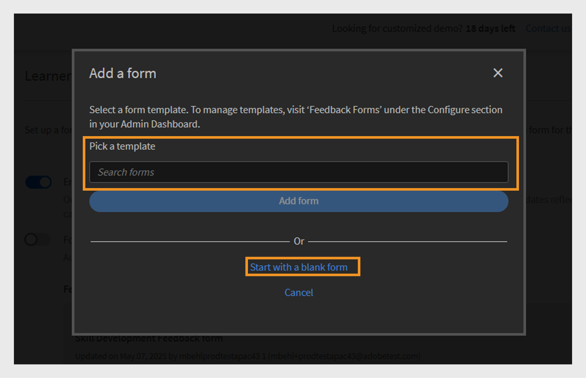
   _新增表單畫面，顯示可從可用範本中選擇或建立新表單的選項_
7. 選擇 **[!UICONTROL Save]** 套用您的變更。

如果課程使用預設回饋表單，且預設表單在帳號層級更新，所有此類課程都會自動反映新表單。 然而，若管理員更改表單或在課程層級指派新表單，未來對預設表單的變更不會影響該課程的回饋表單。

該實例會預設使用課程層級的回饋表單。 若管理員在課程層級更改回饋表單，不會影響實例層級已設定的表單。 然而，變更後新建立的任何實例，預設都會使用更新後的課程層級回饋表單。

依照相同步驟更改學習路徑的預設回饋表單。

>[!NOTE]
>
>如果你不更改表格，課程會使用預設的回饋表單。
