# 學習者成績單

下載學習者成績單並使用Learning Manager管理報告。

Adobe Learning Manager可讓組織的管理員產生與學習者相關的成績單。

## 產生學習者成績單 {#generatelearnertranscripts}

1. 若要產生學習者成績單，請按一下[管理員登入]左窗格中的&#x200B;**[!UICONTROL Reports]**。

   管理員導覽至&#x200B;**[!UICONTROL Reports]**&#x200B;頁面內的&#x200B;**[!UICONTROL Custom Reports]** > **[!UICONTROL Excel Reports]**&#x200B;標籤。

1. 按一下連結&#x200B;**[!UICONTROL Learner Transcripts]**。

   **[!UICONTROL Learner Transcript]**&#x200B;歷程記錄頁面會顯示訊息 — **尚未產生學習者成績單**&#x200B;或已在學習成績單歷程記錄頁面實作後觸發的下載清單。

   <!---->

   學習者成績單對話方塊隨即出現。 選擇您需要產生成績單的日期範圍。

   >[!NOTE]
   >
   >依預設，開始日期是學習者的註冊日期，結束日期永遠是目前的日期。 當您需要資料時，您只能修改開始日期。

1. 從&#x200B;**[!UICONTROL Select Learners]**&#x200B;欄位中選擇學習者名稱，然後按一下&#x200B;**[!UICONTROL Generate].**
1. 您可以選擇單一學習者或學習者群組。 若要新增多個學習者，請按一下&#x200B;**[!UICONTROL Add More Learners]**。

   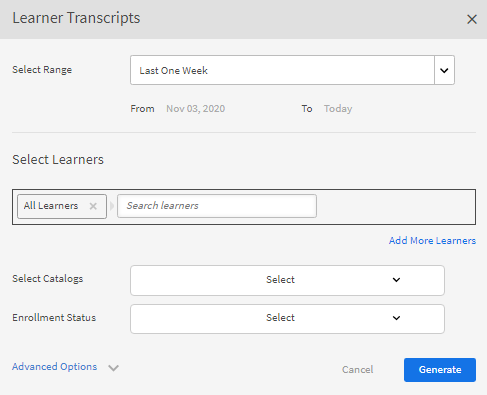

   *新增更多學習者*

1. 您可以啟用核取方塊來選擇特定目錄。 僅下載指定目錄的成績單。 您可以從&#x200B;**[!UICONTROL Select Catalogs]**&#x200B;下拉式清單中選取目錄，以選取特定目錄。

   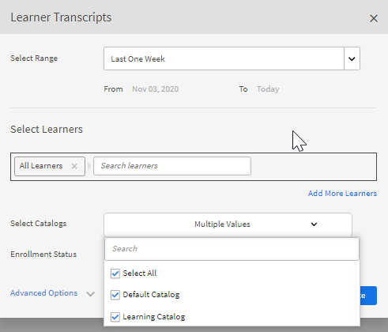

1. 匯出學習者成績單時，有一個選項&#x200B;**[!UICONTROL Enrollment Status]**。 此下拉式清單包含下列選項：

   * 全選
   * 已完成
   * 進行中
   * 尚未開始
   * 已取消註冊

   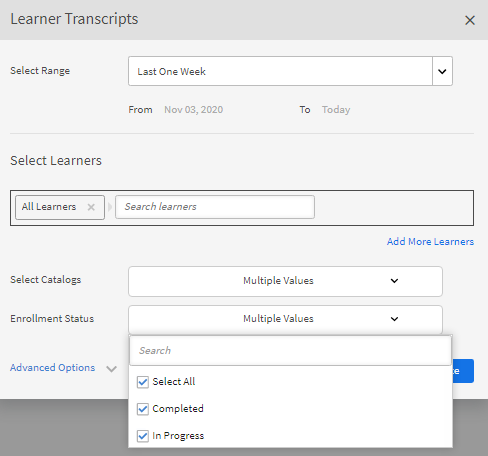

   *選取目錄*

1. 您也可以下載已從帳戶中刪除的學習者成績單。

   若要下載已刪除使用者的學習者成績單，請按一下&#x200B;**[!UICONTROL Advanced Options]**&#x200B;箭頭，並啟用核取方塊&#x200B;**[!UICONTROL Include data of Deleted Learners]**。

   

   *下載已刪除學習者的學習者成績單*

1. 您可以啟用&quot;**[!UICONTROL Enable module level information]**&quot;核取方塊，選擇在學習者成績單中下載模組層級資訊。 在這種情況下，如果啟用此選項，系統會將模組名稱和每個模組逗留時間擷取為成績單的一部分。
1. 您可以透過啟用選項&quot;**[!UICONTROL Include skills data and summary sheets]**&quot;核取方塊來選擇下載技能資料和摘要表。

   成績單會在未包含技能資料時產生，並以.zip檔案下載到您的電腦。 如果「技能資料」核取方塊已啟用，則會產生並下載轉錄的.xls檔案。

## 使用複製貼上產生學習者成績單

擷取學習者成績單變得繁瑣的程式，因為一次只能為學習者或使用者群組取得一個。 在這裡，您可以使用複製貼上功能來複製學習者電子郵件ID清單，並一次貼上。

1. 以&#x200B;**[!UICONTROL Administrator]**&#x200B;或&#x200B;**[!UICONTROL Manager]**&#x200B;登入。
1. 移至&#x200B;**[!UICONTROL Manage]**&#x200B;下的&#x200B;**[!UICONTROL Reports]**，其載入&#x200B;**[!UICONTROL User Activity]**&#x200B;頁面。
1. 按一下左窗格中的&#x200B;**[!UICONTROL Custom Reports]**，然後從清單中選取&#x200B;**[!UICONTROL Learner Transcripts]**。
1. 在&#x200B;**[!UICONTROL Learner Transcripts]**&#x200B;頁面上，按一下左上角的&#x200B;**[!UICONTROL Generate New]**&#x200B;按鈕。
1. 從&#x200B;**[!UICONTROL Select date range]**&#x200B;下拉式清單中按一下，以選取偏好的日期。 按一下「**[!UICONTROL Email IDs]**」索引標籤，以輸入複製的不重複電子郵件ID清單。

   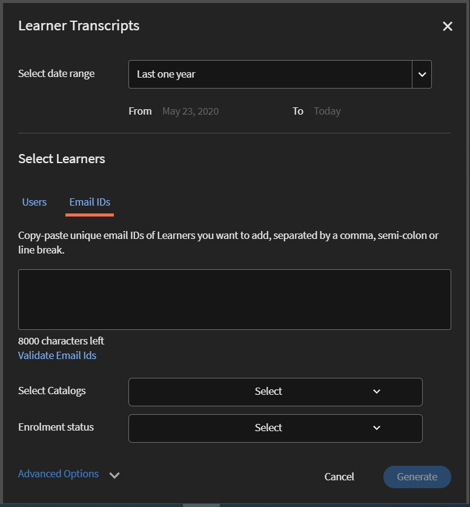

   *複製並貼上電子郵件ID*

1. 使用&#x200B;**[!UICONTROL Validate Email Ids]**&#x200B;驗證輸入的識別碼是否正確。

   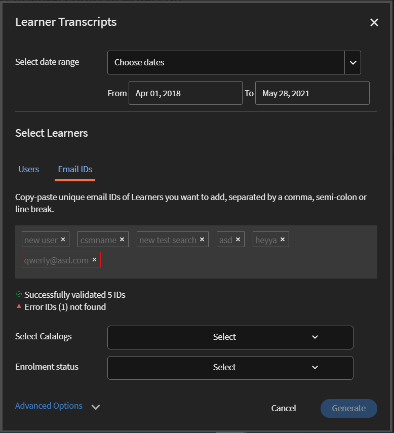

   *驗證電子郵件ID*

   如果輸入的電子郵件ID不正確，則會以紅色醒目提示，同時顯示如上所述的驗證訊息。

   除非輸入的所有電子郵件ID都正確，否則無法使用&#x200B;**[!UICONTROL Generate]**&#x200B;按鈕。

   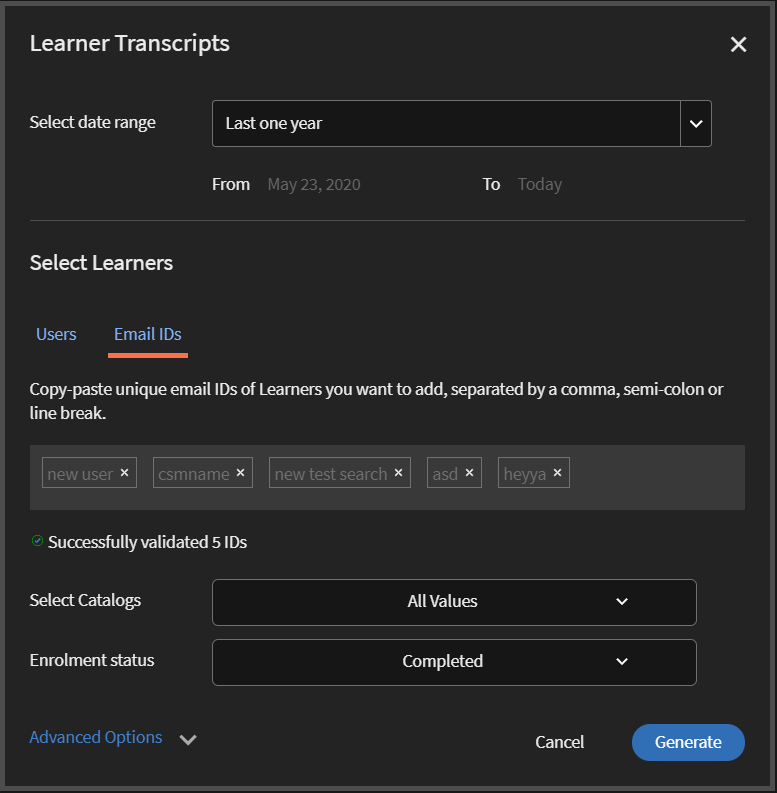

   *產生學習者成績單*

1. 按一下&#x200B;**[!UICONTROL Generate]**&#x200B;按鈕，為所有提及的電子郵件ID產生學習者成績單。 您會收到如下說明產生報表的確認訊息。

   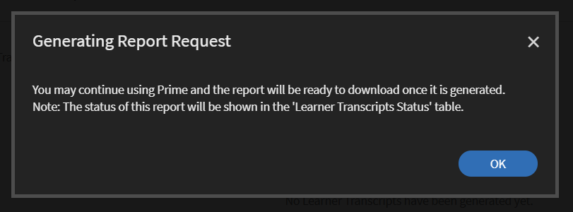

   *正在產生報告的確認訊息*

   針對在&#x200B;**[!UICONTROL Users]**&#x200B;和&#x200B;**[!UICONTROL Email IDs]**&#x200B;標籤下輸入的電子郵件ID，可結合產生學習者成績單。

## 學習者成績單下載記錄 {#ltdownload}

在&#x200B;**[!UICONTROL Learner Transcript]**&#x200B;下載頁面上，若要產生報表，當您按一下&#x200B;**[!UICONTROL Generate New]**&#x200B;按鈕時，學習者成績單對話方塊隨即顯示。

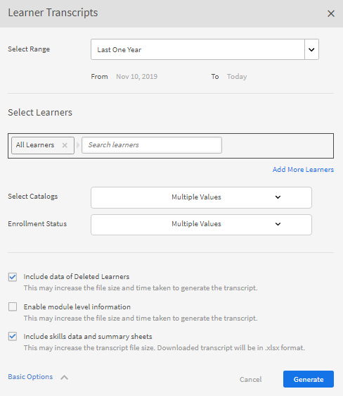

*產生所有學習者成績單的報告*

按一下&#x200B;**[!UICONTROL Advanced Options]**&#x200B;並展開面板。

選擇使用者及其所屬的目錄。 按一下&#x200B;**[!UICONTROL Generate]**&#x200B;按鈕後，會顯示一個對話方塊，其中會提及下載報告大約所需的時間。 若要產生報表，請按一下&#x200B;**[!UICONTROL Generate]**。

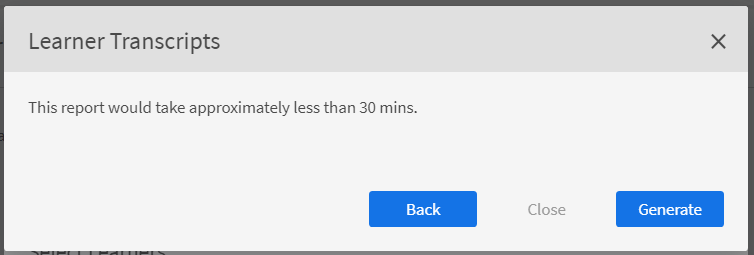

*選取[產生]按鈕*

成績單會在背景產生，而您可以在Learning Manager中繼續您的工作。 成績單產生後，您就可以從清單下載成績單。

身為管理員，您可以檢視系統中任何人產生的所有成績單。

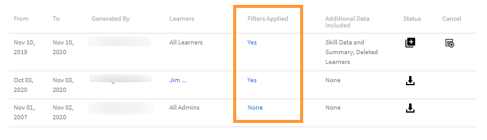

*檢視下載歷程記錄*

下載清單會顯示下列屬性：

* **學習者：**&#x200B;要下載其成績單的學習者/學習者群組。
* **包含的其他資料：**&#x200B;取決於管理員想要從新增學習者成績單強制回應視窗的「進階」選項下載的其他資料
* **狀態：**&#x200B;已下載、已排入佇列或進行中。
* **從**&#x200B;到&#x200B;**到**：要下載的成績單的持續時間。
* **套用的篩選器：**&#x200B;您是否套用了註冊狀態的篩選器。
* **產生者：**&#x200B;要求下載的Learning Manager使用者之使用者ID。
* **狀態：**&#x200B;已下載、已排入佇列或進行中。

您可以隨時取消下載。 如果管理員取消工作，Learning Manager會將應用程式內通知傳送給觸發學習者成績單的使用者。

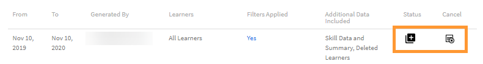

*學習者成績單下載佇列*

您隨時可以&#x200B;**取消**&#x200B;下載。 如果工作被取消，Learning Manager會傳送應用程式內通知給已取消工作的使用者。

## 已刪除學習者的資料 {#dataofdeletedlearners}

您可以在學習者成績單清單中包含已刪除學習者的資料。 在學習者成績單對話方塊中，啟用選項&#x200B;**[!UICONTROL Include data of Deleted Learners]**。

啟用選項並按一下&#x200B;**[!UICONTROL Generate]**&#x200B;後，學習者成績單下載頁面中已刪除的學習者資料功能，如下所示：

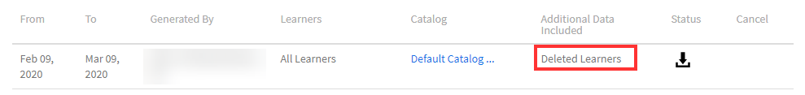

*檢視已刪除學習者的資料*

## 自訂欄 {#customize-columns-lt}

管理員可以自訂學習者成績單報告中匯出的欄。 管理員、自訂管理員和管理員可在匯出報告之前設定欄。

在&#x200B;**[!UICONTROL Learner Transcripts]**&#x200B;對話方塊中，按一下&#x200B;**[!UICONTROL Advanced Options]**。 在&#x200B;**[!UICONTROL Configure Export Format]**&#x200B;區段中，選擇要匯出的欄。

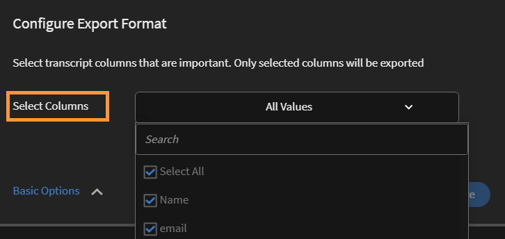

*自訂要匯出的欄*

只有當使用者以.CSV格式下載學習者成績單時，才允許自訂。 下載為.XLSX格式時，將不會接受欄偏好設定選擇，並將匯出所有預設欄。

## 學習者成績單檔案內容 {#learnertranscriptfilecontent}

典型的學習者成績單檔案包含單一檔案中的六張Excel工作表。 學習者成績單可提供資料的整體深入分析，包括每個課程涉及的學習者人數、其技能、根據課程或學習者的完成百分比，以及合規性儀表板。 學習者成績單中提供的控制面板如下：

**學習者成績單**

在學習者成績單Excel工作表中，連同有關學習者的設定檔詳細資訊一起，提供了學習物件明智沖銷詳細資訊，例如註冊日期、開始日期、已習得等級、已取得的測驗分數。 如果課程屬於任何學習計畫的一部分，則會與個別課程使用情況詳細資料分開列出。

**1 — 學習活動儀表板**

在此學習對象專屬控制面板中，您可以檢視每個課程、學習計畫或認證的學習者人數。 您可以檢視特定學習物件的學習者進度表。 此工作表會顯示完成課程或學習計畫的學習者數、進行中的學習者以及學習者的到期日等資料。

系統會根據您指定到期日及進度百分比臨界值的輸入欄位，計算特定課程的使用者進度。 例如，如果您在「輸入」欄位中指定7天和70%作為值，則會顯示7天後到期的課程以及進度超過70%的課程的課程進度。 您也可以在此工作表中變更期間，修改過的資料會自動顯示在此儀表板中。

**2 — 學習活動儀表板**

此學習儀表板會顯示特定使用者的資料。 您可以從此儀表板檢視特定使用者已註冊的課程、學習計畫或認證。 此表格也會顯示使用者已完成哪些學習物件、進行中的學習物件，以及使用者即將到期的資料。

每個課程的使用者進度會根據您指定的輸入進行計算。 即到期日與進度百分比值。 例如，如果您在「輸入」欄位中指定7天和70%作為值，則會顯示不同課程（7天後到期）的使用者進度以及進度超過70%的課程。

**技能**

在技能表中提供技能名稱、技能等級、所需學分、已認列學分、完成百分比及其他設定檔明細。 以下提供技能Excel表範例快照以供參考。

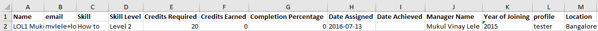

*技能Excel工作表範例*

**1 — 技能儀表板**

在此儀表板中，您可以檢視您的組織是否具備各種技能。 對於特定技能，您可以檢查組織中應該擁有該技能的使用者數量與實際擁有該技能的使用者數量。 此儀表板也會指定必須重新整理其技能的使用者。 系統會根據您在「輸入」欄位中輸入的輸入來計算此值。 例如，如果您輸入50天作為輸入，儀表板會提供在50天後需要重新整理技能之使用者的相關資料。

**2 — 技能儀表板**

此技能儀表板比較適合特定使用者。 您可以篩選特定使用者或多個使用者，並將他們的技能層級檢視為控制面板。 這張表可協助經理和管理員追蹤每個學習者的技能，並將其與預期的技能進行比較。 技能儀表板也會向必須重新整理其技能的學習者顯示亮點。 系統會根據您在「輸入欄位」中輸入的天數，計算學習者重新整理清單。

**法規遵循儀表板**

合規性儀表板分為兩部分 — 每位使用者的合規性報告和每次培訓的合規性報告。 對於以使用者為基礎的報告，您可以使用合規性儀表板來追蹤即將到達重要合規性計畫到期日期的使用者。 對於以培訓為基礎的報告，您可以依學習計畫或認證進行篩選。

對於這兩個相容性報告，請依到期日篩選以檢視適當的資料。

### 成績單中的時間和日期欄 {#datetime}

下列欄中的值會以分鐘為單位四捨五入到最接近的分鐘和秒數來表示00：

* 註冊日期（UTC時區）
* 開始日期（UTC時區）
* 完成日期（UTC時區）

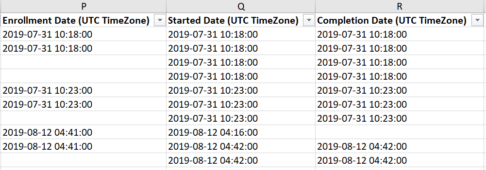

*Excel工作表上的時間和日期欄*

### 成績單中的模組持續時間和ID欄 {#moduledurationandidcolumnsinthetranscript}

學習者成績單也顯示欄 — **[!UICONTROL Module Duration]**&#x200B;和&#x200B;**[!UICONTROL ID]**。

成績單中的&#x200B;*模組持續時間與識別碼資料行*

### 成績單中的其他欄 {#ModuledurationandIDcolumnsinthetranscript-1}

| **資料行** | **描述** |
|---|---|
| 晚於 | 在輸入的（值）天數前已習得技能，且需要重新整理的學習者數 |
| 技能 | 指派給學習者的技能名稱 |
| 管理員名稱 | 將在「技能摘要」表格中顯示其下屬技能關係資料的經理名稱 |
| 列標籤 | 具有已指派技能清單的學習者名稱 |
| 每位使用者應具備的技能數 | 指派給學習者的技能數 |
| 每位使用者擁有的技能數 | 學習者習得的技能數 |
| 需要重新整理的技能數 | 技能需要重新整理的學習者數 |
| 合規性百分比 | 已指派技能的進度百分比 |
| 內嵌路徑 | 這些列會顯示內嵌式學習計畫的名稱。 |
| 內嵌路徑ID | 這些列會顯示內嵌式學習計畫的ID |
| 內嵌路徑語言 | 這些列會顯示建立學習計畫的語言。 |
