# 學習者成績單

下載學習者成績單並使用 Learning Manager 管理報告。

Adobe Learning Manager 讓組織的管理員能夠產生與學習者相關的成績單。

## 產生學習者成績單 {#generatelearnertranscripts}

1. 要產生學習者成績單，請點擊 **[!UICONTROL Reports]** 管理員登入的左側窗格。

   管理員會&#x200B;**[!UICONTROL Custom Reports]**&#x200B;前往頁面內&#x200B;**[!UICONTROL Reports]**&#x200B;的>**[!UICONTROL Excel Reports]**&#x200B;分頁。

1. 點擊連結 **[!UICONTROL Learner Transcripts]**。

   **[!UICONTROL Learner Transcript]**&#x200B;歷史頁面顯示訊息：**尚未產生**&#x200B;學習者成績單，或是學習成績單歷史頁面實施後已觸發的下載清單。

   <!---->

   會跳出學習者成績單對話框。 請選擇您需要產生成績單的日期範圍。

   >[!NOTE]
   >
   >預設情況下，從開始日期為學員註冊日期，起訖日期永遠為當前日期。 你只能修改從你需要資料開始的日期。

1. 從欄位中選擇學習者的名字 **[!UICONTROL Select Learners]** ，然後點擊 **[!UICONTROL Generate]。**
1. 你可以選擇單一學習者或多個學習者團體。 若要新增多位學習者，請點擊 **[!UICONTROL Add More Learners]**。

   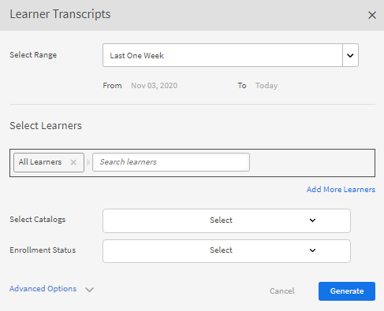

   *增加更多學習者*

1. 您可以透過勾選方塊選擇特定目錄。 逐字稿僅為指定的目錄下載。 你可以從下拉選單中選擇特定的目錄 **[!UICONTROL Select Catalogs]** 。

   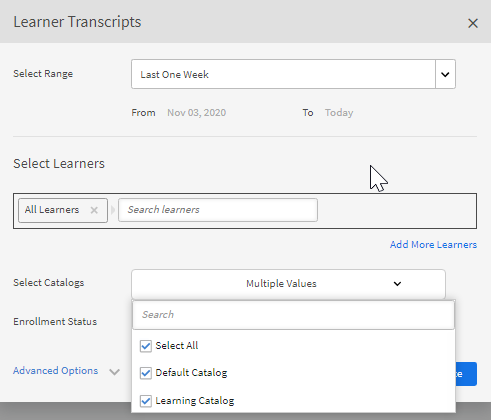

1. 匯出學習者成績單時，有一個選項為 **[!UICONTROL Enrollment Status]**。 此下拉選單包含以下選項：

   * 全部選擇
   * 已完成
   * 進行中
   * 未開始
   * 未註冊

   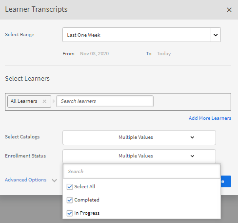

   *選擇目錄*

1. 你也可以下載被帳戶刪除的學習者成績單。

   要下載被刪除使用者的學習者成績單，請點擊箭頭 **[!UICONTROL Advanced Options]** 並啟用勾選框 **[!UICONTROL Include data of Deleted Learners]**。

   

   *下載被刪除學習者的學習者成績單*

1. 你可以選擇在學習者成績單中啟用「**[!UICONTROL Enable module level information]**」勾選框來下載模組層級資訊。 此時若啟用此功能，模組名稱及每個模組所花費的時間會作為逐字稿的一部分被擷取。
1. 你可以選擇透過啟用「**[!UICONTROL Include skills data and summary sheets]**」勾選框來下載技能資料和摘要表。

   當技能資料未包含時，成績單會產生並下載為.zip檔案。 若啟用技能資料勾選框，會產生並下載.xls檔案的成績單。

## 使用複製貼上方式產生學習者文字稿

取得學習者成績單變得繁瑣，因為只能逐一取得學習者或使用者群組。 在這裡，利用複製貼上功能，你可以一次性複製學習者電子郵件 ID 清單並貼上。

1. 請以 **[!UICONTROL Administrator]** or **[!UICONTROL Manager]**&#x200B;登入。
1. 請前往 **[!UICONTROL Reports]** 下方 **[!UICONTROL Manage]**，它會載入該 **[!UICONTROL User Activity]** 頁面。
1. 點擊 **[!UICONTROL Custom Reports]** 左側窗格，從列表中選擇 **[!UICONTROL Learner Transcripts]** 。
1. 在頁面 **[!UICONTROL Learner Transcripts]** 上，點擊 **[!UICONTROL Generate New]** 左上角的按鈕。
1. 請點擊 **[!UICONTROL Select date range]** 下拉選單選擇偏好日期。 點擊 **[!UICONTROL Email IDs]** 分頁輸入複製的獨一無二電子郵件 ID 清單。

   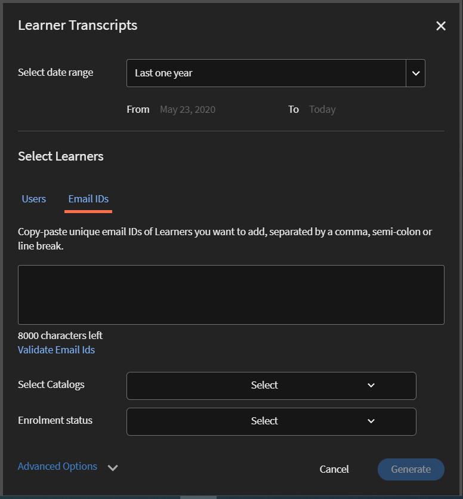

   *複製貼上電子郵件 ID*

1. 用來 **[!UICONTROL Validate Email Ids]** 驗證輸入的 ID 是否正確。

   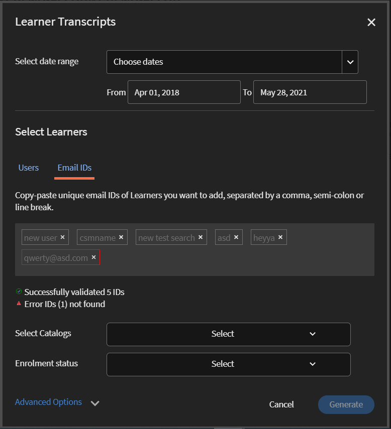

   *驗證電子郵件 ID*

   若輸入的電子郵件 ID 錯誤，則會以紅色標示，並附上上述驗證訊息。

   **[!UICONTROL Generate]** 除非輸入的所有電子郵件ID正確，否則按鈕將無法使用。

   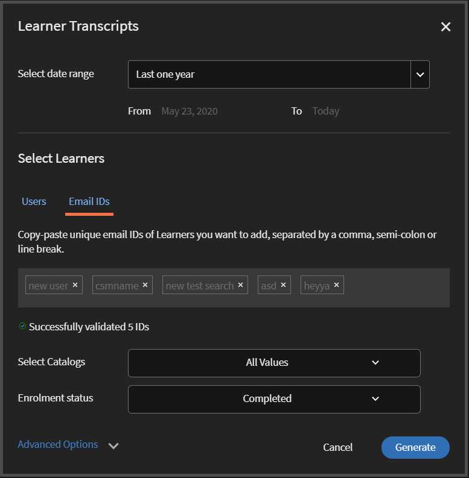

   *產生學習者成績單*

1. 點擊 **[!UICONTROL Generate]** 按鈕即可產生所有提及電子郵件 ID 的學習者成績單。 您將收到如下所示的確認訊息，說明報告產生。

   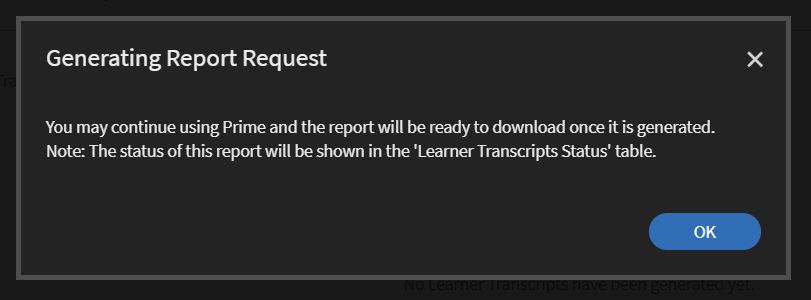

   *報告正在產生的確認訊息*

   產生學習者成績單時，可以合併輸入在 和 **[!UICONTROL Email IDs]** 分頁下的電子郵件 ID **[!UICONTROL Users]**。

## 學習者成績單下載歷史 {#ltdownload}

在 **[!UICONTROL Learner Transcript]** 下載頁面，點擊按鈕時 **[!UICONTROL Generate New]** 會顯示「學習者成績單」對話框。

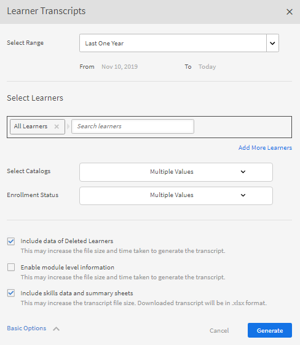

*產生所有學習者成績單的報告*

點擊 **[!UICONTROL Advanced Options]** 並展開面板。

選擇使用者及其所屬目錄。 點擊 **[!UICONTROL Generate]** 按鈕後，會顯示一個對話框，說明下載報告所需的大致時間。 要產生報告，請點擊 **[!UICONTROL Generate]**。

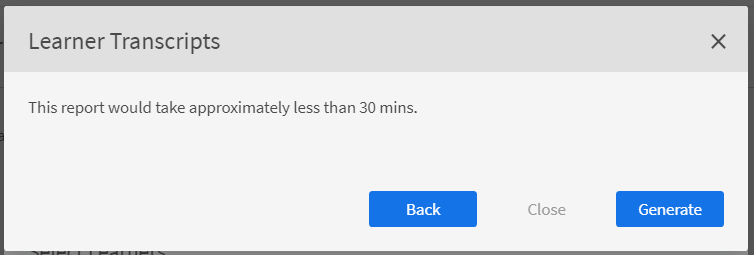

*選擇生成按鈕*

成績單會在背景自動產生，你可以繼續在學習管理員中執行任務。 逐字稿產生後，您可以從清單中下載。

作為管理員，你可以查看系統中任何人產生的所有成績單。

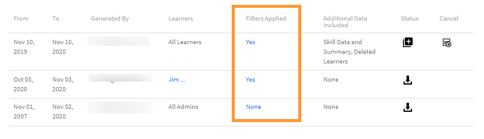

*查看下載歷史*

下載清單顯示以下屬性：

* **學習者：** 需下載成績單的學習者/學習者團體。
* **新增資料：** 視管理員想從「新增學習者成績單」模式的進階選項下載哪些額外資料而定
* **狀態：** 已下載、排隊或進行中。
* **發件** 人與 **收件人**：待下載的逐字稿長度。
* **已套用篩選條件：** 您是否已套用註冊狀態篩選器。
* **產生者：** 申請下載的學習管理員使用者的使用者ID。
* **狀態：** 已下載、排隊或進行中。

你可以隨時取消下載。 如果管理員取消了工作，Learning Manager 會發送應用程式內通知觸發學習者成績單的使用者。

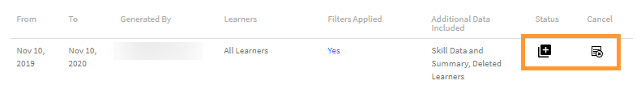

*學習者逐字稿下載佇列*

你可以 **隨時取消** 下載。 若工作被取消，Learning Manager 會發送應用程式內通知已取消該工作的人。

## 被刪除學習者的資料 {#dataofdeletedlearners}

你可以將被刪除學習者的資料納入學習者成績單清單中。 在學習者成績單對話框中，啟用 **[!UICONTROL Include data of Deleted Learners]**。

啟用該選項並點擊 **[!UICONTROL Generate]**&#x200B;後，已刪除的學習者資料會出現在學習者成績單下載頁面，如下所示：

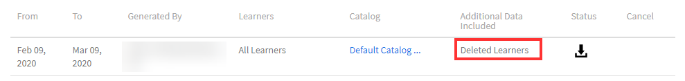

*查看被刪除的 Learber 資料*

## 自訂欄位 {#customize-columns-lt}

管理員可自訂學習者成績單報告中匯出的欄位。 管理員、自訂管理員和經理可以在匯出報告前先設定欄位。

在對話框中 **[!UICONTROL Learner Transcripts]** ，點擊 **[!UICONTROL Advanced Options]**。 在該 **[!UICONTROL Configure Export Format]** 區塊中，選擇你想匯出的欄位。

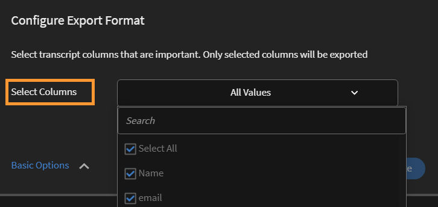

*自訂欄位以匯出*

只有當使用者下載學習者成績單（Learner Transcript）時，才允許進行客製化。CSV 格式。 下載為 .XLSX 格式時，欄位偏好選擇將不會被尊重，所有預設欄位都會被匯出。

## 學習者成績單檔案內容 {#learnertranscriptfilecontent}

一個典型的學習者成績單檔案由六份Excel表格組成。 學習者成績單表提供整體數據洞察，包括每門課程參與的學習者人數、技能、依課程或學習者計算的完成率，以及合規儀表板。 以下是學習者成績單中可用的儀表板：

**學習者成績單**

在學習者成績單的 Excel 表格中，除了學習者的個人資料外，還會依學習項目提供詳細資料，例如報名日期、開始日期、取得成績、測驗成績。 若課程屬於任何學習計畫，則會與個別課程使用資料分開列出。

**1- 學習活動儀表板**

在這個專為 LO 設計的儀表板中，您可以查看每門課程、學習計畫或認證的學習人數。 你可以查看特定學習對象的學習進度表。 此表顯示完成課程或學習計畫的學習人數、正在進行的學習者及學習者的截止日期等資料。

使用者在特定課程的進度是根據輸入欄位計算，該欄位中你指定截止日期和進度百分比門檻。 例如，如果你在輸入欄位中指定 7 天和 70% 的數值，則會顯示 7 天內截止課程的進度，以及超過 70% 進度的課程進度。 你也可以在這個工作表中更改時間範圍，修改後的資料會自動顯示在這個儀表板中。

**2 - 學習活動儀表板**

這個學習儀表板會顯示特定使用者的資料。 從這個儀表板，你可以查看特定使用者所報名的課程、學習計畫或認證。 表格同時顯示使用者已完成的學習物件、進行中的學習物件，以及即將到期的日期。

使用者在每門課程的進度會根據你指定的輸入來計算。 也就是截止日期和進度百分比的數值。 例如，如果你在輸入欄位中指定 7 天和 70% 的數值，使用者會顯示不同課程的進度，針對 7 天內截止的課程，以及超過 70% 進度的課程。

**技巧**

技能表中會列出技能名稱、技能等級、所需學分、已獲得學分、完成百分比及其他個人資料。 以下附上技能範例 Excel 表格供參考。

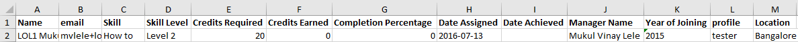

*Excel 技能表範例*

**1- 技能儀表板**

在這個儀表板中，您可以查看您的組織是否具備多項技能。 針對特定技能，你可以比較組織中應該擁有該技能的用戶數量與實際擁有該技能的人數。 此儀表板同時指定需更新技能的使用者。 這個數值是根據你在輸入欄位輸入的輸入來計算的。 例如，如果你輸入 50 天作為輸入，儀表板會顯示用戶在 50 天後需要更新技能的資料。

**2- 技能儀表板**

這個技能儀表板更針對使用者設計。 你可以篩選特定使用者或多位使用者，並以儀表板方式查看他們的技能等級。 此表能協助管理者與管理者追蹤每位學員的技能與預期技能的差異。 技能儀表板也說明了需要更新技能的學習者。 學習者的刷新清單是根據你在輸入欄位輸入的天數計算出來的。

**合規儀表板**

合規儀表板分為兩部分——每位使用者的合規報告與依培訓提供的合規報告。 針對使用者報告，您可以使用合規儀表板追蹤重要合規計畫即將到期的用戶。 針對訓練型報告，您可以依學習計畫或認證篩選。

對於這份合規報告，請依截止日期篩選以查看相關資料。

### 逐字稿中的時間與日期欄位 {#datetime}

以下欄位的數值將分鐘四捨五入至最接近的分鐘，秒數為00：

* 註冊日期（UTC時區）
* 開始日期（UTC時區）
* 完工日期（UTC時區）

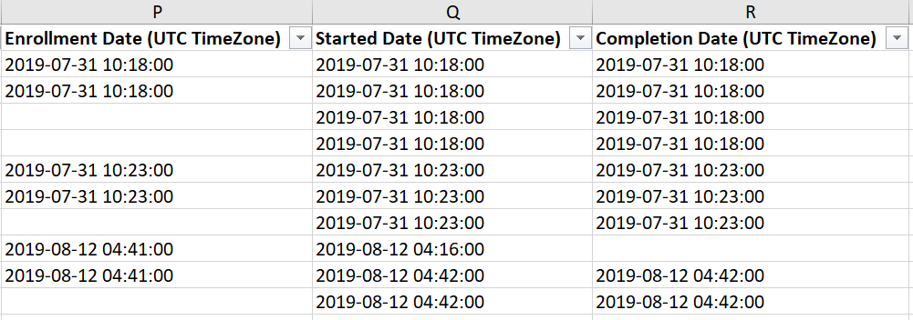

*Excel 表格中的時間與日期欄位*

### 課程長度與逐字稿中的編號欄位 {#moduledurationandidcolumnsinthetranscript}

學習者成績單也會顯示欄位 - **[!UICONTROL Module Duration]** 和 **[!UICONTROL ID]**。

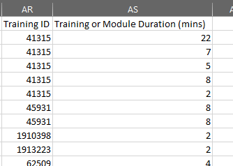

*課程長度與逐字稿中的編號欄位*

### 逐字稿中的其他欄位 {#ModuledurationandIDcolumnsinthetranscript-1}

| **柱狀** | **描述** |
|---|---|
| 之後 | 在輸入（價值）天數前達成技能的學習者數量，需要更新 |
| 技巧 | 分配給學習者的技能名稱 |
| 經理人姓名 | 其下屬的經理名稱將顯示在技能摘要表中 |
| 排標籤 | 學習者名稱及分配的技能清單 |
| 每位使用者應擁有的技能數量 | 學習者需具備的技能數量 |
| 每位使用者擁有的技能數量 | 學習者所達成的技能數量 |
| 需要刷新的技能數量 | 需要刷新技能的學習者數量 |
| 合規率 | 分配技能的進度百分比 |
| 嵌入路徑 | 這些列會顯示嵌入學習程式的名稱。 |
| 嵌入路徑識別碼 | 這些列會顯示嵌入學習程式的 ID。 |
| 嵌入式路徑語言 | 這些列會顯示學習程式所使用的語言。 |
