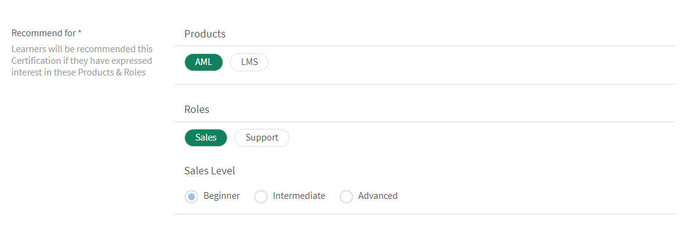
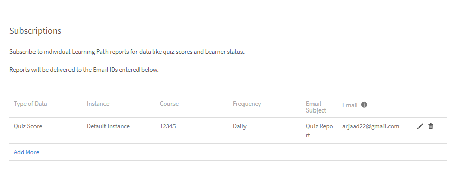

# 學習路徑

## 什麼是學習路徑？

管理員通常有興趣建置詳細的課程，提供特定主題或專業領域的深入知識。 它也可以是員工或客戶希望完成的一系列培訓課程。 這要求將一組課程和計畫捆綁在一起，以建立完整的訓練套件。

這就是我們構想學習路徑的地方。 學習路徑是學習者必須經歷的歷程，以隨著時間掌握一些主題。 學習者可掌控其培訓體驗，並能以更有效率的方式自訂進度取得及保留知識。

例如，新員工上線時，組織會進行有關政策和程式、文化、歷史等的培訓。 學習路徑會根據員工的需求設定課程，讓員工可以按照為其設定的學習路徑註冊課程。 您可以選擇，並且可以在此路徑上註冊使用者，以便他們可以從一個課程轉到另一個課程。

## 建立和設定學習路徑

在本培訓中，您將學習如何創建學習路徑、向其添加課程、發佈和停用學習路徑，以及在學習路徑中配置實例。

如果您無法啟動培訓，請寫信給 <almacademy@adobe.com>。

## 學習路徑的優勢

學習路徑使培訓傳遞方案方便且免費。 以下是學習路徑的一些主要優點：

1. 直接將技能和技能級別分配給學習路徑。 無需匹配技能學分。 學習者完成學習路徑后，他/她將達到上述技能水準。
1. 能夠將現有學習路徑嵌入新學習路徑。 嵌入功能僅適用於 1 級嵌入。 因此，已包含嵌入路徑的學習路徑不能嵌入到新路徑中。
1. 可在學習路徑層級新增必要條件、工作輔助和資源。
1. 建立區段的功能。 每個區段都可以有標題。
1. 能夠將區段設為必要並設定完成條件。

## 在Learning Manager中新增學習路徑

在學習管理員的“管理員”應用中，按兩下 **[!UICONTROL Learning Path]** 左側面板。

在&#x200B;**[!UICONTROL Learning Path]**&#x200B;頁面中，按一下&#x200B;**[!UICONTROL Add]**。 輸入詳細資料。

*新增學習路徑*

在&#x200B;**註冊型別**&#x200B;選項中，選取&#x200B;**自行註冊**&#x200B;或&#x200B;**管理員註冊**。

>[!NOTE]
>
>如果您選取&#x200B;**管理員註冊**&#x200B;選項，學習者將只會看到經理指派或經理核准的課程。 學習者將無法在「建議」區段中看到學習路徑。

創建學習路徑后，選擇新創建的學習路徑，並在路徑中添加課程。

您可以新增技能併為學習路徑指派徽章。 若要添加技能，請從下拉清單中選擇 **[!UICONTROL Pick a Skill]** 所需的一個或多個技能。 同時選取技能或技能的層級。

*新增技能*

為學習路徑指派徽章。 從可用徽章清單中挑選徽章。

從 **[!UICONTROL Recommend for]** 部分中選擇產品、角色和角色級別，以向在這些產品和角色中表達興趣的使用者建議此學習路徑。

*建議*

選擇各節的排序類型，並根據您的喜好培訓為“有序”或“無序”。

如果選擇「已排序」，則課程將顯示在創建課程的相同序列中。 如果選擇“無序”，則不會對課程進行排序。 學習者可以按任何順序完成課程。

要在學習路徑中加入課程， 請按下 **[!UICONTROL Add Courses or Learning Paths]**。

在出現的對話方塊中，選擇要新增至學習路徑的訓練。

*將培訓新增至學習路徑*

您可以根據分配的技能、修改日期和課程效果進一步對課程進行排序。

選擇課程或學習路徑後，按下 **[!UICONTROL Save]**。

在學習路徑中，您可以執行以下作：

**建立並設定區段：**&#x200B;建立區段以將多個訓練課程組成群組，完成訓練的某個區域或重要部分。 每個部分都可以有一個標題。 每個部分也可以標記為強制性，並具有特定的完成要求。

**將每個部分中的課程設置為必修課：** 如果您希望/不想在學習路徑中強制培訓，請啟用或禁用“必修”複選框。 如果啟用該複選框，則可以將所有培訓設為必需培訓或某些培訓為必填項。

*將每個部分的課程設為必修課*

**重新排列順序：**&#x200B;您可以上下移動課程並變更其順序。

*重新排列培訓的順序*

**拿掉課程：** 在課程卡片上，按兩下 X，然後從學習路徑中刪除課程。

*從學習路徑移除課程*

進行更改後，若要發佈學習路徑，請按兩下“Publish”。

## 巢狀或增強型學習路徑

嵌套或增強型學習路徑是包含多個學習路徑的學習路徑。 要插入學習路徑，追隨與在學習路徑中添加課程相同的過程。

*巢狀或增強型學習路徑*

## 學習路徑設定

在設定部分中，您可以添加學習者在開始學習路徑之前必須採取的先決條件和工作輔助。 您還可以添加對學習者有幫助的資源。

*變更學習路徑的設定*

## 例項

學習路徑執行個體會顯示額外的磚&#x200B;**[!UICONTROL Learning Paths]**。 圖磚會顯示數字。 已新增至學習路徑的學習計畫數量。

在&#x200B;**課程**&#x200B;圖磚中，您可以看到已註冊此執行個體的學習者所看到的課程執行個體。

**[!UICONTROL Enable Learners to Choose instances (Flexible Learning Path)]**&#x200B;核取方塊僅適用於課程。 所有子級學習路徑都會選擇將學習計畫例項與學習路徑對應。 依預設，對應會設定為「預設例項」。

*學習路徑例項*

## 通知

共有 3 個選項：

1. **[!UICONTROL All Skill Levels Courses and Learning Paths (selected by default)]：** 學習者會收到任何未完成課程的通知，無論學習路徑中的級別如何。
1. **[!UICONTROL Root Learning Path]：** 學習者會收到屬於家長學習路徑的任何未完成課程的通知。
1. **[!UICONTROL Learning Path + first Skill Level children only]：** 學習者會收到任何未完成課程的通知，這些課程是父學習路徑的第一個子課程。

通知提醒會根據選項觸發。 默認情況下，該選項 **[!UICONTROL All Levels Courses and Learning Paths]** 是為執行個體啟用的。

## 訂閱

您可以訂閱個人學習路徑，以直接在您的收件匣接收全面的數據，包括測驗分數和學習者狀態。

請按照以下步驟作：

1. 前往任一學習路徑>訂閱。
1. 選取「新增更多」。
1. 選取詳細資料並輸入電子郵件ID以接收報表。

*訂閱個別學習路徑*

## 重要注意事項

請注意，學習計劃的現有功能將在發佈后立即重命名為“學習路徑”。 如果您希望繼續將其稱為「學習計畫」，我們建議您使用「術語」功能來套用所需的術語。 如此一來，您就能使用到「學習計畫」這個字。

學習路徑提供您一系列的功能。 其中一些在發行後即可立即使用。 管理員/作者可以開始使用它們。 擴充功能，例如「部分」、「在其他路徑新增學習路徑」等。 已停用，勾選下列核取方塊即可啟用。

學習者可以繼續使用學習計畫（現在稱為學習路徑），作者/管理員也可以繼續建立學習計畫。 若要善用上述「學習路徑」的擴充功能，管理員應啟用下述設定。 啟用后，學習路徑的所有新擴展功能都將可用。

**[!UICONTROL Settings]**&#x200B;**[!UICONTROL General]**>頁面有啟用學習路徑的新選項。如果已啟用此選項，您可以在學習路徑中新增課程和學習計畫。 選項一經啟用即無法變更。

<!-- ## Other Learning Path-related details 

### Learning Path option is disabled/unchecked in Admin Settings

**Accounts using Native Web apps**

**Learners**

* By default, learners will notice a change in terminology from "Learning Program" to Learning Path". This has been done to make the interface more intuitive. If you do not want this change, refer to the below points.  

* This change however will not be reflected in the UI if you have already used the 'Custom Terminology" function to replace the terminology "Learning Programs" with some custom text. 
* In case you had not used the Custom Terminology function yet but now wish to retain "Learning Programs" as the terminology, you can do so via the 'Custom Terminology' feature post the release.

* The overall cosmetic look and feel of erstwhile 'Learning Programs' will get updated to a more visually rich look and feel.

**Authors and Admins**

* The terminology within the Admin/Author apps is the same as that of learners.
* The UI for Authors and Admins to create, update the erstwhile 'Learning Program' objects will now be updated to the new UI. There is no loss of functionality, just that the User Interface to do the operation will be much more intuitive. These UI changes will reflect in your account, even if you have chosen not to enable 'Extended Features of Learning Path', with no loss in functionality. 

* Note that any existing Learning Program objects will not change so there is no impact on learners (other than the terminology point noted above). Authors/Admins might notice a default grouping called "Section" within their existing objects, which would be of no material impact as far as functionality goes. Authors/Admins will also see added functionalities like Skills, Job Aids etc. But as you haven't used it yet, it will not create any impact on the learner side till you actually start using it.

**Reporting**

* If you do not enable the option, Learning Path , there are no changes in the Learner Transcript report structure due to Learning Path. But as communicated in earlier notice (refer to the table shared in earlier communication); one new column will get added to the extreme right of the Learner Transcript immediately after the release.

**Accounts using Headless LMS**

**Learners**

* There are no changes for learners in headless interface. APIs as well that are used to generate the reports does not have immediate changes. 

**Authors and Admins**

* Same changes as that of Authors/Admins stated above.

**Reporting**

* Same changes as that of Reporting stated above.

### Learning Paths option is enabled/checked in Admin Settings

**Accounts using Native Web apps**

**Learners**

* Same changes as that of Learners when the option is disabled.
* As you start using the extended functionality of Learning Paths, Learners will benefit from seeing more elaborate paths with embedded paths and sections, Skills and badges being earned on path completion, resources at path level, and other benefits.

**Authors and Admins**

* Same changes as that of Authors and Admins when the option is disabled.

* Users will get more functionality in crafting elaborate paths. You can define Skill-Levels that would automatically be achieved by a learner on completion of path (not have to focus on the arithmetic of Credits for the levels). Resources can be added at the path level (Not possible as of today). Sections can be created with each section having the ability to have X of Y options. One can embed a Learning Path within another Learning Path (one level of hierarchy supported)

**Reporting**

* A few new columns will get added to the 'Learner Transcript' and 'Content Report' structures to incorporate the new feature of embedding of paths within paths. This may impact integration code that you may have written to export this data to your custom data warehouse/DB outside Learning Manager. This information is communicated in the table provided in earlier communication.

**Accounts using Headless LMS**

**Learners**

* There is no change for your learners, unless you make changes to your headless LMS implementation, as the APIs on which you have built your headless interface will not be changing.
* If you do start using the extended features of Learning Paths by creating new Learning Paths, however you will have to make changes to the headless LMS implementation to reflect those on your learner app. The Learning Manager APIs will allow you to do that.

**Authors and Admins**

* Same changes as that of Authors/Admins stated above.

**Reporting**

* Same changes as that of Reporting stated above. -->
