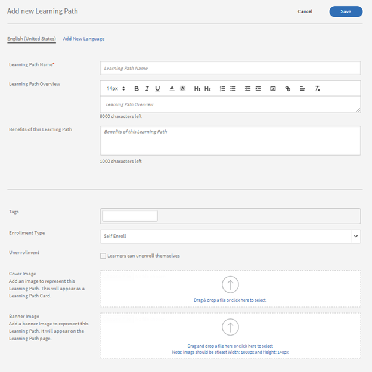
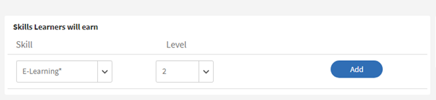
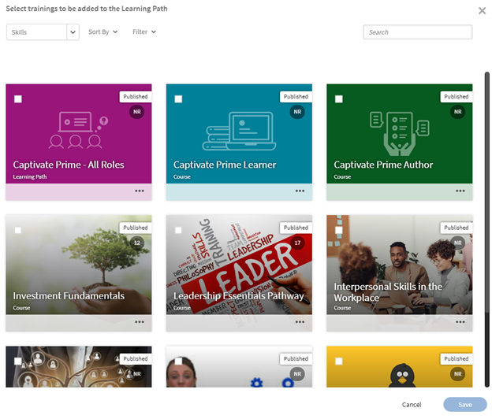
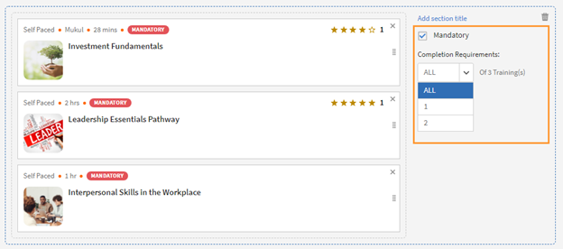
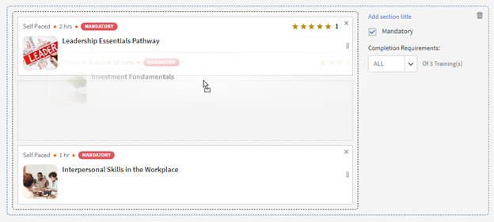
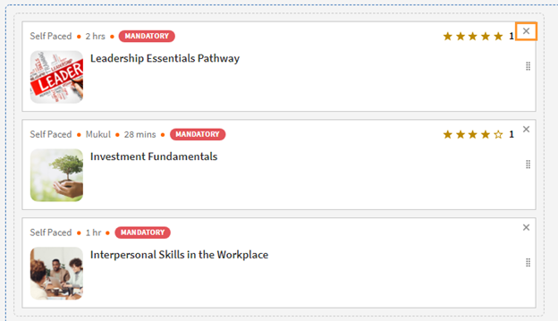
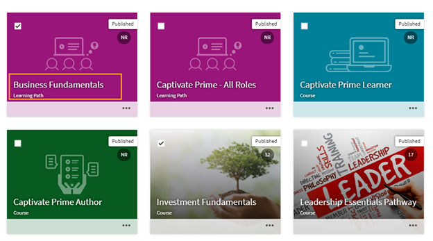
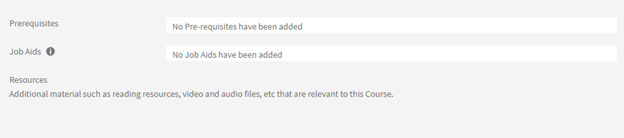
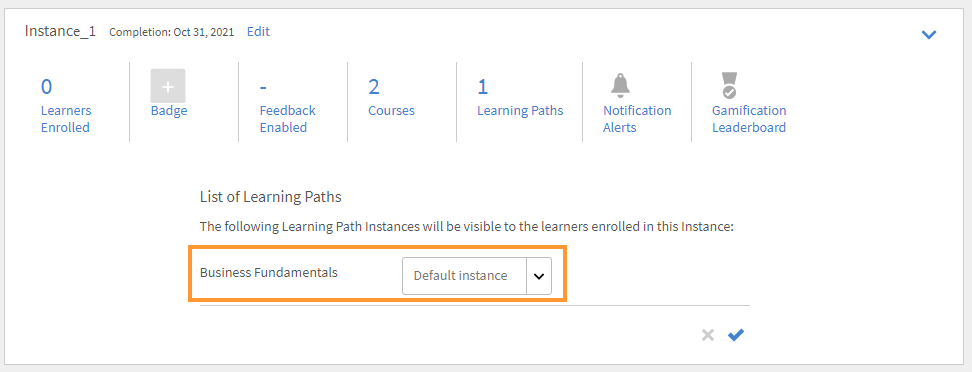

# 學習路徑

## 什麼是學習路徑？

管理員通常有興趣建置詳細的課程，提供特定主題或專業領域的深入知識。 它也可以是員工或客戶希望完成的一系列培訓課程。 這要求將一組課程和計畫捆綁在一起，以建立完整的訓練套件。

這就是我們構想學習路徑的地方。 學習路徑是學習者必須經歷的歷程，以隨著時間掌握一些主題。 學習者可掌控其培訓體驗，並能以更有效率的方式自訂進度取得及保留知識。

例如，新員工上線時，組織會進行有關政策和程式、文化、歷史等的培訓。 學習路徑會根據員工的需求設定課程，讓員工可以按照為其設定的學習路徑註冊課程。 您選擇後，您就可以在此路徑中註冊使用者，讓使用者在不同的課程中前進。

## 學習路徑的優勢

學習路徑讓訓練計畫的傳送變得方便而輕鬆。 以下是學習路徑的一些主要優點：

1. 直接為學習路徑指派技能和技能等級。 不需要符合技能積分。 學習者完成學習路徑後，他/她就會達到所述的技能水準。
1. 將現有學習路徑內嵌至新學習路徑的功能。 內嵌功能僅適用於1級內嵌。 因此，已包含內嵌路徑的學習路徑無法內嵌於新路徑中。
1. 可在學習路徑層級新增必要條件、工作輔助和資源。
1. 建立區段的功能。 每個區段都可以有標題。
1. 能夠將區段設為必要並設定完成條件。

## 在Learning Manager新增學習路徑

在Learning Manager的管理程式中，按一下 **[!UICONTROL Learning Path]** 位於左側面板。

在 **[!UICONTROL Learning Path]** 頁面，按一下 **[!UICONTROL Add]**. 輸入詳細資料。

*新增學習路徑*

建立學習路徑後，選取新建立的學習路徑，並在路徑中新增課程。

您可以新增技能並指派徽章至學習路徑。 若要新增技能，請從以下位置選取所需技能： **[!UICONTROL Pick a Skill]** 下拉式清單。 同時選取技能或技能的層級。

為學習路徑指派徽章。 從可用徽章清單中挑選徽章。

根據您的偏好，選擇區段和培訓的順序型別，即「已訂購」或「未訂購」。

如果您選擇「已訂購」，課程會以您建立的相同順序顯示。 如果您選擇「未排序」，則課程不會排序。 學習者可依任何順序完成課程。

若要在學習路徑中新增課程，請按一下 **[!UICONTROL Add Courses or Learning Paths]**.

在出現的對話方塊中，選擇要新增至學習路徑的訓練。

*將訓練新增至學習路徑*

您可以根據指定的技能、修改日期和課程效果進一步排序課程。

選取課程或學習路徑後，按一下 **[!UICONTROL Save]**.

在「學習路徑」中，您可以執行下列動作：

**建立和設定區段：** 會建立區段，將多個訓練課程組成群組，以完成訓練的某個區域或重要部分。 每個區段都可以有標題。 每個區段也可以標示為具有特定完成需求的強制。

**讓課程成為每個區段中的必修課程：** 若您想要/不想在學習路徑內讓培訓成為強制性，請啟用或停用「強制」核取方塊。 如果您啟用核取方塊，您可以將所有培訓設為強制性，或部份培訓設為強制性。

*讓課程成為每個區段中的必修課程*

**重新排列順序：** 您可以上下移動課程並變更其順序。

*重新安排培訓的順序*

**移除課程：** 在課程卡上，按一下X ，然後將課程從學習路徑中移除。

*從學習路徑移除課程*

完成變更後，若要發佈學習路徑，請按一下「發佈」 。

## 巢狀傾斜路徑

您可以在學習路徑中加入學習路徑，但最多可以在其中巢狀內嵌一個學習路徑。

插入學習路徑，就像插入課程一樣。

*在學習路徑內新增學習路徑*

## 學習路徑設定

在「設定」區段中，您可以新增學習者開始學習路徑前必須具備的先決條件及工作輔助。 您也可以新增對學習者有用的資源。

*變更學習路徑的設定*

## 例項

「學習路徑」執行個體會顯示額外的磚， **[!UICONTROL Learning Paths]**. 圖磚會顯示數字。 已新增至學習路徑的學習計畫數量。

在 **課程** 圖磚，您可看見已註冊此例項的學習者所看到的課程例項。

此 **[!UICONTROL Enable Learners to Choose instances (Flexible Learning Path)]** 核取方塊僅適用於課程。 所有子級學習路徑都會選擇將學習計畫例項與學習路徑對應。 依預設，對應會設定為「預設例項」。

*學習路徑例項*

## 通知

有三個選項：

1. **[!UICONTROL All Levels Courses and Learning Paths (selected by default)]：** 學習者會收到任何未完成課程的通知，無論學習路徑內的層級為何。
1. **[!UICONTROL Root Learning Path]：** 學習者會收到屬於父級學習路徑之任何未完成課程的通知。
1. **[!UICONTROL Learning Path and first level child only]：** 學習者會收到任何不完整課程的通知，這些課程為父級學習路徑的第一子級。

通知提醒會根據選項觸發。 依預設，選項 **[!UICONTROL All Levels Courses and Learning Paths]** 已為執行個體啟用。

## 重要注意事項

請注意，學習計畫的現有功能將會在發行後立即重新命名為學習路徑。 如果您希望繼續將其稱為「學習計畫」，我們建議您使用「術語」功能來套用所需的術語。 如此一來，您就能使用到「學習計畫」這個字。

學習路徑提供您一系列的功能。 其中一些在發行後即可立即使用。 管理員/作者可以開始使用它們。 擴充功能，例如「部分」、「在其他路徑新增學習路徑」等。 已停用，勾選下列核取方塊即可啟用。

學習者可以繼續使用學習計畫（現在稱為學習路徑），作者/管理員也可以繼續建立學習計畫。 若要善用上述「學習路徑」的擴充功能，管理員應啟用下述設定。 啟用後，「學習路徑」的所有新擴充功能都將可供使用。

此 **[!UICONTROL Settings]** > **[!UICONTROL General]** 頁面有一個新選項可啟用學習路徑。 如果已啟用此選項，您可以在學習路徑中新增課程和學習計畫。 選項一經啟用即無法變更。

## 其他學習路徑相關詳細資訊

### 「管理設定」中的「學習路徑」選項已停用/取消勾選

**使用原生Web應用程式的帳戶**

**學習者**

* 依預設，學習者會注意到術語從「學習計畫」變更為「學習路徑」。 這麼做可讓介面更直覺。 如果您不想進行此變更，請參閱下列要點。

* 不過，如果您已使用「自訂術語」功能將術語「學習計畫」取代為某些自訂文字，此變更將不會反映在UI中。
* 如果您尚未使用「自訂術語」功能，但現在希望保留「學習計畫」作為術語，您可以透過發行後的「自訂術語」功能這樣做。

* 舊版「學習計畫」的整體外觀和手感將更新為視覺效果更豐富的外觀和手感。

**作者與管理員**

* 管理員/作者應用程式內的術語與學習者相同。
* 作者和管理員用以建立、更新舊版「學習計畫」物件的UI現在將更新至新UI。 功能不會遺失，只是使用者介面執行的操作會更直覺。 即使您選擇不啟用「學習路徑的延伸功能」，這些UI變更仍會反映在您的帳戶中，不會損失任何功能。

* 請注意，任何現有的學習計畫物件都不會變更，因此對學習者不會造成影響（上述術語點除外）。 作者/管理員可能會在其現有物件中注意到名為「Section」的預設群組，就功能而言，這不會產生任何重大影響。 作者/管理員也會看到新增的功能，例如技能、工作輔助等。 但由於您尚未使用過此工具，因此在您實際開始使用它之前，不會對學習者產生任何影響。

**報告**

* 如果您未啟用學習路徑選項，學習者成績單報告結構不會因為學習路徑而發生變更。 但如先前通知所述（請參考先前通知中所共用的表格）；在發佈後，學習者成績單的最右邊將立即新增一欄。

**使用Headless LMS的帳戶**

**學習者**

* Headless介面中的學習者沒有變更。 用於產生報表的API也不會立即變更。

**作者與管理員**

* 與上述作者/管理員的變更相同。

**報告**

* 與上述報告功能相同的變更。

### 學習路徑選項已在「管理員設定」中啟用/勾選

**使用原生Web應用程式的帳戶**

**學習者**

* 與停用選項時的學習者變更相同。
* 當您開始使用「學習路徑」的擴充功能時，學習者將可受益於顯示更精細的路徑，其中包含內嵌的路徑和區段、完成路徑時所獲得的技能與徽章、路徑層級的資源及其他好處。

**作者與管理員**

* 與停用選項時「作者」和「管理員」的變更相同。

* 使用者將獲得製作複雜路徑的更多功能。 您可以定義學習者完成路徑後自動達成的技能等級（不必聚焦於等級的積分算術）。 資源可在路徑層級新增（目前尚無法新增）。 可以使用每個具有X個Y選項能力的區段來建立區段。 使用者可將學習路徑內嵌於其他學習路徑（支援一層階層）

**報告**

* 「學習者成績單」和「內容報表」結構新增了幾欄，整合了路徑內嵌的新功能。 這可能會影響您為了匯出此資料至Learning Manager外部的自訂資料倉儲/資料庫而編寫的整合程式碼。 此資訊在之前的通訊中所提供的表格中傳達。

**使用Headless LMS的帳戶**

**學習者**

* 除非您變更Headless LMS實作，否則您的學習者不會有任何變更，因為您建置Headless介面的API不會變更。
* 如果您是透過建立新學習路徑來開始使用「學習路徑」的延伸功能，不過您必須變更Headless LMS實作，以反映學習者應用程式上的那些專案。 Learning Manager API可讓您這麼做。

**作者與管理員**

* 與上述作者/管理員的變更相同。

**報告**

* 與上述報告功能相同的變更。
