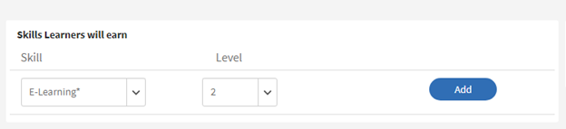
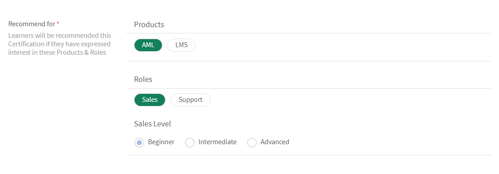
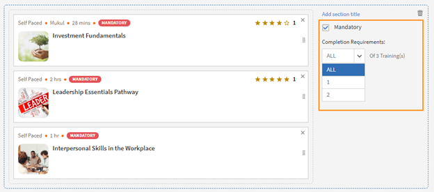
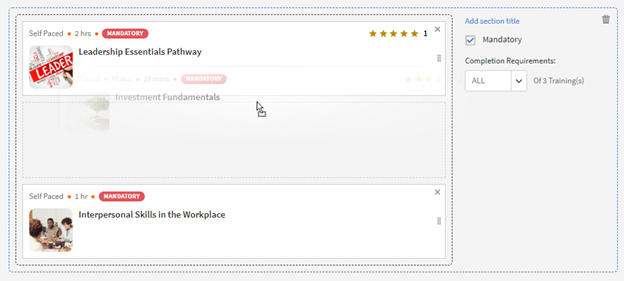
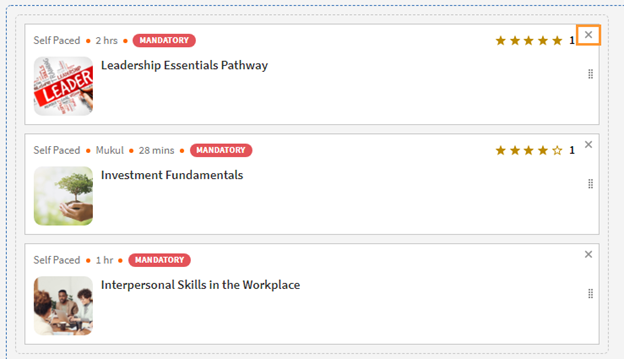
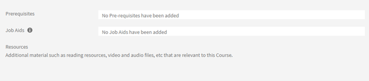
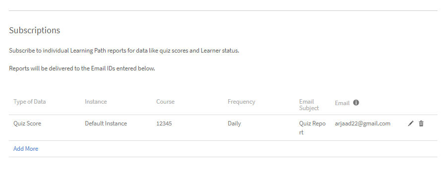

# 學習路徑

## 什麼是學習路徑？

行政人員通常希望建立詳盡的課程，以深入掌握特定主題或專業領域。 也可以是員工或客戶必須完成的一系列訓練課程。 這需要將一系列課程和計畫整合在一起，打造完整的訓練方案。

這正是學習路徑（Learning Path）發揮作用的地方。 學習路徑是學習者必須經歷一段旅程，隨著時間推移精通某個主題。 學習者能掌控自己的訓練經驗，並能以自我節奏更有效地獲取與記憶知識。

例如，組織在新員工入職時會進行政策與程序、文化、歷史等方面的培訓。 學習路徑會根據員工的需求設置課程，讓員工能依照為自己設定的學習路徑報名課程。 你可以選擇，也可以讓使用者在這條路徑上註冊，讓他們能從一門課進步到另一門課。

## 建立與配置學習路徑

在這場訓練中，你將學習如何建立學習路徑、新增課程、發布與退休學習路徑，以及在學習路徑內配置實例。

如果你無法啟動訓練，請寫信至 <almacademy@adobe.com>。

## 學習路徑的優點

學習路徑讓培訓課程的提供變得方便且無煩惱。 以下是學習路徑的一些主要好處：

1. 直接將技能和技能等級分配到學習路徑上。 不需要匹配技能點數。 一旦學習者完成學習路徑，即達到上述技能水準。
1. 能夠將現有的學習路徑嵌入新的學習路徑中。 嵌入功能僅可用於一層嵌入。 因此，已包含嵌入路徑的學習路徑，無法嵌入新的路徑中。
1. 能夠在學習路徑層級新增先修課程、工作輔助工具及資源。
1. 能夠建立分段。 每個章節都可以有標題。
1. 能夠將章節設為強制性並設定完成標準。

## 在學習管理員中新增學習路徑

在學習管理員的管理應用程式中，點擊 **[!UICONTROL Learning Path]** 左側面板。

在頁面 **[!UICONTROL Learning Path]** 中，點擊 **[!UICONTROL Add]**。 請輸入細節。

*新增學習路徑*

在「 **註冊類型** 」選項中，選擇 **「自行註冊** 」或 **「管理員註冊**」。

>[!NOTE]
>
>若選擇 **管理員選課** 選項，學習者將只看到經理提名或核准的課程。 學習者將無法在建議區塊看到學習路徑。

建立學習路徑後，選擇新建立的學習路徑，並加入路徑中的課程。

你可以新增技能並為學習路徑分配徽章。 要新增技能，請從 **[!UICONTROL Pick a Skill]** 下拉選單中選擇所需的技能。 也要選擇技能等級。

*新增技能*

為學習路徑分配徽章。 從可用徽章清單中挑選一個徽章。

從該區塊選擇產品、角色及職缺層級 **[!UICONTROL Recommend for]** ，向對這些產品與角色表達興趣的使用者建議此學習路徑。

*推薦*

根據你的偏好，選擇區段和訓練的順序類型為有序或無序。

如果你選擇「有序」，這些課程會依照你創建的順序出現。 如果你選擇無序，賽道就不會有順序。 學習者可依任意順序完成課程。

若要在學習路徑中新增課程，請點擊 **[!UICONTROL Add Courses or Learning Paths]**。

在跳出的對話框中，選擇你想加入學習路徑的訓練項目。

*將培訓加入學習路徑*

你還可以根據所分配的技能、修改日期和課程成效來排序課程。

選擇課程或學習路徑後，點擊 **[!UICONTROL Save]**。

在學習路徑中，你可以執行以下操作：

**建立與配置一個區段：** 一個區段用來將多個訓練課程分組，完成訓練的某一領域或重要組成部分。 每個部門都可以有標題。 每個章節也可以標示為必修，並有特定的完成要求。

**將課程設為每個章節的必修：** 如果你想或不想讓訓練在學習路徑中成為必修，請啟用或關閉必修選項。 如果你啟用這個勾選框，你可以選擇讓所有訓練都變成強制，或是部分訓練變成強制。

*讓每個部分的課程都成為必修*

**重新排列順序：** 你可以將賽道往上或往下移動，並改變它們的順序。

*重新安排訓練順序*

**移除課程：** 在課程卡片上點擊 X，將課程從學習路徑中移除。

*將課程從學習路徑中移除*

完成變更後，要發佈學習路徑，請點擊發佈。

## 巢狀或增強學習路徑

巢狀或增強學習路徑是指包含多個學習路徑的學習路徑。 要插入學習路徑，請遵循與在學習路徑中新增課程相同的流程。

*巢狀或增強學習路徑*

## 學習路徑設定

在設定區塊，你可以加入學習者在開始學習路徑前必須完成的先修條件和工作輔助資料。 你也可以加入對學習者有幫助的資源。

*變更學習路徑的設定*

## 實例

學習路徑實例會顯示一個額外的圖塊。 **[!UICONTROL Learning Paths]**&#x200B;該圖塊顯示該數字。 這些學習課程被納入學習路徑。

在 **課程** 圖塊中，你可以看到該實例中已註冊的學習者可見的課程實例。

**[!UICONTROL Enable Learners to Choose instances (Flexible Learning Path)]**&#x200B;該勾選框僅適用於課程。此選項允許學習者在學習路徑中切換實例。 所有兒童學習路徑都會有選項，可以將學習程式實例映射到 Learning Path。 預設情況下，映射設定為預設實例。

*學習路徑實例*

即使課程彈性且需學習者選擇課程，學習者仍可透過學習計畫或管理員註冊。 在這些情況下，系統允許學員即使名額已滿仍可註冊，但必須等到有空位才能開始課程。

候補名單功能僅適用於學習者自行報名時。 當課程達到座位限制時，講師可以查看候補學習者的名單。 若有空位，講師可加入候補學員，直到課程再次滿員。

## 通知

有三種選擇：

1. **[!UICONTROL All Skill Levels Courses and Learning Paths (selected by default)]學習** 者會收到任何未完成課程的通知，無論學習路徑中的等級為何。
1. **[!UICONTROL Root Learning Path]學習** 者會收到屬於家長學習路徑的任何未完成課程的通知。
1. **[!UICONTROL Learning Path + first Skill Level children only]學習** 者會收到任何未完成課程的通知，該課程是父學習路徑的第一個子課程。

通知提醒是根據選項觸發的。 預設情況下，該選項 **[!UICONTROL All Levels Courses and Learning Paths]** 會被啟用於實例中。

## 訂閱

你可以訂閱各個學習路徑，直接將包括測驗分數和學習者狀態的完整資訊直接送到你的信箱。

請依照以下步驟操作：

1. 前往任何學習路徑>訂閱。
1. 選擇「新增更多」。
1. 請選擇詳細資料並輸入電子郵件 ID 以接收報告。

*訂閱個人學習路徑*

## 重要說明

請注意，學習程式現有的功能將在發布後立即更名為學習路徑。 若您仍想稱之為學習計畫，我們建議您使用「術語」功能來套用所需的術語。 這樣你就可以使用「學習計畫」這個詞。

學習路徑為你帶來多種功能。 其中一些會在發行後立即取得。 管理員/作者可以開始使用它們。 像「區段」、「在另一路徑新增學習路徑」等擴充功能已被停用，可透過勾選下方提及的勾選框來啟用。

學習者可以繼續使用學習程式（現稱為學習路徑），作者/管理員也能繼續創建這些程式。 為了利用上述學習路徑的擴展功能，管理員應啟用如下所述的設定。 啟用後，學習路徑的所有新擴展功能將全面開放。

**[!UICONTROL Settings]** >**[!UICONTROL General]**&#x200B;頁面新增了一個啟用學習路徑的選項。若啟用此選項，你可以在學習路徑中新增課程與學習計畫。 啟用後你就無法更改這個選項。

<!--
 ## Other Learning Path-related details 

### Learning Path option is disabled/unchecked in Admin Settings

**Accounts using Native Web apps**

**Learners**

* By default, learners will notice a change in terminology from "Learning Program" to Learning Path". This has been done to make the interface more intuitive. If you do not want this change, refer to the below points.  

* This change however will not be reflected in the UI if you have already used the 'Custom Terminology" function to replace the terminology "Learning Programs" with some custom text. 
* In case you had not used the Custom Terminology function yet but now wish to retain "Learning Programs" as the terminology, you can do so via the 'Custom Terminology' feature post the release.

* The overall cosmetic look and feel of erstwhile 'Learning Programs' will get updated to a more visually rich look and feel.

**Authors and Admins**

* The terminology within the Admin/Author apps is the same as that of learners.
* The UI for Authors and Admins to create, update the erstwhile 'Learning Program' objects will now be updated to the new UI. There is no loss of functionality, just that the User Interface to do the operation will be much more intuitive. These UI changes will reflect in your account, even if you have chosen not to enable 'Extended Features of Learning Path', with no loss in functionality. 

* Note that any existing Learning Program objects will not change so there is no impact on learners (other than the terminology point noted above). Authors/Admins might notice a default grouping called "Section" within their existing objects, which would be of no material impact as far as functionality goes. Authors/Admins will also see added functionalities like Skills, Job Aids etc. But as you haven't used it yet, it will not create any impact on the learner side till you actually start using it.

**Reporting**

* If you do not enable the option, Learning Path , there are no changes in the Learner Transcript report structure due to Learning Path. But as communicated in earlier notice (refer to the table shared in earlier communication); one new column will get added to the extreme right of the Learner Transcript immediately after the release.

**Accounts using Headless LMS**

**Learners**

* There are no changes for learners in headless interface. APIs as well that are used to generate the reports does not have immediate changes. 

**Authors and Admins**

* Same changes as that of Authors/Admins stated above.

**Reporting**

* Same changes as that of Reporting stated above.

### Learning Paths option is enabled/checked in Admin Settings

**Accounts using Native Web apps**

**Learners**

* Same changes as that of Learners when the option is disabled.
* As you start using the extended functionality of Learning Paths, Learners will benefit from seeing more elaborate paths with embedded paths and sections, Skills and badges being earned on path completion, resources at path level, and other benefits.

**Authors and Admins**

* Same changes as that of Authors and Admins when the option is disabled.

* Users will get more functionality in crafting elaborate paths. You can define Skill-Levels that would automatically be achieved by a learner on completion of path (not have to focus on the arithmetic of Credits for the levels). Resources can be added at the path level (Not possible as of today). Sections can be created with each section having the ability to have X of Y options. One can embed a Learning Path within another Learning Path (one level of hierarchy supported)

**Reporting**

* A few new columns will get added to the 'Learner Transcript' and 'Content Report' structures to incorporate the new feature of embedding of paths within paths. This may impact integration code that you may have written to export this data to your custom data warehouse/DB outside Learning Manager. This information is communicated in the table provided in earlier communication.

**Accounts using Headless LMS**

**Learners**

* There is no change for your learners, unless you make changes to your headless LMS implementation, as the APIs on which you have built your headless interface will not be changing.
* If you do start using the extended features of Learning Paths by creating new Learning Paths, however you will have to make changes to the headless LMS implementation to reflect those on your learner app. The Learning Manager APIs will allow you to do that.

**Authors and Admins**

* Same changes as that of Authors/Admins stated above.

**Reporting**

* Same changes as that of Reporting stated above. 
-->
