# 學習方案

在Learning Manager中為管理員建立學習計畫。

## 概觀 {#overview}

學習計畫是一組規則，可根據特定條件將學習者註冊至指定的培訓。

學習計畫可讓管理員根據某些事件（如新員工入職或員工指定或地點變更）的發生自動指派課程、學習計畫或認證。

例如，當員工加入組織時，「新員工方向計畫」會自動指派給員工。 同樣地，如果員工被提升為經理，則會自動將新的經理指導計畫指派給員工。

您可以根據預先定義的事件集，自動為學習者註冊任何課程和學習計畫。 您可以在學習者完成技能、課程或學習計畫後，自動指派後續學習活動，建立學習者的學習路徑。

## 建立學習計畫 {#createlearningplans}

若要建立學習方案，您必須以管理員身分登入。

1. 在左窗格中，按一下&#x200B;**[!UICONTROL Learning Plans]**。 如果有任何現有事件，則會列在頁面上。 不過，如果您是第一次設定學習計畫功能，請繼續進行下一個步驟。
1. 在頁面的右上角，按一下&#x200B;**[!UICONTROL Add]**。 在&#x200B;**[!UICONTROL Add Learning Plan]**&#x200B;對話方塊中，輸入員工必須接受的學習計畫名稱。

   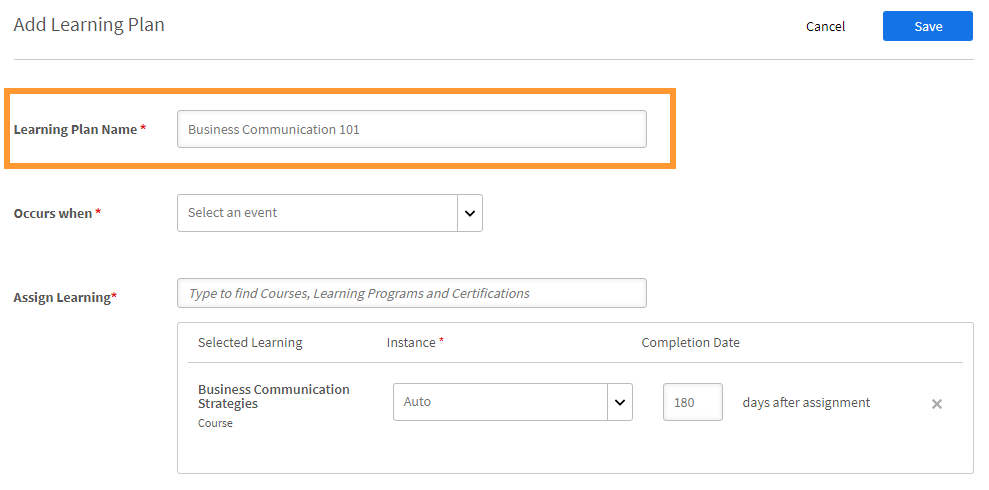

1. 在&#x200B;**[!UICONTROL Occurs when]**&#x200B;下拉式清單中，選擇所需的事件。 這些選項決定學習者何時參加課程。 選取活動型別後，請選取適當的培訓、課程、學習計畫或認證。

>[!NOTE]
>
> 管理員和作者都可以建立自動註冊事件。

事件包括：

**1 — 新增學習者：**&#x200B;當新使用者或員工加入組織時。

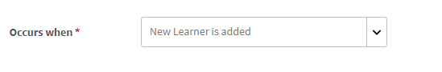

**2 — 學習者已新增至群組：**&#x200B;當新使用者或員工加入群組時。  輸入並從下拉式清單中選取此事件適用的使用者群組。 您可以選擇多個群組。 您也可以選取選項，將此事件指派給這些群組的所有現有成員。

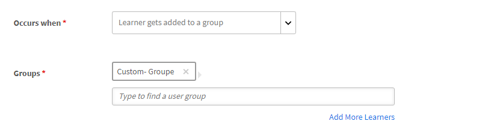

此學習計畫是專為&#x200B;***自訂 — 群組***&#x200B;使用者設計的。 在欄位中輸入群組的名稱，然後使用預先輸入搜尋來選擇一個或多個群組。

**3 — 學習者從群組移除：**&#x200B;使用者或學習者從群組移除時會觸發此事件。 輸入並從下拉式清單中選取此事件適用的使用者群組。 您可以選擇多個群組。

**4 — 學習者完成課程/學習路徑/認證：**&#x200B;當學習者完成任何學習物件（例如課程、學習計畫等）時，就會觸發此事件。 選取此事件適用的學習物件。 選取事件的完成狀態。 或者，您也可以選擇此學習者所屬的使用者群組。 輸入天數，完成學習物件後，此事件即會觸發。 如果您想要將此事件指派給已完成此學習物件的現有使用者，請選取選項。

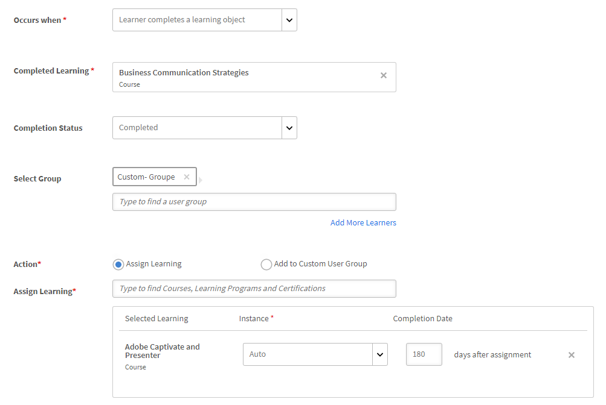

**5 — 學習者未通過課程模組：**&#x200B;當學習者未通過任何學習物件（例如課程、學習計畫等）時，就會觸發此事件。 選取此事件適用的學習物件。 您也可以選擇此學習者所屬的使用者群組。

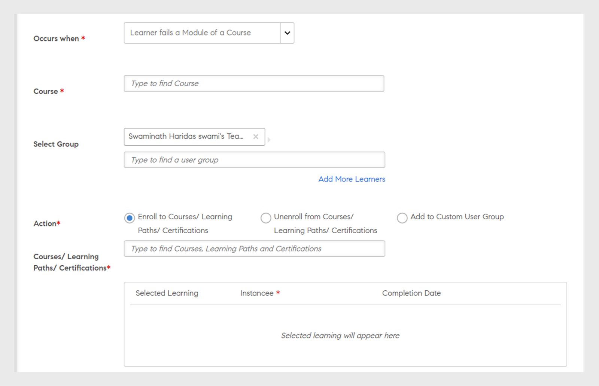

**4 — 學習者達到技能等級：**&#x200B;輸入技能名稱並選取技能等級。 您也可以選擇此學習者所屬的使用者群組。 這是選擇性的。 輸入天數，在達到技能後，此事件就會觸發。 如果您想要將此事件指派給已習得此技能的現有學習者，請選取選項。

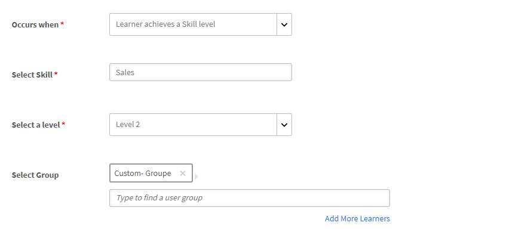

此外，設定必須於幾天後將「學習計畫」指派給學習者。

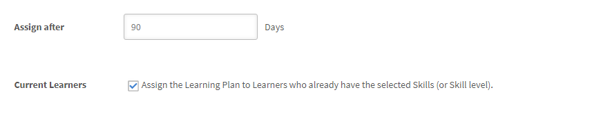

**5 — 在特定日期：**&#x200B;事件必須發生在特定日期時。 選取必須指派事件的日期。 選取需要自動指派事件的使用者群組。 選取需要指派的執行個體，並選擇性地在需要觸發事件多少天後輸入。

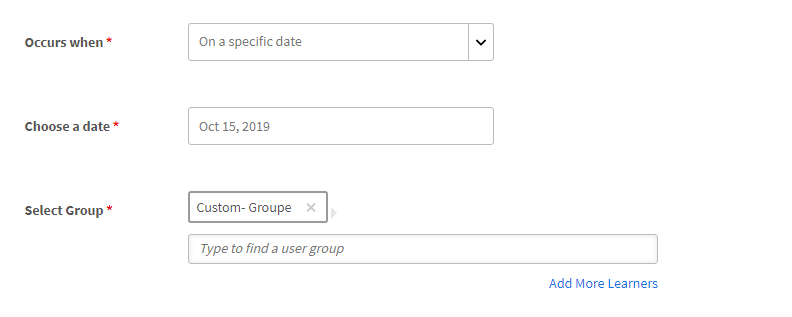

1. 您可以從&#x200B;**[!UICONTROL Instance]**&#x200B;下拉式清單中選取所有事件的執行個體。 您也可以為任何活動選取已指派學習專案的例項。

   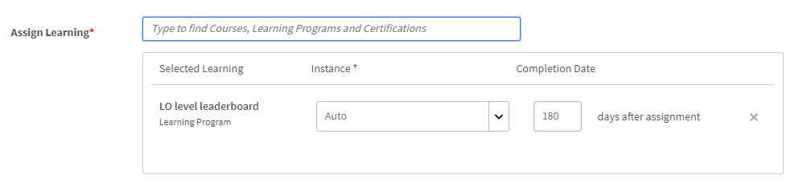

   在Learning Manager中，學習計畫會建立自己的例項「自動」。 如果您選擇群組（例如「所有學習者」），則根據預設，學習計畫中的所有學習者都會自動註冊例項。

   儲存學習計畫時，執行個體「自動」會在課程的「學習者」區段的「**[!UICONTROL Select Instance]**」下拉式清單中顯示為選項。

1. 若要儲存學習方案，請按一下&#x200B;**[!UICONTROL Save]**。

## 取消訓練註冊 {#unenroll-training}

新增學習計畫時，管理員可以根據特定觸發器將使用者從特定培訓中取消註冊。

在管理員應用程式上，按一下&#x200B;**[!UICONTROL Learning Plans]** > **[!UICONTROL Add]**。

下一節代表已新增選項&#x200B;**[!UICONTROL Unenroll from Training]**&#x200B;的觸發程式。

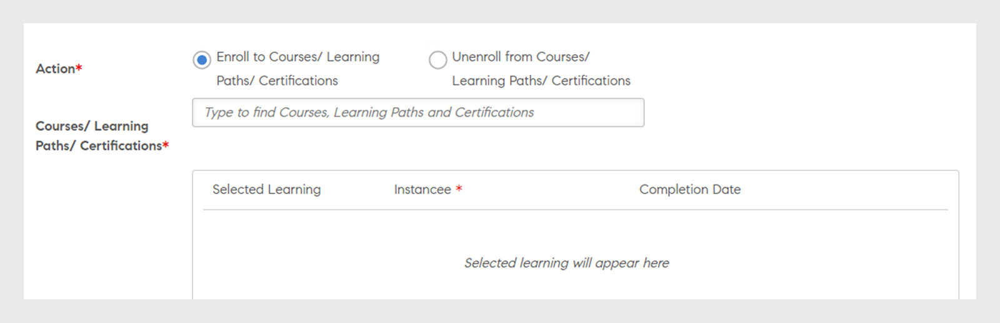

## 學習者從群組中移除 {#learnergetsremovedfromagroup}

1. 新增一或多個使用者群組。 如果選取了多個群組，當學習者從提及的任一群組中移除時，就會觸發計畫。
1. 選擇動作為&#x200B;**[!UICONTROL Unenroll from training]**。

   1. 管理員可選擇從使用者群組移除使用者時，該使用者會從中取消註冊的培訓。
   1. 執行個體和完成日期將不適用於此情境。

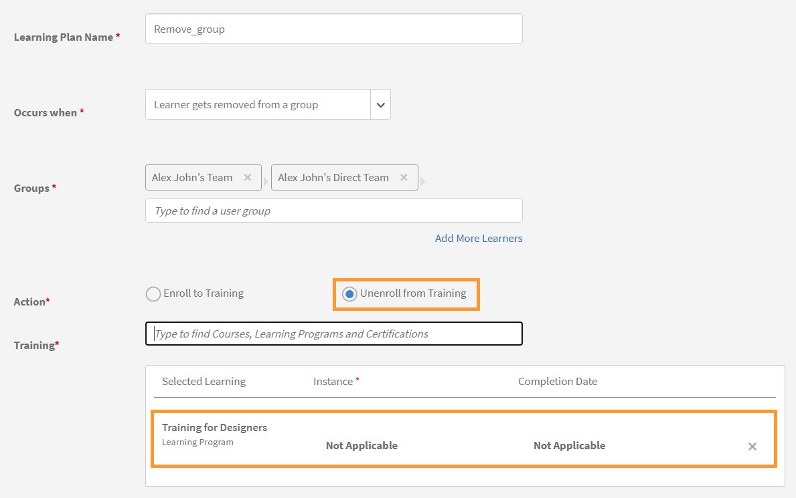

## 學習者完成訓練 {#learnercompletesatraining}

1. 新增一或多個使用者群組。 如果選取了多個群組，則當學習者完成指定的訓練時會觸發計畫。
1. 選擇動作為&#x200B;**[!UICONTROL Unenroll from training]**。

   1. 管理員可選擇在使用者新增至使用者群組時，使用者會從中取消註冊的培訓。
   1. 執行個體和完成日期將不適用於這種情況。

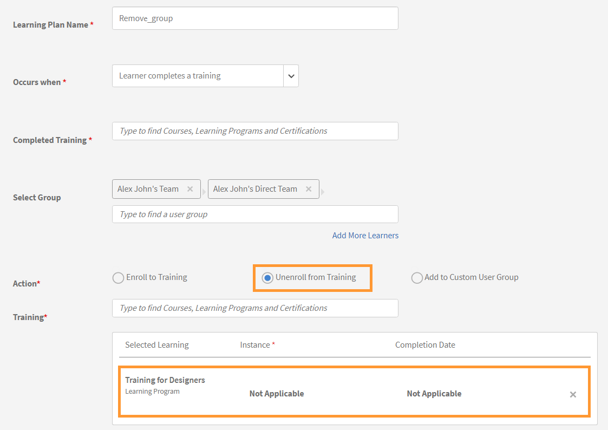

## 學習者未通過課程模組

1. 新增一或多個使用者群組。 如果選取了多個群組，則當學習者未能通過指定的培訓時會觸發計畫。
1. 選擇動作為&#x200B;**[!UICONTROL Unenroll from training]**。

   1. 管理員可選擇在使用者新增至使用者群組時，使用者會從中取消註冊的培訓。
   1. 執行個體和完成日期將不適用於這種情況。

## 學習者已新增至群組 {#learnergetsaddedtoagroup}

1. 新增一或多個使用者群組。 如果選取了多個群組，則會於學習者新增至提及的任一群組時觸發計畫。
1. 選擇動作作為「取消訓練註冊」。

   1. 管理員可選擇在使用者新增至使用者群組時，使用者會從中取消註冊的培訓。
   1. 執行個體和完成日期將不適用於這種情況。

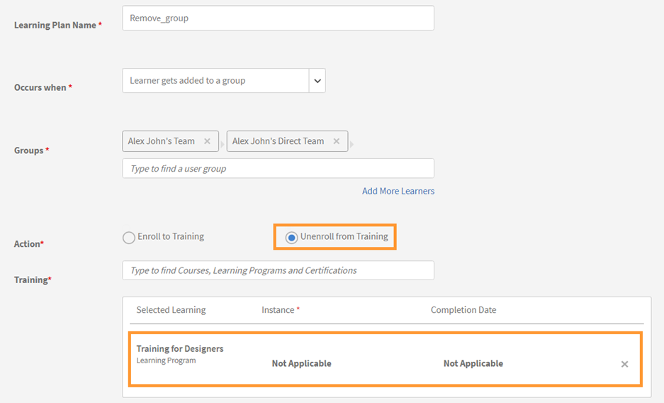

## 學習者達到技能等級 {#learnerachievesaskilllevel}

1. 指定要習得的技能。
1. 新增一或多個使用者群組。 如果選取了多個群組，則當學習者達到所選技能時會觸發計畫。

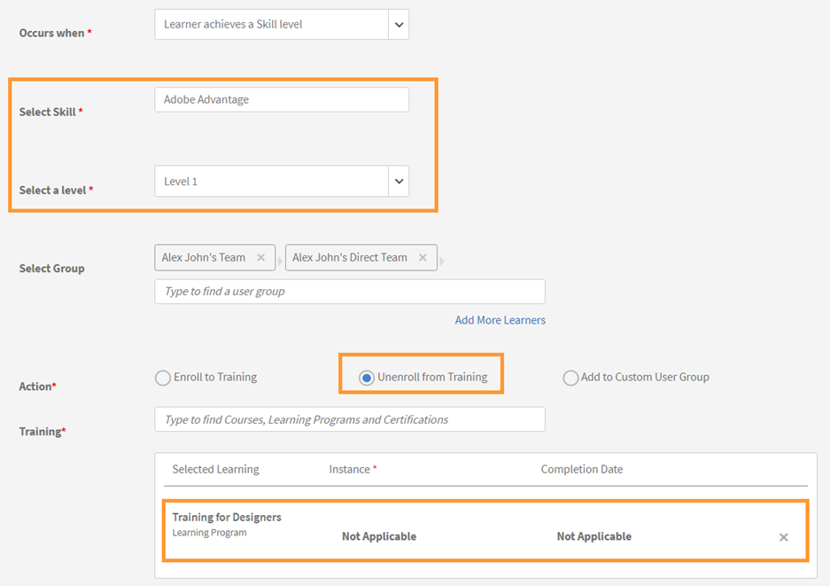

## 在特定日期 {#onaspecificdate}

1. 選擇應該取消註冊學習者的日期。
1. 新增一或多個使用者群組。 如果選取了多個群組，則會在日期觸發計畫，並取消註冊屬於所選群組的使用者。
1. 選擇動作作為「取消訓練註冊」。

   1. 管理員可選擇在指定日期取消註冊時，使用者將會從哪些培訓中取消註冊。
   1. 執行個體和完成日期將不適用於這種情況。

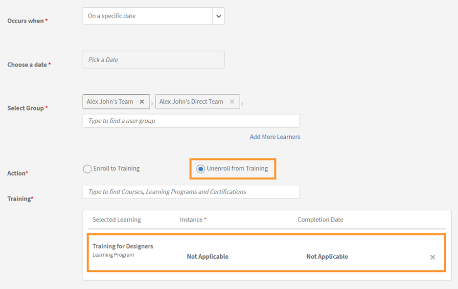

## 編輯學習方案 {#editalearningplan}

建立學習計畫後，管理員可隨時編輯/更新學習計畫。 若要編輯，請選取學習計畫名稱，並修改所顯示&#x200B;**[!UICONTROL Edit Learning Plan]**&#x200B;快顯對話方塊中的值。  選取&#x200B;**[!UICONTROL Save]**。

>[!NOTE]
>
>您無法在&#x200B;**[!UICONTROL Edit Learning Plan]**&#x200B;快顯視窗中修改&#x200B;**[!UICONTROL Occurs when]**&#x200B;選項。

## 啟用學習方案 {#enablealearningplan}

依預設，您建立的所有新學習計畫都會處於停用狀態。 您必須為要指派的學習者啟用計畫。 當您啟用核取方塊&#x200B;**[!UICONTROL Current Learners]**&#x200B;時，事件會自行啟用。

若要啟用學習方案，

1. 從「學習方案」清單中，選擇要啟用的方案。

   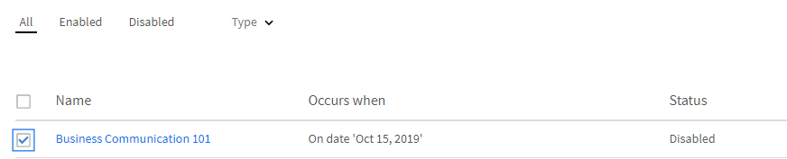

1. 在頁面的右上角，按一下&#x200B;**[!UICONTROL Actions]** > **[!UICONTROL Enable]**。 這會啟用學習方案。

## 刪除學習方案 {#deletealearningplan}

若要刪除學習方案，

1. 從「學習方案」清單中，選擇您要刪除的方案。
1. 在頁面的右上角，按一下&#x200B;**[!UICONTROL Actions]** > **[!UICONTROL Delete]**。

## 停用學習方案 {#disablealearningplan}

若要停用學習方案，

1. 按一下索引標籤&#x200B;**[!UICONTROL Enabled]**。
1. 從「學習方案」清單中，選擇要停用的方案。
1. 在頁面的右上角，按一下&#x200B;**[!UICONTROL Actions]** > **[!UICONTROL Disable]**。 這會將計畫移至&#x200B;**[!UICONTROL Disabled]**&#x200B;標籤。

## 篩選學習計畫 {#filteralearningplan}

您可以根據建立學習計畫時使用的事件型別來篩選學習計畫。 按一下&#x200B;**[!UICONTROL Type]**&#x200B;並選擇任何選項以顯示符合選取範圍的學習計畫。

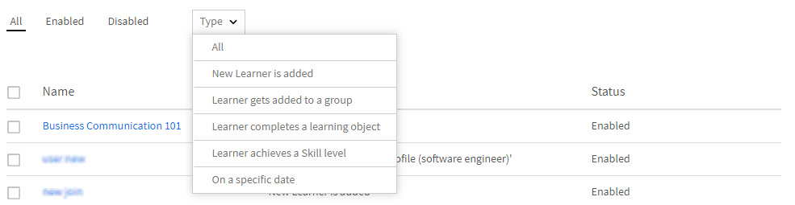

## 常見問題 {#frequentlyaskedquestions}

1. 如何設定Learning Manager以設定新員工上線的自動註冊？

   在&#x200B;**[!UICONTROL Occurs when]**&#x200B;下拉式清單中選擇選項&#x200B;**[!UICONTROL New Learner is added]**。 然後為學習者指派學習物件、例項和完成日期。 管理員和作者都可以建立自動註冊事件。 建立事件後將其啟用。

1. 如何設定教室和虛擬教室課程的學習計畫/自動註冊？

   建議您使用必要的作業階段詳細資訊來設定課程執行個體。 然後設定學習計畫並將其對應至已建立的課程例項。

1. 如何檢視已註冊特定學習計畫的學習者清單？

   當執行個體自動建立時，按一下&#x200B;**[!UICONTROL Course]** > **[!UICONTROL Learners]**，然後從&#x200B;**[!UICONTROL Instance]**&#x200B;下拉式清單中選擇所需的執行個體。
