# 學習計畫

在學習管理員中為管理員建立學習計畫。

## 概觀 {#overview}

學習計畫是一套規則，根據特定標準為學習者報名特定訓練。

學習計畫允許管理員根據特定事件（如新員工入職、員工職稱或地點變更）自動分配課程、學習計畫或證照。

例如，當員工加入組織時，新員工入職培訓計畫會自動分配給該員工。 同樣地，若員工晉升為經理，該員工會自動分配新經理入職培訓計畫。

你可以根據預先定義的事件，自動為學習者報名任何課程和學習計畫。 你可以在學習者完成技能、課程或學習計畫後，自動指派後續學習活動，為學習者建立學習路徑。

## 制定學習計畫 {#createlearningplans}

要建立學習計畫，您必須以管理員身份登入。

1. 在左側窗格，點擊 **[!UICONTROL Learning Plans]**。 若有任何現有活動，則會列在頁面上。 不過，如果你是第一次設定學習計畫功能，那就繼續下一步。
1. 在頁面右上角，點擊 **[!UICONTROL Add]**。 在對話框中 **[!UICONTROL Add Learning Plan]** ，輸入員工必須修讀的學習計畫名稱。

   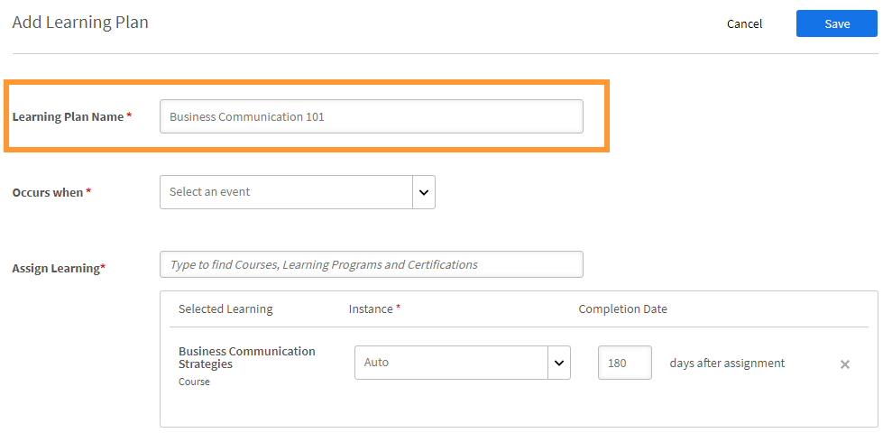

1. 在 **[!UICONTROL Occurs when]** 下拉選單中，選擇所需的事件。 管理員可以一次新增一個活動。
這些選項決定了學習者何時參加課程。 選擇活動類型後，請選擇適當的培訓、課程、學習計畫或認證。

>[!NOTE]
>
> 管理員和作者都可以建立自動註冊事件。

活動如下：

**1 - 新增學習者：** 當新使用者或員工加入組織時。

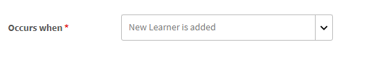

**2 - 學習者加入群組：** 當新使用者或員工加入群組時。  從下拉選單輸入並選擇該事件適用的使用者群組。 你可以選擇多個群組。 此外，你也可以選擇選項，將此事件指派給這些群組中所有現有成員。

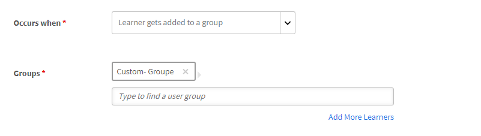

此學習計畫專為客製化集團&#x200B;***用戶設計***。在欄位輸入群組名稱，並使用預先輸入搜尋，選擇群組名稱。

**3 - 學習者被移除出群組：** 當使用者或學習者被移除時，事件會被觸發。 從下拉選單輸入並選擇該事件適用的使用者群組。 你可以選擇多個群組。

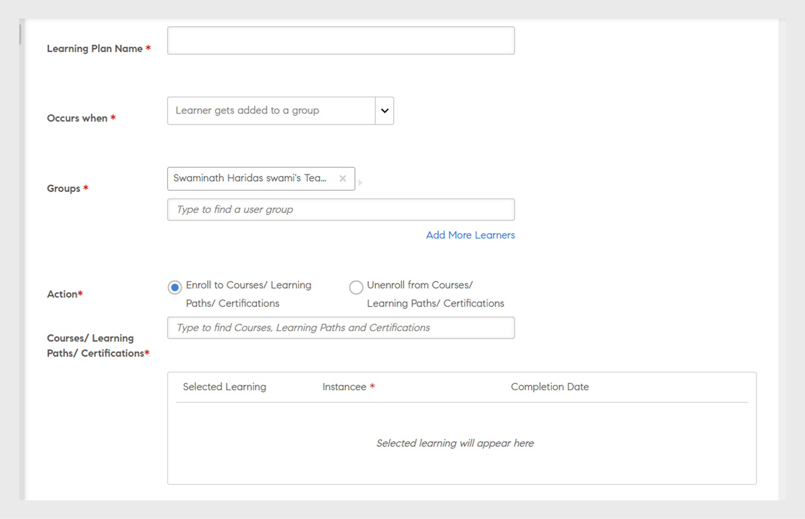

**4 - 學習者完成課程/學習路徑/認證：** 當學習者完成任何學習對象（如課程、學習程式等）時，該事件會觸發。 選擇該事件適用的學習對象。 選擇活動的完成狀態。 你也可以選擇該學習者所屬的使用者群組。 輸入天數，完成學習物件後，這個事件就會觸發。 如果你想將此事件指派給已完成此學習物件的現有使用者，請選擇此選項。

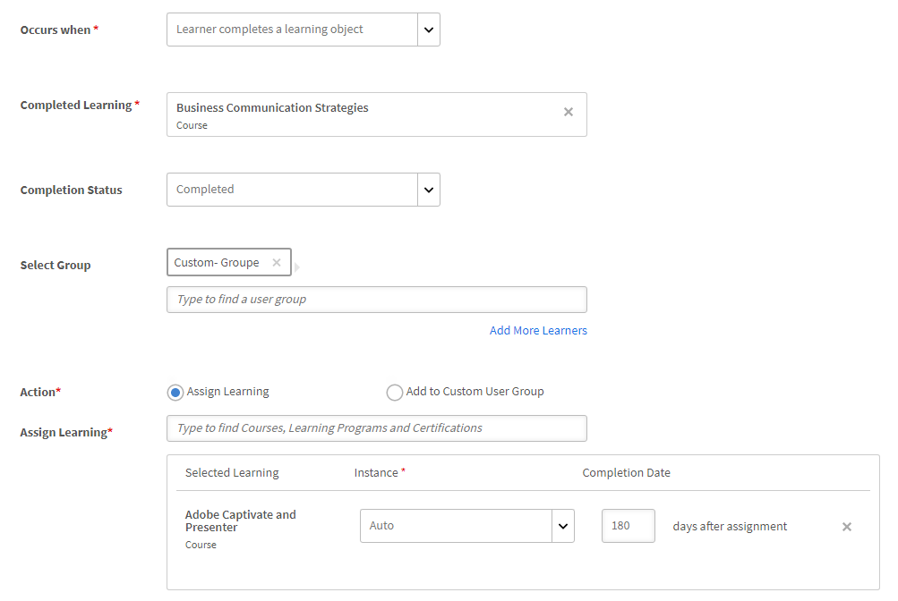

**5 - 學習者在課程模組中失敗：** 當學習者在任何學習對象（如課程、學習程式等）失敗時，事件就會觸發。 選擇該事件適用的學習對象。 您也可以選擇該學習者所屬的使用者群組。

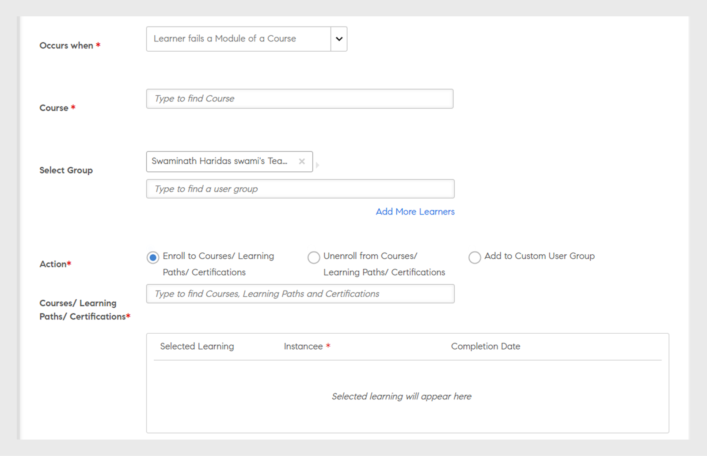

**4 - 學習者達到技能等級：** 輸入技能名稱並選擇技能等級。 您也可以選擇該學習者所屬的使用者群組。 這是可選的。 輸入天數，達成該技能後，這個事件就會觸發。 如果你想將此活動指派給已達成此技能的現有學習者，請選擇該選項。

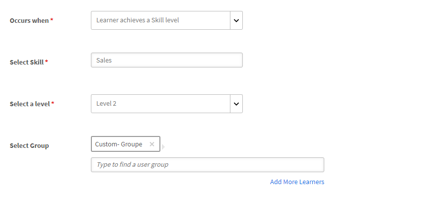

此外，設定學習計畫必須分配給學習者的天數。

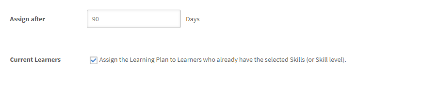

**5 - 特定日期：** 事件必須在特定日期發生。 選擇必須指定活動的日期。 選擇需要自動指派事件的使用者群組。 選擇需要指派的實例，並可選擇在事件觸發天數後輸入。

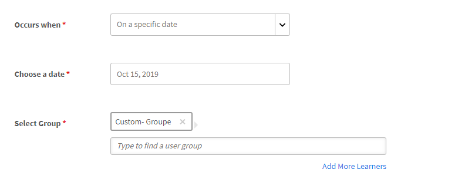

1. 對於所有事件，你可以從 **[!UICONTROL Instance]** 下拉選單中選擇實例。 你也可以選擇任何事件中分配的學習實例。

   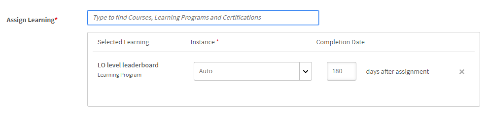

   在學習管理器中，學習計畫會建立自己的實例，稱為自動（Auto）。 例如，當你選擇群組，例如「所有學習者」時，學習計畫中的所有學習者預設都會被註冊在自動實例中。

   當你儲存學習計畫時，自動實例會以選項形式 **[!UICONTROL Select Instance]** 出現在課程學習者區塊的下拉選單中。

1. 要儲存學習計畫，請點擊 **[!UICONTROL Save]**。

## 退學訓練 {#unenroll-training}

新增學習計畫時，管理員可根據特定觸發條件取消特定培訓的使用者。

在管理應用程式中，點擊 **[!UICONTROL Learning Plans]** > **[!UICONTROL Add]**。

接下來的章節代表該選項 **[!UICONTROL Unenroll from Training]** 加入的觸發條件。

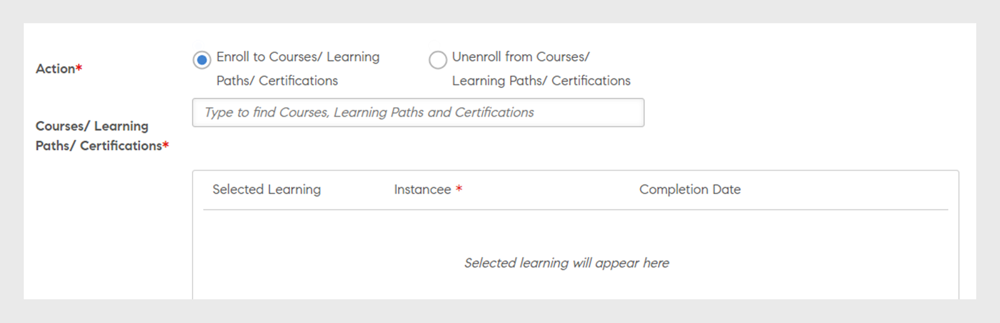

## 學習者會被從群組中移除 {#learnergetsremovedfromagroup}

1. 新增一個或多個使用者群組。 若選擇多個群組，當學習者被從上述群組中移除時，計畫即會啟動。
1. 選擇動作為 **[!UICONTROL Unenroll from training]**。

   1. 管理員可以選擇在移除使用者群組時，將該培訓項目從哪些課程中退役。
   1. 此情況下，實例與完成日期不適用。

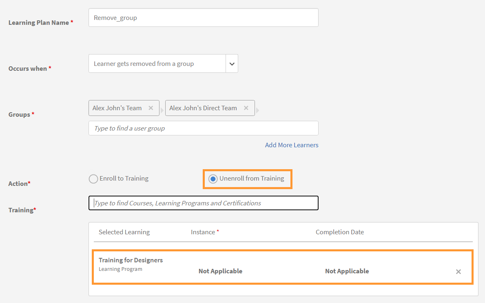

## 學習者完成訓練 {#learnercompletesatraining}

1. 新增一個或多個使用者群組。 若選擇多個小組，當學習者完成指定訓練時，計畫即被觸發。
1. 選擇動作為 **[!UICONTROL Unenroll from training]**。

   1. 管理員可選擇新增使用者群組時退名的培訓課程。
   1. 本案不適用實例及完成日期。

## 學習者在課程中某個模組不及格

1. 新增一個或多個使用者群組。 若選擇多個組別，當學習者未完成指定訓練時，計畫會被觸發。
1. 選擇動作為 **[!UICONTROL Unenroll from training]**。

   1. 管理員可選擇新增使用者群組時退名的培訓課程。
   1. 本案不適用實例及完成日期。

## 學習者會被加入群組 {#learnergetsaddedtoagroup}

1. 新增一個或多個使用者群組。 若選擇多個群組，則當學習者被加入上述任一群組時，計畫即被觸發。
1. 選擇動作為「從訓練中退役」。

   1. 管理員可選擇新增使用者群組時退名的培訓課程。
   1. 本案不適用實例及完成日期。

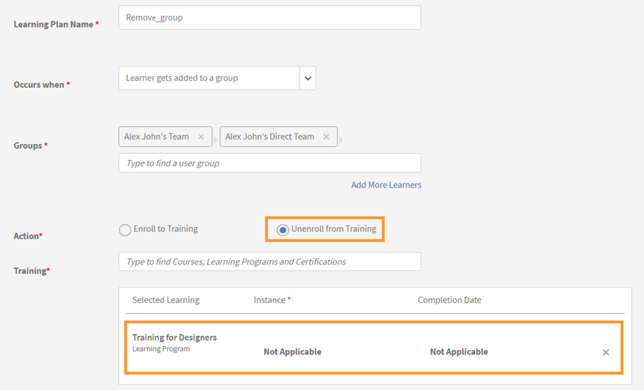

## 學習者達到一定的技能水準 {#learnerachievesaskilllevel}

1. 指定要達成的技能。
1. 新增一個或多個使用者群組。 若選擇多個組別，當學習者達成所選技能時，計畫會被觸發。

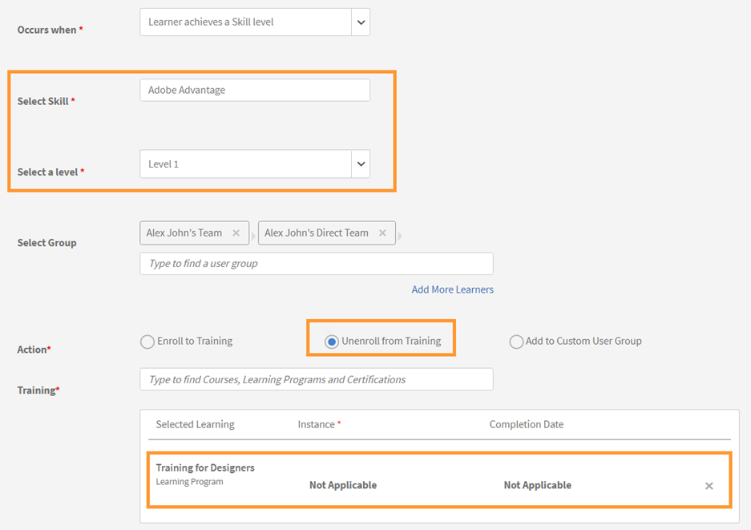

## 在特定日期 {#onaspecificdate}

1. 選擇學習者應退學的日期。
1. 新增一個或多個使用者群組。 若選擇多個群組，計畫會在當天觸發，並取消所選群組中的使用者。
1. 選擇動作為「從訓練中退役」。

   1. 管理員可在指定日期退選時，選擇使用者將退選的培訓課程。
   1. 本案不適用實例及完成日期。

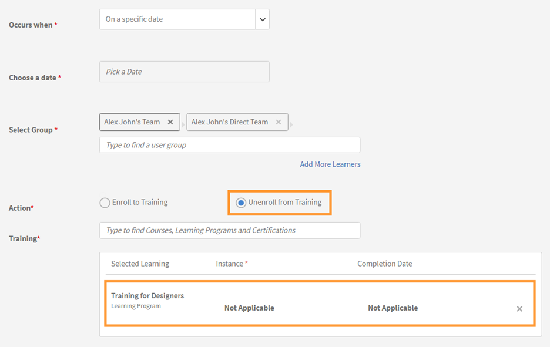

## 編輯學習計畫 {#editalearningplan}

建立學習計畫後，管理員可隨時編輯或更新學習計畫。 要編輯，請選擇學習計畫名稱，並在彈出視窗中修改數值 **[!UICONTROL Edit Learning Plan]** 。  選擇 **[!UICONTROL Save]**。

>[!NOTE]
>
>你無法修改 **[!UICONTROL Occurs when]** 彈出視窗中的 **[!UICONTROL Edit Learning Plan]** 選項。

## 啟動學習計畫 {#enablealearningplan}

預設情況下，您所建立的所有新學習計畫都處於失效狀態。 您必須為學習者分配計畫。 當你啟用勾選框 **[!UICONTROL Current Learners]**&#x200B;時，事件會自動啟用。

為了實現學習計畫，

1. 從學習計畫清單中，選擇你想要啟用的計畫。

   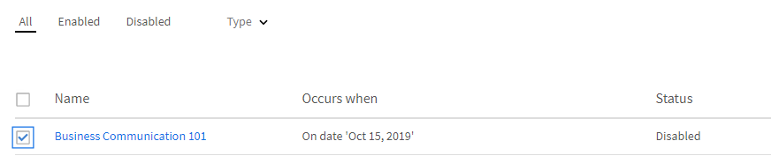

1. 在頁面右上角，點擊 **[!UICONTROL Actions]** > **[!UICONTROL Enable]**。 這使學習計畫得以實現。

## 刪除學習計畫 {#deletealearningplan}

要刪除學習計畫，

1. 從學習計畫清單中，選擇你想刪除的計畫。
1. 在頁面右上角，點擊 **[!UICONTROL Actions]** > **[!UICONTROL Delete]**。

## 停用學習計畫 {#disablealearningplan}

要停用學習計畫，

1. 點擊分頁 **[!UICONTROL Enabled]**。
1. 從學習計畫清單中，選擇你想停用的方案。
1. 在頁面右上角，點擊 **[!UICONTROL Actions]** > **[!UICONTROL Disable]**。 這樣計畫就會移到分 **[!UICONTROL Disabled]** 頁。

## 篩選學習計畫 {#filteralearningplan}

你可以根據建立學習計畫時所使用的事件類型來篩選學習計畫。 點擊 **[!UICONTROL Type]** 並選擇任何選項，即可顯示與所選方案相符的學習計畫。

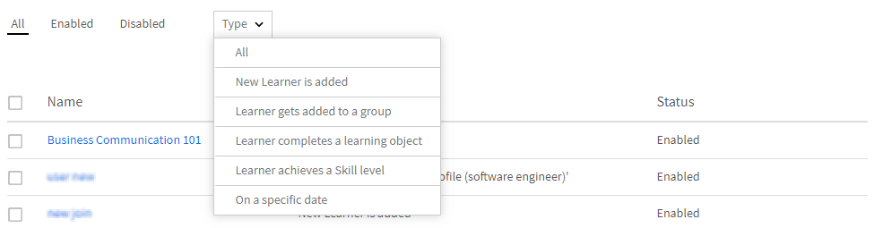

## 常見問題 {#frequentlyaskedquestions}

1. 我該如何設定學習管理員來設定新進員工的自動入職？

   在 **[!UICONTROL Occurs when]** 下拉選單中，選擇選項 **[!UICONTROL New Learner is added]**。 接著指派學習對象、實例及完成日期給學習者。 管理員和作者都可以建立自動註冊事件。 建立事件後啟用。

1. 我該如何為教室和虛擬教室課程設定學習計畫/自動註冊？

   建議你先設定課程實例並輸入所需的課程細節。 接著建立學習計畫，並將其映射到已經建立好的課程實例。

1. 我該如何查看已註冊到特定學習計畫的學習者名單？

   當自動實例建立後，點擊 **[!UICONTROL Course]** > **[!UICONTROL Learners]**，並從 **[!UICONTROL Instance]** 下拉選單中選擇所需的實例。
