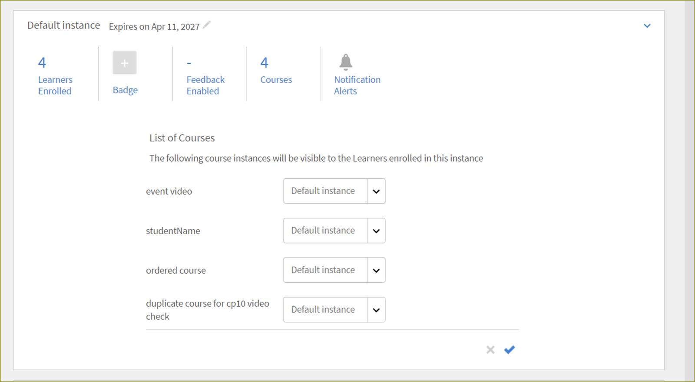
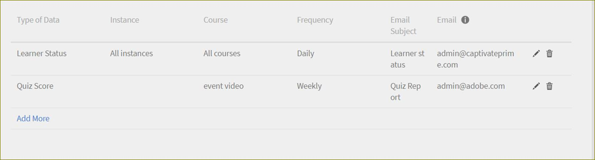

# 學習計畫

>[!WARNING]
>
>Adobe Learning Manager已棄用學習計畫。

閱讀本文章，瞭解如何在Learning Manager中建立和管理學習計畫

學習計畫是一組設計獨特的課程，可滿足特定學習者的目標。 管理員會為學習者建立這些學習計畫。 您可以學習者身分檢視這些學習計畫。

## 建立學習計畫 {#createalearningprogram}

管理員可以建立學習計畫。 若要建立學習計畫，請遵循下列步驟：

1. 以管理員身分登入。 按一下左窗格上的&#x200B;**[!UICONTROL Learning program]**。 學習計畫頁面會顯示現有學習計畫的清單（如果已為您組織建立）。
1. 按一下頁面右上角的「新增」 。 新增學習計畫頁面隨即顯示。
1. 輸入學習計畫名稱、概要，然後輸入計畫的權益。
1. 若要在其他區域設定中建立學習計畫，請按一下頁面頂端的「新增語言」 。 選取您需要的語言，然後按一下「新增」。 您可能需要以所有選擇的語言新增所有學習計畫中繼資料。 否則，會針對其他語言環境顯示英文資訊。
1. 輸入學習計畫的唯一學習物件ID。 唯一ID應僅包含字母和數字，不含特殊字元。 任何兩個學習物件都不應具有相同的ID。
1. 根據您的選擇，選擇註冊型別為管理員註冊或自行註冊。 選取取消註冊選項和課程訂購選項，然後按一下「儲存」。 如果您選擇自行註冊，學習者便可將自己註冊至學習計畫。

   課程頁面會顯示以將課程新增至學習計畫。 您可在其中看到「課程」和「目錄」標籤。

   **附註**

   所有型別的課程均可新增至學習計畫。 這些包括教室和虛擬教室課程、活動、自控進度以及混合式課程。 經理指派和經理核准的課程未出現在課程選擇期間學習計畫中。

1. 您必須先新增課程至學習計畫才能發佈。 按一下「**[!UICONTROL Catalog]**」標籤，將課程與學習計畫建立關聯。 所有可用課程的清單隨即顯示。

1. 將滑鼠指標暫留在任何課程卡上，並按一下滑鼠指標，以選擇要新增至學習計畫的課程。 如果課程尚未新增至學習計畫，您可以檢視該課程卡片中間的+符號。

   若要包含更多課程，請重複此步驟。

   **附註**

   在&#x200B;**[!UICONTROL Curriculum]**&#x200B;索引標籤中檢視學習計畫的所有新增課程清單。 新增的課程標籤會顯示在&#x200B;**[!UICONTROL Catalog]**&#x200B;標籤中課程卡底部的新增標籤。

1. 按一下左窗格頂端的&#x200B;**[!UICONTROL Back to programs]**&#x200B;以檢視所有學習計畫的清單。 您可以看到這裡列出您新新增的學習計畫。
1. 您可以按一下左窗格中的「概述」 ，然後選擇「動作>Publish」來發佈學習計畫。 您也可以按一下頁面右上角的Publish ，透過「課程與例項」檢視發佈學習計畫。

## 將學習者新增至學習計畫 {#addlearnerstoalearningprogram}

如需註冊學習者及遵循步驟的詳細資訊，請參閱[註冊學習者。](courses.md#main-pars_header_1058138132)

## 為學習計畫啟用完整目錄控制 {#catalog}

就像授與學習或模組[&#128279;](shared-catalog-full-control.md)的完整目錄控制項一樣，您也可以為學習方案啟用完整的目錄控制項。

## 重設課程

管理員可以在學習計畫中重設課程進度。

管理員可從學習計畫重設課程進度。

若要重設課程，管理員必須從「課程」下拉式選單中選取課程。

然後從&#x200B;**[!UICONTROL Actions]**&#x200B;下拉式清單中按一下&#x200B;**[!UICONTROL Reset Course]**。

學習者現在可以從頭開始啟動所選課程的模組。

**注意：只會重設課程中失敗和未完成的模組。**

## 建立多個學習計畫例項 {#createmultipleinstancesoflearningprograms}

您可以建立一個課程或學習計畫的多個執行個體。

1. 按一下左窗格中的「學習方案」 。
1. 按一下課程/學習計畫縮圖清單中的學習計畫名稱。
1. 從左窗格按一下「執行處理」。
1. 按一下課程資訊右上角的「新增執行個體」。
1. 隨即顯示學習計畫的新例項。
1. 按一下新執行個體上的編輯圖示（如快照中的紅色箭頭所示）以修改課程/學習計畫值，例如截止日期、執行個體名稱、意見反應和徽章。 進行變更後，按一下修改值旁的勾號以儲存變更。 按一下X標籤以取消變更。

管理員可以將教室和虛擬教室型別課程新增至學習計畫。 作者在建立課程期間提供的任何工作階段都會成為預設例項。 管理員新增課程至學習計畫時，預設會對映至所有課程的預設執行個體，但管理員可變更執行個體對映。 新增至學習計畫的課程數也會顯示在例項頁面中，如下所示。

**變更執行個體對應**

若要變更執行個體對應，請按一下「執行個體」頁面中的課程計數。 課程例項對應方塊隨即出現，內含例項清單。 您現在可以選取執行個體對應。

## 建立彈性學習計畫 {#flexible}

使用彈性學習計畫，學習者可參加不限於預設執行個體提供的培訓。 管理員會建立不同的執行個體來因應學習者的需求。 這類學習計畫通常是教室或VC工作階段。 為確保所有學習者都有機會參加，管理員可建立一個以上課程例項以因應不同時區。

管理員也可以將學習計畫例項對應至學習者選取的課程例項。

**工作流程**

1. 建立多個例項的課程。
1. 建立學習計畫並新增一些課程。
1. 建立學習計畫例項。
1. 註冊學習者。

## 訂閱 {#subscription}

管理員可擷取測驗分數和學習者狀態報表。 他們可以設定報告頻率、電子郵件主旨和收件者電子郵件ID。 根據設定的頻率，收件者會收到一封包含附加報告的電子郵件。

## 檢視測驗分數 {#viewquizscores}

1. 按一下任何學習計畫圖磚
1. 按一下左窗格中的「測驗分數」。

您可以根據使用者名稱或每個問題來檢視任何特定學習計畫的測驗分數。 請根據使用者或問題選擇相應的標籤。

測試分數會一次顯示一個課程。 從下拉式清單變更課程名稱，以檢視其他課程的測驗分數。 您也可以匯出每個課程的測驗分數。

從下拉式清單中選擇執行個體型別，以根據學習計畫的每個執行個體檢視分數。

## 檢視L1和L3意見反應 {#viewl1andl3feedback}

身為管理員，您可以為學習計畫啟用L1和L3意見回饋。 學習者提供的L1意見會顯示在L1意見標籤下，而經理提供的L3意見會顯示在L3意見標籤下。

## 取消學習者註冊 {#unenrollmentforlearners}

建立學習計畫時，管理員可以選擇學習者是否可以從學習計畫取消註冊。 如果管理員選取選項，則學習者可自行取消註冊。

## 標籤完成 {#markcompletion}

管理員可使用可用的選項將學習計畫標示為完成。 若要標籤學習計畫的完成狀態，請使用下列步驟。

1. 開啟&#x200B;**[!UICONTROL Learning Program]**。
1. 從左側功能表開啟&#x200B;**[!UICONTROL Learners]**&#x200B;頁面。

   **[!UICONTROL Learners]**&#x200B;頁面隨即開啟，內含已註冊學習者清單。

1. 使用每個學習者可用的核取方塊，選取一個/多個/所有學習者以標籤LP完成。
1. 按一下&#x200B;**[!UICONTROL Users]** > **[!UICONTROL Action]** > **[!UICONTROL Mark completion]**。

   如果LP有多個課程，則所有課程都會標示為完成。

## 學習計畫中的課程排序 {#orderingofcoursesinlearningprogram}

管理員可設定學習者參加學習計畫中的課程順序。 建立學習計畫後，您可以隨時更新此課程順序。

若要更新學習計畫中的課程順序，

1. 按一下您選擇的學習計畫卡片，然後在左窗格上按一下&#x200B;**[!UICONTROL Courses]**。

1. 隨即顯示與學習方案相關聯的課程卡片清單。 按一下頁面右上角的&#x200B;**[!UICONTROL Edit]**。
1. 您可以按一下並將每個課程卡拖曳至適當位置，以變更清單的順序。
1. 按一下&#x200B;**[!UICONTROL Republish]**。

## 編輯已發佈的學習計畫 {#editingapublishedlearningprogram}

管理員可以在已發佈狀態中編輯學習計畫。 在此狀態下，管理員可以編輯學習計畫的所有區段並重新發佈。

若要編輯已發佈的學習計畫，請按一下學習計畫卡片，然後按一下頁面右上角的&#x200B;**[!UICONTROL Edit]**。

編輯學習計畫的區段時，如果您必須移出頁面，則需要重新發佈學習計畫。 您會收到對話方塊確認，要求您重新發佈學習計畫。
