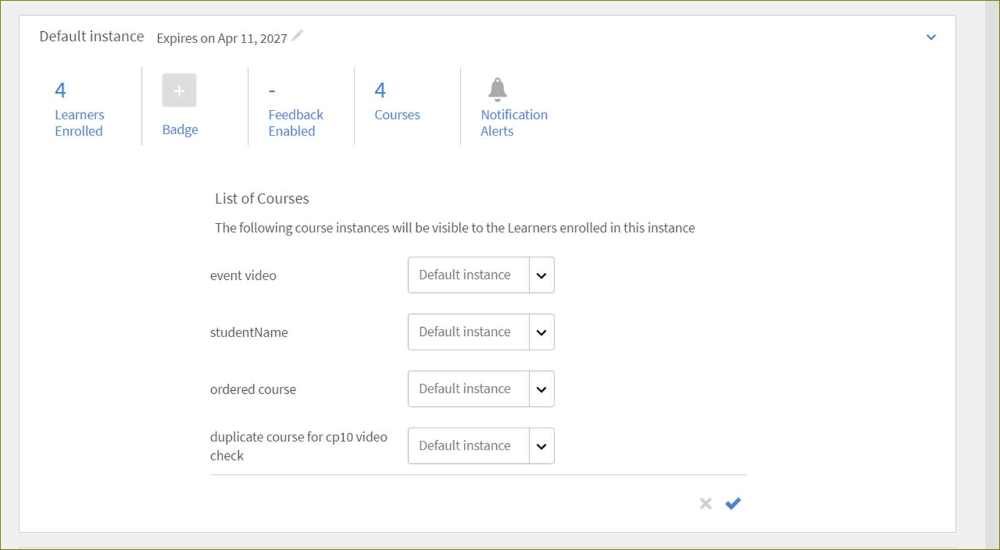
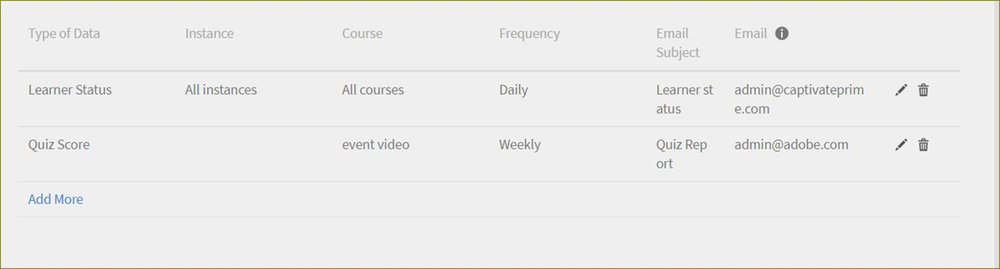

# 學習計畫

>[!WARNING]
>
>Adobe Learning Manager 已不再支持學習程式。

閱讀本文，了解如何在 Learning Manager 中建立和管理學習程式

學習計畫是一組獨特設計的課程，滿足特定學習者的目標。 管理者為學習者設計這些學習計畫。 你可以以學習者的身份來看待這些學習計畫。

## 建立學習計畫 {#createalearningprogram}

管理員可以建立學習計畫。 要建立學習計畫，請遵循以下步驟：

1. 以管理員身份登入。 點擊 **[!UICONTROL Learning program]** 左側窗格。 學習計畫頁面會顯示已為組織建立的現有學習計畫清單。
1. 點擊頁面右上角的「新增」。 新增學習程式頁面會出現。
1. 輸入學習計畫名稱、概述，並輸入課程的好處。
1. 若要在其他地區建立學習程式，請點擊頁面上方的「新增語言」。 選擇你需要的語言，然後點擊新增。 你可能需要在所有選擇的語言中加入所有學習程式的元資料。 否則，英文資訊則會顯示給其他地點。
1. 為您的學習程式輸入一個獨特的學習物件 ID。 唯一的ID應僅包含字母表和數字，且不得包含特殊字元。 沒有兩個學習對象應該有相同的 ID。
1. 依你喜好選擇註冊類型為管理員註冊或自助註冊。 選擇退選選項和課程排序選項，然後點擊儲存。 如果你選擇自行報名，學習者可以自行報名學習課程。

   課程頁面似乎會將課程加入學習程式。 你可以在裡面看到課程和目錄分頁。

   **註**

   各類課程都可以加入學習計畫。 這些課程包括課堂與虛擬課程、活動課程、自定進度課程及混合課程。 經理提名及經理核准的課程不會出現在學習計畫的課程選擇中。

1. 你必須先把課程加入學習程式，才能發佈。 點擊 **[!UICONTROL Catalog]** 分頁鍵將課程與學習計畫關聯。 會顯示所有可用課程的清單。

1. 請將滑鼠滑鼠移至任一課程卡片並點擊，選擇你想加入學習程式的課程。 如果該課程尚未加入學習程式，你可以在該課程卡片中間看到一個 + 符號。

   若要包含更多課程，請重複此步驟。

   **註**

   在分頁中查看您學習計畫 **[!UICONTROL Curriculum]** 新增的所有課程清單。 新增課程的標籤可見於分頁課程卡片 **[!UICONTROL Catalog]** 底部。

1. 點擊 **[!UICONTROL Back to programs]** 左側窗格上方，可查看所有學習計畫的清單。 你可以在那裡看到你新加入的學習計畫。
1. 你可以點擊左側的「概覽」並選擇「動作>發佈」來發布學習程式。 你也可以透過頁面右上角的「課程與實例」檢視，點擊「發佈」來發布學習計畫。

## 將學習者加入學習計畫 {#addlearnerstoalearningprogram}

欲了解更多關於招募學習者及應遵循的步驟，請參閱  [「註冊學習者」。](courses.md#main-pars_header_1058138132)

## 啟用學習程式的完整目錄控制 {#catalog}

就像授予學習或模組[&#128279;](shared-catalog-full-control.md)的完整目錄控制權一樣，你也可以啟用學習程式的完整目錄控制。

## 重設航向

管理員可以在學習計畫中重置課程進度。

透過學習計畫，管理員可以重置課程進度。

要重設課程，管理員必須從課程下拉選單中選擇課程。

然後從下拉選單中 **[!UICONTROL Actions]** 點選 **[!UICONTROL Reset Course]**。

學習者現在可以從一開始就啟動所選課程的模組。

**注意：只有課程中不及格或未完成的模組會被重置。**

## 建立多個學習程式實例 {#createmultipleinstancesoflearningprograms}

你可以建立多個課程或學習程式的實例。

1. 從左側窗格點選學習程式。
1. 點擊課程/學習計畫縮圖列表中的學習程式名稱。
1. 從左側窗格點選「實例」。
1. 在球場資訊右上角的右上角點擊新增實例。
1. 會顯示一個新的學習程式實例。
1. 點擊新實例上的編輯圖示（如快照中紅色箭頭所示），即可修改課程/學習計畫的數值，如截止日期、實例名稱、回饋和徽章。 完成變更後，點擊修改後值旁的勾選標記以儲存變更內容。 點擊 X 標記取消變更。

管理員可以將教室和虛擬教室類型的課程加入學習計畫。 作者在課程創建過程中所提供的課程內容，將成為預設實例。 當管理員將課程加入學習程式時，預設會映射到所有課程的預設實例，但管理員可以更改實例的映射。 新增到學習計畫的課程數量也會在實例頁面中顯示，如下所示。

**變更實例映射**

要更改實例映射，請點擊實例頁面中的課程數量。 會顯示一個賽道實例映射框，並列出實例列表。 你現在可以選擇實例映射。

## 建立彈性學習計畫 {#flexible}

透過彈性學習計畫，學習者可以參加不受預設實例限制的訓練。 管理員會建立不同的實例以配合學習者的需求。 這類學習計畫通常是教室或虛擬學習課程。 為確保所有學習者都有機會參加，管理員可能會建立多個課程實例，以適應不同時區。

管理員也可以將學習程式的實例映射到學習者所選擇的課程實例。

**工作流程**

1. 建立幾個包含多個實例的課程。
1. 建立學習計畫並新增一些課程。
1. 建立學習計畫的實例。
1. 讓學員報名。

## 訂閱 {#subscription}

管理員可以取得測驗分數和學習者狀態報告。 他們可以設定舉報頻率、電子郵件主題及收件人電子郵件 ID。 根據設定的頻率，收件人會收到附有報告的電子郵件。

## 查看測驗分數 {#viewquizscores}

1. 點擊任何學習程式磁貼
1. 點擊左側面板的測驗分數。

你可以根據使用者名稱或每個問題查看任何特定學習程式的測驗分數。 請依序選擇「依使用者」或「依問題」分頁。

測驗分數會依一門課逐一顯示。 從下拉選單更改課程名稱，即可查看其他課程的測驗分數。 你也可以匯出每門課程的小測驗分數。

從下拉選單中選擇實例類型，即可查看每個學習程式實例的分數。

## 查看 L1 與 L3 回饋 {#viewl1andl3feedback}

作為管理員，你可以啟用學習計畫的 L1 和 L3 回饋。 學習者給予的 L1 回饋會顯示在 L1 回饋標籤下，經理提供的 L3 回饋則會在 L3 回饋標籤下顯示。

## 學習者退學 {#unenrollmentforlearners}

在建立學習計畫時，管理員可選擇學習者是否能退役於學習計畫。 如果管理員選擇了這個選項，學習者就可以自行退選。

## 標記完成 {#markcompletion}

管理員可利用可用選項標記學習計畫為完成。 為了標誌學習計畫的完成，請遵循以下步驟。

1. 打開 **[!UICONTROL Learning Program]**.
1. 從左側選單打開 **[!UICONTROL Learners]** 頁面。

   頁面 **[!UICONTROL Learners]** 一開始就列出已註冊的學習者名單。

1. 選擇一位、多位或全部學習者，並使用每位學習者的勾選框來標記 LP 完成。
1. 點擊 **[!UICONTROL Users]** > **[!UICONTROL Action]** > **[!UICONTROL Mark completion]**。

   如果 LP 有多門課，所有課程都會被標記為已完成。

## 學習計畫中的課程排序 {#orderingofcoursesinlearningprogram}

管理者可設定學習者修習課程的順序。 建立學習程式後，你可以隨時更新這個課程順序。

為了更新學習計畫中的課程順序，

1. 點擊你選擇的學習程式卡片，然後點擊 **[!UICONTROL Courses]** 左側窗格。

1. 會顯示與學習計畫相關的課程卡清單。 點擊 **[!UICONTROL Edit]** 頁面右上角。
1. 你可以點擊並拖曳每張課程卡到適當位置來改變清單的順序。
1. 點擊 **[!UICONTROL Republish]**。

## 編輯已發表的學習程式 {#editingapublishedlearningprogram}

學習程式可由已公布州的管理員編輯。 在此狀態下，管理員可以編輯學習程式的所有章節並重新發布。

若要編輯已發布的學習程式，請點擊學習程式卡片，並點擊 **[!UICONTROL Edit]** 頁面右上角。

在編輯學習程式的各章節時，如果你必須離開頁面，就需要重新發布學習程式。 你會收到一個對話確認，要求你重新發布學習程式。
