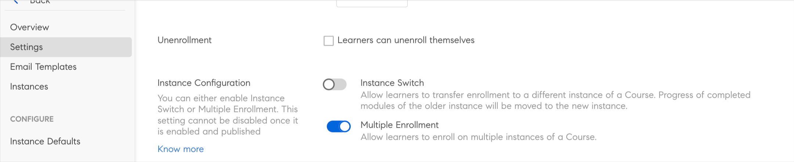
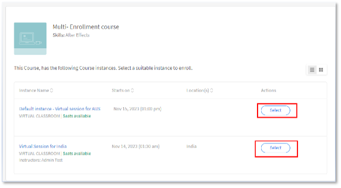
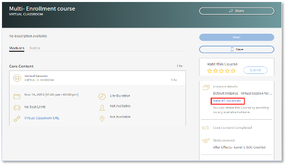
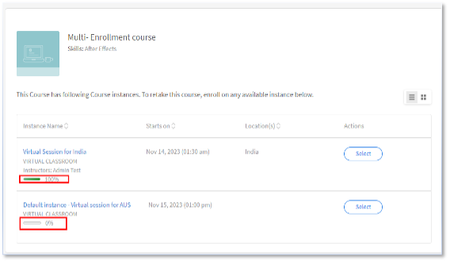
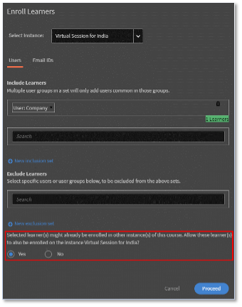

# Adobe Learning Manager中的多重註冊

在Adobe Learning Manager中，每個課程可以有不同的例項。 身為帳戶管理員，您的一項主要職責就是建立跨不同時區的不同VILT工作階段例項，並可能為特定使用者群組建立工作階段。

在2023年7月版本之前，當管理員註冊了學習者時，他們只能註冊一個例項。 如果學習者希望參加不同執行個體的課程，管理員會建立多個課程，每個執行個體各一個。

AdobeLearning Manager的多重註冊功能可協助管理員避免此類情況。

## 什麼是多重註冊

透過各種可用例項，將學習者多重註冊為課程中的多次。  學習者可註冊多個課程例項，無論其已註冊、已完成或尚未開始的狀態為何。 當作者啟用 [!UICONTROL Multiple Enrollment] 在切換後，學習者即可註冊課程的多個例項。

*從設定啟動多重註冊*

您可以個別追蹤每個執行個體的進度，也可以匯出報告來追蹤每個執行個體的進度。

## 重要點

* 多重註冊僅適用於課程有多個例項時。
* 多註冊選項啟用且使用者在多個例項中註冊後，學習者成績單報告中會為每個課程建立新列（每個例項和每個學習者各一列）
* 若設定報表自動化時每門課程僅預期一列，則您必須對報表自動化進行必要的調整，才能啟用「多重註冊」功能。

## 如何啟用多重註冊

1. 以作者身分登入您的AdobeLearning Manager帳戶。
1. 選取您想要學習者多次註冊的課程。
1. 在左側面板中，選取 **[!UICONTROL Settings]** > **[!UICONTROL Edit]** > **[!UICONTROL Instance configuration]** > **[!UICONTROL Enable Multiple Enrollment]**.

*啟用多重註冊*

>[!NOTE]
>
>身為作者，您不能同時啟用[執行個體切換]和[多重註冊]。

## 學習者檢視

當學習者想要註冊教室或VC課程，或想要在繼續其他課程前完成課程時，多次註冊將有所幫助。

對於未註冊的學習者，當他們選取課程時，將會檢視課程底下具有多個例項的畫面。 接著，他們便可以選取每個例項並註冊。

*檢視例項*

註冊一個執行個體後，他們可以在右側窗格中選取「檢視所有執行個體」選項，註冊其他執行個體。

*註冊執行個體*

每個執行個體的進度都可追蹤如下：

*追蹤每個執行個體的進度*

## 管理員中的多重註冊變更

**註冊：**

註冊學習者時，您可以啟用下列核取方塊：

*「選取的學習者可能已註冊此課程的其他執行個體。 允許這些學習者也註冊執行個體……」*

*管理員的註冊選項*

如果學習者已註冊一個例項，而您身為管理員，嘗試將學習者註冊到其他課程例項，請選取「是」。

## 報告

對於已註冊相同課程的兩個例項的學習者，系統會為每個課程例項建立兩列。 報表也會顯示執行個體的進度。
