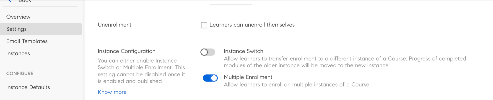
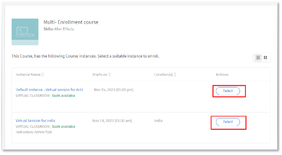
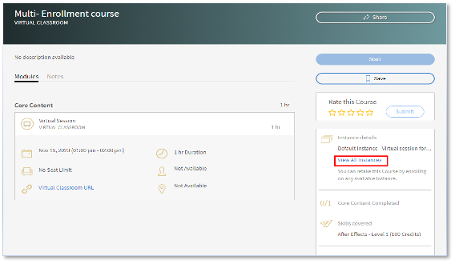
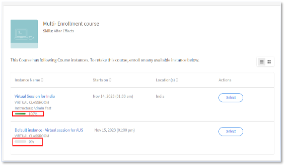
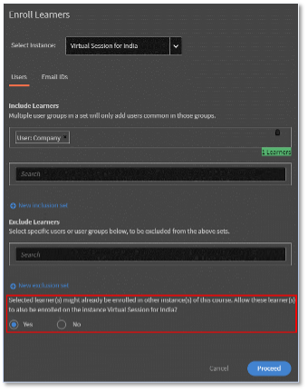

# Adobe Learning Manager 的多次註冊

在 Adobe Learning Manager 中，每門課程可以有不同的實例。 作為帳戶管理員，您的主要職責之一是跨時區建立不同的 VILT 會話實例，並可能為特定使用者群組建立會話。

在 2023 年 7 月釋出之前，管理員註冊學習者時，只能在一個實例中註冊。 若學習者希望在不同實例中修習同一門課，管理員會為每個實例建立多門課程。

Adobe Learning Manager 的多重註冊功能幫助管理員避免此類情況。

## 管理實例

>[!INFO]
>
>在本次訓練中，您將學習如何編輯實例細節與實例屬性。    

如果你無法啟動訓練，請寫信至 <almacademy@adobe.com>。

## 什麼是多重註冊

多重選課是指學習者透過各種可用實例多次註冊同一課程。  學習者無論已註冊、完成或尚未開始，都可以同時註冊多個課程實例。 當作者啟用 [!UICONTROL Multiple Enrollment] 切換功能後，學習者即可在多個課程實例中註冊。

*從設定啟動多重註冊*

每個實例的進度可以單獨追蹤，並可匯出報告以追蹤每個實例的進度。

## 重要重點

* 多重選課僅適用於同一課程有多重實例時。
* 啟用多重選課選項且使用者在多個實例中註冊後，學習者成績單報告中會為每門課程建立新一列（每個實例及每位學員各一列）
* 若報告自動化設定為每門課程只預期一列，您必須在啟用多重報名功能前對報告自動化做出必要調整。
* 管理 API 不支援多重註冊情境。 如果你有任何需求，請聯絡你的CSM。

## 如何啟用多重註冊

1. 以作者身份登入您的 Adobe Learning Manager 帳號。
1. 選擇你希望學習者多次報名的課程。
1. 在左側面板，選擇 **[!UICONTROL Settings]** > **[!UICONTROL Edit]** > **[!UICONTROL Instance configuration]** > **[!UICONTROL Enable Multiple Enrollment]**。

*啟用多重註冊*

>[!NOTE]
>
>作為作者，你不能同時啟用實例切換和多重註冊。

## 學習者視角

當學習者想報名教室或虛擬課程，或想在進入下一門課程前再完成一門課時，多次註冊非常有幫助。

對於未註冊的學習者，當他們選擇課程時，會看到課程下方的多個實例畫面。 接著，他們可以選擇每個實例並註冊。

*查看實例*

註冊一個實例後，他們可透過右側選區的「檢視所有實例」選項來註冊其他實例。

*註冊到一個實例*

每個實例的進度可如實追蹤如下：

*追蹤每個實例的進度*

## 管理員中的多重註冊變更

**招生情況：**

在註冊學習者時，您可以啟用以下勾選框：

*「被選中的學員可能已經註冊在本課程的其他實例中。 允許這些學習者同時註冊於實例中......」*

*管理員註冊選項*

如果學習者已經註冊在一個實例中，而你作為管理員正嘗試將學習者註冊到另一個課程實例，請選擇「是」。

## 報導

對於同時註冊同一課程兩個實例的學習者，每個實例會建立兩列。 報告同時顯示實例的進度。
