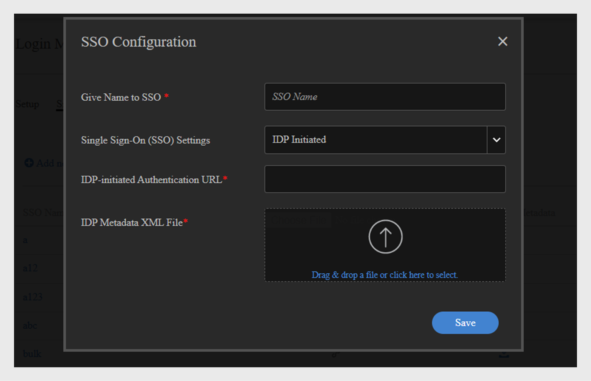

# 多個SSO登入 {#multiple-sso-logins}

管理員可為內部和外部使用者設定多種登入方法。 Adobe Learning Manager支援多個SSO登入，可協助管理員根據其需求和使用案例設定登入方法。

目的是讓管理員根據其位置、組織等，為不同的使用者群組設定不同的SSO。

一個帳戶最多可以新增20個SSO設定。 這些可用來為內部和外部使用者設定SSO。

>[!NOTE]
>
>啟用多SSO時，您可以在自行註冊設定檔中選擇值或使用者群組。 選擇值後，會建立不含任何使用者的使用者群組。 這類使用者群組沒有任何使用者。 匯入下一個CSV時，將移除此使用者群組。

## 啟用多個SSO

若要啟用多個SSO，請選取&#x200B;**設定** > **登入方法**。

在設定頁面上，選取內部或外部使用者的核取方塊&#39;**[!UICONTROL Enable Multiple Single Sign-On (SSO)]**&#39;。

啟用多個SSO時，為「預設登入方法」選取的登入方法會成為未連結至任何SSO設定的使用者群組/設定檔的預設登入型別。 預設登入可以是Adobe ID、SSO或ALM ID （外部使用者）。

>[!NOTE]
>
>具有必要許可權的管理員和自訂管理員可以執行這些步驟。

若要設定SSO，請遵循下列步驟：

1. 按一下設定單一登入(SSO)。
1. 按一下新增SSO組態。\
   
1. 在SSO設定對話方塊中，新增下列專案：

   * 輸入SSO的名稱。
   * 選取SSO- IDP起始的型別或SP起始的型別。

      * 如果您已選取IDP initiated，請輸入IDP URL。 這將是應用程式的唯一識別碼，也是由IDP服務提供者提供的資訊URL。 這是所有Adobe Learning Manager使用者登入後會被重新導向的URL。
      * 從您的IDP提供者上傳IDP中繼資料XML。 此檔案包含有關IdP的資訊，可讓Adobe Learning Manager接受來自它的SAML宣告
      * 如果您已選取SP，請輸入實體ID。 實體ID是服務提供者(SP)提供的URL。
      * 輸入SP登入URL。 使用者會使用此URL登入應用程式。

1. 會將SSO設定新增至清單。

## 為內部使用者設定SSO

### CSV使用者

請遵循下列步驟：

1. 匯入包含作用中欄位及其值的CSV。
1. 按一下「設定>登入方法」。
1. 選取&#x200B;**[!UICONTROL Enable Multiple Single Sign-On (SSO)]**&#x200B;登入核取方塊。
1. 將SSO設定對應到作用中欄位的值。
1. 儲存設定。 再次匯入CSV。

### 單一使用者

請遵循下列步驟：

1. 按一下「設定>登入方法」。
1. 選取&#x200B;**[!UICONTROL Enable Multiple Single Sign-On (SSO)]**&#x200B;登入核取方塊。
1. 選取SSO的有效欄位。
1. 將SSO設定連結到欄位的值。
1. 儲存設定。 新增單一使用者並指派使用中欄位的值。

### 自行註冊的使用者

請遵循下列步驟：

1. 按一下「設定>登入方法」。
1. 選取&#x200B;**[!UICONTROL Enable Multiple Single Sign-On (SSO)]**&#x200B;登入核取方塊。
1. 將SSO設定連結到欄位的值。
1. 儲存設定。 新增單一使用者並指派使用中欄位的值。
1. 新增自助註冊設定檔。
1. 選取設定的SSO欄位值。

儲存設定檔設定後，複製的URL會將使用者重新導向至連結至為設定檔所選值的SSO。

### 為外部使用者設定SSO

請遵循下列步驟：

1. 建立外部設定檔。
1. 按一下「設定>登入方法」。
1. 選取&#x200B;**[!UICONTROL Enable Multiple Single Sign-On (SSO)]**&#x200B;登入核取方塊。
1. 將SSO設定連結到已建立的外部設定檔。
1. 儲存設定。

儲存設定檔設定後，儲存後，複製的外部設定檔URL會將使用者重新導向至連結至設定檔的SSO。

## 常見問題

+++ 誰可以為使用者啟用多個SSO？

管理員和自訂管理員都可以啟用多個SSO。
+++

+++我可以使用現有或新的單值作用中欄位嗎？

可以，您可以使用現有或新的單一值作用中欄位來設定多個SSO。
+++

+++如果CSV中有停用的欄位，多個SSO的設定會失敗嗎？

否，這不會影響設定SSO。 系統會將使用者重新導向至已設定的SSO。
+++

+++管理員在設定多個SSO時，可以在頁面上的作用中欄位中新增值嗎？

可以，管理員可以向作用中欄位新增值。
+++

+++我可以停用或刪除連結至SSO的欄位嗎？

可以，您可以停用或刪除連結至SSO的欄位，直到您從SSO設定頁面取消連結欄位為止。
+++
