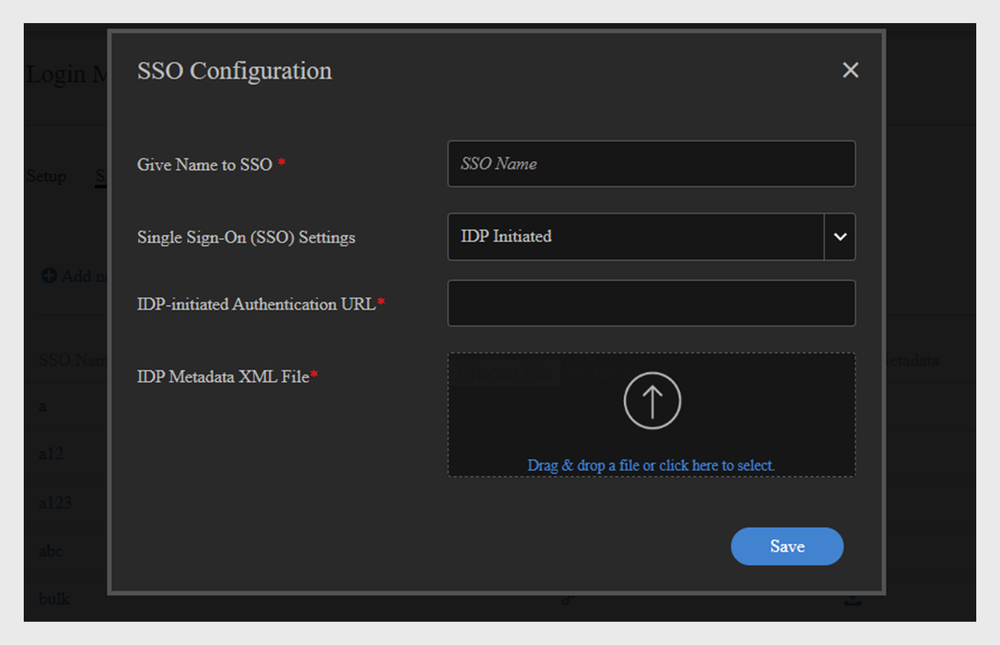

# 多重單點登入 {#multiple-sso-logins}

管理員可以為內部及外部使用者設定多種登入方式。 Adobe Learning Manager 支援多種 SSO 登入，協助管理員根據需求與使用情境設定登入方式。

其目的是讓管理員能根據不同使用者群組的地點、組織等設定不同的 SSO。

一個帳號最多可新增 20 個 SSO 設定。 這些工具可用於為內部及外部使用者設定單點點（SSO）。

>[!NOTE]
>
>啟用 Multi-SSO 後，您可以在自我註冊設定檔中選擇值或使用者群組。 選擇值後，會建立一個零用戶的使用者群組。 這樣的使用者群組沒有任何使用者。 當下一次 CSV 匯入時，這個使用者群組將會被移除。

## 啟用多個單點登入

要啟用多個單一登入系統，請選擇 **「設定** 」> **「登入方式**」。

在設定頁面，選擇「內部使用者」或「外部使用者」的勾選框&#x200B;**[!UICONTROL Enable Multiple Single Sign-On (SSO)]**。

啟用多重 SSO 後，選擇的「預設登入方法」登入方式會成為未連結任何 SSO 設定的使用者群組/個人資料的預設登入類型。 預設登入可以是 Adobe ID、SSO 或 ALM ID（外部使用者）。

>[!NOTE]
>
>擁有必要權限的管理員和自訂管理員可以執行這些步驟。

要設定單點單點（SSO），請依照以下步驟操作：

1. 點擊設定單一登入（SSO）。
1. 點選新增 SSO 設定。\
   
1. 在 SSO 設定對話框中，請新增以下內容：

   * 輸入SSO的名稱。
   * 選擇 SSO 類型——IDP 發起或 SP 發起。

     * 如果你選擇了 IDP 發起，請輸入 IDP 網址。 這將是您申請的唯一識別碼，也是由 IDP 服務提供者提供的資訊。 這是所有 Adobe Learning Manager 使用者登入後都會被重新導向的網址。
     * 從你的 IDP 提供者上傳 IDP Metadata XML。 此檔案包含 IdP 的資訊，使 Adobe Learning Manager 能接受其 SAML 斷言
     * 如果您已選擇 SP 發起，請輸入實體 ID。 實體 ID 是服務提供者（SP）提供的網址。
     * 輸入 SharePoint 的登入網址。 使用者會使用此網址登入應用程式。

1. SSO 設定會被加入清單。

## 為內部使用者設定 SSO

### CSV 中的使用者

請依照以下步驟操作：

1. 匯入包含活躍欄位及其數值的 CSV 檔。
1. 點擊>登入方式的設定。
1. 選擇 **[!UICONTROL Enable Multiple Single Sign-On (SSO)]** 登入勾選框。
1. 將 SSO 配置映射到活動欄位的值。
1. 儲存設定。 再匯入一次 CSV。

### 單用戶

請依照以下步驟操作：

1. 點擊>登入方式的設定。
1. 選擇 **[!UICONTROL Enable Multiple Single Sign-On (SSO)]** 登入勾選框。
1. 選擇一個啟用的 SSO 欄位。
1. 將單點單點（SSO）配置與場值連結。
1. 儲存設定。 新增一個使用者，並為該活躍欄位指派一個值。

### 自助註冊用戶

請依照以下步驟操作：

1. 點擊>登入方式的設定。
1. 選擇 **[!UICONTROL Enable Multiple Single Sign-On (SSO)]** 登入勾選框。
1. 將單點單點（SSO）配置與場值連結。
1. 儲存設定。 新增一個使用者，並為該活躍欄位指派一個值。
1. 新增自助註冊個人檔案。
1. 選擇已設定的 SSO 欄位的值。

儲存設定檔後，複製的 URL 會將使用者導向到與設定檔所選值連結的 SSO。

### 為外部使用者設定 SSO

請依照以下步驟操作：

1. 建立外部個人檔案。
1. 點擊>登入方式的設定。
1. 選擇 **[!UICONTROL Enable Multiple Single Sign-On (SSO)]** 登入勾選框。
1. 將 SSO 設定連結到外部建立的設定檔。
1. 儲存設定。

儲存設定檔後，儲存後，複製的外部設定檔網址會將使用者導向到與該設定檔連結的 SSO。

## 常見問題

+++ 誰可以為使用者啟用多個單一登入（SSO）？

管理員與自訂管理員皆可啟用多個 SSO。
+++

+++我可以使用現有或新的單一值活動欄位嗎？

是的，你可以用現有或新的單一值活躍欄位來設定多個 SSO。
+++

+++如果 CSV 中有被停用的欄位，設定多個 SSO 會失敗嗎？

不，這不會影響設定 SSO。 使用者將被導向已設定好的單點登入（SSO）。
+++

+++管理員在設定多重單點（Multi-SSO）時，可以為頁面的活動欄位新增值嗎？

是的，管理員可以為活動欄位新增值。
+++

+++我可以停用或刪除與 SSO 連結的欄位嗎？

是的，你可以停用或刪除與 SSO 連結的欄位，直到你從 SSO 設定頁面解除連結。
+++
