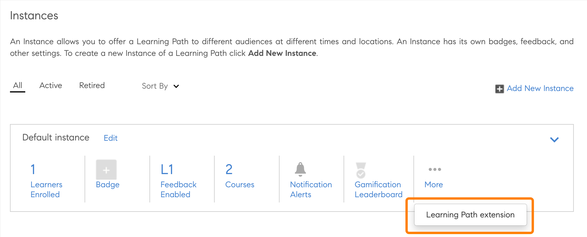
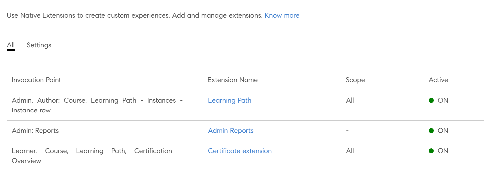
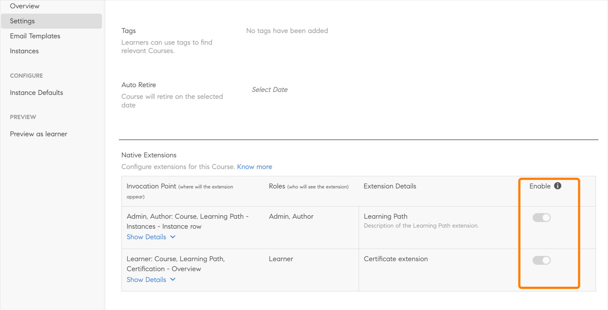
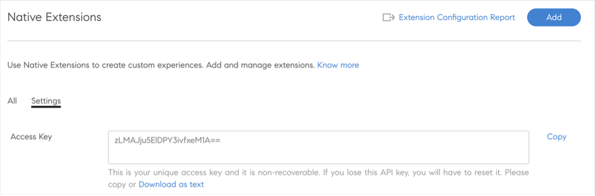
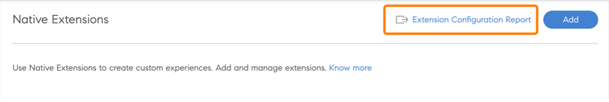
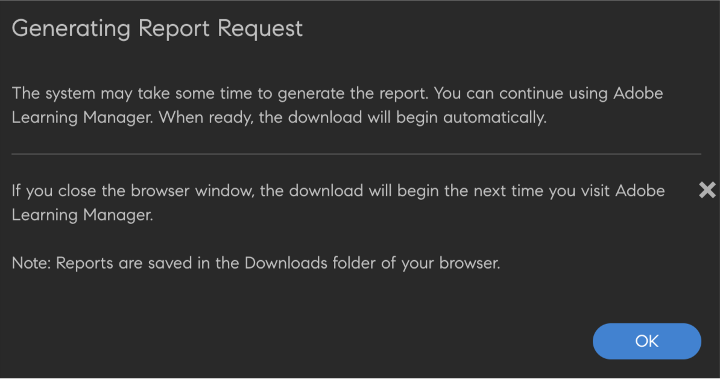
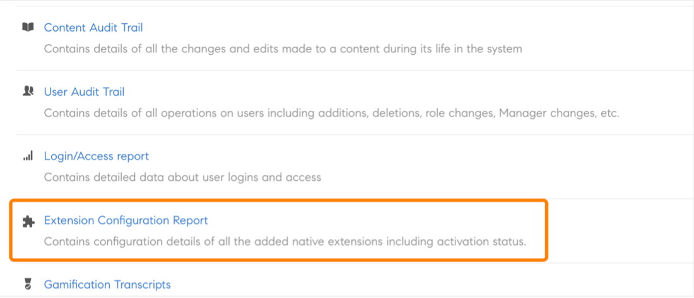

# 原生擴充性

您可以在Adobe Learning Manager的原生版本中設定自訂體驗，如此一來，您將不會將Headless用於較不複雜的案例。 您也可以建立自訂應用程式，並將其放置在學習者、經理、管理員、作者或講師工作流程的原生版本中的不同位置。

Adobe Learning Manager可在管理員、作者、學習者、經理和講師應用程式中支援15個叫用點。

## 建立擴充功能

1. 以管理員身分，在左側面板中選取&#x200B;**[!UICONTROL Native Extensions]**。
1. 選取「新增擴充功能」。
1. 在&#x200B;**[!UICONTROL Name]**&#x200B;欄位中輸入擴充功能的名稱。
1. 在&#x200B;**[!UICONTROL Description]**&#x200B;欄位中輸入擴充功能的說明。
1. 選取引動點。 引動點是Adobe Learning Manager中可在自訂應用程式中插入連結或按鈕的任何位置。 可以使用下列引動點：

   在此範例中，選取&#x200B;**[!UICONTROL Admin]**， **[!UICONTROL Author: Course]**， **[!UICONTROL Learning Path]** - **[!UICONTROL Instances]** - **[!UICONTROL Instance row]**。

   
   *選取呼叫點*

1. 輸入將顯示在&#x200B;**[!UICONTROL Extension Label]**&#x200B;欄位中UI的擴充功能標籤。
1. 在&#x200B;**[!UICONTROL URL]**&#x200B;欄位中，輸入您要主控副檔名的URL。
1. 在「開啟位置」下拉式清單中，選取要在強制回應視窗或新標籤中啟動擴充功能。
1. 選取強制回應視窗的大小。 如果您在上一步中選取了&#x200B;*應用程式內*&#x200B;強制回應視窗，則這些選項可供使用。

   若要維持快顯視窗內的協助工具，當擴充功能應用程式位於網站上的最後一個可聚焦元素時，必須將其傳送至事件，然後使用者選取TAB鍵。 需要將焦點保持在快顯視窗內，以支援協助工具。

   ```
   window.parent.postMessage({*}
   
   { type: 'ALM_EXTENSION_APP', eventType: 'trapFocusInModal' }
   
   ,{}'');
   ```

1. 設定擴充功能的範圍。 下列範圍可供使用：

   * **[!UICONTROL All Courses, Learning Paths and Certifications]**：此擴充功能已針對所有課程、學習路徑及認證啟用。 與管理員一樣，作者可為部分課程、學習路徑及認證停用此功能。
   * **[!UICONTROL Selected Courses, Learning Paths and Certifications]**：所有課程、學習路徑及認證皆停用此擴充功能。 作者可與管理員一起為某些課程、學習路徑和認證啟用此功能。

1. 選取&#x200B;**[!UICONTROL Activate]**&#x200B;切換以啟用擴充功能。 啟動後，擴充功能會根據範圍顯示在指定的引動點上。
1. 選取頁面右上角的&#x200B;**[!UICONTROL Save]**&#x200B;以建立副檔名。

## 以管理員身分存取擴充功能

1. 以管理員身分，選取左側工具列中的&#x200B;**[!UICONTROL Learning Paths]**。
1. 選取課程> **[!UICONTROL View Learning Path]**。
1. 在左側面板中選取&#x200B;**[!UICONTROL Instances]**。
1. 選取[執行個體]區段中的&#x200B;**[!UICONTROL More]**。 擴充功能會顯示在「例項」區段中。

   
   *選取擴充功能*

   選取擴充功能時，擴充功能會出現在強制回應視窗中。

## 以作者身分存取擴充功能

1. 以管理員身分，選取左側工具列中的&#x200B;**[!UICONTROL Learning Paths]**。
1. 選取課程> **[!UICONTROL View Learning Path]**。
1. 在左側面板中選取&#x200B;**[!UICONTROL Instances]**。
1. 選取[執行個體]區段中的&#x200B;**[!UICONTROL More]**。 擴充功能會顯示在「例項」區段中。

   
   *以作者身分存取擴充功能*

   選取擴充功能時，擴充功能會出現在強制回應視窗中。

## 檢視所有擴充功能

身為管理員，您可以在「原生擴充功能」頁面上檢視所有擴充功能。 若要檢視清單，請選取應用程式左側面板中的「原生擴充功能」 。


*檢視所有擴充功能*

## 啟用或停用擴充功能

身為作者，您可以在課程的「設定」頁面上啟用或停用課程、認證或學習路徑的擴充功能。


*啟用擴充功能*

## 共用存取金鑰

如果您要設定註冊擴充功能，則必須共用存取金鑰。

這點很重要，因為如果此金鑰未產生並跨平台共用，註冊驗證將會失敗，且學習者無法自行註冊課程。

必須共用存取金鑰才能註冊課程或學習路徑及憑證。

在「設定」標籤中，產生金鑰。


*共用存取金鑰*

## 下載擴充功能報表

有兩種方式下載此報表。

**擴充功能組態報告**

1. 在[原生擴充功能]頁面中，選取&#x200B;**[!UICONTROL Extension Configuration Report]**。

   
   *下載延伸報告*

   報表隨即產生。

1. 選取「確定」。

   
   *正在產生報告*

   報告包含下列欄位：

   * 擴充功能名稱
   * 引動點
   * 標籤
   * 在URL中開啟
   * 範圍
   * 啟動
   * 學習對象唯一識別碼
   * 訓練ID
   * 訓練型別
   * 訓練名稱

**報告頁面**

1. 在&#x200B;**[!UICONTROL Reports]** > **[!UICONTROL Custom Reports]**&#x200B;中，選取&#x200B;**[!UICONTROL Extension Configuration Report]**。

   
   *從「報表」頁面下載報表*

設定註冊狀態時，狀態必須在&#x200B;**0 - 4294967295**&#x200B;範圍內。
