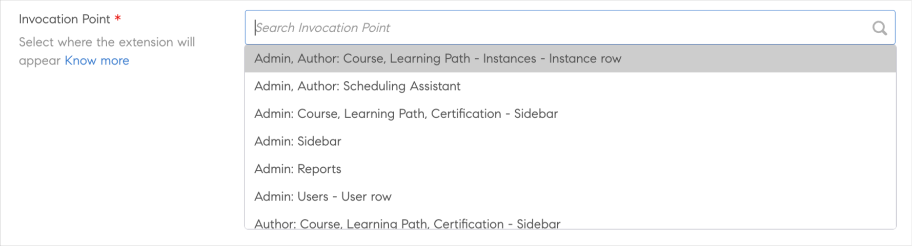
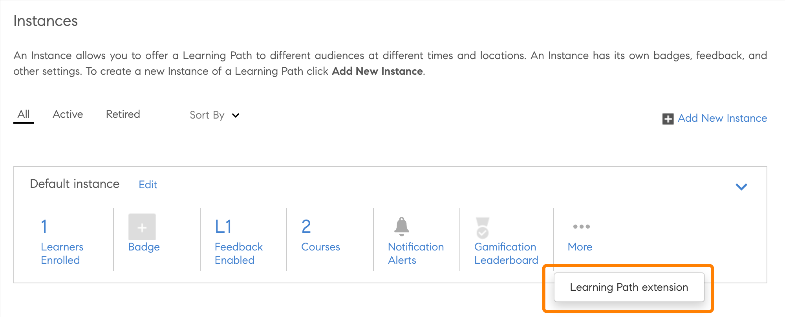
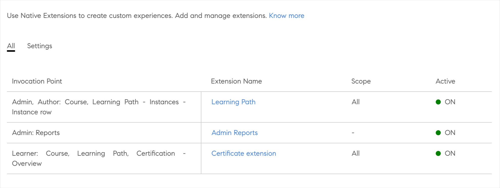
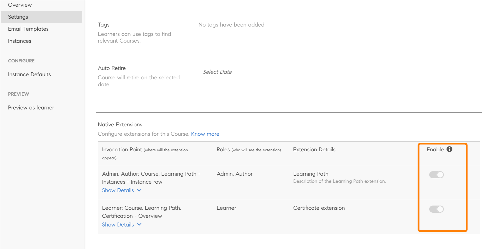
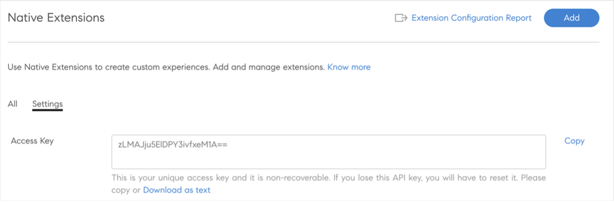
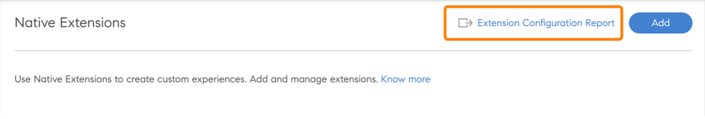
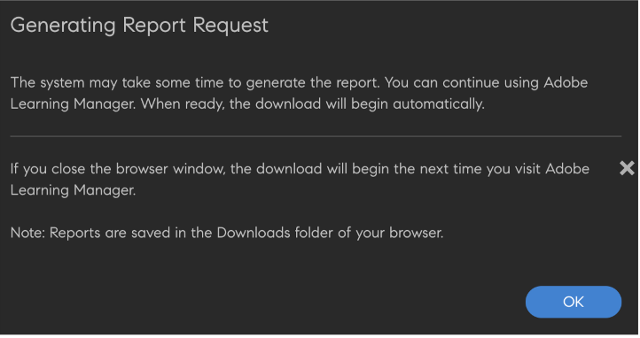
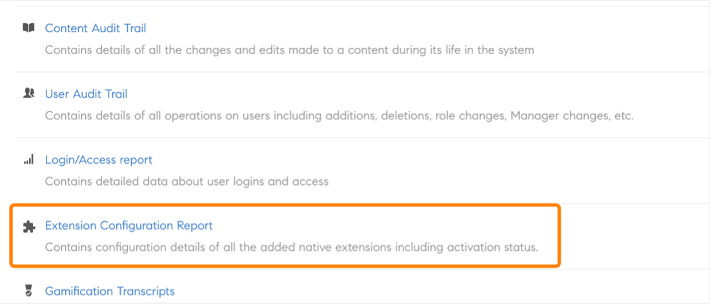

# 原生可擴充性

你可以在 Adobe Learning Manager 原生版本中設定自訂體驗，這樣就不用在較簡單的案件中使用 headless。 你也可以建立自訂應用程式，並將它們放在學習者、管理者、管理員、作者或講師工作流程的原生版本中的不同位置。

Adobe Learning Manager 支援 15 個調用點，涵蓋管理員、作者、學習者、管理者及講師應用程式。

## 建立擴充功能

1. 作為管理員，在左側面板選擇 **[!UICONTROL Native Extensions]**。
1. 選擇新增擴充功能。
1. 在欄位 **[!UICONTROL Name]** 輸入該分機名稱。
1. 請在欄位中輸入擴充功能的 **[!UICONTROL Description]** 描述。
1. 選擇一個召喚點。 呼叫點是指 Adobe Learning Manager 中任何可在自訂應用程式中插入連結或按鈕的位置。 以下召喚點可用：

   在此範例中，選擇 **[!UICONTROL Admin]**， **[!UICONTROL Author: Course]**， - **[!UICONTROL Learning Path]** **[!UICONTROL Instances]** - 。 **[!UICONTROL Instance row]**

   
   *選擇呼叫點*

1. 輸入會在介面 **[!UICONTROL Extension Label]** 欄位中顯示的擴充標籤。
1. 在欄位 **[!UICONTROL URL]** 輸入你想放置副檔名的網址。
1. 在「開啟」下拉選單中，選擇是要在模態中啟動擴充功能，還是在新分頁中啟動。
1. 選擇模態的大小。 如果你在前一步選擇 *了「應用* 內模式」，這些選項就會開放。

   為了維持彈出視窗內的無障礙性，當活動進入網站上最後一個可聚焦元素時，必須將擴充應用程式送入活動現場，然後使用者選擇 TAB 鍵。 這是為了讓焦點保持在彈出視窗內，支持無障礙。

   ```
   window.parent.postMessage({*}
   
   { type: 'ALM_EXTENSION_APP', eventType: 'trapFocusInModal' }
   
   ,{}'');
   ```

1. 設定擴展範圍。 以下示波器可供選擇：

   * **[!UICONTROL All Courses, Learning Paths and Certifications]**：此擴充功能適用於所有課程、學習路徑及證照。 除了管理員，作者也可以在某些課程、學習路徑和認證中關閉此功能。
   * **[!UICONTROL Selected Courses, Learning Paths and Certifications]**： 此擴充功能對所有課程、學習路徑及認證均已停用。 除了管理員，作者也可以啟用它用於某些課程、學習路徑和認證。

1. 選擇 **[!UICONTROL Activate]** 切換鍵讓擴充功能啟用。 一旦啟用，擴充功能就會根據作用域顯示在指定的呼叫點上。
1. 在頁面右上角選擇 **[!UICONTROL Save]** 建立擴充功能。

## 以管理員身份存取擴充功能

1. 作為管理員，請在左側工具列選擇 **[!UICONTROL Learning Paths]** 。
1. 選擇課程> **[!UICONTROL View Learning Path]**。
1. 在左側面板選擇 **[!UICONTROL Instances]** 。
1. 在實例區段選擇 **[!UICONTROL More]** 。 擴充功能出現在實例區塊。

   
   *選擇分機*

   當你選擇擴充功能時，該擴展名稱會出現在模態中。

## 以作者身份存取擴充功能

1. 作為管理員，請在左側工具列選擇 **[!UICONTROL Learning Paths]** 。
1. 選擇課程> **[!UICONTROL View Learning Path]**。
1. 在左側面板選擇 **[!UICONTROL Instances]** 。
1. 在實例區段選擇 **[!UICONTROL More]** 。 擴充功能出現在實例區塊。

   
   *作為作者使用 Access 擴充功能*

   當你選擇擴充功能時，該擴展名稱會出現在模態中。

## 查看所有延伸

作為管理員，你可以在原生擴充功能頁面查看所有擴充功能。 要查看清單，請在應用程式左側面板選擇「原生擴充功能」。


*查看所有延伸*

## 啟用或停用擴充功能

作為作者，在課程的設定頁面中，你可以啟用或停用課程、認證或學習路徑的擴充功能。


*啟動分機*

## 分享存取金鑰

如果你要設定註冊擴充功能，必須分享存取金鑰。

這點很重要，因為如果此金鑰未被產生並互相分享，註冊認證將失敗，學習者無法自行註冊課程。

註冊課程或學習路徑及證書必須共享存取金鑰。

在設定標籤中，產生金鑰。


*分享存取金鑰*

## 下載延伸報告

有兩種方式可以下載這份報告。

**擴充套件配置報告**

1. 在原生擴充功能頁面，選擇 **[!UICONTROL Extension Configuration Report]**。

   
   *下載延伸報告*

   報告會產生。

1. 選擇確定。

   
   *生成報告*

   報告包含以下欄位：

   * 分機名稱
   * 召喚點
   * 標籤
   * 網址開啟
   * 範圍
   * 啟動
   * LO 唯一識別碼
   * 訓練識別
   * 訓練類型
   * 訓練名稱

**報告頁面**

1. 在 **[!UICONTROL Reports]** > **[!UICONTROL Custom Reports]**&#x200B;中，選擇 **[!UICONTROL Extension Configuration Report]**。

   
   *從報告頁面下載報告*

在設定註冊狀態時，狀態必須在 **0 到 4294967295** 之間。
