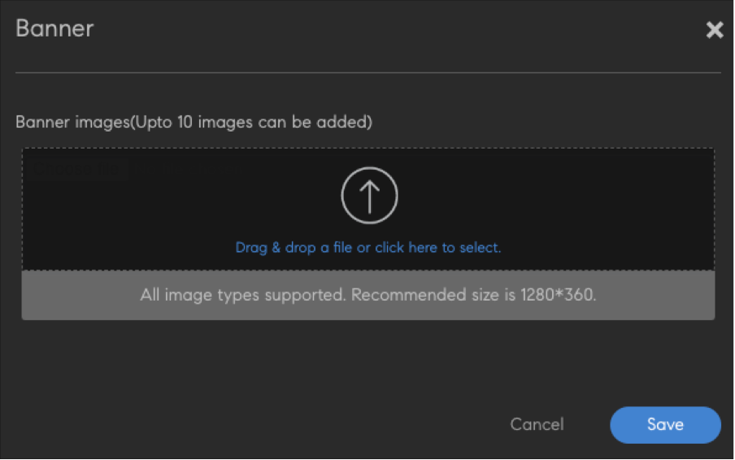
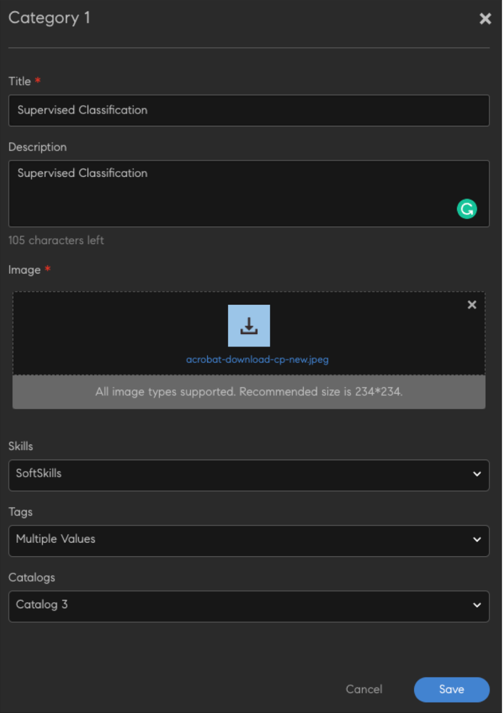
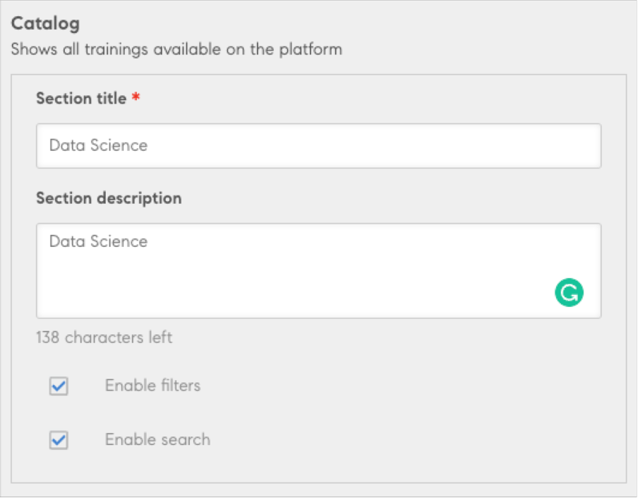

# 學習者的非登入體驗

AdobeLearning Manager原生入口網站支援非記錄方式存取培訓網站。 啟用此模式後，學習者即可探索及存取培訓網站，並檢視各種可用的課程和內容。

非登入體驗可讓學習者在不登入入口網站的情況下瀏覽課程。

非登入首頁必須由整合管理員啟用並設定 [訓練資料聯結器](/help/migrated/integration-admin/feature-summary/connectors.md#training-data-access).

然後，即可從聯結器匯出培訓。

>[!NOTE]
>
>確認已選取「原生學習管理員」選項。

管理員可以修改和設定首頁，適用於未登入的使用者。

>[!IMPORTANT]
>
>AdobeLearning Manager學習者API可讓您為使用者建立自訂學習體驗。 這些API的使用需要有效的使用者權杖，且僅能用於具有完全授權/註冊學習者的工作流程中。 不應依原樣將其用於任何型別的資料擷取，以支援任何非登入的使用者/共用使用者或任何其他此類情況。 非登入使用案例需要特殊處理。 若您對這些API的適當使用有任何疑問，請洽詢解決方案架構團隊，並確保解決方案架構師已在您部署解決方案之前對其進行稽核。

## 啟動首頁選項

在AdobeLearning Manager首頁上，選擇 **品牌化**. 然後，在左窗格中選取[Non-logged in Homepage]。

*選取「未登入首頁」選項*

## 新增橫幅

新增任何行銷公告的橫幅，或包含當天的趨勢主題。 選取 **新增橫幅**.

*新增橫幅*

瀏覽至要當作橫幅使用的影像位置。 然後在橫幅影像上提供連結作為動作按鈕。

## 新增類別

此元件可用來依標籤、技能和目錄來篩選目錄。 本節包含每個類別的標題和說明。 按一下後，系統會將使用者重新導向至已套用篩選器的目錄頁面。

選取 **[!UICONTROL Add category]**. 然後輸入分類的明細。

*新增類別*

儲存類別。 類別會新增至區段。

## 新增目錄

新增非登入使用者的目錄，讓他們可瀏覽平台上的所有訓練。

*新增目錄*

所有匯出的訓練都會出現。

## 不支援的功能

* 將不會匯出工作輔助。 不過，學習者可在登入後檢視這些頁面。
* 目錄元件中的「排序依據」。
* 在管理應用程式中使用的預設檢視設定（「設定>一般>清單檢視」）。
* 星級評等/有效性。
* 卡片圖示設定。
* 相關技能和標籤設定。
* 以目錄方式顯示的學習者應用程式檢視。
* 訓練概觀頁面 — 按一下卡片會重新導向至「註冊」，之後使用者會重新導向至「訓練概觀」頁面/執行個體頁面。
* 所有啟用的目錄都會出現。 任何無權存取目錄的學習者登入後都無法檢視目錄並在其中接受訓練。
