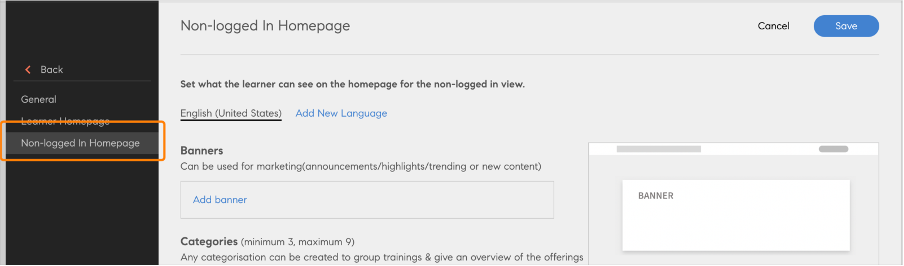
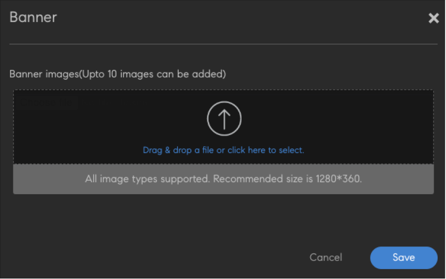
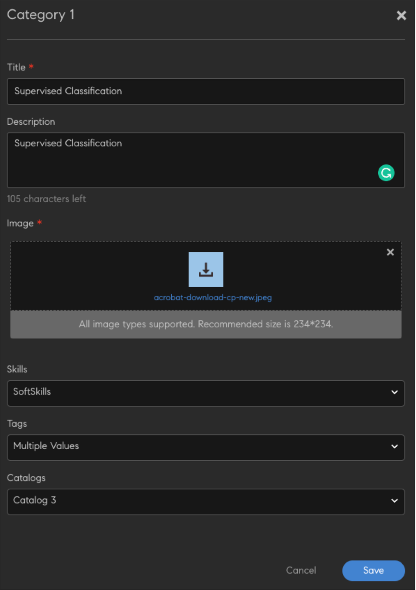
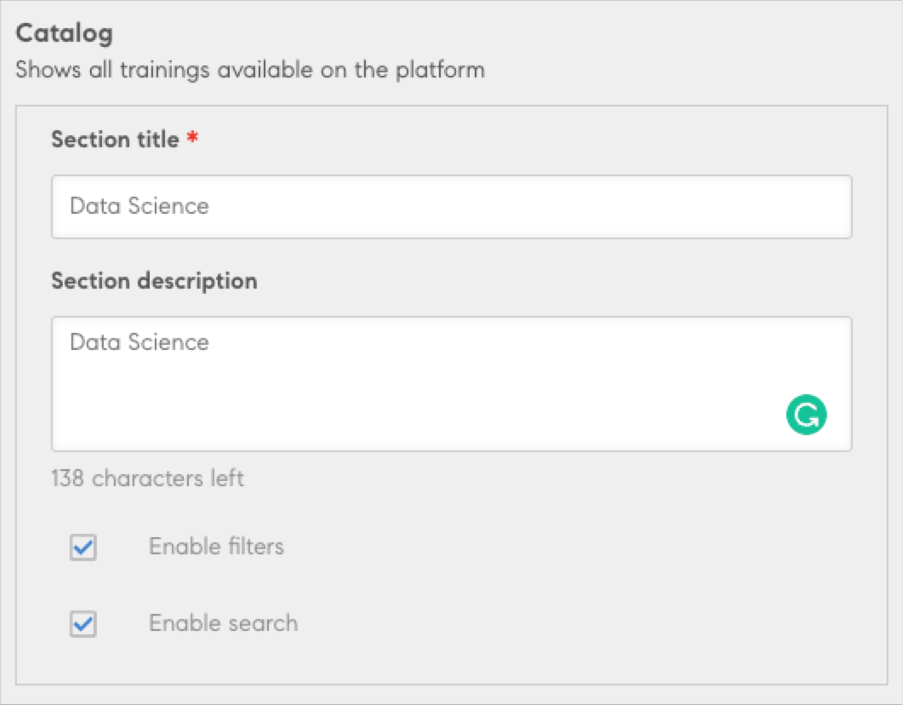

# 學習者未登入的經驗

Adobe Learning Manager 原生入口網站將支援無需登入的方式存取培訓網站。 啟用此模式後，學習者可以發現並存取培訓網站，並瀏覽各種課程與內容。

未登入體驗讓學習者無需登入入口網站即可瀏覽課程。

若要啟用未登入首頁，整合管理員必須啟用並設定 [訓練資料連接器](/help/migrated/integration-admin/feature-summary/connectors.md#training-data-access)。

訓練內容可以從連接器匯出。

>[!NOTE]
>
>請確保選擇了「原生學習管理員」這個選項。

管理員可以修改和設定首頁，該首頁是為未登入使用者設計的。

>[!NOTE]
>
>此功能在 FedRAMP 授權的環境中無法使用。 詳情請參閱 [FedRAMP 環境](/help/migrated/feature-availability-in-fedramp-authorized-environment.md) 的功能可用性。

## 學習器 API

Adobe Learning Manager - 學習者 API 允許您為使用者建立客製化學習體驗。 使用這些 API 需要有效的使用者憑證，且僅用於有完整授權/註冊學習者的工作流程。

>[!IMPORTANT]
>
>這些檔案不應該以現有方式用於任何資料擷取，以支援任何未登入的使用者或共用使用者或其他類似情況。 若想建立無頭或基於 AEM 的非登入體驗，請與我們聯繫。 我們會根據您的需求建議合適的方案。

未登入的使用案例需要特殊處理。

**如對這些 API 的正確使用有任何疑問，請聯繫解決方案架構團隊，並確保解決方案架構師在部署**&#x200B;前已審核過解決方案。

## 啟動首頁選項

在 Adobe Learning Manager 首頁，選擇&#x200B;**品牌。**&#x200B;然後在左側窗格選擇「未登入首頁」。

*選擇「未登入首頁」選項*

## 新增橫幅

為任何行銷公告或當天熱門話題的特寫加標。 選擇 **新增橫幅**。

*新增橫幅*

瀏覽作為橫幅使用的圖片位置。 接著在橫幅圖片上提供連結作為動作按鈕。

## 新增分類

此元件可用來依標籤、技能及目錄篩選目錄。 本節包含每個類別的標頭與描述。 點擊後，使用者會被導引到已套用篩選器的目錄頁面。

選擇 **[!UICONTROL Add category]**。 然後輸入分類的詳細資訊。

*新增分類*

保留該類別。 該類別會被加入該區。

## 新增目錄

新增一個目錄給未登入用戶，讓他們能瀏覽平台上的所有訓練內容。

*新增目錄*

所有輸出訓練都會在場。

## 不支援的功能

* 就業輔助工具不會出口。 不過，學習者登入後仍能看到這些內容。
* 在目錄部分中排序。
* 管理應用程式中使用的預設檢視設定（設定>一般>清單檢視）。
* 星級評分/效果。
* 卡片圖示設定。
* 相關技能與標籤設定。
* 學習者應用程式的視圖，會依目錄方式顯示。
* 訓練總覽頁面 - 點擊卡片會導引至註冊，使用者隨後會被導向訓練總覽頁面/實例頁面。
* 所有啟用的目錄都會在場。 任何無法存取目錄的學習者，登入後將無法看到目錄及其中的培訓內容。
* 原生選項的課程或學習路徑變更只會在 24 小時後反映，而非即時;而高級課程則會在至少 3 小時後反映。
