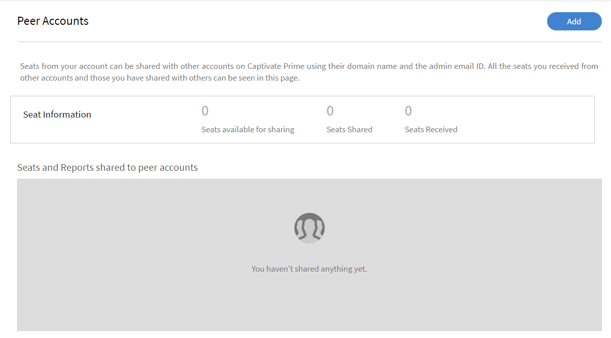
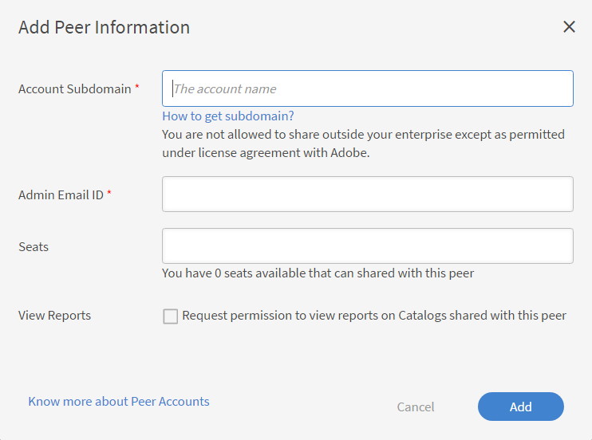
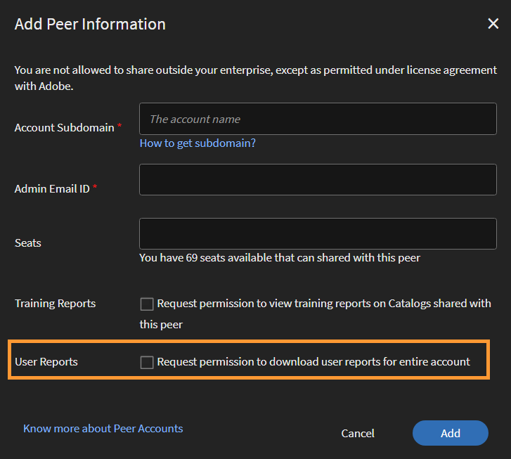
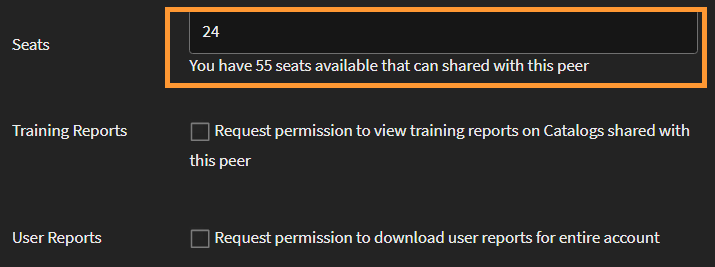

# 對等帳戶

閱讀本文章，瞭解如何在Learning Manager中建立和管理同儕節點帳戶。

Learning Manager提供使用Peer帳戶功能共用已購名額的功能。 透過Learning Manager中的對等帳戶，管理員可以將已購買的名額與管理員相關聯的對等帳戶共用。 此外，已開始共用名額的管理員可以檢視對等帳戶的報告。

## 新增對等帳戶 {#addapeeraccount}

1. 在管理員控制面板中，按一下 **[!UICONTROL Settings]** > **[!UICONTROL Peer Accounts]**.
1. 從右上角按一下 **[!UICONTROL Add]**.

   

   *新增對等帳戶*

1. 在 **[!UICONTROL Account Subdomain]** 欄位，指定您要建立對等帳戶的子網域。

   

   *新增子網域*

1. 輸入接受或拒絕對等帳戶請求的管理員的電子郵件ID。
1. 指定您想要與同事共用的座位數。 當您與對等帳戶共用名額時，對等帳戶會與收到的名額或對等本身購買的名額一起進入「使用中」狀態。

   如果您輸入的數字大於可用座位，系統會顯示警告。

1. 如果您想要檢視同行的註冊報告和共用目錄報告，請選取核取方塊。
1. 按一下「新增」以新增對等帳戶。

   如果管理員與對等共用名額，則該對等無法與其他任何人共用這些名額。 但是，同儕節點可以單獨購買一些座位並分享。

## 檢視與對等帳戶相關聯的報告 {#viewreportsassociatedwithpeeraccounts}

建立對等帳戶之後，您也可以為對等帳戶繪製報告。 作為管理員，如果您啟動對等帳戶請求，則可以檢視對等帳戶的報告。

如果對等體也想要檢視管理員報告，則對等體必須傳送個別的對等體帳戶要求給管理員。

若要瞭解如何產生和檢視對等帳戶的共用目錄，請參閱 [檢視對等報表](reports.md#main-pars_header_894271250).

## 刪除對等帳戶 {#deletingpeeraccounts}

如果您不想再與帳戶共用名額或購買專案，可以刪除對等帳戶。

1. 從Learning Manager管理員應用程式中，按一下「設定>對等帳戶」 。
1. 選取您要刪除的一或多個對等帳戶。
1. 執行下列任一項作業：

   * 按一下頁面右上角的「刪除」 。
   * 按一下您要刪除的對等帳戶旁的「刪除」圖示。

   刪除對等帳戶後，收到的名額就無法再使用。 如果對等帳戶僅收到名額而沒有購買名額，則該帳戶會進入「非使用中」狀態。

## 對等帳戶的使用者報告 {#download-peer-account}

管理員可以檢視對等帳戶的使用者報告。 父級帳戶管理員可以請求存取報告，當對等帳戶管理員接受此請求後，父級管理員將能夠檢視對等帳戶中註冊的使用者數量，並能夠下載對等帳戶的使用者報告。

1. 在[Peer Accounts]頁面上，按一下 **[!UICONTROL Add]**.
1. 啟用選項， **[!UICONTROL Request permission to download user reports for entire account]**.

*檢視對等帳戶的使用者報告*

若要下載對等帳戶的報告，請按一下 **[!UICONTROL Download]**.

## 常見問題 {#frequentlyaskedquestions}

+++如何在不同帳戶之間共用座位？

新增對等帳戶時，請指定您可與另一個對等帳戶共用的名額數。

*將名額從一個帳戶分享到另一個帳戶*
+++
