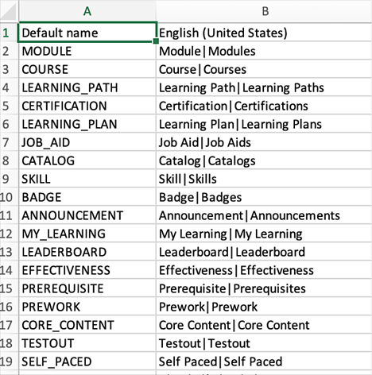
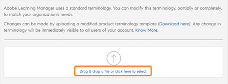
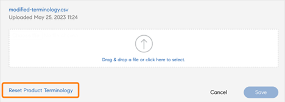
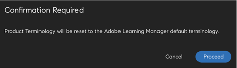

# 產品術語

>[!IMPORTANT]
>
>產品術語僅適用於Adobe Learning Manager的英文版。

## Adobe Learning Manager中的產品術語是什麼

Adobe Learning Manager在使用者介面上使用一組標準術語。 身為管理員，您可以修改術語以符合組織的需求。

使用產品術語功能，您可以重新命名這些術語，並且符合您組織的學習標準。

## 下載術語csv檔案

若要變更術語，請遵循下列步驟：

1. 以管理員身分，選取 **[!UICONTROL Settings]** > **[!UICONTROL General]**.
1. 在 **[!UICONTROL Product Terminology]**，選取 **[!UICONTROL Edit]**.

   
   _產品術語_

1. 選取 **[!UICONTROL Download Here]** 並下載術語的範本。

   
   _下載範本_

## 變更術語

1. 下載CSV後，請變更第二欄中的必要術語。 例如，您可以將「模組」變更為「培訓」，或將「排行榜」變更為「排名」。

   
   _編輯csv_

1. 儲存變更。

## 上傳更新的CSV

1. 在 **[!UICONTROL Product Terminology]** 區段，選取連結以上傳CSV。

   
   _上傳csv_

1. 上傳更新的CSV。
1. 選取 **[!UICONTROL Save]**.

術語的變更現在反映了該帳戶的作者、學習者、經理、講師或自訂管理員。

## 重設術語

上傳含有新術語的CSV後，您可以重設為預設術語。

選取 **[!UICONTROL Reset Product Terminology]**.

_重設產品術語_

按一下連結時，您可以看到確認快顯訊息。

_確認提示_

術語會恢復為原始名稱。

## 未變更的內容

術語變更不適用於：

* 電子郵件範本(**[!UICONTROL Admin]** > **[!UICONTROL Email Templates]**)

* 報表(**[!UICONTROL Admin]** > **[!UICONTROL Reports]**)

