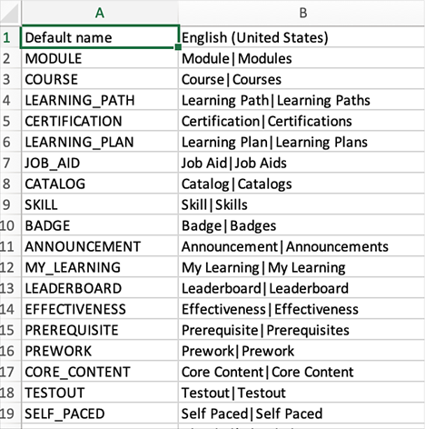
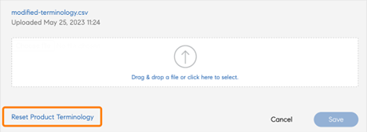

# 產品術語

>[!IMPORTANT]
>
>產品術語僅適用於 Adobe Learning Manager 的英文版。

## Adobe Learning Manager 中的產品術語是什麼

Adobe Learning Manager 在使用者介面中使用標準的術語組合。 作為管理員，你可以根據組織的需求修改術語。

利用產品術語功能，您可以重新命名這些術語，並符合您組織的學習標準。

## 下載術語 csv 檔案

要更改術語，請遵循以下步驟：

1. 作為管理員，請選擇 **[!UICONTROL Settings]** > **[!UICONTROL General]**。
1. 在 **[!UICONTROL Product Terminology]**&#x200B;中，選擇 **[!UICONTROL Edit]**。

   
   _產品術語_

1. 選擇 **[!UICONTROL Download Here]** 並下載術語範本。

   
   _下載範本_

## 改變術語

1. 下載CSV後，請更改第二欄所需的術語。 例如，你可以把模組改成訓練，或把排行榜改成排名。

   
   _編輯 csv_

1. 儲存變更。

## 上傳更新後的 CSV

1. 在該 **[!UICONTROL Product Terminology]** 區塊中，選擇上傳 CSV 的連結。

   
   _上傳 csv_

1. 上傳更新後的 CSV 檔。
1. 選擇 **[!UICONTROL Save]**。

術語變更現在反映該帳號的作者、學習者、經理、講師或自訂管理員。

## 重置術語

上傳包含新術語的 CSV 後，你可以重置回預設術語。

選擇 **[!UICONTROL Reset Product Terminology]**。

_重設產品術語_

點擊連結後，你會看到確認彈出的訊息。

_確認提示_

術語名稱恢復原名。

## 什麼不會改變

術語變更不適用於：

* 電子郵件範本（**[!UICONTROL Admin]** > **[!UICONTROL Email Templates]**）
* 報告（**[!UICONTROL Admin]** > **[!UICONTROL Reports]**）
