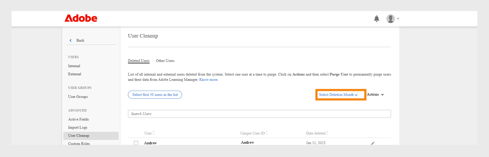
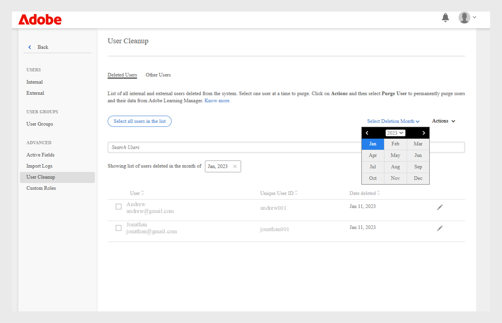
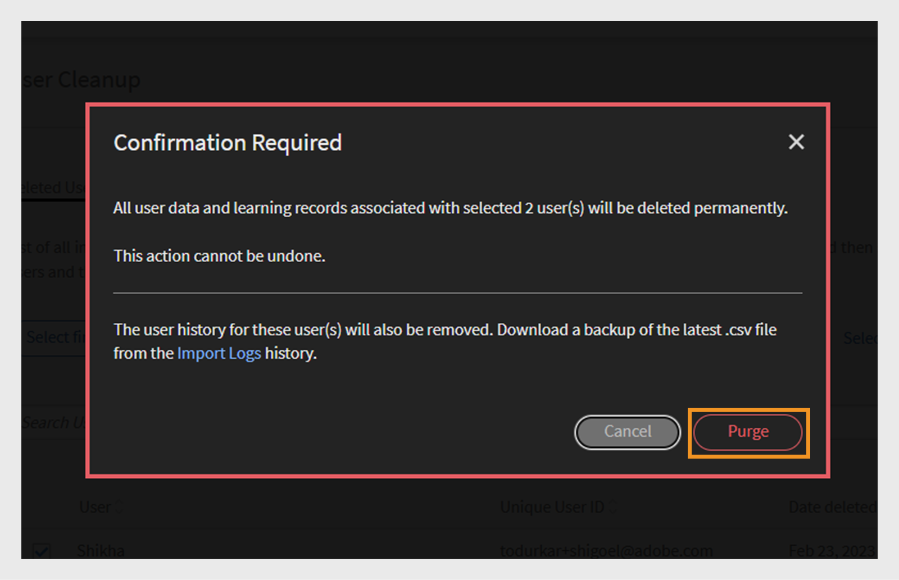

# 清除使用者

進一步瞭解在Learning Manager中清除使用者資料。

## 概觀 {#overview}

使用清除使用者功能，從Learning Manager中移除使用者的個人識別資訊和學習記錄。 請注意，「刪除使用者」和「永久刪除使用者」是兩個不同的功能。 雖然已刪除的使用者可以還原，但與已清除的使用者相關的所有使用者資料和學習記錄都無法還原。

清除使用者動作可能會產生下列結果：

* 如果清除使用者，匯入記錄中的連結將無法正常運作，以避免下載舊的CSV並將使用者資料重新帶回系統中。
* 如果清除作者，其名稱會由清除該使用者的管理員名稱取代。
* 如果清除講師，則會從工作階段中將其移除。 管理員必須更換/新增此類工作階段的講師。
* 在Learning Manager中清除使用者，不會移除任何外部應用程式（第三方系統或您編寫的其他應用程式）中的使用者。 請聯絡外部應用程式擁有者，將使用者從這類應用程式中移除。
* 如果在聯結器的組態設定中參照了已清除的使用者，則聯結器會停用。 管理員需要重新設定聯結器才能繼續。

<!---### Manage users

In this training, you will learn how to assign and remove roles, send a welcome email, and delete and purge users. 

If you're unable to launch the training, write to <almacademy@adobe.com>.-->

## 如何清除使用者

若要永久刪除使用者，請執行下列步驟：

1. 以管理員身分，從左窗格選取&#x200B;**[!UICONTROL Users]**。 **[!UICONTROL Internal Users]**&#x200B;頁面隨即開啟。
1. 刪除您要永久刪除的使用者。 若要刪除，請使用核取方塊選取一或多個使用者。 開啟&#x200B;**[!UICONTROL Action]**&#x200B;下拉式清單，然後選取&#x200B;**[!UICONTROL Delete User.]**
1. 在左窗格中，選取&#x200B;**[!UICONTROL User Cleanup]**。 **[!UICONTROL User Cleanup]**&#x200B;頁面會與已刪除的使用者清單一起顯示。 使用選項按鈕來選取要永久刪除的使用者。 您一次只能清除一個使用者。

   

   *選取要清除的使用者*

1. 開啟&#x200B;**[!UICONTROL Actions]**&#x200B;下拉式功能表並選取&#x200B;**[!UICONTROL Purge User]**。

   

   *選取清除使用者選項*

1. 會出現一個對話方塊，要求確認。 清除後，與所選使用者相關聯的所有使用者資料和學習記錄都會永久刪除。 清除後，動作將無法復原。 若要確認，請按一下&#x200B;**[!UICONTROL Purge]**。

   

   清除使用者後&#x200B;*確認訊息*

1. 確認並按一下「永久刪除」後，即接受永久刪除請求。 動作完成後，您會收到通知。 此外，也提供清除請求ID。 您可以將此ID提供給CSM以追蹤請求。

>[!NOTE]
>
>一旦將已刪除的使用者新增回系統，先前的角色（例如管理員、經理、作者、講師等）將不會保留。它們將會以學習者角色新增。

## 大量清除使用者

您可以選取前50名使用者，並一次清除這些使用者。 這可以讓管理員一次選取50個使用者，並將他們一起清除。 這在管理員想要大量清除使用者時有所幫助。 檢查要永久刪除的使用者永遠是最佳做法。 這對於確保只清除正確的使用者集非常重要。

*大量清除使用者*

## 清除之前篩選已刪除的使用者

Adobe Learning Manager可讓管理員永久移除已從平台刪除的使用者。 此過程稱為清除，可幫助組織維護乾淨的學習者資料庫、遵守資料保留政策，並防止未經授權存取使用者資料。
這對於維護資料衛生，以及確保從系統中移除未使用的舊使用者資料特別有用。
清除使用者是遵守資料隱私權指引，或透過移除多餘記錄來維護經過清理的資料存放區的關鍵所在。

### 按月篩選已刪除的使用者

您可以篩選已刪除的使用者，方法是選取特定月份，然後永久刪除他們。

若要使用刪除月份來篩選已刪除的使用者：

1. 在管理員首頁中選取&#x200B;**[!UICONTROL Users]**，然後選取&#x200B;**[!UICONTROL User Cleanup]**。
2. 選取&#x200B;**[!UICONTROL Select Deletion Month]**&#x200B;日期選擇器並選取日期。

   
   _選取刪除使用者的月份_

   選定月份中刪除的使用者清單隨即顯示。

   
   _所選月份顯示的已刪除使用者清單_

### 依月份排序已刪除的使用者

您可以依篩選的使用者的&#x200B;**[!UICONTROL Unique User ID]**&#x200B;和&#x200B;**[!UICONTROL Date deleted]**&#x200B;來排序使用者。

1. 在已刪除的使用者清單中，根據使用者ID或刪除日期來排序使用者。

   
   _依不重複使用者識別碼篩選的使用者清單_

2. 選取一或多個使用者。
3. 選取&#x200B;**[!UICONTROL Actions]**，然後選取&#x200B;**[!UICONTROL Purge User]**。
4. 在確認訊息上選取清除，以從Adobe Learning Manager中永久刪除使用者記錄。

   
   _永久清除使用者之前的最終確認_

>[!NOTE]
>
>永久清除使用者會移除其資料。 在繼續之前仔細檢查您的選取專案。

+++閱讀「清除使用者」動作的結果

<table>
 <tbody>
  <tr>
   <th><strong>使用Learning Manager UI清除 — Enterprise</strong></th>
   <th> </th>
  </tr>
  <tr>
   <td>從提出要求的企業帳戶中刪除選取的使用者。 </td>
   <td>是</td>
  </tr>
  <tr>
   <td>從所有試用帳戶中刪除其電子郵件、adobe_id符合所選使用者電子郵件的所有使用者。</td>
   <td>是</td>
  </tr>
  <tr>
   <td>刪除所有試用帳戶的所有使用者，其電子郵件、adobe_id符合所選使用者的電子郵件，且他/她是試用帳戶的建立者。</td>
   <td>否</td>
  </tr>
  <tr>
   <td>從請求企業帳戶及所有試用帳戶的所有其他欄位中刪除使用者的電子郵件。</td>
   <td>是</td>
  </tr>
  <tr>
   <td>通知啟動器刪除確認。</td>
   <td>是</td>
  </tr>
  <tr>
   <td><strong>使用Learning Manager UI清除 — 非企業</strong></td>
   <td> </td>
  </tr>
  <tr>
   <td>從請求試用帳戶中刪除選取的使用者。</td>
   <td>是</td>
  </tr>
  <tr>
   <td>從所有試用帳戶中刪除其電子郵件、adobe_id符合所選使用者電子郵件的所有使用者。</td>
   <td>是</td>
  </tr>
  <tr>
   <td>刪除所有試用帳戶的所有使用者，其電子郵件、adobe_id符合所選使用者的電子郵件，且他/她是試用帳戶的建立者。</td>
   <td>否</td>
  </tr>
  <tr>
   <td>從所有試用帳戶的所有其他欄位中刪除使用者的電子郵件。</td>
   <td>是</td>
  </tr>
  <tr>
   <td>通知啟動器刪除確認。</td>
   <td>是</td>
  </tr>
  <tr>
   <td><strong>清除其他使用者 — 企業(不是內部或外部Learning Manager使用者的個人)</strong></td>
   <td> </td>
  </tr>
  <tr>
   <td>從請求企業帳戶及所有試用帳戶的所有其他欄位中刪除選取的使用者。</td>
   <td>是</td>
  </tr>
  <tr>
   <td>從帳戶刪除使用者。</td>
   <td>否</td>
  </tr>
  <tr>
   <td>通知啟動器刪除確認。 </td>
   <td>是</td>
  </tr>
  <tr>
   <td><strong>清除</strong> <strong>其他使用者 — 非企業(非內部或外部Learning Manager使用者的個人)</strong></td>
   <td> </td>
  </tr>
  <tr>
   <td>從所有試用帳戶的所有其他欄位中刪除選取的使用者。</td>
   <td>是</td>
  </tr>
  <tr>
   <td>從帳戶刪除使用者。</td>
   <td>否</td>
  </tr>
  <tr>
   <td>通知啟動器刪除確認。</td>
   <td>是</td>
  </tr>
  <tr>
   <td><strong>使用Adobe IMS清除 — 企業</strong></td>
   <td> </td>
  </tr>
  <tr>
   <td>通知企業管理員此要求。</td>
   <td>是</td>
  </tr>
  <tr>
   <td>檢查電子郵件欄位以傳送通知。</td>
   <td>否</td>
  </tr>
  <tr>
   <td><strong>使用Adobe IMS清除 — 非企業</strong></td>
   <td> </td>
  </tr>
  <tr>
   <td>從所有試用帳戶中刪除所有具有所提供AdobeID/電子郵件的使用者。</td>
   <td>是</td>
  </tr>
  <tr>
   <td>如果提供的Email/AdobeId是試用帳戶的建立者，則刪除試用帳戶的所有使用者。</td>
   <td>是</td>
  </tr>
  <tr>
   <td>從所有試用帳戶的所有其他欄位中刪除選取的電子郵件識別碼。</td>
   <td>是</td>
  </tr>
 </tbody>
</table>

+++

## 常見問題 {#frequentlyaskedquestions}

+++清除請求需要多少天才能完成？

清除使用者的請求最多需要30天才能完成。
+++

+++您可以在Adobe Learning Manager中執行大量清除嗎？

可以，您可以大量執行永久刪除。 不過，您只能執行一次有50位使用者的大量永久刪除。
+++

+++我可以還原已清除的使用者嗎？

不適用。 清除後，所有使用者資料將會永久刪除且無法復原。

+++
