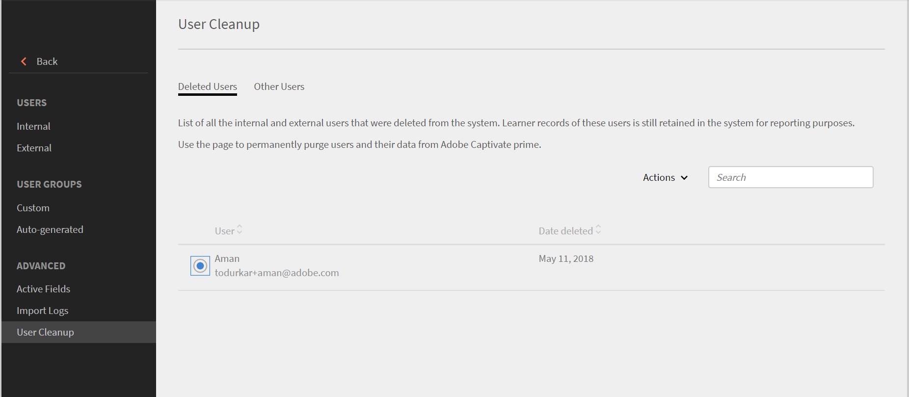
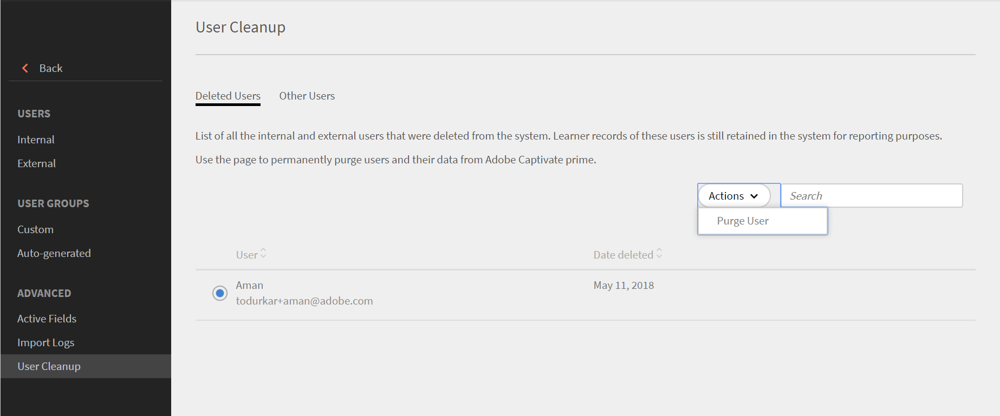
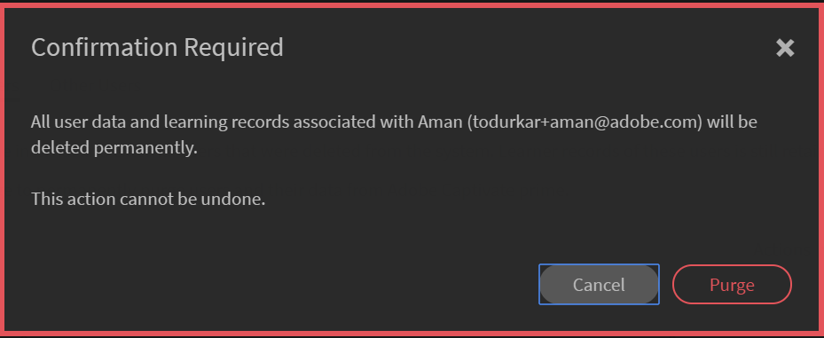
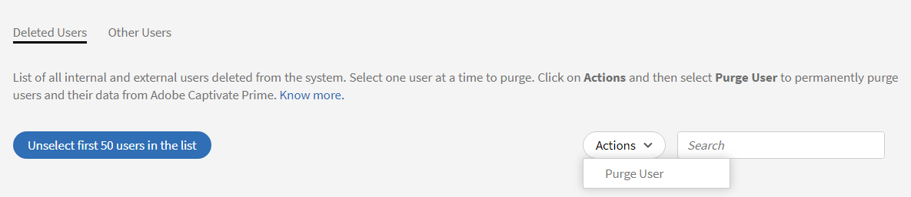

# 清除使用者

進一步瞭解在Learning Manager中清除使用者資料。

## 概觀 {#overview}

使用清除使用者功能，從Learning Manager中移除使用者的個人識別資訊和學習記錄。 請注意，「刪除使用者」和「永久刪除使用者」是兩個不同的功能。 雖然已刪除的使用者可以還原，但與已清除的使用者相關的所有使用者資料和學習記錄都無法還原。

清除使用者動作可能會產生下列結果：

* 如果清除使用者，匯入記錄中的連結將無法正常運作，以避免下載舊的CSV並將使用者資料重新帶回系統中。
* 如果清除作者，其名稱會取代為清除該使用者的管理員名稱。
* 如果清除講師，則會從工作階段中將其移除。 管理員必須更換/新增這類工作階段的講師。
* 在Learning Manager中清除使用者不會移除任何外部應用程式（第三方系統或您編寫的其他應用程式）中的使用者。 請聯絡外部應用程式擁有者，將使用者從這類應用程式中移除。
* 如果在聯結器的組態設定中參照了已清除的使用者，則聯結器會停用。 管理員需要重新設定聯結器才能繼續。

若要永久刪除使用者，請執行下列步驟：

1. 以管理員身分，選取 **[!UICONTROL Users]** 從左窗格。 此 **[!UICONTROL Internal Users]** 頁面隨即開啟。
1. 刪除您要永久刪除的使用者。 若要刪除，請使用核取方塊選取一或多個使用者。 開啟 **[!UICONTROL Action]** 下拉式清單並選取 **[!UICONTROL Delete User.]**
1. 在左窗格中，選取 **[!UICONTROL User Cleanup]**. 此 **[!UICONTROL User Cleanup]** 頁面中會顯示已刪除使用者的清單。 使用選項按鈕來選取要永久刪除的使用者。 您一次只能清除一個使用者。

   

   *選取要永久刪除的使用者*

1. 開啟 **[!UICONTROL Actions]** 下拉式功能表並選取 **[!UICONTROL Purge User]**.

   

   *選取整個清除使用者選項*

1. 會出現一個對話方塊，要求確認。 清除後，與所選使用者相關聯的所有使用者資料和學習記錄都會永久刪除。 清除後，動作將無法復原。 若要確認，請按一下 **[!UICONTROL Purge]**.

   

   *清除使用者後的確認訊息*

1. 確認並按一下「永久刪除」後，即接受永久刪除請求。 動作完成後，您會收到通知。 此外，也提供清除請求ID。 您可以將此ID提供給CSM以追蹤請求。

## 大量清除使用者

您可以選取前50名使用者，並一次清除這些使用者。 這可讓管理員一次選取50個使用者，並將他們一起清除。 這在管理員想要大量清除使用者時有所幫助。 檢查要永久刪除的使用者永遠是最佳做法。 這對於確保只清除正確的使用者集非常重要。

*大量清除使用者*

+++閱讀「清除使用者」動作的結果

<table>
 <tbody>
  <tr>
   <th><strong>使用Learning Manager UI清除 — 企業</strong></th>
   <th> </th>
  </tr>
  <tr>
   <td>從提出要求的企業帳戶中刪除選取的使用者。 </td>
   <td>是</td>
  </tr>
  <tr>
   <td>從所有試用帳戶中刪除其電子郵件、adobe_id符合所選使用者電子郵件的所有使用者。</td>
   <td>是</td>
  </tr>
  <tr>
   <td>刪除所有試用帳戶的所有使用者，其電子郵件、adobe_id符合所選使用者的電子郵件，且他/她是試用帳戶的建立者。</td>
   <td>否</td>
  </tr>
  <tr>
   <td>從請求企業帳戶及所有試用帳戶的所有其他欄位中刪除使用者的電子郵件。</td>
   <td>是</td>
  </tr>
  <tr>
   <td>通知啟動器刪除確認。</td>
   <td>是</td>
  </tr>
  <tr>
   <td><strong>使用Learning Manager UI清除 — 非企業</strong></td>
   <td> </td>
  </tr>
  <tr>
   <td>從請求試用帳戶中刪除選取的使用者。</td>
   <td>是</td>
  </tr>
  <tr>
   <td>從所有試用帳戶中刪除其電子郵件、adobe_id符合所選使用者電子郵件的所有使用者。</td>
   <td>是</td>
  </tr>
  <tr>
   <td>刪除所有試用帳戶的所有使用者，其電子郵件、adobe_id符合所選使用者的電子郵件，且他/她是試用帳戶的建立者。</td>
   <td>否</td>
  </tr>
  <tr>
   <td>從所有試用帳戶的所有其他欄位中刪除使用者的電子郵件。</td>
   <td>是</td>
  </tr>
  <tr>
   <td>通知啟動器刪除確認。</td>
   <td>是</td>
  </tr>
  <tr>
   <td><strong>清除其他使用者 — 企業（不是內部或外部Learning Manager使用者的個人）</strong></td>
   <td> </td>
  </tr>
  <tr>
   <td>從請求企業帳戶及所有試用帳戶的所有其他欄位中刪除選取的使用者。</td>
   <td>是</td>
  </tr>
  <tr>
   <td>從帳戶刪除使用者。</td>
   <td>否</td>
  </tr>
  <tr>
   <td>通知啟動器刪除確認。 </td>
   <td>是</td>
  </tr>
  <tr>
   <td><strong>清除</strong> <strong>其他使用者 — 非企業（不是內部或外部Learning Manager使用者的個人）</strong></td>
   <td> </td>
  </tr>
  <tr>
   <td>從所有試用帳戶的所有其他欄位中刪除選取的使用者。</td>
   <td>是</td>
  </tr>
  <tr>
   <td>從帳戶刪除使用者。</td>
   <td>否</td>
  </tr>
  <tr>
   <td>通知啟動器刪除確認。</td>
   <td>是</td>
  </tr>
  <tr>
   <td><strong>使用Adobe IMS清除 — 企業</strong></td>
   <td> </td>
  </tr>
  <tr>
   <td>通知企業管理員此要求。</td>
   <td>是</td>
  </tr>
  <tr>
   <td>檢查電子郵件欄位以傳送通知。</td>
   <td>否</td>
  </tr>
  <tr>
   <td><strong>使用Adobe IMS清除 — 非企業</strong></td>
   <td> </td>
  </tr>
  <tr>
   <td>從所有試用帳戶中刪除所有具有所提供AdobeID/電子郵件的使用者。</td>
   <td>是</td>
  </tr>
  <tr>
   <td>如果提供的Email/AdobeId是試用帳戶的建立者，則刪除試用帳戶的所有使用者。</td>
   <td>是</td>
  </tr>
  <tr>
   <td>從所有試用帳戶的所有其他欄位中刪除選取的電子郵件識別碼。</td>
   <td>是</td>
  </tr>
 </tbody>
</table>

+++

Learning Manager現已符合GDPR規定。 如需GDPR法規遵循的詳細資訊，請參閱  [Learning Manager法規遵循GDPR](../../kb/prime-gdpr.md).

## 常見問題 {#frequentlyaskedquestions}

+++清除請求需要多少天才能完成？

清除使用者的請求最多需要30天才能完成。
+++

+++您可以在Learning Manager中執行大量清除嗎？

可以，您可以大量執行永久刪除。 不過，您只能執行一次有50位使用者的大量永久刪除。
+++
