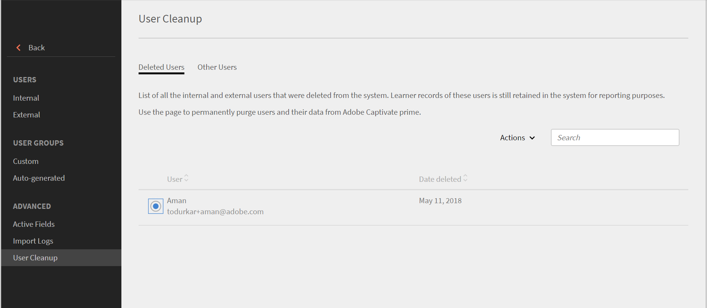
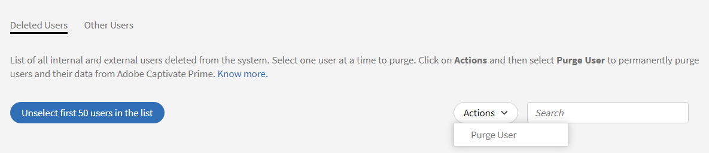

# 清除使用者

了解更多關於在 Learning Manager 中清除使用者資料的資訊。

## 概觀 {#overview}

使用清除使用者功能，從學習管理員中移除使用者的個人可識別資訊及學習紀錄。 請注意，刪除和清除使用者是兩個不同的功能。 雖然刪除的使用者可以恢復，但所有與被清除使用者相關的使用者資料和學習紀錄無法恢復。

清除使用者行動可能產生以下結果：

* 若使用者被清除，匯入日誌中的連結將無法有效，以避免下載舊的 CSV 檔案並再次將使用者資料帶回系統。
* 如果作者被清除，他的名字會被刪除該使用者的管理員名稱取代。
* 若教官被清除，將被移除出課程。 管理員必須替換或新增這類課程的講師。
* 在 Learning Manager 中清除使用者不會移除該使用者在任何外部應用程式（第三方系統或你自己撰寫的其他應用程式）。 請聯絡外部應用程式擁有者，讓使用者從這些應用程式中移除。
* 如果在連接器的設定設定中被提及被清除的使用者，該連接器將被停用。 管理員需要重新設定連接器才能繼續運作。

<!--
### Manage users

In this training, you will learn how to assign and remove roles, send a welcome email, and delete and purge users. 

If you're unable to launch the training, write to <almacademy@adobe.com>.
-->

## 如何清除使用者

要清除使用者，請遵循以下步驟：

1. 作為管理員，請從左側窗格選擇 **[!UICONTROL Users]** 。 **[!UICONTROL Internal Users]**&#x200B;頁面打開。
1. 刪除你想清除的使用者。 要刪除，請透過勾選框選擇一位或多位使用者。 打開 **[!UICONTROL Action]** 下拉選單並選擇 **[!UICONTROL Delete User.]**
1. 在左側窗格選擇 **[!UICONTROL User Cleanup]**。 該 **[!UICONTROL User Cleanup]** 頁面顯示已刪除使用者名單。 使用單選按鈕選擇要清除的使用者。 你一次只能清除一個使用者。

   

   *選擇一個要清除的使用者*

1. 打開 **[!UICONTROL Actions]** 下拉選單並選擇 **[!UICONTROL Purge User]**。

   

   *選擇清除使用者選項*

1. 出現一個對話框尋求確認。 一旦清除，所有與所選使用者相關的資料與學習紀錄都會被永久刪除。 一旦被清除，行動就無法撤銷。 要確認，請點擊 **[!UICONTROL Purge]**。

   

   *清除使用者後的確認訊息*

1. 一旦確認並點擊清除，清除請求就會被接受。 操作完成後你會收到通知。 同時也提供清除申請ID。 你可以把這個ID提供給CSM來追蹤申請。

>[!NOTE]
>
>一旦刪除的使用者被重新加入系統，先前的角色（例如管理員、經理、作者、講師等） 不會被保留。他們會加入學習者角色。

## 大量清除使用者

你可以選擇前 50 名使用者，一次性清除這些使用者。 這讓管理員可以一次選擇 50 位使用者並一起清除。 這有助於管理員在想要大量清除使用者時使用。 檢查被選中清除的使用者是最佳做法。 這很重要，以確保只有正確的用戶群被清除。

*大量清除使用者*

## 在清除前先過濾已刪除的使用者

Adobe Learning Manager 允許管理員永久移除已從平台刪除的使用者。 此過程稱為清除，幫助組織維持乾淨的學習者資料庫，遵守資料保留政策，並防止未經授權存取使用者資料。
這對於維護資料衛生及確保系統中舊有未使用的使用者資料被移除特別有用。
清除使用者對於遵守資料隱私指引或透過移除冗餘紀錄來維護資料儲存的淨化至關重要。

### 按月份篩選已刪除的使用者

你可以選擇特定月份來篩選已刪除的用戶，然後永久刪除他們。

要用刪除月份篩選被刪除的用戶：

1. 在管理員首頁選擇 **[!UICONTROL Users]** ，然後選擇 **[!UICONTROL User Cleanup]**。
2. 選擇 **[!UICONTROL Select Deletion Month]** 日期選擇器並選擇日期。

   
   _選擇使用者被刪除的月份_

   選取月份內刪除的使用者名單會顯示出來。

   
   _所選月份顯示的已刪除使用者列表_

### 按月份排序已刪除的使用者

你可以依照他們的 **[!UICONTROL Unique User ID]** 和 **[!UICONTROL Date deleted]**&#x200B;來排序被篩選的使用者。

1. 在已刪除使用者清單中，依使用者 ID 或刪除日期排序。

   
   _使用者列表依獨特使用者 ID 篩選_

2. 選擇一位或多位使用者。
3. 選擇 **[!UICONTROL Actions]** ，然後選擇 **[!UICONTROL Purge User]**。
4. 在確認訊息中選擇「清除」以永久刪除 Adobe Learning Manager 中的使用者紀錄。

   
   _永久清除用戶前的最終確認_

>[!NOTE]
>
>清除使用者會永久移除他們的資料。 在繼續前請再三確認你的選擇。

+++閱讀清除使用者行動的結果

<table>
 <tbody>
  <tr>
   <th><strong>使用 Learning Manager UI - Enterprise 進行清除</strong></th>
   <th> </th>
  </tr>
  <tr>
   <td>從請求的企業帳號中刪除所選使用者。 </td>
   <td>是的</td>
  </tr>
  <tr>
   <td>刪除所有試用帳號中所有與adobe_id與特定使用者電子郵件相符的使用者。</td>
   <td>是的</td>
  </tr>
  <tr>
   <td>刪除所有與選定使用者電子郵件相符且該adobe_id為試用帳號創建者的所有試用帳號使用者。</td>
   <td>不</td>
  </tr>
  <tr>
   <td>刪除申請企業帳號及所有試用帳號其他欄位中的使用者電子郵件。</td>
   <td>是的</td>
  </tr>
  <tr>
   <td>通知發起人刪除確認。</td>
   <td>是的</td>
  </tr>
  <tr>
   <td><strong>使用 Learning Manager UI 進行清理 - 非企業版</strong></td>
   <td> </td>
  </tr>
  <tr>
   <td>從申請的試用帳號中刪除已選中的使用者。</td>
   <td>是的</td>
  </tr>
  <tr>
   <td>刪除所有試用帳號中所有與adobe_id與特定使用者電子郵件相符的使用者。</td>
   <td>是的</td>
  </tr>
  <tr>
   <td>刪除所有與選定使用者電子郵件相符且該adobe_id為試用帳號創建者的所有試用帳號使用者。</td>
   <td>不</td>
  </tr>
  <tr>
   <td>刪除所有試用帳號其他欄位中的使用者電子郵件。</td>
   <td>是的</td>
  </tr>
  <tr>
   <td>通知發起人刪除確認。</td>
   <td>是的</td>
  </tr>
  <tr>
   <td><strong>清除其他使用者-企業級（非內部或外部 Learning Manager 使用者）</strong></td>
   <td> </td>
  </tr>
  <tr>
   <td>刪除申請企業帳號及所有試用帳號中所有其他欄位的選取使用者。</td>
   <td>是的</td>
  </tr>
  <tr>
   <td>使用者從帳號中刪除。</td>
   <td>不</td>
  </tr>
  <tr>
   <td>通知發起人刪除確認。 </td>
   <td>是的</td>
  </tr>
  <tr>
   <td><strong>清除</strong><strong>其他使用者- 非企業用戶（非內部或外部 Learning Manager 使用者）</strong></td>
   <td> </td>
  </tr>
  <tr>
   <td>刪除所有試用帳戶其他欄位中所選用戶。</td>
   <td>是的</td>
  </tr>
  <tr>
   <td>使用者從帳號中刪除。</td>
   <td>不</td>
  </tr>
  <tr>
   <td>通知發起人刪除確認。</td>
   <td>是的</td>
  </tr>
  <tr>
   <td><strong>使用 Adobe IMS - Enterprise 進行清除</strong></td>
   <td> </td>
  </tr>
  <tr>
   <td>通知企業管理員這個請求。</td>
   <td>是的</td>
  </tr>
  <tr>
   <td>請檢查電子郵件欄位以發送通知。</td>
   <td>不</td>
  </tr>
  <tr>
   <td><strong>使用 Adobe IMS - 非企業版進行清除</strong></td>
   <td> </td>
  </tr>
  <tr>
   <td>從所有試用帳號刪除所有擁有提供 AdobeID/電子郵件的使用者。</td>
   <td>是的</td>
  </tr>
  <tr>
   <td>如果提供的電子郵件或 Adobe ID 是該試用帳號的創建者，請刪除所有試用帳號的使用者。</td>
   <td>是的</td>
  </tr>
  <tr>
   <td>刪除所有試用帳號其他欄位中的選中電子郵件 ID。</td>
   <td>是的</td>
  </tr>
 </tbody>
</table>

+++

## 常見問題 {#frequentlyaskedquestions}

+++清除請求需要幾天才能完成？

清除用戶的請求最多需時30天完成。
+++

+++你能在 Adobe Learning Manager 裡執行批量清理嗎？

是的，你可以批量進行排毒。 不過，你最多只能批量清除 50 位用戶。
+++

+++我可以恢復被清除的使用者嗎？

不。 一旦清除，所有使用者資料將永久刪除，無法恢復。

+++
