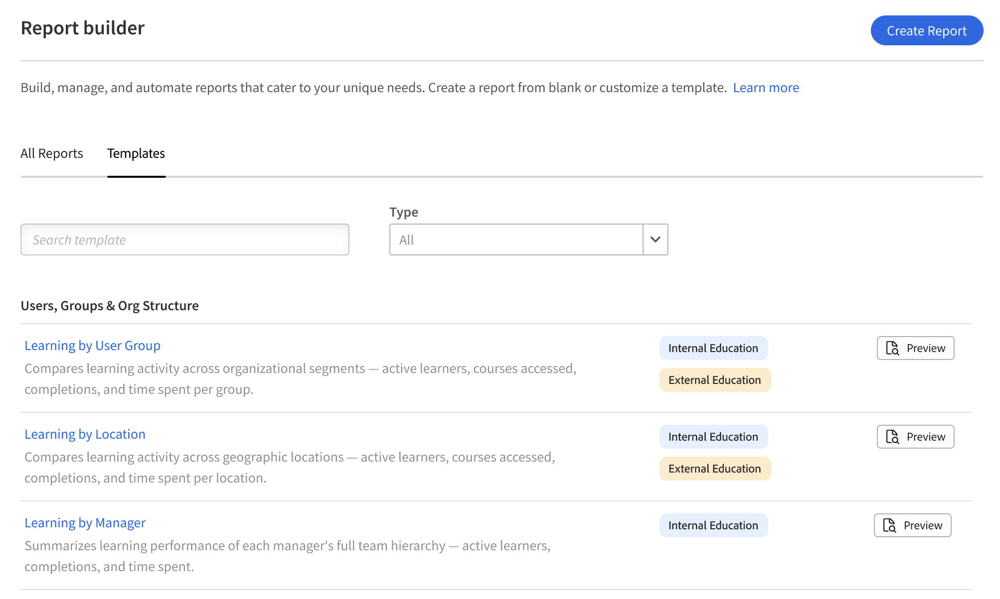

# 報告建置器 - 概念與術語

## 範本與報告

**範本** 是由 Adobe Learning Manager 預先建構好的報表配置。 這些工具設計用於常見使用情境、註冊與完成追蹤、合規報告、教師表現，且可立即下載。 範本是唯讀的;你無法編輯或覆寫它們。

**報告** 是你自己儲存的設定。 你可以從零開始建立報告，或複製範本並編輯副本。 當你複製範本時，該副本會變成報告，並存於你的 **報告** 標籤中。 模板和報告都會出現在報告建工具中，但分別放在不同的分頁中。

## 資料集

資料集是報告建工具中相關欄位的命名群組。 當你在報告中新增欄位時，你是從這些資料集中選擇。 把每個資料集想像成一張關於學習資料某一面向資訊的表格。

以下是報告建構器中可用的資料集範例：

* **使用者**：學習者資料，包括活躍欄位
* **逐字稿**：註冊與完成紀錄
* **學習對象**：課程、學習路徑與認證資料
* **學習物件實例**：實例層級細節
* **目錄**：目錄及目錄標籤資料
* **使用者群組**：使用者群組成員與階層
* **模組**：教室與虛擬課程資料，包括電子學習模組細節

>[!NOTE]
>
>資料集可選擇性加入。 並非所有組合都能在單一報告中找到。

## 欄位與新增按鈕

你新增的每一欄會以一列的形式出現在報表畫布中，並成為下載檔案中的一欄。 你可以重複新增同一欄。 當你想測量同場兩個不同數值時，這很有用。 例如，你可以新增&#x200B;****&#x200B;兩次狀態欄位：一次用來計算註冊人數，一次用來計算正在進行中的學習者，使用計數 if Aggregate。

你也可以輸入別名來重新命名任何欄位。 別名會以所下載報告的欄頭出現。

## 按群組與聚合

分組是依選定欄位來總結資料，而不是顯示單一列。 例如，依教師名稱分組，每位講師會有一列，而不是每個報名一列。

分組遵循標準資料庫行為：一旦你對某欄套用分組，報告中每隔一欄必須套用彙總函數。 你不能把單筆資料和分組資料混在一起。 可用的聚合函數有：

* **計數**：總列數
* **Count if**：欄位與你指定的值相符的列數
* **總和**：數值域的總和
* **最小**&#x200B;值：數值欄位中的最低值
* **Max**：數值欄位中的最高值
* **平均**&#x200B;值：數值欄位的平均值

如果你用過 Excel 的樞紐分析表，欄位層級的按群組功能也是一樣的。

## 濾鏡

篩選器會限制報告中出現的欄位。 你可以套用多個濾波器，並搭配 AND 或 OR 邏輯。

過濾器運算子依欄位的資料型態而定：

* **字串欄位**：包含、等於、以（可預先打字搜尋以識別值）
* **數值域**：大於、小於、等於
* **日期欄位**：等於、之前、之後、中間及相對範圍（例如，過去90天）
* **列舉（列表）欄位**：在 in、is not 在（多重選擇值選擇器）

## AND / OR 邏輯與巢狀濾波器群組

多個過濾器預設為 AND 邏輯，所有條件必須為真才能顯示一列。 你可以在任兩個濾波器之間切換操作員到OR。 你也可以用 **「加入為群組**」來分組篩選，這樣會產生一個括號。 群組內的過濾器會合併評估，然後再與外部過濾器合併。

這讓你可以建立條件，例如：（目錄=安全或目錄=衛生）且完成日期是在過去90天內。

你可以在其他群組中巢狀，以支援複雜的多層邏輯。

## 分院

你可以在一欄或多欄上排序。 你排序的第一欄是主要排序。 在主欄的平手中，還會顯示其他分類。

當你需要穩定輸出時，務必至少套用一個排序。 由於報告產生是在分散式系統中進行，除非先進行排序，否則無法保證兩次下載同一報告的列序。

## 趨勢資料與快照資料

任何使用趨勢彙整器的報告，例如月對月或週，皆反映依日期分組的當前快照資料。 它不反映每個過去日期的資料歷史狀態。

例如，按月份分組的登記趨勢顯示目前有多少註冊數據，分布在創建月份內。 它不包含後來退學或更改使用者群組的學習者。 這些變動不會追溯適用於過去幾個月。

## 被刪除的學習者與活躍欄位

報告建置器支援將已刪除的學習者納入報告並取得其活躍欄位值。

請使用使用者資料集中的刪除日期欄位來建立報告。

## 最佳實務

* 在從零開始建立報告前，先閱讀現有的資料集參考資料。 知道哪組資料包含你需要的欄位，能大幅節省設定時間。
* 在訂閱排程報告前，請先套用排序功能。 這確保每次配送的列次序一致。
* 如果你發現意外重複的列，請檢查報告中是否有欄位，每列可有多個值，例如多位講師的課程名稱。
