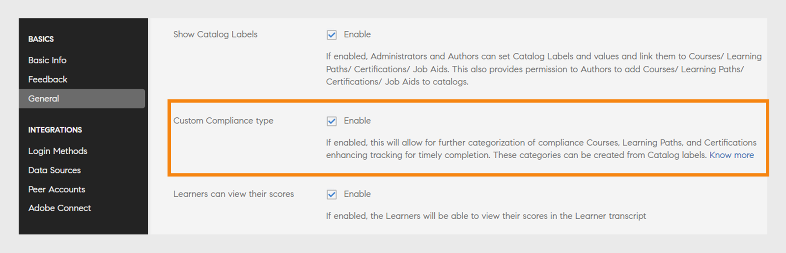
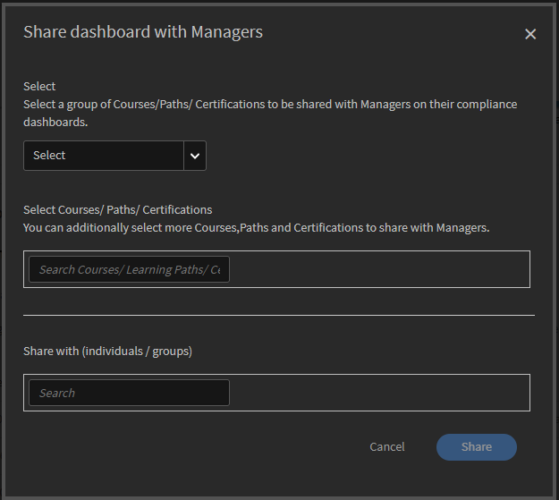
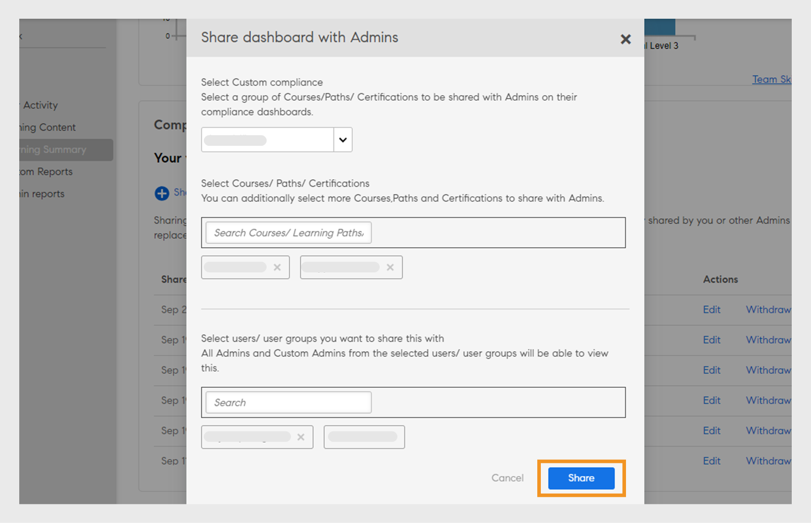
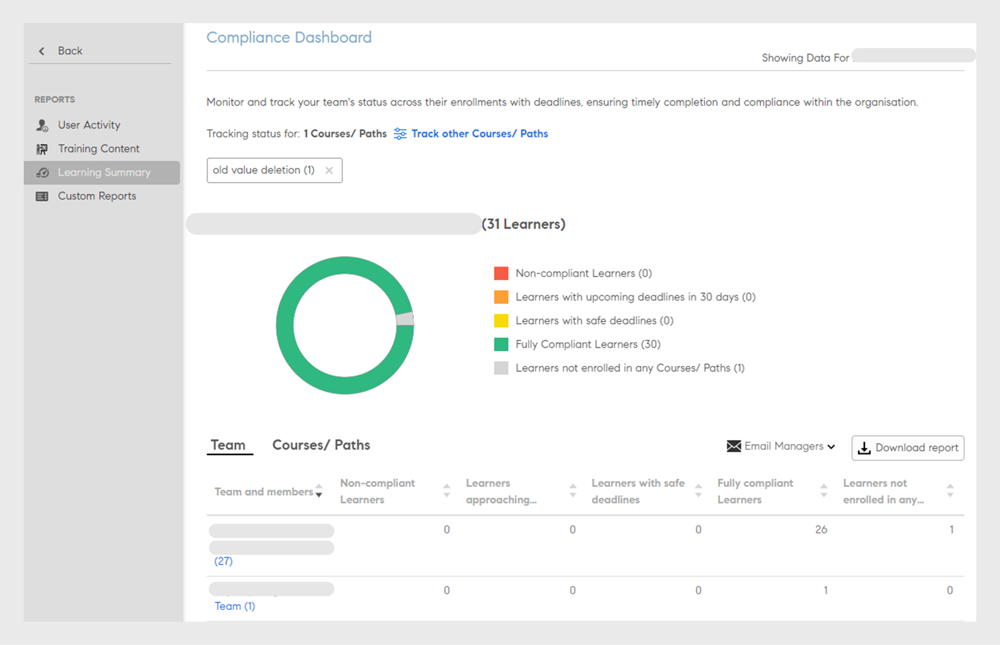
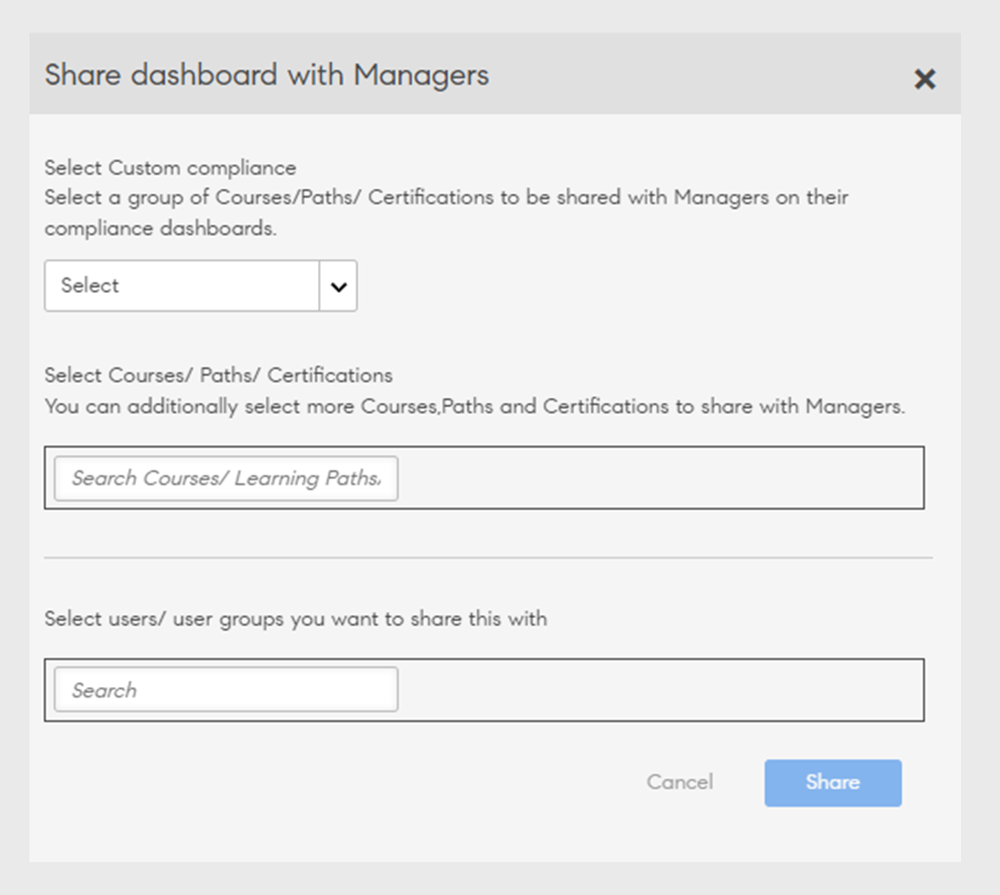
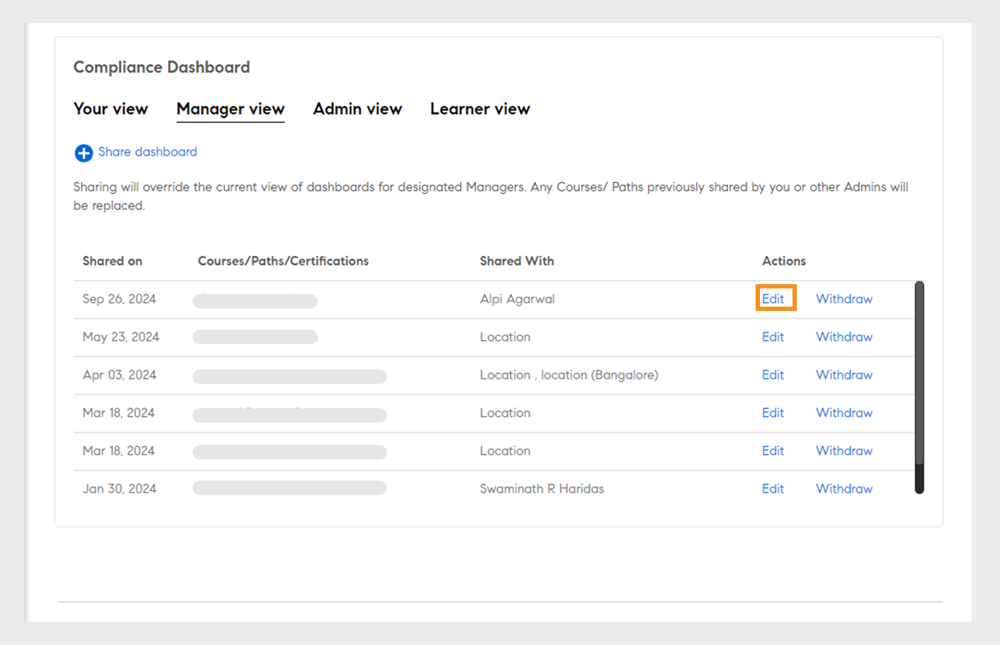
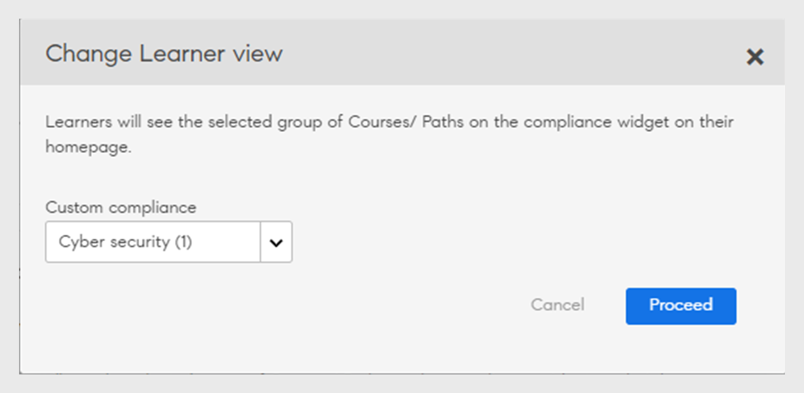

# 報表

了解與學習管理器應用程式中的管理員角色關聯的報告。

Adobe Systems學習管理員使您能夠創建各種報告來跟蹤、監視和控制學習者活動。 系統會自動追蹤學習者活動並擷取至資料庫中。 管理員和管理員報告會從資料庫產生。

## 概觀 {#overview}

管理員和經理的報告生成過程都類似。 經理可以視圖與其下屬對應的報告，而管理員可以視圖所有組織範圍的報告。

報表匯總到控制面板中。 報表必須存在於控制面板內。 A **[!UICONTROL Default Dashboard]** 預設存在于報表頁面中。 您新增的任何報表都會移入此預設控制面板。 要將報表新增到單個控制面板，請使用下拉箭頭並選擇 **[!UICONTROL Add Report]**。 有關建立控制面板的更多信息，請参閱本頁面的控制面板部分。

## 報告類型 {#typesofreports}

Adobe Systems學習管理器支援四種主要類型的報告，例如完成、花費的時間、技能和有效性。 您可以使用下列報表類型產生 300+ 個變數的報表：

* 學習者的課程傳遞統計
* 課程成效報告
* 基於學習者技能的報告
* 學習者的學習方案註冊統計資訊
* 學習者花費的學習時間
* 學習者人數
* 認證完成

## 用戶活動儀錶板 {#useractivitydashboards}

查看一段時間内平台上所有用戶活動摘要。 設定用戶群組並套用篩選器。

用戶活動控制面板显示用戶在帳戶中的活動。 列出的三個報表是：

* **註冊使用者：** 此報表提供您帳戶周內註冊的用戶數量資訊。 對於具有每月有效單位許可的帳戶，報告改為顯示MAU單位。

* **使用者訪問報告：** 此報告提供有關每天訪問平臺的用戶數量的資訊。 還提供月度報告。

* **學習花費時間報告：** 此報告提供有關平臺中每天花費的學習時間的資訊。 還提供月度報告。

### 註冊使用者 {#registeredusers}

學習管理器記錄每周在系統中註冊的用戶數。 管理員可以視圖此報告，以了解當周某天的註冊用戶計數。 存儲一周后的註冊計數不會更改。 因此，歷史註冊計數與系統中的當前學習者集無關。

此報表提供您帳戶每周的註冊用戶數量信息。

對於具有每月有效單位許可的帳戶，報告改為顯示MAU單位。

*「已註冊用戶」報表*

***對於每月訪問單元帳戶：***

**每月活躍用戶報表**

此報表顯示每月在學習平臺中處於活動狀態的學習者數量。 如果使用者執行此處提及的任何學習作，則該用戶在當月被視為活動。 其計算方式與每月有效單位的方式相同。

每月活動計數一旦計算並存儲一個月，就不會改變。 因此，顯示的歷史計數與系統中的當前學習器集無關。

### 使用者造訪 {#uservisits}

此報表顯示一天或月期間存取系統的學習者總數。 瀏覽學習平台而不消費任何學習也視為「存取」學習平台。 這有助於管理員瞭解存取系統的使用者總數。 當月的第一天，Learning Manager會建立上個月存取平台的使用者總數記錄。 它也會擷取這些使用者的使用者群組資訊。

只記錄管理員設定的使用者群組。 這可讓管理員對使用者群組套用篩選，以取得每月歷史資料。 請注意，如果使用者群組設定被修改，且Learning Manager在先前的幾個月內未記錄此使用者群組的資料，則Learning Manager無法顯示前幾個月新設定的此使用者群組的資料。

此報表包含使用所有格式（例如Web、行動應用程式、Headless自訂解決方案）存取平台的使用者。 裝置應用程式使用圖表僅明確提及使用Learning Manager裝置應用程式存取平台的使用者。 這可協助管理員識別其帳戶中使用行動應用程式的情形。

*用戶瀏覽報表*

### 學習逗留時程報表 {#learningtimespentreport}

在這裡，您可以看到一個雙軸折線圖，顯示所有學習者在12個月內花費的總學習時間。 第二個軸表示個人學習所花費的時間中位數。

不同學習物件（例如學習計劃和認證）所花費的時間計算如下：

* 具有静態和互動式內容的自定進度課程
* 使用url的活動課程。
* 已啟用週末旗標的週末工作階段。
* 已自動標籤出席的VC連線工作階段。
* 不同學習物件（例如學習計畫與認證）的逗留時間
* xAPI活動課程的xAPI陳述式。

您可進一步將圖表導出為 Excel 電子表格。

提供了用於選擇使用者群組配置的篩選器，這將有助於查看有關不同用戶組的數據。

所選日期和消費者群組篩選器將應用於儀錶板中的所有相關圖形。

>[!NOTE]
>
>若是 **[!UICONTROL User Visits]** AND **[!UICONTROL Learning Time Spent]** 報表，顯示的預設數據 （未設定使用者群組時） 將針對整個帳戶。

## 培訓內容控制面板 {#trainingcontentdashboard}

培訓內容儀錶板提供有關平台上可用培訓的見解。 您可以檢視熱門培訓或追蹤所有可用的培訓。

### 培訓報表 {#trainingsreport}

此報告提供平臺（已發佈狀態）中每月可用的培訓總數的資訊。 它指出了隨時間推移提供的培訓數量。

*培訓報告*

### 活動培訓報表 {#activetrainingsreport}

此報表提供選定時間範圍內處於活動狀態的培訓資訊。 主動訓練是指在給定時間內註冊、在玩家中查看或完成的訓練。

對於主動培訓，在未完成使用者群組配置時，所有根用戶（帶經理角色）內部組的數據將可供選擇。 除了根用戶用戶組外，如果需要，還可以再配置 10 個用戶組。

*活動訓練報表*

>[!NOTE]
>
>選取和篩選器時&#x200B;**[!UICONTROL All Users]****[!UICONTROL 12 months]**，數據不會如預期顯示，但會在您選取 時&#x200B;**[!UICONTROL All internal user group]顯示。**

<table>
 <tbody>
  <tr>
   <td>
    
<b>參考</b>
</td>
   <td>
    
<b>度量</b>
</td>
   <td>
    
<b>說明</b>
</td>
  </tr>
  <tr>
   <td>
    
1
</td>
   <td>
    
開始比率(%)
</td>
   <td>
    
已開始課程的學習者人數與註冊人數的比率。
</td>
  </tr>
  <tr>
   <td>
    
2
</td>
   <td>
    
完成率（%）
</td>
   <td>
    
已完成課程的使用者總數與開始課程的用戶總數的比率。 
</td>
  </tr>
  <tr>
   <td>
    
3
</td>
   <td>
    
學習者意見
</td>
   <td>
    
以1到10的級數收到的所有L1回饋回應的平均值，會舍入至最接近的整數。 
</td>
  </tr>
  <tr>
   <td>
    
4
</td>
   <td>
    
經理反饋
</td>
   <td>
    
收到的所有 L3 反饋回應的平均值，範圍為 1 到 5，四捨五入到最接近的整數 
</td>
  </tr>
 </tbody>
</table>

培訓報表還有兩欄：

1. 課程的平均星級評分。
1. 對課程進行評分的學習者人數。
1. 內嵌路徑
1. 內嵌路徑ID
1. 內嵌課程ID

>[!NOTE]
>
>開始率、完成率、學習者意見回饋和經理意見回饋不受套用的篩選器影響。 這些篩選條件只會影響註冊、檢視和完成。

>[!NOTE]
>
>對於這兩個報表（訓練內容、使用者活動），您最多可以設定10個使用者群組。 處理作業最多可能需要24小時的時間才能完成，並讓新設定的篩選器可供使用。

## 學習摘要儀表板 {#dashboards}

### 產生控制面板報表

>[!INFO]
>
>在本次訓練中，您將瞭解如何從資料庫產生儀表板報告。    

如果您無法啟動訓練，請寫信到<almacademy@adobe.com>。

檢視平台中所有學習活動的摘要報告。 在此頁面上，您可以看到所選根使用者團隊和外部設定檔的以下摘要資訊。 亦可選擇時間範圍：

* 以註冊、視圖和完成形式呈現的學習摘要
* 頂級技能
* 合規性摘要

*摘要圖表*

如果有內部根級別管理員，它們將一個接一個地顯示。

所有外部設定檔將列在內部設定檔（內部根層級使用者）之後。

如果外部設定檔有管理員，則管理員階層會顯示在&#x200B;**[!UICONTROL Showing Data For]**&#x200B;下拉式清單中。 使用者將在經理階層的所有詳細信息頁面（學習摘要、合規性和技能狀態）中列出

如果沒有，則所有單個用戶詳細信息將顯示在清單中。

若要查看各個內部團隊註冊的更精細詳細資訊，請按下 **[!UICONTROL Learning Summary Details]**。

*學習摘要詳細資訊*

按一下任何註冊後，您都可以看到每個經理的學習者，以及註冊了哪些學習物件。 您還可以查看每個學習者的進度和完成詳細資訊。

*分配給經理的學習者*

按兩下任意團隊並將其報表匯出為 csv。 管理員可以通過選擇使用者組或單個用戶匯出任何使用者組或單個用戶的報告，然後從下拉清單導出 **[!UICONTROL Action]** 詳細資訊。

此外，您還可以看到正在進行和已實現技能視圖條形圖。 您可以新增/刪除要在圖表中顯示的技能。

*技能狀態堆疊條形圖*

### 合規性儀錶板

**Adobe Learning Manager**&#x200B;為所有管理員和管理員提供合規性儀表板。 管理員可以建立合規性儀表板並與管理員共用。 經理將能夠檢視其應用程式上新共用的儀表板，並可輕鬆追蹤其團隊成員對特定培訓的合規性。 合規性儀表板可讓管理員將自訂合規性課程分類為特定類別（例如，銷售、行銷和法律）。 自訂規範類別由&#x200B;**[!UICONTROL Catalog Labels]**&#x200B;提供。

_合規性儀表板 - 管理員視圖_

管理員還可以通過選擇 **[!UICONTROL Go to Compliance dashboard]**&#x200B;來檢查每個經理團隊的合規性狀態。 管理員可以單獨或群組與經理共用一組培訓課程。 這有助於經理輕鬆跟蹤其隊友對指定培訓的合規性。

#### 管理員工作流程

##### 建立自定義合規性標籤

合規性標籤是一種目錄標籤，用於將課程/學習路徑/認證分類為合規性類型。若要創建自定義合規性標籤，請執行以下步驟追隨：

1. 在管理員應用程式中，轉到 **[!UICONTROL Settings]** > **[!UICONTROL General]**。
1. 選擇 **[!UICONTROL Custom Compliance type]** 選項以啟用自定義合規性標籤。

   
   _啟用自定義合規性_

   >[!NOTE]
   >
   >引入了此新目錄標籤，用於將課程、學習路徑和認證分類為合規性類型。 若要啟用該 **[!UICONTROL Custom Compliance type]** 選項，必須先在同一頁面中啟用 **[!UICONTROL Show Catalog Label]** 該選項。

1. 移至 **[!UICONTROL Settings]** > **[!UICONTROL Catalog Label]** 並選擇 **[!UICONTROL Compliance type]**.
1. 在文字框中 **[!UICONTROL Value]** 鍵入值（例如，法律、銷售），然後選擇 **[!UICONTROL Add Value]**。

   
   _為自定義合規性添加值_

1. 選擇 **[!UICONTROL Save]**。

>[!NOTE]
>
>作者在其應用程式中創建/編輯課程時必須添加這些合規性標籤。 請參閱 [將合規性標籤添加到課程/學習路徑/認證](/help/migrated/authors/feature-summary/courses.md#add-compliance-labels-to-courselearning-pathcertification)。

##### 建立和共用合規性儀錶板

若要創建和共用合規性儀錶板，請執行以下步驟追隨：

1. 移至 **[!UICONTROL Reports]** > **[!UICONTROL Learning Summary]**。
1. **[!UICONTROL Compliance Dashboard]**&#x200B;在該部分中，選擇 **[!UICONTROL Shared with Managers]**。
1. 從下拉功能表中選擇&#x200B;**[!UICONTROL Share dashboard]****[!UICONTROL Select Compliance Label]**&#x200B;並選擇創建的標籤。

   
   _選擇合規性類型_

1. 在 **[!UICONTROL Share with]** 文字框中鍵入並選擇經理的姓名。
1. 選擇將 **[!UICONTROL Share]** 控制面板傳送給選定的經理。

>[!NOTE]
>
>共用新儀錶板將覆蓋所選經理應用程式中的現有儀錶板。 管理員將能够視圖管理員新共享的儀錶板。

#### 與管理員和自定義管理員共用合規性儀錶板

管理員可以與其他管理員和自定義管理員共用儀錶板，從而即時訪問所有合規性儀錶板。

請按照以下步驟與管理員和自訂管理員共享儀錶板：

1. 以ID **[!UICONTROL Admin]**&#x200B;登入。
2. 導航到 **[!UICONTROL Reports]** > **[!UICONTROL Learning Summary]**。
3. 選擇&#x200B;**[!UICONTROL Admin View]****[!UICONTROL Compliance Dashboard]**&#x200B;該部分。
4. 選取按鈕 **[!UICONTROL Share Dashboard]** 。

   
   _共用控制面板 - 管理員_

5. 從下拉功能表中選擇 **[!UICONTROL Select Custom Compliance]** 合規性標籤。 此選項將選擇具有所選合規性標籤的所有課程。
6. 選擇要與管理員共用的其他課程、學習路徑或認證。

   
   _共用合規性儀錶板_

7. 選擇要分享儀表板的使用者或使用者組，然後選擇 **[!UICONTROL Share]**。

##### 檢視合規性儀表板 — 自訂管理員和其他管理員

來自所選使用者群組的所有自訂管理員和其他管理員都可以在他們的應用程式上看到合規性儀表板。

請依照下列步驟檢視法規遵循儀表板：

1. 導覽至&#x200B;**[!UICONTROL Reports]** > **[!UICONTROL Learning Summary]** > **[!UICONTROL Compliance Dashboard]**。
2. 選擇&#x200B;**[!UICONTROL Your View]****[!UICONTROL Compliance Dashboard]**&#x200B;該部分。
3. 選擇該 **[!UICONTROL Go to Compliance Dashboard]** 選項，可以看到管理員共用的新合規性儀錶板。

   
   _檢視合規性儀錶板 - 自定義管理_

#### 與商店管理員共用

管理員可以與商店經理共用合規性儀錶板，從而使他們能夠監視學習者的合規性進度。

請依照下列步驟，與商店管理員共用控制面板：

1. 以&#x200B;**[!UICONTROL Admin]**&#x200B;登入。
2. 導覽至&#x200B;**[!UICONTROL Reports]** > **[!UICONTROL Learning Summary]** > **[!UICONTROL Compliance Dashboard]**。
3. 在&#x200B;**[!UICONTROL Compliance Dashboard]**&#x200B;區段中選取&#x200B;**[!UICONTROL Manager View]**。
4. 選取&#x200B;**[!UICONTROL Share Dashboard]**&#x200B;按鈕。

   
   _與管理員共用合規性儀表板_

5. 從下拉功能表中選擇 **[!UICONTROL Select Custom Compliance]** 合規性標籤。此選項將選擇具有所選合規性標籤的所有課程。
6. 選擇要與管理員共用的其他課程、學習路徑或認證。
7. 選擇要分享儀表板的使用者或使用者組，然後選擇 **[!UICONTROL Share]**。

##### 檢視合規性儀表板 – 管理器

如需詳細資訊，請參閱本文[檢視合規性儀表板](/help/migrated/managers/feature-summary/manager-dashboard.md#view-the-dashboard)。

#### 編輯儀表板

請依照下列步驟編輯法規遵循儀表板：

1. 以ID **[!UICONTROL Admin]**&#x200B;登入。
2. 導航到 **[!UICONTROL Reports]** > **[!UICONTROL Learning Summary]** > **[!UICONTROL Compliance Dashboard]**。
3. 選擇 **[!UICONTROL Admin View]** 或 **[!UICONTROL Manager View]** 在分區上 **[!UICONTROL Compliance Dashboard]** 。 可以在此部分中查看合規性儀錶板。
4. 在要編輯的合規性儀錶板上選擇 **[!UICONTROL Edit]** 。

   
   _編輯合規性儀錶板_

5. 變更所需的詳細資訊，然後選擇 **[!UICONTROL Share]**。
6. 合規性儀錶板將與選定的經理共用。

#### 撤銷控制面板 — 管理員

請依照下列步驟撤銷法規遵循儀表板：

1. 以&#x200B;**[!UICONTROL Admin]**&#x200B;登入。
2. 導航到 **[!UICONTROL Reports]** > **[!UICONTROL Learning Summary]** > **[!UICONTROL Compliance Dashboard]**。
3. 選擇 **[!UICONTROL Admin View]** 或 **[!UICONTROL Manager View]** 在分區上 **[!UICONTROL Compliance Dashboard]** 。 可以在此部分中查看合規性儀錶板。
4. 在要刪除的合規性儀錶板上選擇 **[!UICONTROL Withdraw]** ，然後選擇 **[!UICONTROL Proceed]**。
5. 此動作會從管理員的應用程式中移除共用的合規性控制面板。

   
   _撤銷規範儀表板_

#### 為學習者設定預設合規性Widget

按照以下步驟為學習者設置預設合規性小組件：

1. 以ID **[!UICONTROL Admin]**&#x200B;登入。
2. 導航到 **[!UICONTROL Reports]** > **[!UICONTROL Learning Summary]** > **[!UICONTROL Compliance Dashboard]**。
3. 選擇&#x200B;**[!UICONTROL Learner View]****[!UICONTROL Compliance Dashboard]**&#x200B;該部分。
4. 在部分中進行選擇&#x200B;**[!UICONTROL Change]****[!UICONTROL Learner View]**。

   
   _為學習者設置預設合規性小組件_
5. 從 **[!UICONTROL Custom Compliance]** 下拉清單中選擇合規性標籤。 此選項將選擇具有所選合規性標籤的所有課程。
6. 選擇以 **[!UICONTROL Proceed]** 設置預設合規性小組件。

學習者可以在其主頁上的合規性小組件上查看所選課程或學習路徑。 有關詳細資訊，請參閱 [合規性儀錶板小組件](/help/migrated/learners/feature-summary/learner-home-page.md#compliance-dashboard-widget) 。

## 自訂報表

管理員可以使用&#x200B;**[!UICONTROL Reports]**&#x200B;區段中提供的自訂範本來產生特定報告。

### 範例報表 {#samplereports}

**[!UICONTROL Sample Reports]**&#x200B;標籤會顯示一些以範例資料點為基礎的指示性報告。 探索這些報告，瞭解您可以使用帳戶資料產生的不同型別的功能豐富報告。

### 控制面板報表 {#dashboardreports}

控制面板是報表的集合。 依據您的選擇，可將報告分組到儀表板中。 若要檢視您建立的所有展示板，請按一下此展示板標籤。 從&#x200B;**[!UICONTROL View Dashboard]**&#x200B;下拉式清單中，您可以選取預設展示板或您建立的儀表板。

### Excel報表 {#excelreports}

**[!UICONTROL Excel Reports]**&#x200B;索引標籤可讓您匯出XLS檔案格式的報告。

以下是可供下載的報表型別。

* 課程報表
* 學習者成績單
* 公告報表
* 工作輔助報告
* 內容稽核記錄
* 使用者稽核記錄
* 登入/存取報告
* 遊戲成績單
* 遊戲化審計跟蹤

### 學習者成績單 {#learnertranscripts}

Excel 報表中的學習者成績單以十進位數字顯示“所需學分”和“獲得的學分”列。

### 課程報告 {#coursereports}

作為管理員，您可以下載課程的報告。 請依照下列步驟執行：

1. 打開 **[!UICONTROL Reports]** > **[!UICONTROL Custom Reports]** > **[!UICONTROL Excel Reports]** > **[!UICONTROL Course Reports]**。
1. 對話框隨即 **[!UICONTROL Course Report]** 出現。 選擇要取得其報告的課程，然後按下 **[!UICONTROL Show]**。

   
   *課程報告*

1. 您將被重定向到課程頁面。 您可以通過選擇特定的註冊類型，根據每個註冊按用戶和問題匯出測驗分數。
1. 選取&#x200B;**[!UICONTROL Export Quiz Score]**&#x200B;以匯出報告。 將出現一個 **[!UICONTROL Generating Report Request]** 對話框。 按兩下 **[!UICONTROL OK]** 以確認。

   
   *產生報表請求*

   >[!NOTE]
   >
   >如果為模組配置了多次嘗試選項，則導出的測驗分數報告將包含每次嘗試的分數詳細資訊。

### 學習者成績單 {#LearnerTranscripts-1}

Adobe Systems學習管理員使組織的管理員能夠生成與學習者關聯的成績單。 學習者成績單報告包含以下內容：

1. 學習者文字記錄：學習活動儀錶板
1. 技能：技能儀錶板
1. 合規性儀錶板

Excel 報表中的學習者成績單以十進位數字顯示“所需學分”和“獲得的學分”列。

有關生成學習者成績單報告的資訊和詳細資訊，請參閱 [學習者成績單](learner-transcripts.md)。

### 公告報表 {#announcementsreports}

作為管理員，您可以針對您發送的所有公告生成報告。 該報告詳細介紹了以下方面：

* 公告類型
* 公告名稱
* 公告日期
* 公告狀態
* 學習者姓名

若要下載報表，追隨以下任一步驟：

1. 打開 **[!UICONTROL Reports]** > **[!UICONTROL Custom Reports]** > **[!UICONTROL Excel Reports]** > **[!UICONTROL Announcements Report]**。 將 **[!UICONTROL Generating Report Request]** 打開對話框。 按兩下確定。
1. [!UICONTROL **導出**]&#x200B;報表&#x200B;**]>[!UICONTROL **&#x200B;公告>[!UICONTROL **動作**]。

   
   *公告報表*

1. 您可按下 **[!UICONTROL Export Report]** 設定圖示，擷取特定公告的報表。

   
   *特定公告報表*

### 工作輔助報告 {#jobaidsreport}

工作輔助是學習者無需註冊任何特定學習物件按讚課程或學習計劃即可訪問的培訓內容。 管理員可以擷取和下載工作輔助報告。

提取的報表包含有關以下內容的資訊：

* 名字
* 工作輔助類型
* 就業援助狀況（已發佈或撤銷）
* 報名日期
* 完成日期
* 下載日期
* 學習者姓名
* 經理姓名
* 建立者

要下載報表，請執行下列其中一個動作..

* 打開  **[!UICONTROL Reports]** > **[!UICONTROL Custom Reports]** > **[!UICONTROL Excel Reports]** > **[!UICONTROL Job Aid Reports]**。 對話框出現 **[!UICONTROL Generating Report Request]** 。 按兩下 **[!UICONTROL Ok]**。
* 打開 **[!UICONTROL Job Aid]** > **[!UICONTROL Actions]** > **[!UICONTROL Export Report]**。

*工作輔助報告*

* 您也可以按一下設定圖示下的&#x200B;**[!UICONTROL Export Report]**，擷取特定工作輔助的報告。

*特定工作輔助的報告*

### 工作輔助報告

在清單上選取 **[!UICONTROL Job Aids Report]** 後，您會看到兩個選項：

*下載工作輔助 USer 註冊報告*

**所有工作輔助**：如果帳戶中的工作輔助數量少於 1000 萬，則生成的報告將包含所有工作輔助的註冊信息。 這將是預設選項。 如果行數超過 1000 萬，將顯示一個錯誤，您必須手動選擇所需的作業輔助。

**選取的工作輔助**：如果您選取此選項，可以輸入您要產生報告的工作輔助。 您最多可以選取10個工作輔助。 Adobe Learning Manager會檢查工作輔助數量是否超過1,000萬個。

*選取工作輔助*

**工作輔助報告**

如果選取此選項，則會下載系統中所有工作輔助的詳細資訊及其中繼資料和培訓。

下載的報表包含下列欄位：

* 工作輔助名稱
* 語言
* ID
* 型別
* 持續時間（分鐘）
* 狀態
* 發佈日期（UTC時區）
* 建立者名稱
* 透過電子郵件建立
* 由使用者唯一ID建立
* 目錄
* 學習路徑
* 課程
* 標籤
* 技能

**工作輔助使用者註冊報告**

註冊報表包含有關使用者註冊的詳細資訊和其他資訊。

下載的報告包含以下欄位：

* 工作輔助名稱
* 類型
* 州
* 註冊日期（UTC 時區）
* 完成日期（UTC時區）
* 下載日期（UTC時區）
* 學習者姓名
* 電子郵件
* 使用者唯一ID
* 經理姓名
* 經理電子郵件
* 經理使用者唯一ID
* 按名稱分配
* 通過電子郵件分配
* 由使用者唯一ID指派
* 建立者名稱
* 建立者 電子郵件
* 由使用者唯一ID建立
* 工作代碼
* 新欄位
* 個人資料

### 內容稽核軌跡報表 {#contentaudittrailreports}

使用&#x200B;**[!UICONTROL Content Audit Trail]**&#x200B;報告產生器產生課程在系統中存留期間所有變更和編輯的報告。 產生的報表已擷取下列資訊。

* 物件ID
* 物件名稱
* 物件類型
* 修改類型
* 說明
* 引用的物件ID
* 引用的物件名稱
* 修改者 用戶 名稱
* 修改者 用戶 ID
* 修改日期 （UTC 時區）

在「修改類型&#x200B;**」**&#x200B;列中，您將獲得以下詳細資訊：

| 修改類型 | 說明 |
| --- | --- |
| 建立 | 課程已建立 |
| 認證新增 | 認證已新增至目錄 |
| 認證移除 | 憑證已從目錄中移除 |
| 內容新增 | 新增至模組的內容 |
| 課程新增 | 新增至學習路徑的課程 |
| 課程移除 | 課程已從學習路徑移除 |
| 自定義加標籤新增 | 自定義加標籤添加到目錄 |
| 自定義加標籤移除 | 自定義加標籤已從目錄中移除 |
| 刪除 | 目錄已刪除 |
| 工作輔助添加 | 工作輔助添加到目錄 |
| 工作輔助移除 | 工作輔助從目錄中刪除 |
| 學習路徑新增 | 新增至目錄的學習路徑 |
| 學習路徑移除 | 已從目錄中移除學習路徑 |
| 模組內容新增 | 模組已新增至課程（內容部分） |
| 模組內容移除 | 模組已從課程中刪除（內容部分） |
| 發表 | 已發佈課程或學習路徑並已新增至預設目錄 |
| 再版 | 課程重新發佈 |
| 資源新增 | 資源已新增至課程 |
| 資源移除 | 資源已從課程移除 |
| 退休 | 課程已停用 |
| 新增共用目錄 | 目錄已共用至目錄 |
| 共用目錄移除 | 目錄共用已從目錄移除 |
| 共用目錄更新 | 目錄共用狀態：作用中 |
| 更新 | 課程或學習路徑已更新 |
| 使用者群組新增 | 使用者群組已新增至目錄 |
| 使用者群組移除 | 從目錄移除的使用者群組 |

產生的報表中不會擷取有關中繼資料的資訊。

若要產生課程軌跡稽核報表，請依照下列步驟執行。

1. 選取&#x200B;**[!UICONTROL Report]** > **[!UICONTROL Excel reports]** > **[!UICONTROL Course Audit Trail]**。 **[!UICONTROL Content Audit Trail]**&#x200B;對話方塊就會顯示。

   
   *課程稽核軌跡*

1. 選取您要下載報告的課程、學習計畫及認證。 如果未指定，預設會下載所有報表。
1. 選取報告的日期範圍，然後按一下&#x200B;**[!UICONTROL Generate]**。
1. 報告隨即產生，並通知您內容稽核報告已準備就緒。 您可以下載報表。

### 使用者稽核軌跡報表 {#useraudittrailreports}

使用者稽核軌跡會擷取使用者、使用者群組和自我註冊設定檔的生命週期。 在Manager中新增、刪除、變更的使用者都已擷取。 會記錄建立和刪除自我註冊設定檔。 您也可以暫停並繼續自我註冊。

您可以為外部設定檔新增、啟用、停用、暫停或恢復，也可以為自我註冊新增、刪除、暫停或恢復。 也會擷取CSV上傳。

1. 選取&#x200B;**[!UICONTROL Report > Excel report > User Trail]**。 「使用者稽核軌跡」對話方塊就會顯示。
1. 「使用者稽核軌跡」對話方塊就會顯示。 從彈出式選單中選取日期範圍。 您可以選擇產生上週、一個月的報告，或選取自訂日期。

   
   *使用者稽核軌跡*

1. 按一下&#x200B;**[!UICONTROL Generate]**&#x200B;以產生報表。

**[!UICONTROL User Audit Trail Report]**&#x200B;對話方塊上有兩個篩選器。

**日期範圍篩選：**&#x200B;選擇您要產生報表的日期範圍。 有三個選項：

* 上一週
* 上個月
* 自訂日期

選取學習者篩選器：搜尋使用者或使用者群組。

匯出的報告將包含同時符合指定搜尋條件之使用者的資料。

*使用者稽核軌跡*

>[!NOTE]
>
>指定或移除技能時，可以為指定或移除的雙方追蹤「使用者稽核報告」的技能。

### 擴充功能組態報表

此報表提供有關所有新增原生擴充功能的設定詳細資料，包括其啟用狀態的資訊。 瞭解如何下載擴充功能報告，請參閱[下載擴充功能報告](native-extensibility.md#download-extension-report)。

### xAPI活動報表

此報告提供在xAPI活動模組期間記錄和產生的所有xAPI陳述式的資料。

若要下載此報表，追隨以下步驟：

1. 選擇  **[!UICONTROL Report > Excel report > xAPI Activity Report]**。 此時將顯示「xAPI 活動報告」 對話框。
1. 從快顯視窗功能表中選擇日期範圍。 您可以選擇產生上週、一個月的報告，或選取自訂日期。
1. 從下拉式選單中選取學習者及活動。
1. 選取 **[!UICONTROL Generate]** 以產生報表。

### 遊戲化報告 {#gamification}

管理員可以在CSV格式中下載遊戲化成績單。 您可針對個別用戶或用戶群組下載報表。 使用者名、用戶電子郵件、使用者的 UUID、總得分用戶、收集的分數分解、用戶所在的組名稱、經理的姓名和活動欄位值都在報告中提取。 管理員可以使用此報告來評估和了解組織級別或特定群組的用戶排名。

1. 選擇報表> Excel 報表>遊戲化報表」。

   
   *遊戲化報告*

1. 此時將顯示「遊戲化腳本」對話框。 使用學習者的姓名、個人資料、使用者組、電子郵件 ID 或 UUID 選擇學習者。

   
   *遊戲化文字記錄對話框*

1. 按左鍵以  **[!UICONTROL Generate]** 產生報表。

   生成學習者的報告后，您必須能夠匯出帳戶中所有使用者（內部、外部或刪除）的當前和已達到級別的資訊。 您還可以檢查學習者達到的級別的日期：

   * 銅牌成就日期
   * 銀牌達成日期
   * 金牌達成日期
   * 鉑金達成日期

   這些列包含首次達到該級別的日期。 該列 **[!UICONTROL Current Level]** 顯示學習者的當前級別。

   當管理員重置遊戲化時，學習者的所有積分都會相應地重置。

### 遊戲化審計跟蹤報告 {#gamification-audit-trail}

此報告包含每個規則獲得學習者遊戲化積分的歷史和原因。

### 下載報表

1. 選取「遊戲化稽核追蹤」URL。
1. 在「 **遊戲化稽核線索** 」快顯視窗，選取日期範圍。
1. 選擇 **「產生**」。

報表將下載為CSV檔案。 該檔案包含以下欄位：

* 名字
* 電子郵件/ UUID、
* 地位
* 行動
* 點，
* 平衡點
* 規則/任務
* 規則/任務子任務，
* 規則/工作詳細數據
* 型別，
* 名稱，
* 執行個體名稱獲得日期（UTC時區）
* 規則/任務開始時間
* 規則/任務結束時間

### 註冊與取消註冊報表 {#enrollmentandunenrollmentreport}

管理員和經理可以擷取已註冊和已取消註冊的學習者的報告。 作為管理員，您可以查看已從課程、學習方案或認證執行個體註冊或取消註冊的任何學習者、管理員或經理，並導出報告。 而作為经理，您只能獲取團隊成員的報告。 作為經理，您無法在經理中看到已刪除的學習者或您自己的姓名，應用程式為已註冊或未註冊的學習者。

若要下載報表，追隨以下步驟： 打開 >  **[!UICONTROL Course/ Learning program/ Certification]** **[!UICONTROL Learners]** > **[!UICONTROL Action]** > **[!UICONTROL Export report]**。

*取消註冊報告*

### 回饋報表 {#feedback-report}

作為管理員，您現在可以為指定時間段內的選定培訓獲取學習者反饋 （L1） 和經理反饋 （L3）。

可以從 UI 匯出數據，也可以通過 PowerBI 連接器匯出數據，以便進行更深入的分析。

L1 和 L3 反饋報告提供了一個選項，用於為一年範圍內的選定培訓或針對任何日期範圍的最多 10 個選定培訓&#x200B;****&#x200B;下載 L1 和 L3 回應的綜合反饋報告。

登入管理員身份，請按兩下 **[!UICONTROL Reports]** > **[!UICONTROL Custom Reports]**，然後在報表清單中按下 **[!UICONTROL Feedback Report]**。

*下載意見報告*

選擇篩選器后按兩下下載，您將收到一個通知，用於CSV格式中下載報表。

下載的報告將包含詳細資訊，例如培訓名稱和類型、實例名稱、學習者姓名和電子郵件、反饋類型：L1 或 L3、為新數據提交的反饋日期。

對於此功能實施之前的現有數據，將顯示LO完成日期，LO完成日期，L1反饋問題自定進度實際文本和教室文本在不同列中，L1反饋相應回復，經理姓名和電子郵件，L3反饋值和提交日期，活動字段。

還可以將數據從UI匯出或導出到 Power BI，後者支持任何日期範圍的所有培訓，以獲得更深入的分析

### 培訓報表 {#training-report}

Learning Manager支援訓練報表，可讓管理員下載訓練詳細資料及其相關的中繼資料，例如作者、發佈日期、技能、目錄標籤等。

在管理員應用程式上，按一下「**[!UICONTROL Reports]** > **[!UICONTROL Custom Reports]** > **[!UICONTROL Excel Reports]** > **[!UICONTROL Trainings Report]**」。

您可以下載以下專案的報表：

* 選取的培訓（限制10） — 從任何目錄選取一或多項培訓（最多10項）
* 選取目錄中的培訓（限制 5 個）-（目錄選擇最多可提供 5 個目錄）
* 所有培訓 - （帳戶的所有培訓）

*下載訓練報告*

在「進階選項」段落中，可以使用下列選項：

* 包含課程對應與學習計畫/認證
* 包含模組層級資訊

選取篩選器並按一下「下載」後，您將會收到通知，要求您以CSV格式下載報表。

報表將具有下列欄位：

*目錄名稱、培訓類型、培訓ID、培訓唯一ID、培訓名稱、子培訓、模組、培訓或模組持續時間、格式、培訓狀態、技能、作者、上次發佈日期、上次完成日期、講師註冊計數、開始計數、完成計數、平均 L1 分數、平均 L2 分數、平均 L3 分數、收到的 L1 回應、收到的 L2 回應、收到的 L3 回應、目錄標籤和標籤。*

*其他選項*

### 會話摘要報告 {#session-summary-report}

會話摘要報告包含在指定日期內為學習者計劃的所有會話。

這允許管理員導出給定日期範圍下的所有虛擬和課堂會話詳細信息。 管理員還可以匯出與特定培訓或講師相關的會話報告。

這也將有助於管理員瞭解每月計劃的課程，並確定講師的日程安排和已經交付的課程。

以管理員身份按下 **[!UICONTROL Custom Reports]** > **[!UICONTROL Session Summary Report]**。

在隨後的對話框中，選擇日期範圍，然後選擇摘要的培訓或講師。

*會話摘要報告*

下載的 csv 包含下列欄位：

* 開始日期和時間
* 結束日期與時間

* 模組名稱
* 工作階段持續時間 （以分鐘為單位）
* 座位數
* 位置
* 實例名稱
* 課程名稱
* 課程ID
* 講師姓名
* 講師電子郵件
* 註冊計數
* 工作階段型別
* 輪候表限制
* 輪候表計數
* 輪候表使用者電子郵件
* 位置資訊
* 位置區域

### 講師利用率報告

此報表可擷取講師在授課指派工作階段時每天所花的時間（以分鐘為單位）。 報表可從選取的開始日期下載三個月。

若要下載報表，請按一下&#x200B;**[!UICONTROL Reports]** > **[!UICONTROL Custom Reports]** > **[!UICONTROL Instructor Utilization Report]**。

選擇一個或多個講師和日期範圍。

*下載講師利用率報告*

下載的報表包含下列欄位：

* 講師姓名
* 講師ID
* 能力水準
* 以日期為欄。 如果在某個日期使用了講師，則會列出會話數。 如果某一天未使用講師，則該值顯示為零。

此報表包含從選取月份起三個月的記錄。

要檢索所有講師的記錄，請將講師字段留空。

此外，具有產生報表權限的自定義管理員可擷取此報表。

### 使用者稽核記錄報表

此報告捕獲有關按時間、日期等切換實例（從執行個體“到”到執行個體“）的學習者的信息。

選擇學習者或消費者群組。

要下載報表，請按兩下 **[!UICONTROL Reports]** > **[!UICONTROL Custom Reports]** > **[!UICONTROL User Audit Trail Report]**。

*下載使用者稽核記錄報表*

### 學習計劃報表

此報告包含帳戶中所有學習計劃的詳細資訊，例如，相關的用戶組、狀態和觸發器資訊。

該報表包含下列專案：

* 學習計劃的名稱
* 型態 （發生於）
* 培訓（已完成）
* 技能（已達）
* 日期 （日期）
* 行動
* 狀態，建立者
* 建立日期
* 上次修改日期
* 使用者群組 （適用於）
* 使用者群組 （新增至）
* 註冊時間晚於
* 學習元素類型
* 學習元素
* 學習元素執行個體
* 學習元素
* 完成日期
* 學習元素提醒
* 範圍目錄
* 範圍-用戶組

### 自訂角色的稽核軌跡

管理員可以下載自訂角色稽核報告，以追蹤對自訂角色所做的所有變更，包括建立、修改和刪除自訂角色及其相關功能存取權。

若要下載報表，請遵循下列步驟：

1. 以管理員身分登入。
2. 選擇「報表」>「自定義報表」。
3. 選擇「自定義角色審核跟蹤」並選擇日期範圍
4. 選擇“生成”以下載報表。

「自訂角色稽核線索」報表包含下列欄位：

* 角色ID
* 角色名稱
* 活動類型
* 修改類型
* 說明
* 參考物件型別
* 參考物件ID
* 參考物件名稱
* 參考物件電子郵件
* 依使用者名稱修改
* 依使用者UUID修改
* 修改者 用戶電子郵件
* 修改日期 （UTC 時區）
* 源

## 電子郵件訂閱 {#emailsubscriptions}

您可以通過訂閱電子郵件獲取您最喜愛的報表。

### 設定電子郵件訂閱

>[!INFO]
>
>在此培訓中，您將瞭解如何設定控制面板報告的電子郵件訂閱。    

如果您無法啟動培訓，請寫信給 <almacademy@adobe.com>。

在「頁面」中 **[!UICONTROL Reports]** ，按兩下  **[!UICONTROL Subscription]** 「標籤」。 報表訂閱頁面出現。

要從下拉式清單中選擇報表名稱，開始報表」字段中鍵入報表名稱。 從下拉列表中選擇電子郵件的頻率。 您可以新增電子郵件的主題並提供備用電子郵件 ID。

您可以編輯和刪除訂閱。

## 歷史報表

Adobe Systems學習管理器 （ALM） 中的歷史報告是指捕獲學習平台中歷史資料和活動的報告。 這些報告提供了對過去學習者活動的見解、培訓內容、使用者群組表現和其他相關數據。 歷史報告允許管理員跟蹤、監視和分析學習計劃隨時間推移的進展和有效性。

### 課程訪問報告

課程訪問報告提供有關每個課程重新訪問的資訊。

若要下載此報表，請遵循下列步驟：

1. 前往&#x200B;**[!UICONTROL Reports]** > **[!UICONTROL Custom Reports]** > **[!UICONTROL Historic Reports]**。
1. 選取&#x200B;**[!UICONTROL Course Access Report]**。 「產生報表請求」對話方塊開啟。
1. 從下拉式選單中選取年份和季度。
1. 選擇 **[!UICONTROL Generate]**。

### 登入/存取報表

登入/存取報表可提供使用者登入和存取的相關資訊。 您可以一次產生包含三個月資料的報告。

若要下載此報表，請遵循下列步驟：

1. 前往&#x200B;**[!UICONTROL Reports]** > **[!UICONTROL Custom Reports]** > **[!UICONTROL Historic Reports]**。
1. 選取&#x200B;**[!UICONTROL Login/Access report]**。 此時會開啟「產生報表請求」對話方塊。
1. 從下拉功能表中選擇年份和季度。
1. 選擇 **[!UICONTROL Generate]**。

## 建立控制面板 {#createadashboard}

1. 若要開始建立自己的展示板，請按下頁面右側的新增控制面板。

   
   *新增控制面板*

1. 提供控制面板的名稱和說明。
1. 如果您想與任何經理共用控制面板，請在欄位中選擇他們 **[!UICONTROL Share With]** 。 您可以對此作使用任何普通選擇條件。
1. 按兩下 **[!UICONTROL Save]。**

您可以在 標籤 中 **[!UICONTROL Dashboard Reports]** 視圖最近建立的展示板。

要向展示板新增報表，請按下展示板視窗右上角的下拉功能表，然後按兩下 。 **[!UICONTROL Add Report]**&#x200B;用這種方式建立的報表與控制面板相關聯。

>[!NOTE]
>
>您按一下「報表」頁面右上角的「新增」所建立的報表，會新增至您的預設儀表板。

## 共用儀表板 {#shareddashboards}

共用面板是組織內其他使用者與您共用的報告集合。 您新增至共用展示板的任何報表，都會自動與可存取該展示板的其他使用者共用。

您可以透過下列兩種方式共用展示板：

* 透過在&#x200B;**[!UICONTROL Share With]**&#x200B;欄位中輸入共用控制面板的使用者。
* 在下拉式清單中選擇編輯板用戶然後輸入用于共享控制面板的詳細信息。

>[!NOTE]
>
>管理員只能從共享控制面板視圖其團隊成員的報告。

## 下載 {#downloads}

導出的控制面板報表工作表提供詳細資訊，而不是報表摘要。 下載的報告遵循學習者成績單的格式。

## 建立報表 {#report}

1. 按兩下左窗格中的報告。 報告摘要頁面隨即顯示。

   >[!NOTE]
   >
   >默認情況下，範例報表中至少會出現三個範例報表展示板標籤。 您只能視圖示例報表來了解如何創建和自定義它們。

1. 在頁面的右上角，按兩下 **[!UICONTROL Add]**。
1. 在 **[!UICONTROL Add Report]** 對話框的「類型」下拉式清單中，您可以選擇預定義報表之一，也可以選擇 **[!UICONTROL Custom]**。 如果您選取預先定義的報表，則會看到已預先填入表單。 您可以進一步變更某些欄位，然後按一下&#x200B;**[!UICONTROL Save]**。 這會將報表新增至預設控制面板。

   
   *建立報表*

   在 中 **[!UICONTROL Report Type]**，您可以選擇預定義的報表集或選擇自定義值。 您可以將下列報表視圖為預先定義報表集的一部分：

   * 分配和實現的技能
   * 已註冊並完成的課程
   * 課程的有效性
   * 已註冊和已完成的學習計畫
   * 每個課程花費的學習時間
   * 每季花費的學習時間
   * 認證完成

1. 從下拉式選項中選擇 用於 **[!UICONTROL Y-axis]** 您的報表。 對於某些選定的條件，您可以從「州」選項中選擇一個或多個州。 例如，對於課程註冊統計主要條件，狀態可以是已完成、未完成和已註冊。 主要範圍數據在報表中以條形圖的形式表示。

   
   *報表軸*

1. 從下拉式選項中選擇報表的次要 **[!UICONTROL Y-axis]** 標準/範圍。 例如，對於學習方案註冊選項，請從「狀態」下拉清單中選擇一個或多個狀態。 次要範圍數據以折線圖的形式表示。
1. 從下拉式選項中為您的報表選擇適當的 X** 軸**標準。 如果選擇 x 軸作為日期，則可以選擇按日、月、季度和年群組 x 軸標準。
1. 在「時間跨度」部分中，從下拉清單中選擇適當的選項。 可用的選項包括：

   * 最近一個月
   * 季度
   * 年
   * QTD （最近 90 天）
   * 年初至今（過去365天）
   * 日期範圍。 在 **[!UICONTROL From]** 和 **[!UICONTROL To]** 日期欄位中提供值。

   

1. **篩選區域**

   根據您選擇的報表類型，篩選器會出現在底部的「新增報表」對話框中。 下面提到了一些突出的篩選器。

   * **經理：** 您可以根據階層選擇任何一個經理。 對於某些經理，可以有下屬經理和多個員工報告每個下屬經理。
   * **配置檔：** 選擇員工的職位。 這將有助於根據員工設定檔/指定查看員工的報告。 例如，計算機科學家、工程師。
   * **使用者群組：** 選擇要篩選報表所依據的消費者群組。 學習管理器從“使用者”功能中提取為帳戶定義的用戶組。
   * **內容：** 您可以通過從下拉清單中選擇任何課程來根據任何課程過濾報告。

   展開此部分並選擇所需的篩選器。

   
   *選擇篩選器*

1. 按左鍵以 **[!UICONTROL Save]** 完成報表建立。

   
   *範例報表*

## 編輯報表 {#editareport}

在報表上，按下拉箭頭，然後選擇選項 **[!UICONTROL Edit Report]**。

*編輯報表*

對報表進行必要的變更。 要儲存變更，請按下 **[!UICONTROL Save]**。

## 將報表移至控制面板 {#moveareporttoadashboard}

選擇此選項可將目前報表移至現存控制面板。 要移動報表，請按下選項 **[!UICONTROL Move to Dashboard]**。

*將報表移至控制面板*

選擇您希望報表移至的控制面板，然後按下 **[!UICONTROL Move]**。

## 建立報表的副本 {#createacopyofareport}

要建立報表的複本，請選擇選項 **[!UICONTROL Create a Copy]**。

*建立報告復本*

選擇您要複製報表的目標儀表板。 若要開始複製，請按一下&#x200B;**[!UICONTROL Copy]**。

## 刪除報告 {#deleteareport}

要刪除報表，請選擇選項 **[!UICONTROL Delete Report]**。 刪除報表后，您將無法還原報表。 這個過程是不可逆轉的。 刪除報表時請小心作。

*刪除報表*

## 下載報告 {#downloadareport}

若要下載報表，請選擇選項&#x200B;**[!UICONTROL Download Report]**。

*下載報表*

## 調整報表大小 {#resizeareport}

您可以在1×1 （中）和1×2 （大）大小中調整報表大小。 這可讓您檢視報告時擁有更出色的空間。 此外，您也可以輕鬆地平移和縮放這些報表。

## 篩選器 {#filters}

篩選器會根據您選擇的報告型別，顯示在底部的&#x200B;**[!UICONTROL Add]**&#x200B;報告對話方塊中。 下面提到了一些突出的篩選器。

**經理** 您可以根據階層選擇任何一個經理。 對於某些經理，可以有下屬經理和多個員工報告每個下屬經理。

**個人資料** 選擇員工的職位。 這將有助於根據員工設定檔/指定查看員工的報告。 例如，計算機科學家、工程師。

**使用者群組** 選擇要用以篩選報表的消費者群組。 Learning Manager會從使用者功能中擷取為您的帳戶定義的使用者群組。

**課程**&#x200B;您可以從下拉式清單中選擇課程，根據任何課程篩選報告。

*篩選報表*

在圖表圖例上方，您可以視圖縮放方塊。 將游標移到該位置上，按兩下橫桿，然後拖曳至縮放方塊圖形區域的任一部分，以進行放大。

您可以在圖形橫列上以線條的形式視圖次要 y 軸值。 例如，在上面的示例中，您可以在圖形的灰線中看到“有效性”值。

## 使用者群組報表 {#user-group-reporting}

跟蹤用戶組（如部門、外部合作夥伴和角色）與其他用戶組或其他學習目標相比的表現。

### 使用者群組 {#usergroups}

要基於用戶組生成報告， **[!UICONTROL User Group]** 請在 x 軸中選擇 清單 下拉選項，如下螢幕擷圖所示。

*使用者群組報表*

要選擇使用者群組，請鍵入群組的名稱。 您可以看到根據您輸入的字串顯示的建議組。 看到清單組后，選擇所需的使用者群組。

您還可以透過預先輸入搜尋的協助選擇多個使用者群組。

儲存並產生此報告後，如果您選取多個使用者群組，則會產生報告，且所有使用者群組在x軸上彼此相鄰呈橫條圖。

此使用者群組報表可讓您比較一個部門/部門/角色的績效與另一個部門/部門/角色的績效，以評估其學習成就。

### 自訂使用者群組/使用者屬性 {#customusergroupsuserattributes}

您也可以使用Learning Manager中的新增使用者/使用者群組功能來建立自訂的使用者群組。 建立使用者群組後，您可以藉助屬性清單（如位置、分支）為這些自訂使用者群組產生報表。

在x軸中，選擇使用者屬性選項，並從其旁邊的&#x200B;**選取**&#x200B;下拉式清單中選取屬性。 若要根據這些屬性建立自訂的使用者群組報表，您也必須在篩選中選擇適當的使用者群組。

## 檢視報表 {#viewingreports}

在「報表」頁面上，您可視圖所有報表。 您可以按下每個報表右上角的減號 （-） 圖示，將每個報表最小化。 按兩下 （+） 圖示，再次視圖報表。

## 使用不同日期快速視圖 {#quickviewwithdifferentdates}

您可以更改任何報表的日期範圍/值，並快速視圖其他日期，而無需修改和保存報表。 按兩下最近一年日期範圍（如 QTD）旁邊的編輯圖示（如下面快照中的箭頭所示）。 要確認更改，請從快顯視窗功能表中選擇新值，然後按下刻度線。 您可以按下 X 標記來取消變更。

>[!NOTE]
>
>用於視圖報表的日期值是臨時的。 選擇下載選項時，不會下載報表的此視圖。 此視圖只是暫時視圖。

*檢視學習者人數*

## 與不同的經理快速視圖 {#quickviewwithdifferentmanagers}

如果有多個管理員向您報告，您可以快速檢視每個管理員的報告。 若要顯示每個管理員的唯一報告，請從下拉式清單中選擇管理員名稱。

>[!NOTE]
>
>您用來檢視報告的管理員值是暫時的。 選擇下載選項時，不會下載此報表的此檢視。 此檢視只是暫時檢視。

## 檢視課程報告 {#viewcoursereports}

### 產生課程報告

>[!INFO]
>
>在本次訓練中，您將瞭解如何匯出課程報告及設定這些報告的電子郵件訂閱。    

如果您無法啟動訓練，請寫信到<almacademy@adobe.com>。

您可以依照以下步驟檢視每個課程的特定報告：

1. 按一下[報告]頁面上[我的儀表板]索引標籤中的&#x200B;**[!UICONTROL View course reports]**&#x200B;連結。\
   此時將顯示一個快顯視窗對話框。 此時將顯示一個文本輸入字段，您可以在其中輸入必填課程，建議的課程名稱顯示在下拉清單中。 從顯示的清單中選擇課程。

   

   *檢視課程報告*

1. 從下拉清單中選擇您選擇的課程，然後按兩下顯示。
1. 您將被重定向到所選課程的測驗分數結果頁面，以視圖特定於課程的報告。

**編輯/移至複製/刪除/調整報表大小展示板/建立**

若要以「編輯/移至控制面板/建立複製/刪除/調整大小」的形式檢視下拉式選項，請按一下每個報表右上角的下拉式箭頭。

*編輯/移至展示板/建立複製/刪除/調整報表大小*

**[!UICONTROL Edit]** 要在修改數據時返回到初始值，請按下重設。 修改值后按下儲存。

**[!UICONTROL Move to Dashboard]** 您可將目前報表移至另一個控制面板，該控制面板是從控制面板清單選擇而來。

**[!UICONTROL Create a Copy]** 您可將報表複製到從控制面板清單選擇的相同或其他控制面板。

**[!UICONTROL Delete]**&#x200B;按一下[刪除]以移除報表。 在您刪除報表前，會出現警告/確認訊息。

**[!UICONTROL Resize]** 您可以將報表大小調整為 1×1（中）和 2×2（大）。

## 生成和視圖對等帳戶的報告 {#generateandviewreportsforpeeraccount}

作為管理員，除了為帳戶生成報告外，您還可以為設置的對等帳戶生成和視圖報告。

與另一個用戶建立對等帳戶后，可以從頁面視圖該 **[!UICONTROL Reports]** 對等帳戶的報告。 創建報告時，您可以找到該 **[!UICONTROL Select Account]** 欄位。 從列出與您關聯的所有對等帳戶的下拉清單中，選擇要為其視圖共享報表的帳戶。

创建對等帳戶時，如果未選擇“共享目錄”選項，則無法在此清單中視圖該對等帳戶。

*管理對等帳戶的報告*

1. 選取此報表的x軸與y軸，並選取此報表的日期。
1. 請注意「篩選器」欄位，「共用目錄」按鈕為自動啟用狀態。 此為強制性。 如果未啟用共享目錄，則意味著您無法為對等帳戶生成或視圖報告。
1. 從共享目錄下方的下拉清單，選擇要為其視圖報表的共享目錄。
1. 按兩下儲存&#x200B;[!UICONTROL ****]。

   
   *選取對等帳戶的共享目錄*

1. 按一下 **[!UICONTROL Save]**&#x200B;之後，即可在預設控制面板中視圖報表的圖形化表示法。 在此儀錶板中，您可以按經理進一步篩選特定對等帳戶的報告。
1. 如果您這邊對目錄有任何更改，這些更改會立即反映在對等方生成的報告和儀錶板中。 但是，當對等方修改目錄時，更改不會自動顯示在儀錶板中。
1. 如果您希望自動更新儀錶板，您的對等方必須向您發送新的對等請求。

   >[!NOTE]
   >
   >經理不能視圖同級報告。

## 常見問題 {#frequentlyaskedquestions}

+++如何與經理共用自定義儀錶板？

建立控制面板時，請輸入名稱和說明。 要與經理共用，請在欄位中輸入經理的姓名 **[!UICONTROL Share With]** 。

*共用控制面板*
+++
