# 報表

瞭解與Learning Manager應用程式中的管理員角色相關聯的報告。

Adobe學習管理器可讓您建立各種報告，以追蹤、監控和控制學習者的活動。 系統會自動追蹤學習者活動並擷取至資料庫中。 管理員和管理員報告會從資料庫產生。

## 概觀 {#overview}

管理員和管理員的報表產生程式都類似。 管理員可檢視與其下屬對應的報表，而管理員則可檢視所有組織範圍報表。

報表會在控制面板中彙總。 報表必須存在於控制面板中。 A **[!UICONTROL Default Dashboard]** 預設會存在於報表頁面中。 您新增的任何報表都會移至此預設儀表板。 若要將報表新增至個別儀表板，請使用下拉式箭頭並選擇 **[!UICONTROL Add Report]**. 如需建立控制面板的詳細資訊，請參閱本頁面的控制面板區段。

## 學習摘要儀表板 {#dashboards}

### 產生控制面板報表

在本次訓練中，您將瞭解如何從資料庫產生儀表板報告。

如果您無法啟動培訓，請寫信至 <almacademy@adobe.com>.

檢視平台中所有學習活動的摘要報告。 在此頁面上，您可以看到所選根使用者團隊和外部設定檔的以下摘要資訊。 也可以選取時間範圍：

* 註冊、檢視和完成的學習摘要
* 主要技能
* 合規性摘要

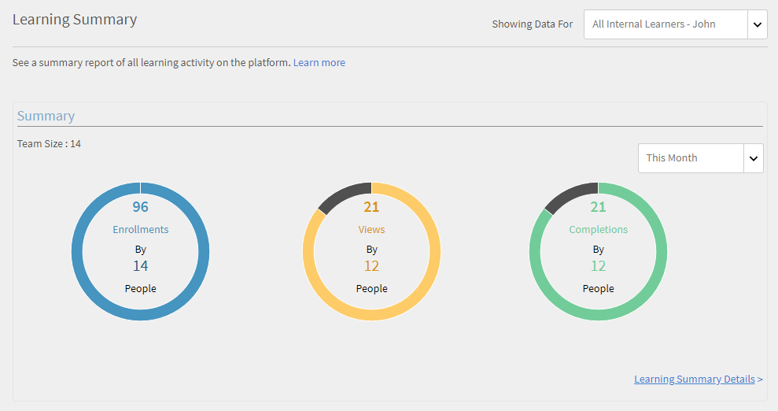
*摘要圖表*

如果有內部根層級管理員，它們會逐一顯示。

所有外部設定檔將列在內部設定檔（內部根層級使用者）之後。

如果外部設定檔有管理員，則管理員階層會顯示在 **[!UICONTROL Showing Data For]** 下拉式清單。  — 使用者將列在所有詳細資訊頁面的管理員階層中（學習摘要、合規性和技能狀態）

如果沒有，則所有個別使用者詳細資料將顯示在清單中。

若要檢視各種內部團隊註冊更細微的詳細資訊，請按一下 **[!UICONTROL Learning Summary Details]**.

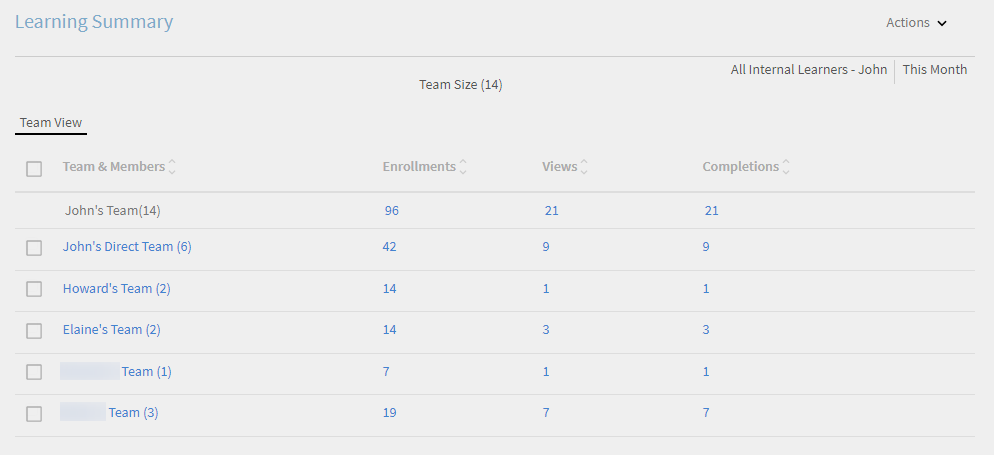
*學習摘要詳細資料*

按一下任何註冊後，您都可以看到每個經理的學習者，以及註冊了哪些學習物件。 您也可以檢視每個學習者的進度和完成詳細資訊。

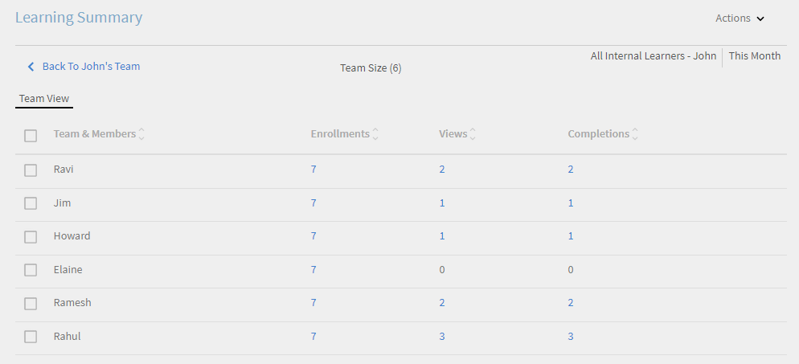
*指派給經理的學習者(Aee)*

按一下任何團隊並將其報表匯出為csv。 管理員可以匯出任何使用者群組或個別使用者的報表，方法是選取使用者群組或個別使用者，然後從「動作」下拉式清單中匯出詳細資訊。

此外，您也可以看到進行中及已習得的技能的長條圖檢視。 您可以新增/移除想要顯示在圖形中的技能。

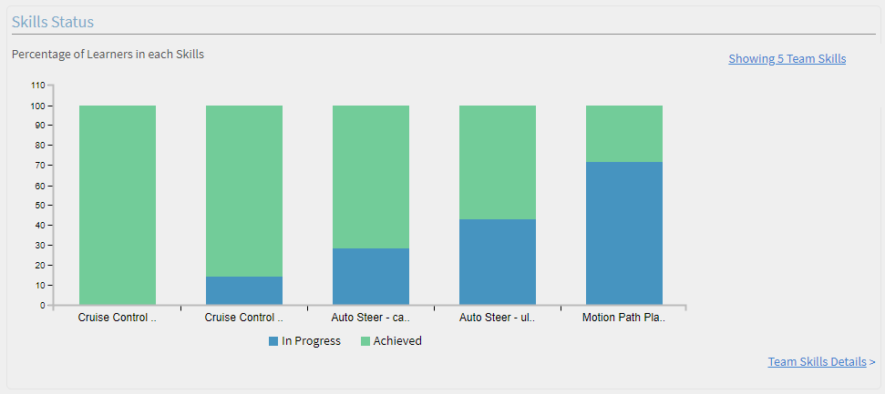
*技能狀態棧疊長條圖*

在最後的視覺效果中，您可以檢查學習者的合規性狀態，並採取適當的行動。

此外，管理員還可以在合規性控制面板中檢視個別培訓資料。

例如，管理員已找出三項追蹤合規性的培訓。 Learning Manager會一次提供所有三次培訓的合規性快照。

現在，管理員可以按一下任何培訓，並快速檢視所選培訓的合規性。

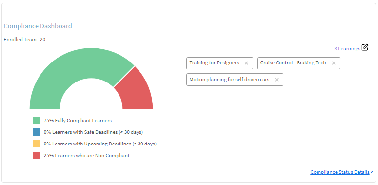
*檢視合規性儀表板*

您也可以檢視每個內部團隊的規範遵循狀態。

按一下連結 **[!UICONTROL Compliance Status Details]** 位於視覺效果底部。

您可以看到對於團隊來說，團隊中的學習者數量違反了或遵循了學習合規性。

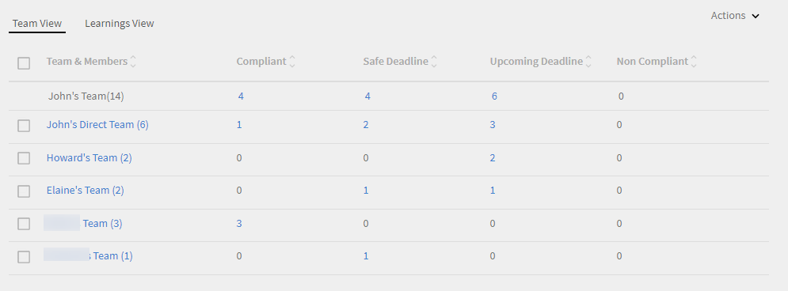
*團隊的規範遵循狀態*

## 與經理分享訓練

Learning Manager為所有管理員和經理提供合規性控制面板。 經理發現，追蹤團隊成員對特定培訓的合規性非常有用。 同時，管理員希望所有管理員能在其儀表板中新增合規性培訓並加以追蹤。

在Learning Manager中 **[!UICONTROL Share with Managers]** 工作流程可讓管理員與管理員共用培訓，以便將其新增到管理員的合規性控制面板。 因此，管理員不需要採取任何動作，可以立即開始追蹤合規性。

管理員可以單獨或與群組管理員共用一組培訓課程。 此共用可協助經理輕鬆追蹤其團隊對指定培訓的合規性。

管理員可以「推送」預設的合規性培訓清單，以便在經理的合規性儀表板中檢視。

### 共用訓練

1. 在 **[!UICONTROL Reports]** > **[!UICONTROL Learning Summary]**，向下捲動，然後按一下索引標籤 **[!UICONTROL Share with Managers]**.

   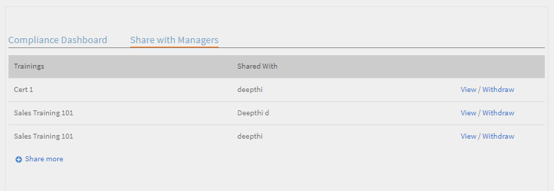
   *與經理分享訓練*

1. 若要新增訓練或多個訓練，請按一下 **[!UICONTROL Share more]**.

1. 在 **[!UICONTROL Share with Managers]** 對話方塊，選擇培訓與管理員。

   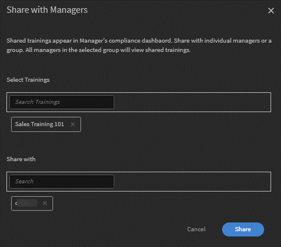
   *選取要與管理員共用的訓練*

1. 按一下 **[!UICONTROL Share]**.

訓練現在與指定的管理員共用。

### 檢視訓練

在共用訓練清單中，按一下 **[!UICONTROL View]**. 您可以檢視指派給經理或某些經理的培訓。

### 撤銷訓練

1. 若要撤銷經理的訓練，請按一下 **[!UICONTROL Withdraw]**.

1. 按一下 **[!UICONTROL Proceed]**. 這會從經理的合規性控制面板中撤銷先前共用的培訓。

## 使用者活動儀表板 {#useractivitydashboards}

檢視一段時間內平台上所有使用者活動的摘要。 設定使用者群組並套用篩選器。

使用者活動儀表板會顯示帳戶中使用者的活動。 列出的三個報表包括：

* **註冊使用者：** 此報表提供一週內在您的帳戶中註冊的使用者數量資訊。 若為具有「每月使用中單位」授權的帳戶，則報表會改為顯示MAU單位。

* **使用者造訪報表：** 此報表提供每日存取平台的使用者數量資訊。 亦提供每月報告。

* **學習逗留時間報表：** 此報表提供平台中每天所花費的學習時間相關資訊。 亦提供每月報告。

## 已註冊使用者 {#registeredusers}

Learning Manager會記錄每週在系統中註冊的使用者人數。 管理員可檢視此報告，以瞭解當週當天的註冊使用者人數。 已登入的計數一星期儲存一次不會變更。 因此，歷史註冊計數與系統中目前的學習者集合無關。

此報表提供一週內在您的帳戶中註冊的使用者數量資訊。

若為具有「每月使用中單位」授權的帳戶，則報表會改為顯示MAU單位。

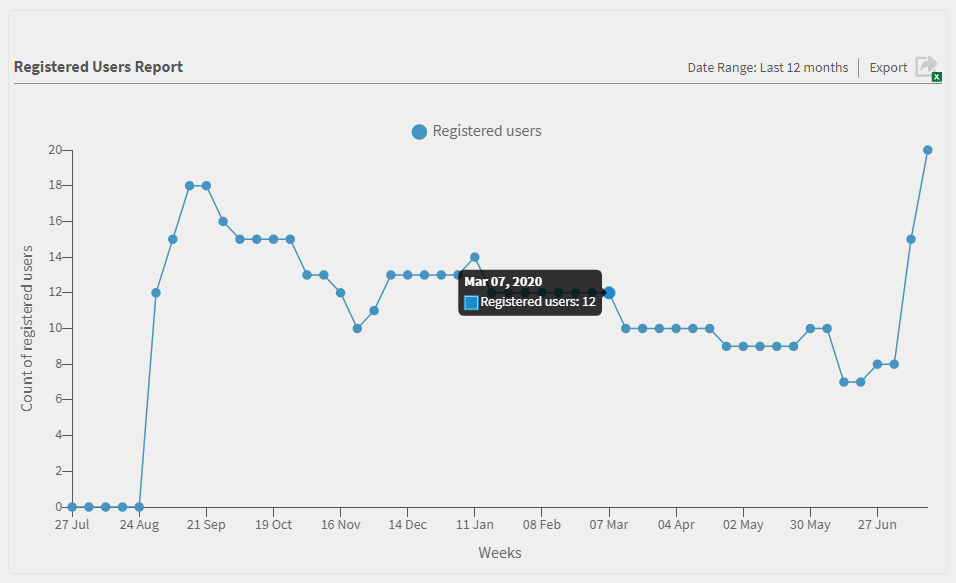
*「註冊使用者」報表*

***對於每月存取單位帳戶：***

**每月作用中使用者報表**

此報表顯示每個月在學習平台中活躍的學習者人數。 如果使用者執行此處提及的任何學習動作，則會視為該月的有效使用者。 這是計算「每月使用中單位」的相同方式。

每月的有效計數在計數並儲存一個月後不會變更。 因此，顯示的歷史計數和系統中目前的學習者集合無關。

## 使用者造訪 {#uservisits}

此報表顯示一天或月期間存取系統的學習者總數。 瀏覽學習平台而不消費任何學習也視為「存取」學習平台。 這有助於管理員瞭解存取系統的使用者總數。 當月的第一天，Learning Manager會建立上個月存取平台的總使用者人數記錄。 它也會擷取這些使用者的使用者群組資訊。

只記錄管理員設定的使用者群組。 這可讓管理員針對每月歷史資料對使用者群組套用篩選。 請注意，如果Incase使用者群組設定已修改，且Learning Manager在先前的幾個月內未記錄此使用者群組的資料，則Learning Manager無法顯示前幾個月新設定的使用者群組的資料。

此報表包含使用所有格式（例如Web、行動應用程式、Headless自訂解決方案）存取平台的使用者。 裝置應用程式使用圖表僅明確提及使用Learning Manager裝置應用程式存取平台的使用者。 這可協助管理員識別其帳戶中使用行動應用程式的情形。

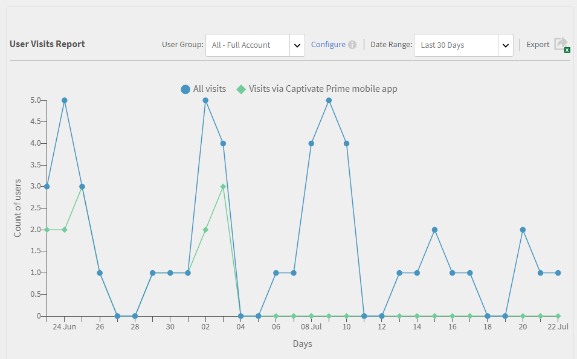
*使用者造訪報表*

## 學習逗留時間報表 {#learningtimespentreport}

在這裡，您可以看到雙軸折線圖，顯示所有學習者在12個月期間內的總學習時間。 第二個座標軸代表個人在學習上所花費的時間中位數。

不同學習物件（例如學習計畫與認證）的逗留時間計算如下：

* 包含靜態與互動式內容的自學課程
* 使用url的活動課程。
* 已啟用週末旗標的週末工作階段。
* 已自動標籤出席的VC連線工作階段。
* 不同學習物件（例如學習計畫與認證）的逗留時間
* xAPI活動課程的xAPI陳述式。

您可以進一步將圖表匯出為Excel試算表。

提供選擇使用者群組設定的篩選器，有助於檢視不同使用者群組的資料。

選取的日期和使用者群組篩選器會套用至圖示板中的所有相關圖形。

>[!NOTE]
>
>的 **[!UICONTROL User Visits]** 和 **[!UICONTROL Learning Time Spent]** 報表，則顯示的預設資料（未設定使用者群組時）將為整個帳戶顯示。

## 訓練內容儀表板 {#trainingcontentdashboard}

培訓內容控制面板提供平台可用培訓的深入分析。 您可以檢視熱門培訓或追蹤所有可用的培訓。

## 培訓報表 {#trainingsreport}

此報表提供當月平台可用培訓總數（發佈狀態）的資訊。 它可指出一段時間內提供的培訓數量。

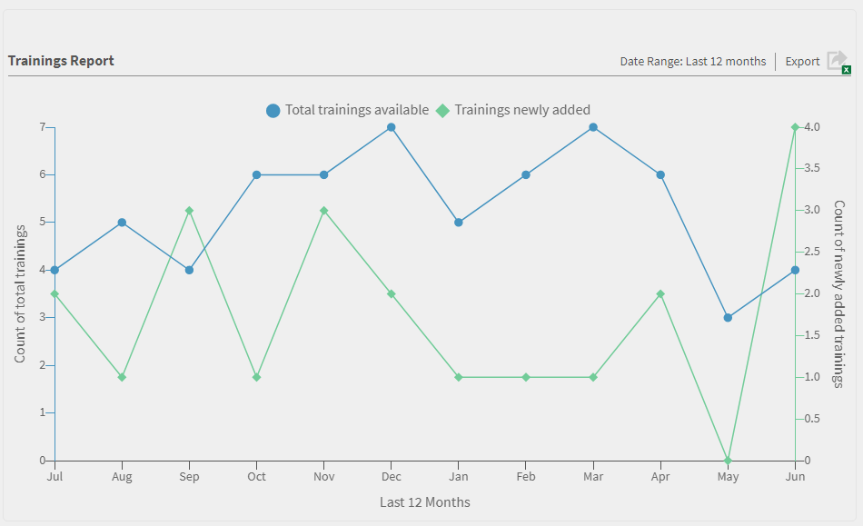
*訓練報告*

## 作用中培訓報表 {#activetrainingsreport}

此報表提供選定時間範圍內有效培訓的資訊。 作用中培訓是指在指定時間內註冊、在播放器中檢視或完成的培訓。

對於使用中訓練，當未完成使用者群組設定時，所有根使用者（具有管理員角色）內部群組的資料都可供選取。 除了root使用者群組之外，您可以視需要再設定10個使用者群組。

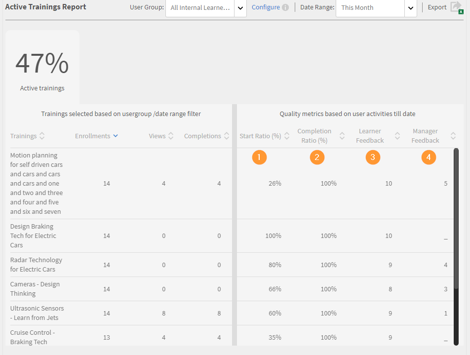
*作用中培訓報告*

>[!NOTE]
>
>資料在下列情況下未如預期顯示 **[!UICONTROL All Users]** 和 **[!UICONTROL 12 months]** 篩選器已選取，但資料會在您選取時顯示 **[!UICONTROL All internal user group].**

<table>
 <tbody>
  <tr>
   <td>
    
<b>參考</b>
</td>
   <td>
    
<b>量度</b>
</td>
   <td>
    
<b>說明</b>
</td>
  </tr>
  <tr>
   <td>
    
1
</td>
   <td>
    
開始比率(%)
</td>
   <td>
    
已開始課程的學習者人數與註冊人數的比率。
</td>
  </tr>
  <tr>
   <td>
    
2
</td>
   <td>
    
完成率(%)
</td>
   <td>
    
已完成課程的使用者總數與已開始課程的使用者總數之間的比率。 
</td>
  </tr>
  <tr>
   <td>
    
3
</td>
   <td>
    
學習者意見
</td>
   <td>
    
以1到10的級數收到的所有L1回饋回應的平均值，會舍入至最接近的整數。 
</td>
  </tr>
  <tr>
   <td>
    
4
</td>
   <td>
    
經理意見
</td>
   <td>
    
以1到5的級數收到的所有L3回饋回應的平均值，會舍入至最接近的整數 
</td>
  </tr>
 </tbody>
</table>

訓練報告有兩個額外的欄：

1. 課程的平均星級評等。
1. 已對該課程進行評分的學習者人數。
1. 內嵌路徑
1. 內嵌路徑ID
1. 內嵌課程ID

>[!NOTE]
>
>開始率、完成率、學習者意見回饋和經理意見回饋不受套用的篩選器影響。 這些篩選條件只會影響註冊、檢視和完成。

>[!NOTE]
>
>對於這兩個報表（訓練內容、使用者活動），您最多可以設定10個使用者群組。 處理作業最多可能需要24小時的時間才能完成，並讓新設定的篩選器可供使用。

## 控制面板報表 {#dashboardreports}

控制面板是報表的集合。 依據您的選擇，可將報告分組到儀表板中。

## 範例報告 {#samplereports}

此 **[!UICONTROL Sample Reports]** 標籤以顯示一些以範例資料點為基礎的指示性報告。 探索這些報告，瞭解您可以使用帳戶資料產生的不同型別的功能豐富報告。

## 控制面板報表 {#DashboardReports-1}

若要檢視您建立的所有展示板，請按一下此展示板標籤。 從 **[!UICONTROL View Dashboard]** 下拉式清單中，您可以選取預設電路板或您建立的圖示板。

## 建立儀表板 {#createadashboard}

1. 若要開始建立自己的面板，請按一下頁面右側的「新增儀表板」 。

   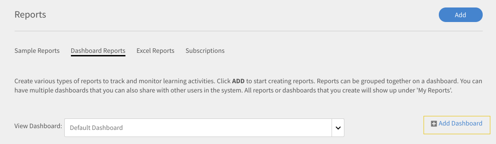
   *新增儀表板*

1. 提供控制面板的名稱和說明。
1. 如果您想要與任何管理員共用控制面板，請在 **[!UICONTROL Share With]** 欄位。 您可以針對此作業使用任何一般選取條件。
1. 按一下 **[!UICONTROL Save].**

您可以檢視最近建立的展示板，位於 **[!UICONTROL Dashboard Reports]** 標籤。

若要新增報表至展示板，請按一下展示板視窗右上角的下拉式清單，然後按一下 **[!UICONTROL Add Report]**. 您以此方式建立的報告會與您的儀表板相關聯。

>[!NOTE]
>
>您按一下「報表」頁面右上角的「新增」所建立的報表，會新增至您的預設儀表板。

## 共用儀表板 {#shareddashboards}

共用面板是組織內其他使用者與您共用的報告集合。 您新增至共用展示板的任何報表，都會自動與可存取該展示板的其他使用者共用。

您可以透過下列兩種方式共用展示板：

* 透過輸入使用者 **[!UICONTROL Share With]** 與其共用控制面板的欄位。
* 選擇下拉式清單中的編輯面板，然後輸入共用控制面板的使用者詳細資訊。

>[!NOTE]
>
>經理只能從共用儀表板檢視其團隊成員的報表。

## 下載 {#downloads}

匯出的儀表板報表工作表會提供詳細資訊，而非報表摘要。 下載的報表會遵循學習者成績單的格式。

## 建立報表 {#report}

1. 按一下左窗格中的「報表」 。 報告摘要頁面隨即顯示。

   >[!NOTE]
   >
   >依預設，至少有三個範例報表會出現在範例展示板標籤中。 您只能檢視範例報表，以瞭解如何建立和自訂範例報表。

1. 在頁面的右上角，按一下 **[!UICONTROL Add]**.
1. 在 **[!UICONTROL Add Report]** 對話方塊的「型別」下拉式清單中，您可以選擇其中一個預先定義的報表，或選取 **[!UICONTROL Custom]**. 如果您選取預先定義的報表，則會看到已預先填入表單。 您可以進一步變更部分欄位，然後按一下 **[!UICONTROL Save]**. 這會將報表新增至您的預設儀表板。

   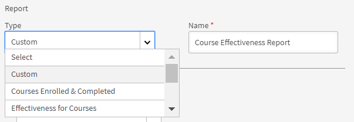
   *建立報告*

   在 **[!UICONTROL Report Type]**，您可以選擇預先定義的報表集或自訂值。 您可以檢視下列報表，做為預先定義報表集的一部分：

   * 已指派和已習得的技能
   * 已註冊及完成的課程
   * 課程的成效
   * 已註冊和已完成的學習計畫
   * 每個課程花費的學習時間
   * 每季花費的學習時間
   * 認證完成

1. 選擇 **[!UICONTROL Y-axis]** 報表的下拉式選項。 對於某些選取的條件，您可以從「狀態」選項中選擇一或多個狀態。 例如，對於課程註冊統計主要標準，狀態可以是已完成、不完整和已註冊。 主要範圍資料在報表中以長條圖表示。

   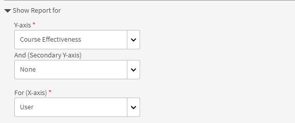
   *報表的座標軸*

1. 選擇次要 **[!UICONTROL Y-axis]** 下拉式選項中報表的條件/範圍。 例如，若是學習方案註冊選項，請從「狀態」下拉式選單中選擇一或多個狀態。 次要範圍資料會以折線圖的形式呈現。
1. 從下拉式選項中為報表選擇適當的X**軸**條件。 如果選擇x軸作為日期，則可選擇按日、月、季和年將x軸條件分組。
1. 在「時間範圍」區段中，從下拉式清單中選擇適當的選項。 可用的選項包括：

   * 上個月
   * 季度
   * 年
   * QTD （過去90天）
   * 當年截至統計日（過去365天）
   * 日期範圍。 在中提供值 **[!UICONTROL From]** 和 **[!UICONTROL To]** 日期欄位。

   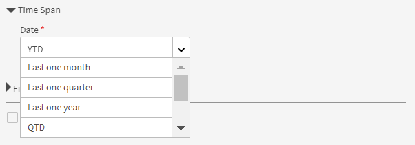

1. **篩選器區段**

   篩選器會根據您選擇的報告型別，顯示在底部的「新增報告」對話方塊中。 以下列出一些顯著的篩選器。

   * **經理：** 您可以根據階層選擇任一管理員。 對於某些經理而言，可能會有下屬經理與向每個下屬經理報告的多個員工。
   * **設定檔：** 選擇員工的指定。 它有助於根據員工的設定檔/指定來檢視員工報表。 例如，電腦科學家、工程師。
   * **使用者群組：** 選擇您要依據其篩選報表的使用者群組。 Learning Manager會從使用者功能中擷取為您的帳戶定義的使用者群組。
   * **內容：** 您可以從下拉式選單中選擇課程，根據任何課程來篩選報表。

   展開此區段並選擇所需的篩選器。

   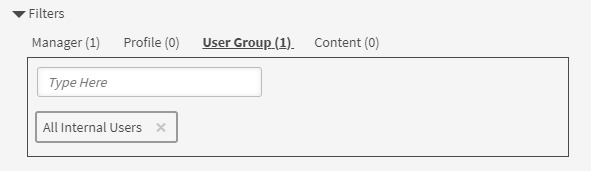
   *選擇篩選器*

1. 按一下 **[!UICONTROL Save]** 以完成報表的建立。

   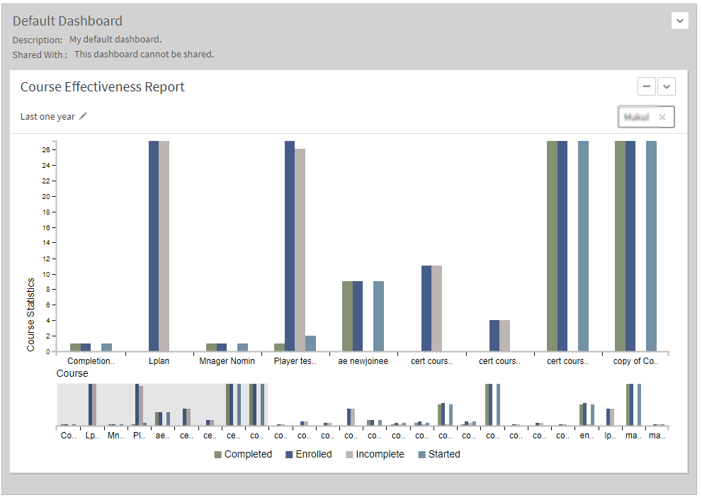
   *範例報告*

## 編輯報告 {#editareport}

在報表中，按一下下拉箭頭，然後選取選項 **[!UICONTROL Edit Report]**.

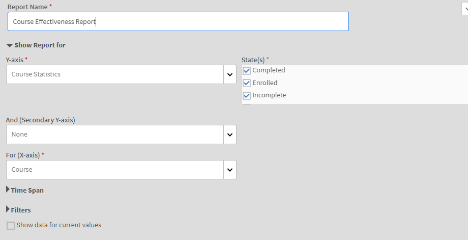
*編輯報告*

對報表進行必要的變更。 若要儲存變更，請按一下 **[!UICONTROL Save]**.

## 將報表移至儀表板 {#moveareporttoadashboard}

選擇此選項可將目前報表移至現有儀表板。 若要移動報表，請按一下選項 **[!UICONTROL Move to Dashboard]**.

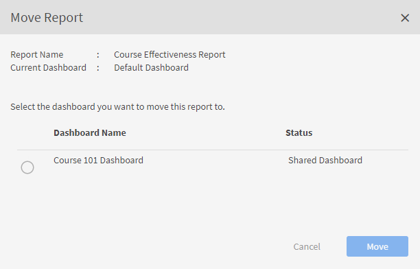
*將報表移至儀表板*

選擇要將報表移動到的儀表板，然後按一下 **[!UICONTROL Move]**.

## 建立報告副本 {#createacopyofareport}

若要建立報告副本，請選取選項 **[!UICONTROL Create a Copy]**.

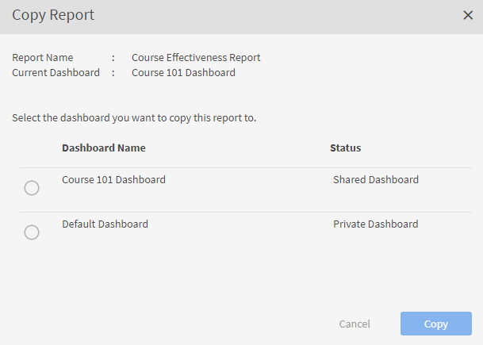
*建立報告副本*

選擇您要複製報表的目標儀表板。 若要開始複製，請按一下 **[!UICONTROL Copy]**.

## 刪除報告 {#deleteareport}

若要刪除報表，請選擇選項 **[!UICONTROL Delete Report]**. 刪除報告後，便無法還原報告。 這個過程是不可逆的。 刪除報告時請謹慎操作。

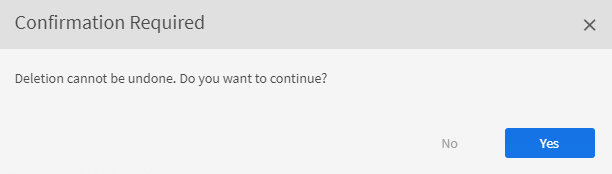
*刪除報告*

## 下載報表 {#downloadareport}

若要下載報表，請選擇選項 **[!UICONTROL Download Report]**.

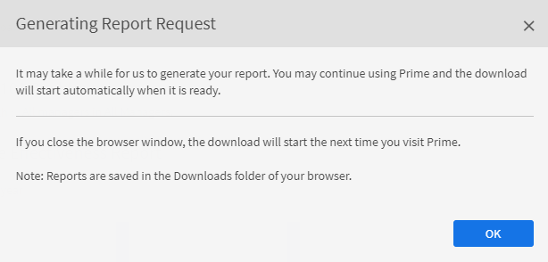
*下載報表*

## 調整報表大小 {#resizeareport}

您可以在1×1 （中）和1×2 （大）大小中調整報表大小。 這可讓您檢視報告時擁有更出色的空間。 此外，您也可以輕鬆地平移和縮放這些報表。

## 篩選器 {#filters}

篩選器出現於 **[!UICONTROL Add]** 下方的「報表」對話方塊，根據您選擇的報表型別而定。 以下列出一些顯著的篩選器。

**經理** 您可以根據階層選擇任一管理員。 對於某些經理而言，可能會有下屬經理與向每個下屬經理報告的多個員工。

**個人資料** 選擇員工的指定。 它有助於根據員工的設定檔/指定來檢視員工報表。 例如，電腦科學家、工程師。

**使用者群組** 選擇您要依據其篩選報表的使用者群組。 Learning Manager會從使用者功能中擷取為您的帳戶定義的使用者群組。

**課程** 您可以從下拉式選單中選擇課程，根據任何課程來篩選報表。

*篩選報表*

在圖形的圖例上方，您可以檢視縮放方塊。 將游標移至其上方、按一下，然後拖曳橫杆至縮放方塊圖形區域的任何部分，以放大顯示。

您可以橫跨圖形條以直線的形式檢視次要Y軸值。 例如，在上述範例中，您可以看到整個圖形的灰線效果值。

## 使用者群組報表 {#user-group-reporting}

追蹤使用者群組（例如，部門、外部合作夥伴和角色）與其他使用者群組或其他學習目標的比較結果。

### 使用者群組 {#usergroups}

若要根據使用者群組產生報表，請選擇 **[!UICONTROL User Group]** 下拉式選項清單中的x軸顯示（如下面的熒幕擷圖所示）。

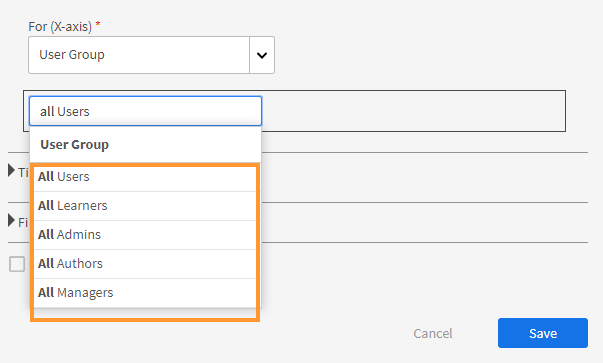
*使用者群組報表*

若要選擇使用者群組，請輸入群組的名稱。 您可以看到根據您輸入的字串顯示的建議群組。 看到群組清單後，請選擇所需的使用者群組。

您還可以透過預先輸入搜尋的協助選擇多個使用者群組。

儲存並產生此報告後，如果您選取多個使用者群組，則會產生報告，且所有使用者群組在x軸上彼此相鄰呈橫條圖。

此使用者群組報表可讓您比較一個部門/部門/角色的績效與另一個部門/部門/角色的績效，以評估其學習成就。

### 自訂使用者群組/使用者屬性 {#customusergroupsuserattributes}

您也可以使用Learning Manager的新增使用者/使用者群組功能來建立自訂的使用者群組。 建立使用者群組後，您可以藉助屬性清單（如位置、分支）為這些自訂使用者群組產生報表。

在X軸中，選擇使用者屬性選項，然後從 **選取** 旁邊的下拉式清單。 若要根據這些屬性建立自訂的使用者群組報表，您也必須在篩選中選擇適當的使用者群組。

## 報表型別 {#typesofreports}

Adobe Learning Manager支援四種主要型別的報表，例如完成、逗留時間、技能及成效。 您可以使用下列報表型別來產生300多種變數的報表：

* 學習者的課程傳遞統計資料
* 課程報表的成效
* 學習者技能型報告
* 學習者的學習計畫註冊統計資料
* 學習者花費的學習時間
* 學習者計數
* 認證完成

## 檢視報表 {#viewingreports}

在「報表」頁面上，您可以檢視所有報表。 您可以按一下每個報表右上角的減號(-)圖示，將每個報表最小化。 按一下(+)圖示以再次檢視您的報表。

## 不同日期的快速檢視 {#quickviewwithdifferentdates}

您可以變更任何報告的日期範圍/值，並快速檢視不同的日期，而不需要修改和儲存報告。 按一下日期範圍（例如QTD）旁上一年的編輯圖示（如下面的快照中所示的）。 若要確認變更，請從躍現式選單中選擇新值，然後按一下勾號。 您可以按一下X標籤來取消變更。

>[!NOTE]
>
>您用來檢視報表的日期值是暫時的。 選擇下載選項時，不會下載此報表的此檢視。 此檢視只是暫時檢視。

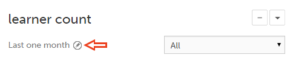
*檢視學習者計數*

## 使用不同管理員進行快速檢視 {#quickviewwithdifferentmanagers}

如果有多個管理員向您報告，您可以快速檢視每個管理員的報告。 若要顯示每個管理員的唯一報告，請從下拉式清單中選擇管理員名稱。

>[!NOTE]
>
>您用來檢視報告的管理員值是暫時的。 選擇下載選項時，不會下載此報表的此檢視。 此檢視只是暫時檢視。

## 檢視課程報告 {#viewcoursereports}

### 產生課程報告

在本次訓練中，您將瞭解如何匯出課程報告及設定這些報告的電子郵件訂閱。

如果您無法啟動培訓，請寫信至 <almacademy@adobe.com>.

您可以依照以下步驟檢視每個課程的特定報告：

1. 按一下 **[!UICONTROL View course reports]** 「報表」頁面上「我的儀表板」標籤中的連結。\
   隨即顯示快顯對話方塊。 會出現一個文字輸入欄位，您可以在其中輸入所需課程，建議的課程名稱會出現在下拉式清單中。 從顯示的清單中選擇課程。

   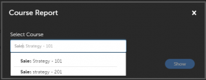

   *檢視課程報告*

1. 從下拉式清單中選取您選擇的課程，然後按一下「顯示」。
1. 系統會將您重新導向至所選課程的「測驗分數結果」頁面，以檢視課程特定報告。

**編輯/移動到展示板/建立複製/刪除/調整報告大小**

若要以「編輯/移至控制面板/建立複製/刪除/調整大小」的形式檢視下拉式選項，請按一下每個報表右上角的下拉式箭頭。

*編輯/移動到展示板/建立複製/刪除/調整報告大小*

**[!UICONTROL Edit]** 若要在修改資料時返回初始值，請按一下重設。 修改值後，按一下「儲存」 。

**[!UICONTROL Move to Dashboard]** 您可以將目前報告移動到另一個儀表板，該儀表板是從儀表板清單中選擇的。

**[!UICONTROL Create a Copy]** 您可以將報告複製到相同或另一個儀表板，該儀表板是從儀表板清單中選擇的。

**[!UICONTROL Delete]** 按一下「刪除」以移除報表。 刪除報表前，系統會顯示警告/確認訊息。

**[!UICONTROL Resize]** 您可以以1×1 （中）和2×2 （大）大小調整報表大小。

## 產生並檢視對等帳戶的報告 {#generateandviewreportsforpeeraccount}

作為管理員，除了為您的帳戶產生報告之外，您還可以為已設定的對等帳戶產生和檢視報告。

當您與其他使用者建立對等帳戶後，可以從以下位置檢視該對等帳戶的報告： **[!UICONTROL Reports]** 頁面。 建立報表時，您會發現 **[!UICONTROL Select Account]** 欄位。 從下拉式清單（列出您關聯的所有對等帳戶）中，選取您要檢視共用報表的帳戶。

建立對等帳戶時，如果未選取[共用目錄]選項，則無法在此清單中檢視該對等帳戶。

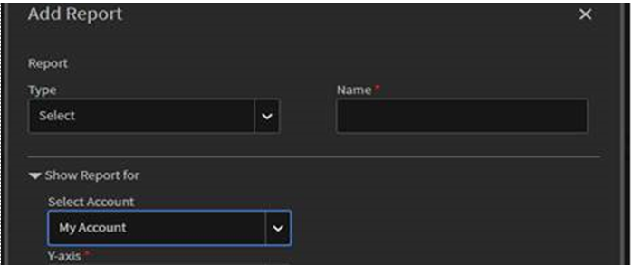
*管理對等帳戶的報告*

1. 選取此報表的x軸與y軸，並選取此報表的日期。
1. 請注意「篩選器」欄位，「共用目錄」按鈕為自動啟用狀態。 此為強制性。 如果未啟用「共用目錄」，則表示您無法產生或檢視對等帳戶的報告。
1. 從「共用目錄」下方的下拉式清單中，選取您要檢視其報表的共用目錄。
1. 按一下 [!UICONTROL **儲存**].

   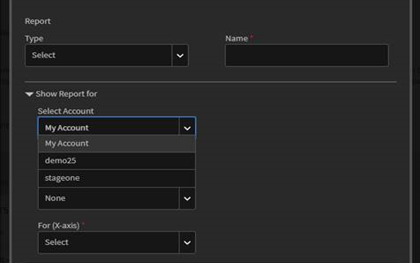
   *選取對等帳戶的共用目錄*

1. 在您按一下 **[!UICONTROL Save]**，即可在預設控制面板中檢視報表的圖形表示。 從這個控制面板，您可以進一步由管理員篩選特定對等帳戶的報告。
1. 如果您這邊對目錄有任何變更，這些變更會立即反映在對等產生的報告和儀表板中。 但是，當對等修改目錄時，變更不會自動出現在您的儀表板中。
1. 如果您想要自動更新儀表板，您的同儕節點必須傳送新的同儕節點要求給您。

   >[!NOTE]
   >
   >管理員無法檢視同級報告。

## 電子郵件訂閱 {#emailsubscriptions}

訂閱報告即可以電子郵件取得您最愛的報告。

### 設定電子郵件訂閱

在此培訓中，您將瞭解如何設定控制面板報告的電子郵件訂閱。

如果您無法啟動培訓，請寫信至 <almacademy@adobe.com>.

在 **[!UICONTROL Reports]** 頁面，按一下  **[!UICONTROL Subscription]** 標籤。 報表訂閱頁面隨即顯示。

若要從下拉式清單中選取報表名稱，請開始在報表欄位中輸入報表名稱。 從下拉式清單中選擇電子郵件的頻率。 您可以新增電子郵件的主旨，並提供備用電子郵件ID。

您可以編輯和刪除訂閱。

## Excel報表 {#excelreports}

此 **[!UICONTROL Excel Reports]** 索引標籤可讓您以XLS檔案格式匯出報表。

以下是可供下載的報表型別。

* 課程報告
* 學習者成績單
* 公告報告
* 工作輔助報表
* 內容稽核軌跡
* 使用者稽核軌跡
* 登入/存取報告
* 遊戲成績單
* 遊戲化稽核軌跡

## 學習者成績單 {#learnertranscripts}

「Excel學習者成績單」報表會以十進位數字顯示「需要學分」和「已習得學分」欄。

## 課程報告 {#coursereports}

管理員可下載課程報告。 請依照下列步驟執行：

1. 開啟 **[!UICONTROL Reports]** > **[!UICONTROL Excel Reports]** > **[!UICONTROL Course Reports]**.
1. 此 **[!UICONTROL Course Report]** 對話方塊隨即顯示。 選取您要擷取報告的課程，然後按一下 **[!UICONTROL Show]**.

   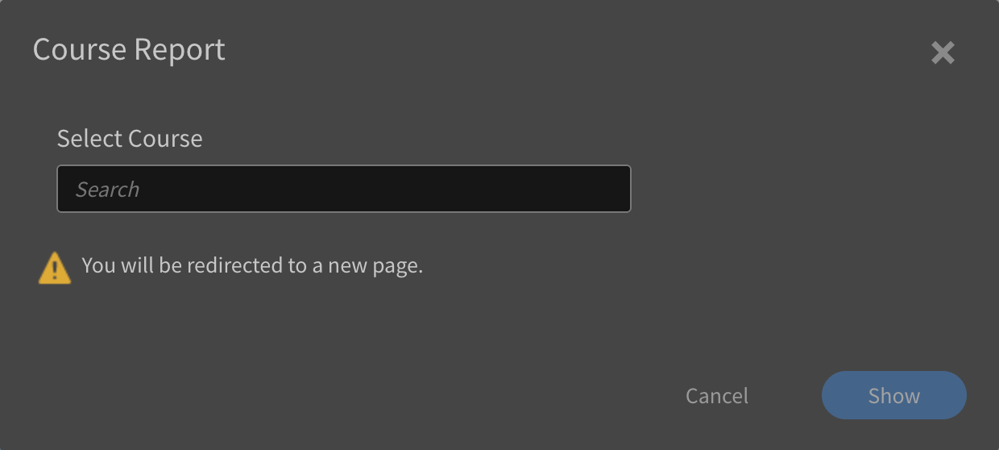
   *課程報告*

1. 系統會將您重新導向至課程頁面。 您可以選擇特定的註冊型別，依使用者及問題匯出測驗分數。
1. 選取 **[!UICONTROL Export Quiz Score]** 以匯出報表。 A **[!UICONTROL Generating Report Request]** 對話方塊隨即顯示。 按一下 **[!UICONTROL OK]** 以確認。

   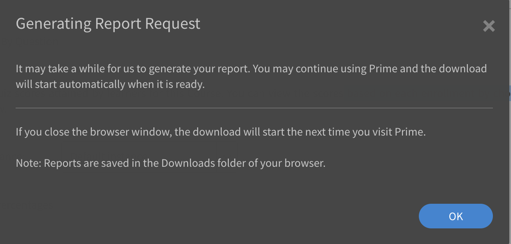
   *正在產生報表請求*

   >[!NOTE]
   >
   >如果模組設定了多重嘗試選項，匯出的測驗分數報表將包含每次嘗試的分數詳細資訊。

## 學習者成績單 {#LearnerTranscripts-1}

Adobe學習管理員可讓組織的管理員產生與學習者相關的成績單。 學習者成績單報告包含下列專案：

1. 學習者成績單：學習活動控制面板
1. 技能：技能儀表板
1. 合規性控制面板

「Excel學習者成績單」報表會以十進位數字顯示「需要學分」和「已習得學分」欄。

如需有關產生學習者成績單報告的資訊和更多資訊，請參閱 [學習者成績單](learner-transcripts.md).

## 公告報告 {#announcementsreports}

作為管理員，您可以產生您所傳送之所有公告的報告。 報告包含有關以下專案的詳細資訊：

* 宣告型別
* 宣告名稱
* 宣告日期
* 宣告的狀態
* 學習者名稱

若要下載報表，請遵循下列任一步驟：

1. 開啟 **[!UICONTROL Reports]** > **[!UICONTROL Excel Reports]** > **[!UICONTROL Announcements Report]**. 此 **[!UICONTROL Generating Report Request]** 對話方塊開啟。 按一下「確定」。
1. [!UICONTROL **公告**] > [!UICONTROL **動作**] > [!UICONTROL **匯出報告**].

   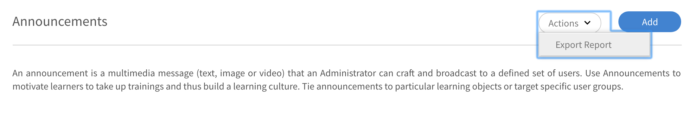
   *公告報告*

1. 您可以按一下設定圖示下的「匯出報表」 ，為特定宣告擷取報表。

   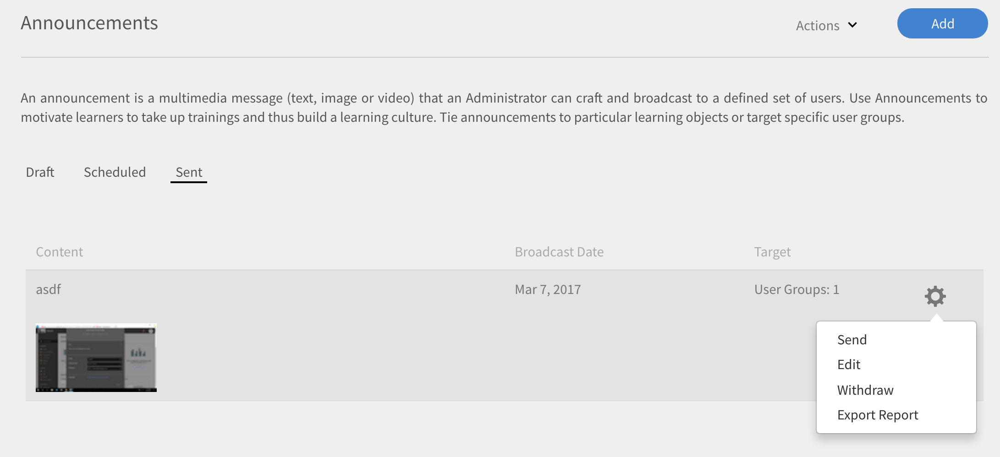
   *特定公告的報告*

## 工作輔助報表 {#jobaidsreport}

工作輔助是學習者無需註冊任何特定學習物件（例如課程或學習計畫）即可存取的培訓內容。 管理員可以擷取及下載工作輔助報告。

擷取的報表包含下列相關資訊：

* 名稱
* 工作輔助型別
* 工作輔助的狀態（已發佈或已撤銷）
* 註冊日期
* 完成日期
* 下載日期
* 學習者名稱
* 管理員名稱
* 建立者

若要下載報表，請執行下列任一項作業：

* 開啟  **[!UICONTROL Reports]** > **[!UICONTROL Excel Reports]** > **[!UICONTROL Job Aid Reports]**. 此 **[!UICONTROL Generating Report Request]** 對話方塊隨即顯示。 按一下 **[!UICONTROL Ok]**.
* 開啟 **[!UICONTROL Job Aid]** > **[!UICONTROL Actions]** > **[!UICONTROL Export Report]**.

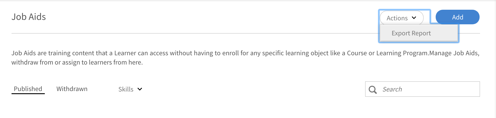
*工作輔助報告*

* 您也可以按一下「 」，擷取特定工作輔助的報告 **[!UICONTROL Export Report]** 在「設定」圖示下。

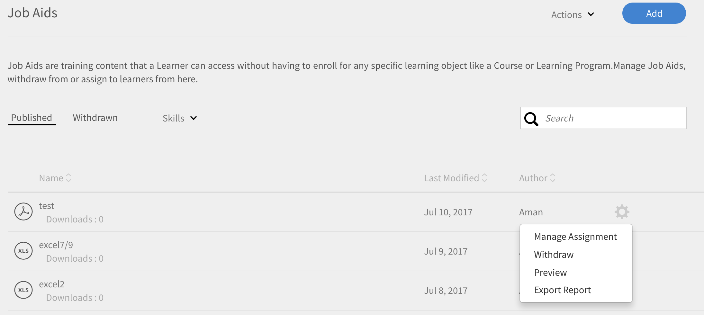
*特定工作輔助的報告*

### 工作輔助報表

在您選取之後 **[!UICONTROL Job Aids Report]** 在清單中，您會看到兩個選項：

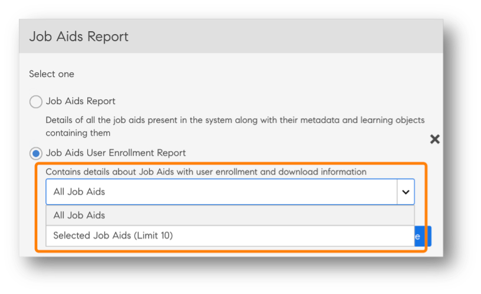
*下載工作輔助使用者註冊報告*

**所有工作輔助**：如果帳戶中的工作輔助數量少於1,000萬，則產生的報告將包含所有工作輔助的註冊資訊。 這將為預設選項。 如果列數超過1千萬，則會顯示錯誤，您必須手動選取所需的工作輔助。

**選取的工作輔助**：如果選取此選項，可以輸入要產生報表的工作輔助。 您最多可以選取10個工作輔助。 AdobeLearning Manager會檢查工作輔助數量是否超過1,000萬個。

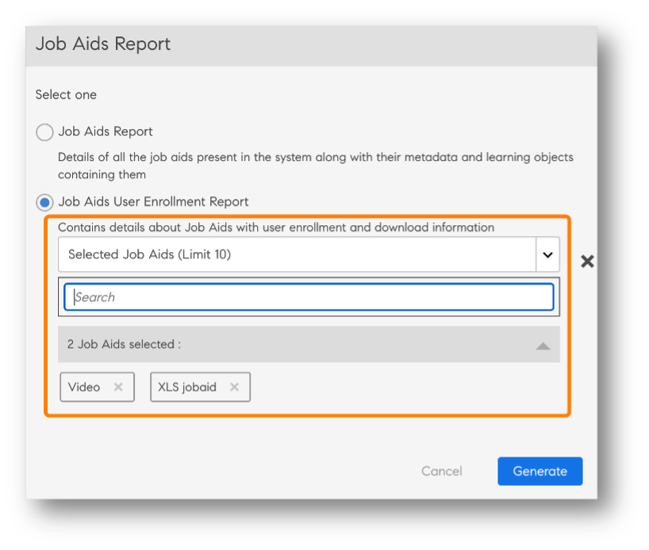
*選取工作輔助*

**工作輔助報表**

如果選取此選項，則會下載系統中所有工作輔助的詳細資訊及其中繼資料和培訓。

下載的報表包含下列欄位：

* 工作輔助名稱
* 語言
* ID
* 型別
* 持續時間（分鐘）
* 狀態
* 發佈日期（UTC時區）
* 建立者名稱
* 透過電子郵件建立
* 由使用者唯一ID建立
* 目錄
* 學習路徑
* 課程
* 標籤
* 技能

**工作輔助使用者註冊報告**

註冊報表包含有關使用者註冊的詳細資訊和其他資訊。

下載的報表包含下列欄位：

* 工作輔助名稱
* 型別
* 狀態
* 註冊日期（UTC時區）
* 完成日期（UTC時區）
* 下載日期（UTC時區）
* 學習者名稱
* 電子郵件
* 使用者唯一ID
* 管理員名稱
* 經理電子郵件
* 管理員使用者唯一ID
* 依名稱指派
* 透過電子郵件指派
* 依使用者唯一ID指派
* 建立者名稱
* 由電子郵件建立
* 由使用者唯一ID建立
* 工作代碼
* 新欄位
* 個人資料

### 內容稽核軌跡報表 {#contentaudittrailreports}

使用 **[!UICONTROL Content Audit Trail]** 報告產生器，用於產生在課程在系統中的生命週期中對課程所做的所有變更和編輯的報告。 產生的報表已擷取下列資訊。

* 物件ID
* 物件名稱
* 物件型別
* 修改型別
* 說明
* 參考物件ID
* 參考物件名稱
* 依使用者名稱修改
* 依使用者ID修改
* 修改日期（UTC時區）

產生的報表中不會擷取有關中繼資料的資訊。

若要產生課程軌跡稽核報表，請依照下列步驟執行。

1. 選取 **[!UICONTROL Report]** > **[!UICONTROL Excel reports]** > **[!UICONTROL Course Audit Trail]**. 此 **[!UICONTROL Content Audit Trail]** 對話方塊隨即顯示。

   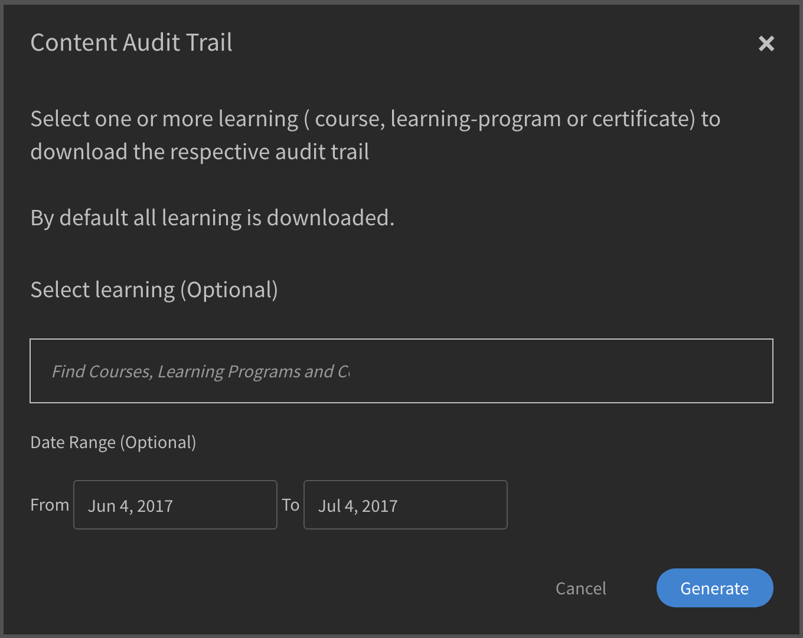
   *課程稽核軌跡*

1. 選取您要下載報告的課程、學習計畫及認證。 如果未指定，預設會下載所有報表。
1. 選取報表的日期範圍，然後按一下 **[!UICONTROL Generate]**.
1. 報告隨即產生，並通知您內容稽核報告已準備就緒。 您可以下載報表。

## 使用者稽核軌跡報表 {#useraudittrailreports}

使用者稽核軌跡會擷取使用者、使用者群組和自我註冊設定檔的生命週期。 在Manager中新增、刪除、變更的使用者都已擷取。 會記錄建立和刪除自我註冊設定檔。 您也可以暫停並繼續自我註冊。

您可以為外部設定檔新增、啟用、停用、暫停或恢復，也可以為自我註冊新增、刪除、暫停或恢復。 也會擷取CSV上傳。

1. 選取  **[!UICONTROL Report > Excel report > User Trail]**. 「使用者稽核軌跡」對話方塊就會顯示。
1. 「使用者稽核軌跡」對話方塊就會顯示。 從彈出式選單中選取日期範圍。 您可以選擇產生上週、一個月的報告，或選取自訂日期。

   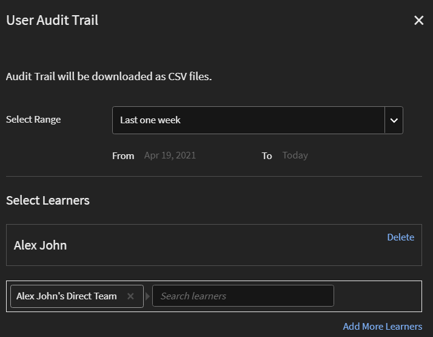
   *使用者稽核軌跡*

1. 按一下 **[!UICONTROL Generate]** 以產生報表。

上有兩個篩選器 **[!UICONTROL User Audit Trail Report]** 對話方塊。

**日期範圍篩選：** 選擇要產生報表的日期範圍。 有三個選項：

* 上一週
* 上個月
* 自訂日期

選取學習者篩選器：搜尋使用者或使用者群組。

匯出的報告將包含同時符合指定搜尋條件之使用者的資料。

*使用者稽核軌跡*

>[!NOTE]
>
>指定或移除技能時，可以為指定或移除的雙方追蹤「使用者稽核報告」的技能。

## 遊戲化報表 {#gamification}

管理員可以下載CSV格式的遊戲成績單。 您可以下載個別使用者或使用者群組的報表。 使用者名稱、使用者電子郵件、使用者的UUID、已評分的使用者總分數、收集的分組分數、使用者播放的群組名稱、管理員名稱以及作用中欄位值都會在報表中擷取。 管理員可以使用此報表來評估及瞭解組織層級或特定群組的使用者排名。

1. 選取「報表> Excel報表>遊戲化報表」 。

   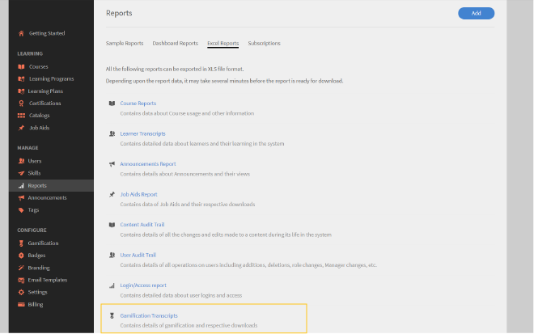
   *遊戲化報告*

1. 「遊戲成績單」對話方塊會出現。 使用名稱、設定檔、使用者群組、電子郵件ID或UUID選取學習者。

   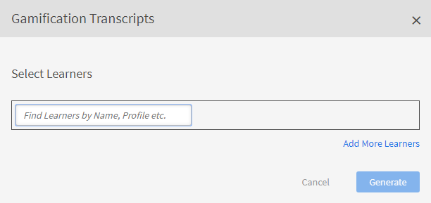
   *遊戲成績單對話方塊*

1. 按一下  **[!UICONTROL Generate]** 以產生報表。

   產生學習者的報告後，您必須能夠匯出帳戶中所有使用者（內部、外部或刪除）的目前和已實現層級資訊。 您也可以檢查學習者達到的層級日期：

   * 銅級獲得日期
   * 銀級獲得日期
   * 金級獲得日期
   * 白金級獲得日期

   這些欄包含第一次達到層級的日期。 欄 **[!UICONTROL Current Level]** 顯示學習者目前的層級。

   當管理員重設遊戲化時，學習者的所有點會相應重設。

## 遊戲化稽核軌跡報告 {#gamification-audit-trail}

此報表含有學習者因每個規則而獲得的遊戲點數的歷程記錄及原因。

### 下載報表

1. 選取遊戲化稽核軌跡URL。
1. 在 **遊戲化稽核軌跡** 快顯視窗，選取日期範圍。
1. 選取 **產生**.

報表會下載為CSV檔案。 檔案包含下列欄：

* 名稱
* 電子郵件/ UUID、
* 狀態
* 動作
* 點，
* 平衡點
* 規則/任務
* 規則/任務子任務，
* 規則/任務詳細資訊
* 型別，
* 名稱，
* 執行個體名稱獲得日期（UTC時區）
* 規則/任務開始時間
* 規則/任務結束時間

## 註冊和取消註冊報告 {#enrollmentandunenrollmentreport}

管理員和經理可以擷取已註冊和已取消註冊學習者的報表。 身為管理員，您可以看到任何已註冊或取消註冊課程、學習計畫或認證執行個體的學習者、管理員或經理，並匯出報告。 身為經理，您只能擷取團隊成員的報表。 身為經理，您無法在經理應用程式中看到已刪除的學習者或您自己的名稱，因為您是已註冊或未註冊的學習者。

若要下載報表，請執行下列步驟：開啟  **[!UICONTROL Course/ Learning program/ Certification]** > **[!UICONTROL Learners]** > **[!UICONTROL Action]** > **[!UICONTROL Export report]**.

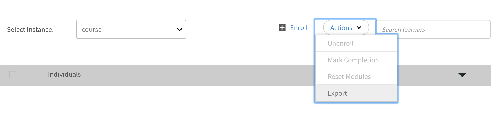
*取消註冊報告*

## 意見回饋報告 {#feedback-report}

身為管理員，您現在可以為指定期間的選定培訓擷取學習者意見回饋(L1)和經理意見回饋(L3)。

您可以從UI或透過PowerBI聯結器匯出資料，以進行更深入的分析。

L1和L3意見報表提供選項，讓您針對以下學校的特定培訓，針對L1和L3回應下載整合意見報表： **一年** 或在任何日期範圍內最多10個已選取的訓練。

以管理員身分登入，按一下 **[!UICONTROL Reports]** > **[!UICONTROL Custom Reports]**，然後在報表清單中，按一下 **[!UICONTROL Feedback Report]**.

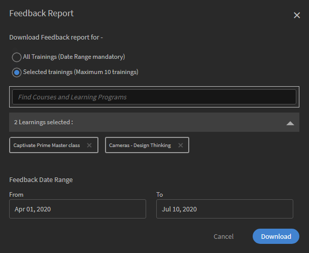
*下載意見反應報表*

選擇篩選器後按一下下載，您會收到通知，要求您下載CSV格式的報表。

下載的報表將具有詳細資訊，例如，培訓名稱和型別、執行個體名稱、學習者名稱和電子郵件、意見型別：L1或L3、為新資料提交意見的日期。

對於此功能實施之前的現有資料，將會顯示學習對象完成日期、學習對象完成日期、L1意見問題不同欄位中的自訂進度實際文字和課堂文字、L1意見回應各自的回應、經理姓名和電子郵件、L3意見值和提交日期、作用欄位。

您也可以將資料從UI或匯出至Power BI，這可支援任何日期範圍的所有培訓，以便進行更深入的分析

## 培訓報表 {#training-report}

Learning Manager支援「培訓報表」，可讓管理員下載培訓詳細資料及其相關中繼資料，例如作者、發佈日期、技能、目錄標籤等。

在管理員應用程式上，按一下 **[!UICONTROL Reports]** > **[!UICONTROL Custom Reports]** > **[!UICONTROL Excel Reports]** > **[!UICONTROL Trainings Report]**.

您可以下載以下專案的報表：

* 選取的培訓（限制10） — 從任何目錄選取一或多項培訓（最多10項）
* 所選目錄中的培訓（限制5） — （目錄選取最多可選擇5個目錄）
* 所有培訓 — （帳戶中的所有培訓）

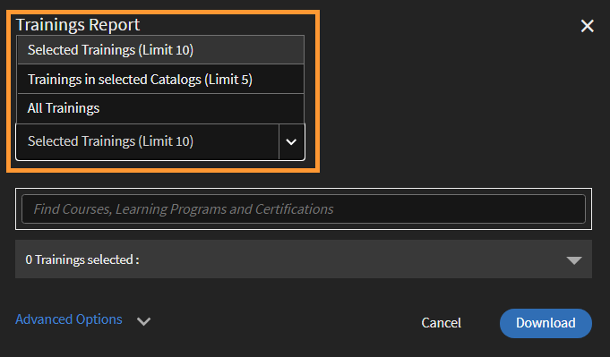
*下載訓練報告*

在「進階選項」段落中，可以使用下列選項：

* 包含課程對應與學習計畫/認證
* 包含模組層級資訊

選取篩選器並按一下「下載」後，您將會收到通知，要求您以CSV格式下載報表。

報告會包含下列欄位：

*目錄名稱、培訓型別、培訓Id、培訓唯一ID、培訓名稱、子培訓、模組、培訓或模組持續時間、格式、培訓狀態、技能、作者、上次發佈日期、上次完成日期、講師註冊計數、開始計數、完成計數、平均L1分數、平均L2分數、已接收L1回應、已接收L2回應、已接收L3回應、目錄標籤與標籤。*

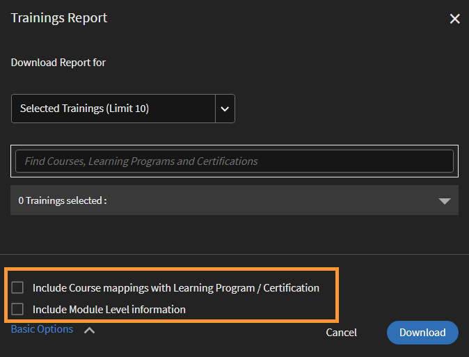
*其他選項*

## 工作階段摘要報告 {#session-summary-report}

「工作階段摘要報告」包含學習者在指定日期內規劃的所有工作階段。

這可讓管理員匯出給定日期範圍內所有虛擬和教室工作階段詳細資料。 管理員也可以匯出有關特定培訓或講師的工作階段報告。

這也有助於管理員瞭解每月規劃的工作階段，並識別講師的排程和已傳送的工作階段。

以管理員身分，按一下 **[!UICONTROL Custom Reports]** > **[!UICONTROL Session Summary Report]**.

在接下來的對話方塊中，選擇日期範圍，並選擇訓練或講師來取得摘要。

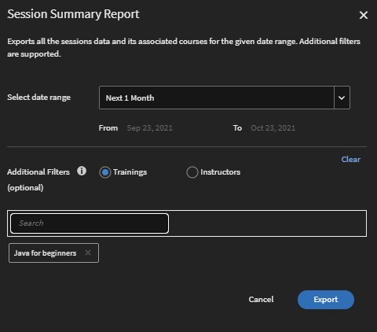
*工作階段摘要報告*

下載的csv包含以下欄位：

* 開始日期和時間
* 結束日期和時間

* 模組名稱
* 工作階段持續時間（分鐘）
* 名額數
* 位置
* 執行個體名稱
* 課程名稱
* 課程ID
* 講師姓名
* 講師電子郵件
* 註冊計數
* 工作階段型別
* 輪候表限制
* 輪候表計數
* 輪候表使用者電子郵件
* 位置資訊
* 位置區域

## 講師使用率報表

此報表可擷取講師在授課指派工作階段時每天所花的時間（以分鐘為單位）。 報表可從選取的開始日期下載三個月。

若要下載報表，請按一下 **[!UICONTROL Reports]** > **[!UICONTROL Custom Reports]** > **[!UICONTROL Instructor Utilization Report]**.

選取一位或多位講師，以及日期範圍。

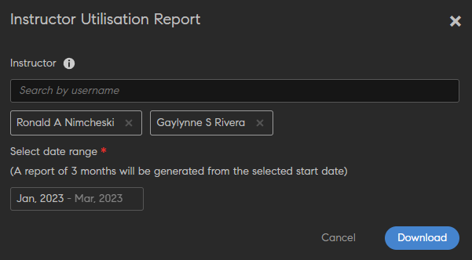
*下載講師使用報告*

下載的報表包含下列欄位：

* 講師姓名
* 講師ID
* 能力層次
* 以欄顯示日期。 如果講師在某個日期被使用，則會列出工作階段數量。 如果講師未在某一天使用，則值將顯示零。

此報表包含選定月份起三個月的記錄。

若要擷取所有講師的記錄，請將「講師」欄位留空。

此外，具有產生報表許可權的自訂管理員可以擷取此報表。

## 使用者稽核軌跡報表

此報表會擷取切換執行個體（從執行個體切換至執行個體）、依時間、日期等切換的學習者相關資訊。

選取學習者或使用者群組。

若要下載報表，請按一下 **[!UICONTROL Reports]** > **[!UICONTROL Custom Reports]** > **[!UICONTROL User Audit Trail Report]**.

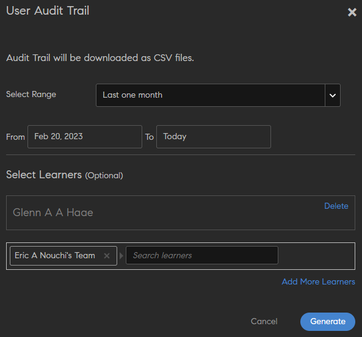

*下載使用者稽核軌跡報告*

## 學習方案報告

此報表包含帳戶中所有學習計畫的詳細資訊，例如相關使用者群組、狀態和觸發器資訊。

報告包含以下內容：

* 學習方案名稱
* 型別（發生於）
* 培訓（已完成）
* 技能（已達到）
* 日期（日期）
* 動作
* 狀態，建立者：
* 建立日期
* 上次修改日期
* 使用者群組（套用至）
* 使用者群組（新增至）
* 在此時間後註冊
* 學習元素型別
* 學習元素
* 學習元素例項
* 學習元素
* 完成日期
* 學習元素提醒
* 領域 — 目錄
* 範圍 — 使用者群組

## 常見問題 {#frequentlyaskedquestions}

+++如何與管理員共用自訂儀表板？

建立儀表板時，輸入名稱和說明。 若要與管理員共用，請在 **[!UICONTROL Share With]** 欄位。

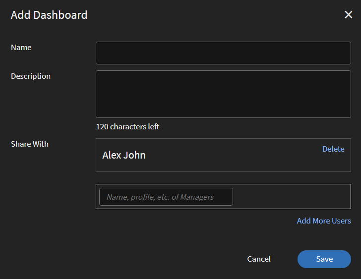
*共用儀表板*
+++
